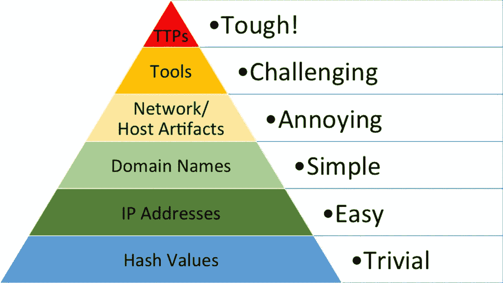
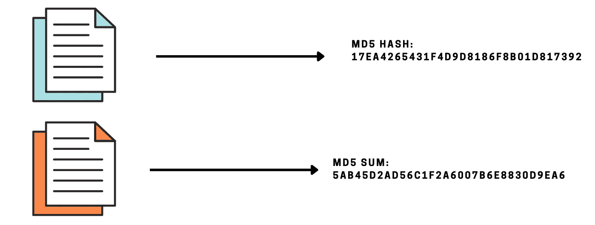

# 痛苦金字塔

> 原文：<https://infosecwriteups.com/pyramid-of-pain-bf9d8653803?source=collection_archive---------1----------------------->

痛苦金字塔:[来源](https://attackiq.com/2019/06/26/emulating-attacker-activities-and-the-pyramid-of-pain/)

**简介**

为有效的网络威胁情报开发了许多模型，但超时的威胁猎人意识到它们都有一些缺陷或局限性。

痛苦金字塔，**就是这样一个在威胁检测行动中有效使用网络威胁情报的概念模型，**但不同的是，该模型在威胁追踪社区中被广泛接受。所以，如果你想进入威胁追踪或者想探索它，那么这是一个很好的开始话题。

当攻击者越过您的防御或试图躲避防御时，您可能会得到一些证据或艺术品，表明他正在试图这样做。这些法医证据或人工制品被认为是妥协的标志。

David J Bainco 于 2013 年首次推出的《痛苦金字塔》借助痛苦金字塔对此进行了解释。痛苦金字塔列出了当攻击者试图渗透或已经入侵系统时，您可能会发现的工件或法医证据，以及如果您能够拒绝他，会给对手带来什么样的痛苦或麻烦(从字面意义上来说)。

David J Bainco 说，并不是所有的妥协指标都是平等的。所以否认不同的藏物会对他产生不同的影响。

这些伪像可能是他试图用来攻击你的服务器的计算机/网络的 IP 地址。它可能是恶意文件，他可能会上传到您的服务器/系统，用于以后的恶意活动。他列出了大约 6 个指标，如果您拒绝攻击者访问这些指标，会发生什么。

你越往上爬，越能拒绝他这些指标，你给他带来的痛苦就越多。(也就是说，他攻击您网络的难度越大)

**哈希值**

不同的文件有不同的哈希值

让我们从最底层开始。哈希值可用于识别特定的恶意软件样本。您可以找到存储在您的计算机上的文件的哈希值，然后使用工具和各种在线资源来检查它们是否与恶意软件样本相对应。

攻击者很容易更改几行代码，或者对他的恶意软件样本进行编码以生成新的唯一散列。这将确保它可以绕过此检查。给他带来的麻烦将是微不足道的，因为他可以轻松地对其进行编码，并绕过他的漏洞样本。

**IP 地址**

拒绝 IP 地址

如果你拒绝访问一个特定的 IP 地址，攻击者将别无选择，只能改变它，购买一个新的，或使用 VPN 或代理网络。这无疑会增加他的痛苦，消耗他的一些时间。

**域名**

拒绝域名

简单地说，域名映射到一个 IP 地址。与 IP 地址不同，域名可能会有点麻烦，因为将域名映射到 IP 地址可能需要 2 到 24 小时。

**网络/主机神器**

这些是用户代理字符串，可用于区分攻击者和普通用户。攻击者使用的工具可能有一些特定的名称，可以用来阻止他并限制他的进入。例如，如果攻击者试图使用 Nmap 扫描您的网络，您可能会在日志文件的主机标题中找到 Nmap。然后，您可以将此作为证据，阻止来自任何包含单词 Nmap 的主机的任何请求。

**工具**

如果您拒绝他访问安装在主机上的工具，攻击者将别无选择，只能从头开始创建新工具、上传工具或离开网络。这将对攻击者产生重大影响。

**TTPs**

在我们看这一节之前，让我们先了解一下什么是 TTP。

TTP 代表战术、技术和程序。它们是敌人用来感染和危害受害者的独特模式。仔细想想，我们都是习惯的受害者。所以，TTP 是对手可能影响你的印记或习惯。它们可用于发现可能危害您网络的潜在对手。用通俗的话来理解，TTP 通过分析他们的攻击风格来帮助识别攻击背后的威胁代理的来源，TTP 通过分析他们的攻击风格来帮助识别攻击背后的威胁代理的来源。

现在，如果您能够识别对手的 TTP，您就可以完全挫败攻击。你可以参考 MITRE 的 ATT&CK 框架来了解更多关于 TTP 的信息。

**结论**

作为威胁猎人、事件响应者或 SOC 分析师，痛苦金字塔是一个重要的概念。这个概念正在被一些著名的公司应用，如思科安全、SentinelOne 等。