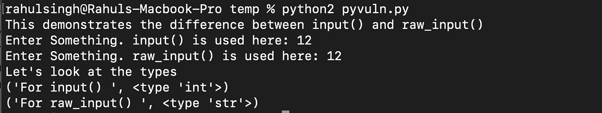
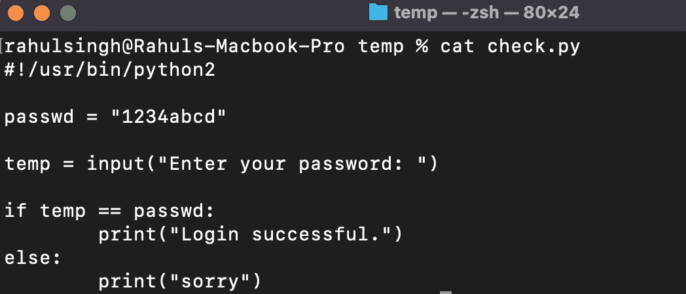
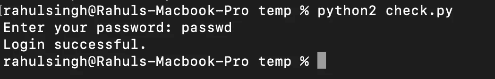
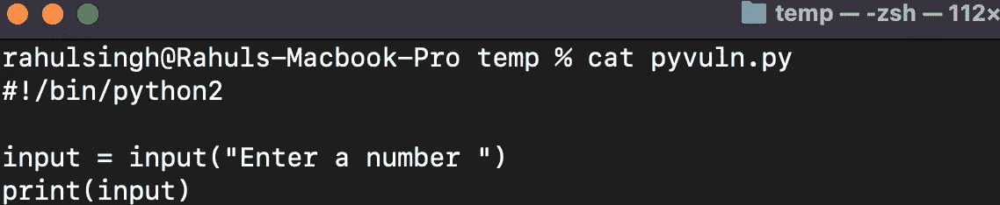
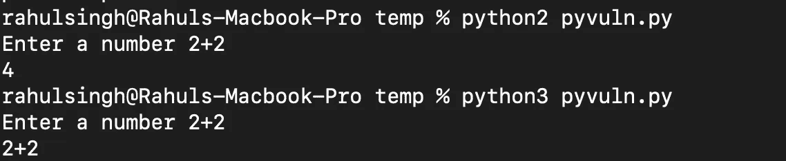
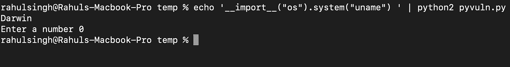

# 了解 Python 2 漏洞

> 原文：<https://infosecwriteups.com/python-2-vulnerabilities-c3a3779f6fc?source=collection_archive---------2----------------------->

在 [Unsplash](https://unsplash.com?utm_source=medium&utm_medium=referral) 上由 [Hitesh Choudhary](https://unsplash.com/@hiteshchoudhary?utm_source=medium&utm_medium=referral) 拍摄的照片

# **简介**

Python 编程基金会已经发表声明，宣布他们已经选择在 2020 年 1 月 1 日让 Python2 退役，立即生效。

此外，他们表示“如果您需要 Python 2 软件方面的帮助，许多志愿者会很乐意帮助您，但是随着时间的推移，愿意帮助您的志愿者数量将会减少。”这篇博文将详细探讨原因是什么，安全后果是什么，以及发现和利用了哪些安全缺陷。

Python 2.0 的最终版本发布于**2000 年**10 月 16 日。从那时起，Python 编程基金会一直在不断推出更新，添加特性，并对编程语言进行重大更改。2006 年，他们推出了 Python 3.0，但那时大多数人已经体验了 Python 2。许多人没有考虑升级到 Python 3.0，所以他们同时使用 Python 2 和 Python 3。

即使 Python2 不再得到官方支持，我们也不能忽视这样一个事实，即绝大多数商业应用程序仍然是用 Python 2 开发的，绝大多数组织没有转用 Python3 的计划。GitHub 上的大多数存储库都是用 Python2 编写的，而且绝大多数包都适用于 Python2。你上一次用 pip3 代替 pip 安装自己喜欢的软件包是什么时候？

截至目前，Python2 和 Python3 共列出 **85 个漏洞。所有这些漏洞的精选列表可以在[这里](https://python-security.readthedocs.io/vulnerabilities.html)找到。漏洞是在 Python 核心和包中发现的。虽然它们中的大多数可能没有公开可用的漏洞，但它非常有利于许多使用易受攻击组件的公司。**

在这篇博文中，我们将讨论 Python2 中的一个漏洞，该漏洞可用于泄露敏感值，并最终导致绕过关键检查。

# **python 2 中的漏洞**

Python2 中的漏洞

这里，我们将利用 Python2 中的 **input()** 函数。需要注意的是，这个漏洞只能在 Python2 中找到。

Python2 有两种方式接受输入，即 **input()** 和 **raw_input()** 。 **raw_input()** 在 Python3 中被移除，该功能被赋予 Python3 中的 input()。但是 Python2 的输入()发生了什么变化呢？

我们先来了解一下 Python2 和 Python3 的区别。

**input():** 该函数将按原样接受输入，并且不会修改其类型。

**raw_input():** 该函数将接受来自用户的输入，并将其转换为字符串类型，除非另有明确说明。

在下面的例子中，我创建了一个接受用户输入的 Python 程序。它首先通过**输入**函数接受输入，然后使用 **raw_input** 函数接受输入。

两种输入功能的区别

从上面的代码片段可以看出，对于相同的整数类型输入， **raw_input 函数**会自动将其转换为字符串类型，而 **input 函数**不会显示这种行为，并且函数的数据类型也不会改变。

# **但这是如何成为漏洞的呢？**

利用此漏洞，恶意用户可以提供与 python 程序中定义的变量相同的输入值。这反过来不会被 Python2 解释器解释为输入，并可能导致认证和其他逻辑绕过。我们通过一个简单的例子来理解这一点。

**例 1**

假设我们已经为管理员帐户编写了一个 Python 脚本。它接收用户提供的密码，然后将其与硬编码的值进行比较。如果值等于“ **1234abcd** ，则只打印“**登录成功**

源代码

我写的片段如上图所示

一切看起来都很好，直到您意识到用户无需提供密码就可以登录。用户只需知道保存密码值的**变量**的名称。因此，用户只需提供 *passwd* 作为输入，因为只有字符串匹配，所以用户将能够登录。

利用漏洞

**例 2**

我们可以举的另一个例子是一个简单的 python 程序，它接受用户的输入，然后将其打印在屏幕上。我们只是使用 input()函数来获取用户输入。

源代码

这里，如果您提供 2+2 作为输入，它将由 **input()** 函数执行。

利用这个漏洞

*注意:该漏洞不适用于 Python3*

如你所料，这可能是非常有害的，并会产生危险的后果。这可能会导致一些严重的漏洞或拒绝服务，因为用户可能会向他们提供一个很长的字符串，如 5666666666666666666666666666 * * 4646，这可能需要大量的时间和资源来处理。

例如，如果恶意用户导入操作系统模块，他就可以在服务器上执行代码，从而导致远程代码执行。下面提供了其中的一个片段。

代码执行

从上面的片段可以明显看出，我们已经导入了 os 模块，它提供了与操作系统交互的功能。

这表明 input 函数(Python2 中)不仅接受用户的输入，还执行它。

# **结论**

这些只是 Python2 编程语言中被发现的众多缺陷中的一小部分。尽管目前可能无法使用公共漏洞。但是，已发现漏洞这一事实表明，这些漏洞具有潜在的可利用性。因此，有必要迁移到 Python3。将来可能会发现更多的漏洞。由于大量组织仍在 Python2 上运行，攻击者可能正在挖掘 Python2 源代码，以便发现和利用漏洞。当风险很高时，攻击者愿意竭尽全力来获得对其目标的优势。