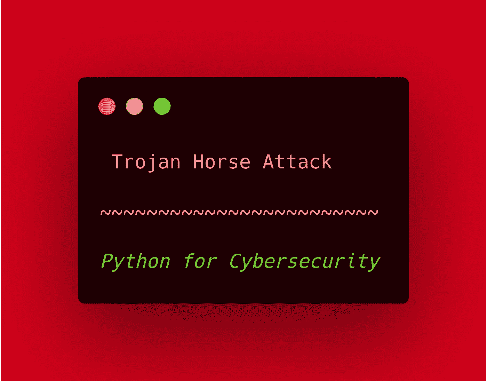
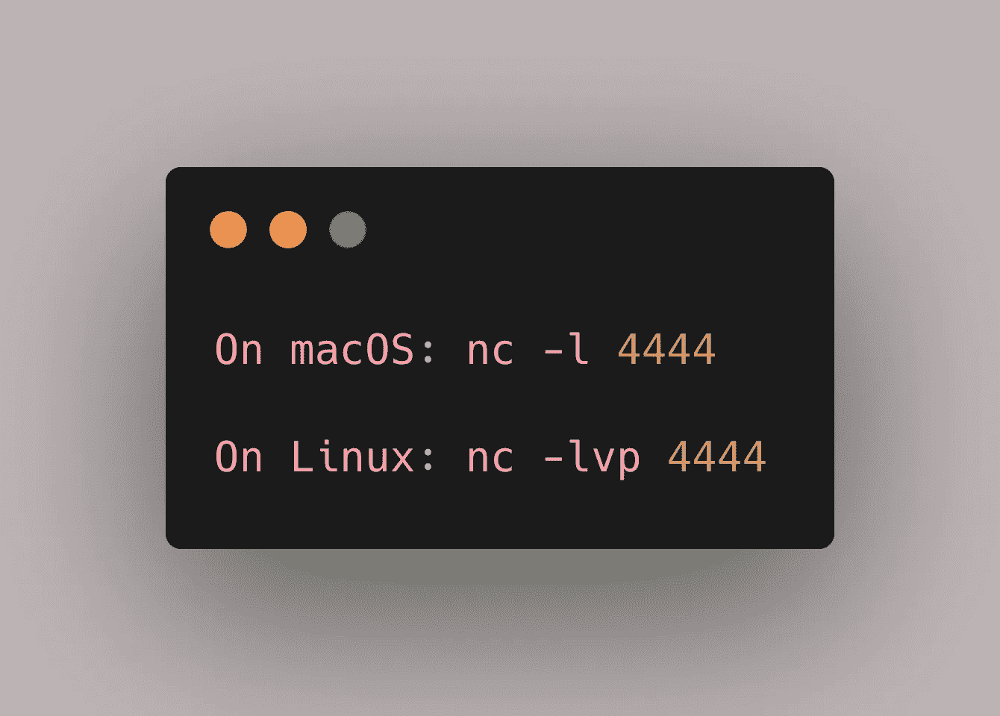
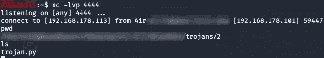

# 基于 Python 的特洛伊木马攻击

> 原文：<https://infosecwriteups.com/python-based-trojan-horse-attack-b35215849cd6?source=collection_archive---------0----------------------->

## 如何执行基于 python 的特洛伊木马攻击

对于那些还不知道的人来说，**特洛伊木马攻击**包括在看似无害的应用程序中，甚至在文档中嵌入漏洞。你可能已经猜到了，今天我们将在 Kivy 制作的 GUI 中嵌入一个后门。这种攻击非常简单，您唯一需要知道的就是一些 python 和网络基础知识。让我们开始吧！

# 特洛伊人

*如何建造？*

## 后门

在我们可以嵌入特洛伊木马的许多东西中，我选择嵌入后门。我们将使用我在本文中谈到的方法:

 [## Python 中的后门攻击

### 在 Python 脚本中执行后门攻击

medium.com](https://medium.com/bugbountywriteup/backdoor-attack-in-python-1395c91ea29a) 

> 基本上，你可以嵌入任何东西，但是今天我们将嵌入一个后门。

## 该应用程序

这是一个关键点，我们将使用 Kivy 框架来开发一个看起来无辜的应用程序，但正如木马攻击所说，它将包含恶意后门，我们将使用它来访问计算机。从那时起，你将拥有目标的电脑。

> 声明:我不是一个有经验的图形应用程序开发人员，只是在我需要的时候使用它们。因此，我们将建立的木马没有一个好的图形，但是，你可以用 Kivy 的文档来改进它。

正如免责声明中所说，今天我们不会关注应用程序的图形，这可以通过查看 Kivy 的文档来轻松改善，相反，我们将关注如何在图形应用程序中嵌入您想要的一切(这里是后门)。

# 黑客的机器

毕竟，这个时间花在讨论为了拥有受害者的机器我们会做什么，我们来谈谈黑客。当我们在[这篇文章](https://medium.com/bugbountywriteup/backdoor-attack-in-python-1395c91ea29a?source=friends_link&sk=8a29ebdb20705b0edcf9b216d7395822)中讨论如何向后门发送命令以在受害者计算机上执行它们时，我们构建了自己的工具来完成这一任务。但是今天，我们将使用 Netcat。

只需打开一个终端窗口，然后:

# 空谈是廉价的，给我看看代码

> ~莱纳斯·托沃兹

现在是编写木马程序的时候了。基本上，我们将使用一个*函数(恶意函数)、*和一个*类(GUI)进行组织。* 这么简单的代码。

**1/2 行:**导入了一些 Kivy 基本模块。

**第 4/6 行:**导入了后门的 Socket 和子进程模块。然后是线程模块，以便能够执行恶意代码和非恶意代码(GUI 代码)。

**第 9/22 行:**使用 Python 文章中后门攻击的代码创建了一个包含后门的 main 函数。

**第 26/27 行:**构建一个*【你好世界】*简单的 GUI。

**第 31/32 行:**为`main()`函数创建了一个线程，然后启动了它(`mal_thread.start()`)。

**第 35/36 行:**运行简单的 GUI。

# 攻击，终于

> 最精彩的来了:进攻。

## 在攻击机器上

如前所述，我们将使用 Netcat 绑定一个端口并监听传入的连接。在这种情况下，我们将使用众所周知的 *4444 端口。在受害者连接之前，这个命令不会给你任何输出。*

## 在目标机器上

在攻击者的机器上开始攻击后，我们可以在受害者的机器上完成攻击。

只需将代码导出到目标机器并执行它，为了让后门程序工作，请确保您在第 10 行输入了正确的 IP 地址。

一旦你在受害者的电脑上执行代码，你会在受害者的电脑上看到一个 Kivy 应用程序说“hello world”，你会在攻击者的电脑上看到这个:

因此，我们在受害者计算机上使用了一个反向外壳。太好了！

## 你可能喜欢的网络安全相关文章

请随意看看它们:

 [## Python 中的后门攻击

### 在 Python 脚本中执行后门攻击

medium.com](https://medium.com/bugbountywriteup/backdoor-attack-in-python-1395c91ea29a)  [## 通过社交网络中的用户名搜索社交媒体账户

### 如何从使用夏洛克的用户名中找到社交媒体账户

medium.comm](https://medium.com/bugbountywriteup/hunt-down-social-media-accounts-by-username-across-social-networks-b326af2d54ed) 

感谢阅读！