# 用于远程系统取证和权限转移的基于 HTTP 的 Python 特洛伊木马

> 原文：<https://infosecwriteups.com/python-http-based-trojan-for-remote-system-forensics-and-privilege-transfer-ae128891b4de?source=collection_archive---------1----------------------->

来源:[https://gotowebsecurity . com/ethical-hacking-course-trojans-lab-session/](https://gotowebsecurity.com/ethical-hacking-course-trojans-lab-session/)

# 概观

在本文中，我们将构建一个基于 python 的特洛伊木马，它具有以下功能:

1.  远程下载无关代码到特洛伊木马并运行它
2.  更新在(1)中下载的代码
3.  自我更新
4.  重新运行自身(对除 SIGKILL 之外的任何信号免疫)
5.  获取并转移 root 权限(从而在目标机器上做任何事情)
6.  通过 HTTP 向攻击者发送数据

我们从一个简单的假设开始:目标执行一些对它有益的代码。它可能是任何类似 python 包的东西，用来完成用户认为值得做的任务。

源代码: [Github](https://github.com/NimishMishra/networking/tree/master/remote_system_forensics)

# 介绍

特洛伊木马之所以强大，是因为它们看起来很漂亮，而且是逃避嫌疑的首选。一旦运行，它们就开始执行它们的恶意意图，同时在攻击者看来完全没问题。更有甚者，因为目标(尤其是开发者)是*通常*不会怀疑抓取开源/包代码并运行它。这可能是我们利用的一个很好的切入点。

# “好”代码

好的代码很简单。它做目标想要它做的事情。它可能跨越多种事物，跨越一个完整的包；代码库越大，发现活动就越微妙。我们将跳过这一部分，写一个简单的代码打印一些东西。

意图有点坏的好代码。

对于目标来说，这个脚本应该做它应该做的事情(在我们的例子中是打印一个简单的行),然后平静地退出。除此之外，这里主要的东西是其他的东西。该脚本构建了一个目录(在正常情况下，您可能希望工作目录隐藏在某个地方。为了简洁明了起见，我将跳过这个步骤)`downloaded``，切换到它，向`http://192.168.43.38:9000/downloader.py`的某个服务器发出一个 cURL 请求(在这里阅读关于 cURL [的更多信息](https://curl.haxx.se/docs/)，并下载返回给 python 脚本`downloader.py`的内容。然后它发出命令`python3 downloader.py`并平静地退出。由于使用了`Popen`，子进程(运行`downloader.py`)在父进程退出时与父进程`good.py`分离，并与`init`关联。所以实际上，它变成了一个独立的过程。函数`run_command()`是 python 中外壳的等价物。它运行指定的命令，并返回来自`STDOUT`的输出，或者如果使用 shell，您将会收到的结果。

现在是配置这个`[http://192.168.43.38:9000.](http://192.168.43.38:9000.)`的时候了

# 服务器端

这个想法是建立一个自动将代码推送到远端的服务器。稍后，它将用于实时更新代码、传输文件、命令等等。我们需要做的就是配置一个能够处理`POST`和`GET`的 HTTP 服务器。

setup_server.py 中的基本 HTTP 服务器框架

python 中的一个`HTTPServer`依赖于两条信息:把它放在哪里和在交互中做什么。前一部分由`('192.168.43.38', 9000)`处理，用于将服务器绑定到机器的端口`9000`，而`192.168.43.38`是本地 IP。后一部分由一个单独的类处理，该类扩展了定义`POST`和`GET`功能的`BaseHTTPRequestHandler`。`_set_response()`函数用于发送强制`HTTP`报头信息(报头、代表成功的代码 200 和代表报头结束的 end 报头)。因为我们将处理文本数据，所以将`Content-type`设置为`text/html`就可以了。现在添加两个主要功能。

GET.py

一个`GET`请求，其中包含一个要获取的路径。在这种情况下，它将是`http://192.168.43.38:9000/filepath`中的`filepath`形式。它可能是空的(类似于你访问的网站的主页)或者它包含一些东西(类似于你从主页访问的其他页面)。在我们的例子中，当对我们的 *home、*即`http://192.168.43.38:9000/`进行`GET`操作时，我们希望返回服务器中可用文件的列表，并在请求特定文件时返回文件的内容，如`http://192.168.43.38:9000/downloader.py`所示。技术是区分两种情况，在后一种情况下打开文件，创建一个响应，然后用`wfile.write()`发送响应。

`POST`请求包含必须处理的数据。

POST.py

它从 HTTP 头中获取长度，使用`rfile.read()`提取数据，并存储到一个文件中。使用`SPLIT`进行拆分只是一种方便的换行符处理方式(对我来说！我从来不能在通过网络发送的数据中保留新行。对一个文件来说，它看起来像一个巨大的单行数据。为了克服这个问题，我在目标端用一个`SPLIT`替换`\n`，然后在服务器端替换回来。最后，我们使用`wfile.write().`发送一个`POST OK`

现在我们继续制作其他东西。第一，`downloader.py`

# 第一阶段执行

我们的好代码用于将一个简单的`downloader.py`加载到指定的目录并执行它。现在主要由`downloader.py`来处理其他一切。首先，我们希望`downloader.py`能够处理这些事情:

1.  知道服务器端的文件何时被更新。
2.  知道`downloader.py`本身的代码何时更新。
3.  回避所有可能的信号(甚至不是一个简单的`kill PID`应该终止它)。
4.  从服务器端下载更新文件并执行。
5.  隐藏自身(子主题太大，因此不在此讨论)。
6.  调度本身(与`cron`相关，这里不涉及)并构建内核持久性。

对于前两者，下面的代码就足够了。

下载者. py

可能有几种方法来检查状态。我决定创建一个特殊的文件`status.txt`，在两行上有二进制数字。第一行有一个 0/1，表示服务器上的文件是否已经更新(或者攻击者是否想要重新运行某些程序)，第二行有一个 0/1，表示`downloader.py`本身是否需要更新。非常直观地，我们下载`status.txt`并分析标志。如果我们在第一行获得 1，我们继续获取和下载文件(因为更新`downloader.py`也涉及相同的操作，这里不检查第二个标志)。当数据被检索时，我们删除`status.txt`,因为不再需要它。

第三个要求简单地处理如下。

处理信号和端接

接收到的以下任何信号都会导致`downloader.py`的重新下载，并作为新过程重新运行。只有不可忽略的`SIGKILL`杀死进程。

第四部分也是主要部分是这样的。

获取文件

回想一下关于`GET`的讨论，表单`http://192.168.43.38:9000`的请求返回服务器中托管的文件列表。我们获取列表并运行一个循环(忽略`status.txt`，因为它已经被下载并分析过了)。如果我们获得了`downloader.py`(即它在服务器上可用)和`data[1] == 1`(它需要更新)，我们将触发`refresh_downloader()`，通过重新下载、运行一个新进程并退出当前进程来刷新`downloader.py`。如果不是这样，我们只需创建一个要下载的文件列表，这些文件将在下一个代码片段中处理。

下载文件

只需对相应的 URL 创建 cURL 请求并下载文件。一旦下载完毕，`run_scripts()`将运行工作目录中的所有文件，除了`downloader.py`(只要`status.txt`的第一行有一个 1，就会产生一个 fork bomb:表示继续下载和刷新文件的标志)和`setup_server.py`(包含前面讨论过的服务器脚本)。[你不应该把`setup_server.py`放在服务器上，但是我很懒，没有修复它:]。

这里是`downloader.py`的完整代码

添加注释行' command_list.append("sudo ")是为了稍后进行特权转移。

差不多就是这样！

# 样品运行

目标端的初始设置。

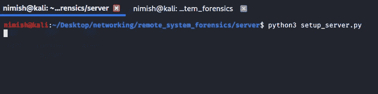

攻击者端的初始设置

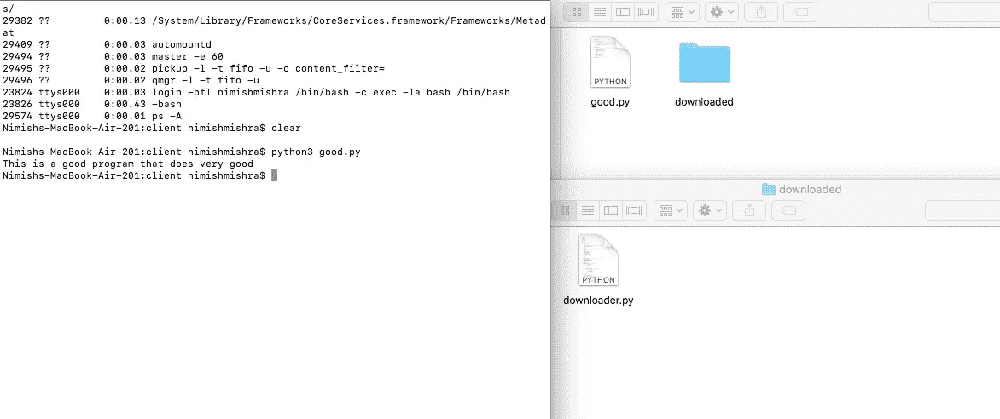

运行 good.py 注意左边的 ps -A 输出。

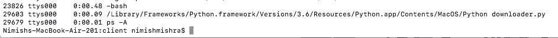

请注意 good.py 退出后的 ps -A 输出。

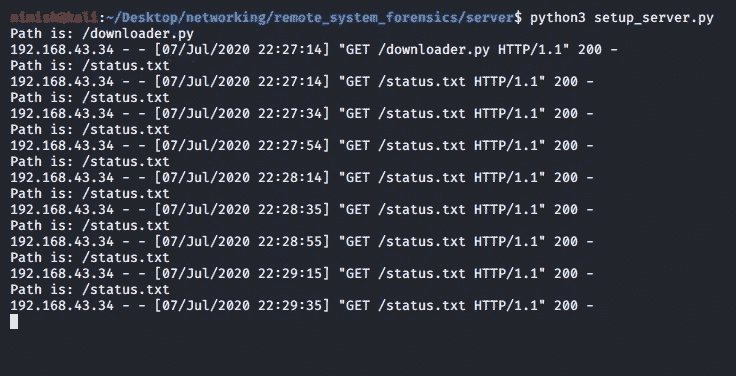

downloader.py 对 status.txt 的服务器执行 GET 请求

`status.txt`到现在设定为:

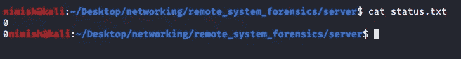

包含 0 和 0 的简单两行文本文件。

现在更新一下`downloader.py.`的某些部分，我在`while`循环中的`check_status()`调用之前添加了一个简单的`print`语句。然后将`status.txt`设置为 1 和 1。等待`GET`请求。结果如下:

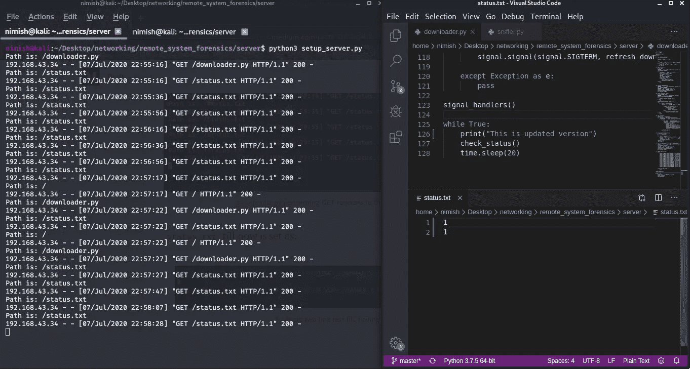

当状态更改为 1 和 1 时，请注意左边是如何对 downloader.py 发出 GET 请求的。

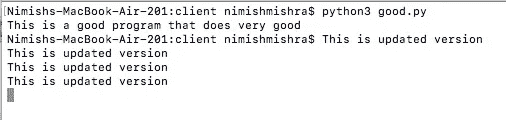

印刷

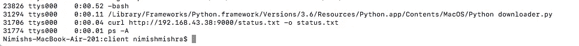

注意 downloader.py 的 PID 的变化

# 第二阶段执行

既然推动远程代码的通用框架已经建立并运行，现在是时候编写一些漏洞了。你可以用它来创造。我没有，我想出了两个主意:

1.  运行一组命令
2.  查询某个目录(递归读取子目录中的所有文件并返回到目标)

我们将`commands.txt`预定义为攻击者存储需要在目标机器上执行的命令的标准。同样，`directory.txt`是要查询的目录的集合。

我们建立了第一个漏洞。

命令 _ 执行者. py

打开`commands.txt`,逐行读取命令，执行它们，制作响应，并将其发送回服务器，这是非常简单的实现。

第二个漏洞如下。

directory_enlister.py

该漏洞打开文件`directory.txt`并读取目标目录。然后它触发`enlist_directory()`,分别列出文件和子目录。对于每个文件，它读取(`cat filename`)并创建一个响应。对于每个子目录，它将完整的路径添加到主列表`directory_list`中，这反过来确保当附加的子目录也被查询以查找其中的其他文件和子目录时，会有一个机会。

就是这样！制作`commands.txt`和`directories.txt`并继续执行它们。

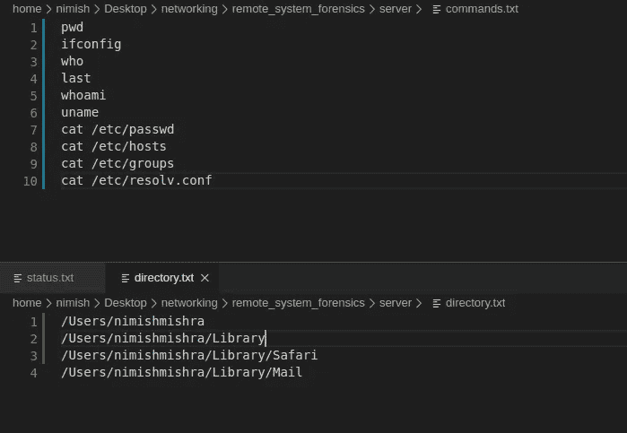

样本(关于目标的仍然相当敏感的信息)

# 样品运行

当服务器启动并运行时，将两个文本文件和两个漏洞都移动到服务器，并将`status.txt`更改为 1 和 0(意味着更新文件，但`downloader.py`不需要更新，这又意味着更新并运行其他文件，从而运行我们的漏洞)。

根据目标的连接以及第二次攻击中的`time.sleep(30)`,传输数据需要一段时间。但是一旦发生了，你就会意识到你刚刚得到了什么。

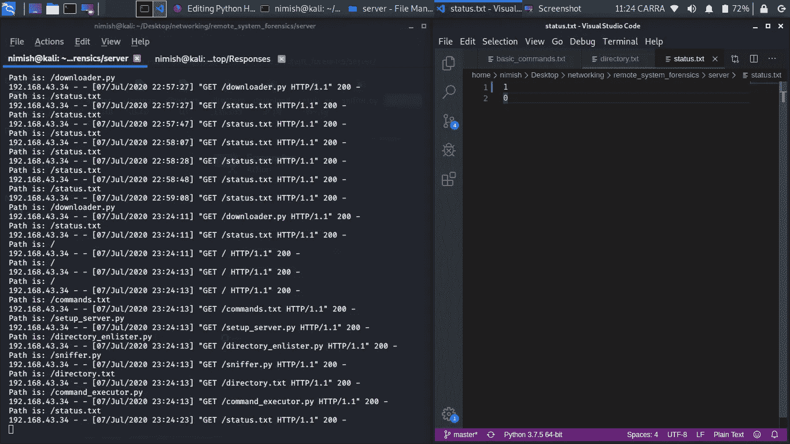

状态更改说明如何发出 GET 请求

下载了几个文件。我把它们移到不同的目录下，并对它们进行了分析。这是一张快照。

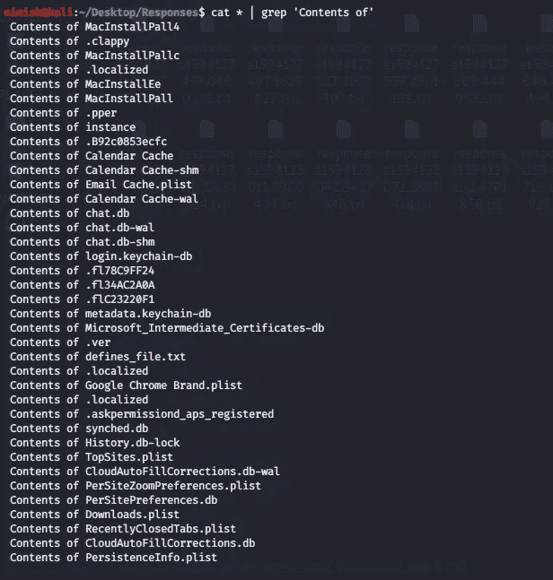

“的内容”是由 directory_enlister.py 在读取文件内容并存储它们以发送回服务器时添加的。这些是在各自*中包含数据的文件列表。txt 文件。

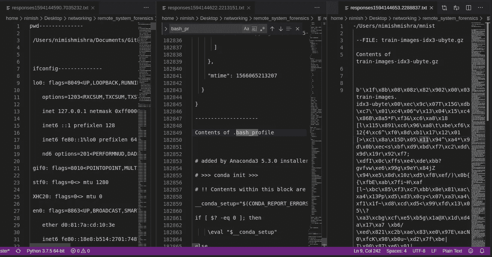

一个样本。的内容。bash_profile、ifconfig 以及一个压缩的 gz 文件

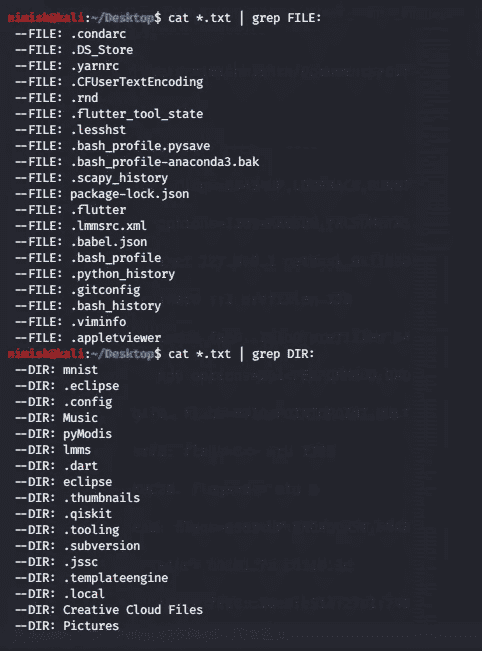

其数据被发送到服务器的一些文件

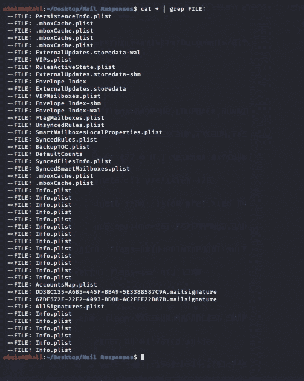

与目标邮箱相关的文件

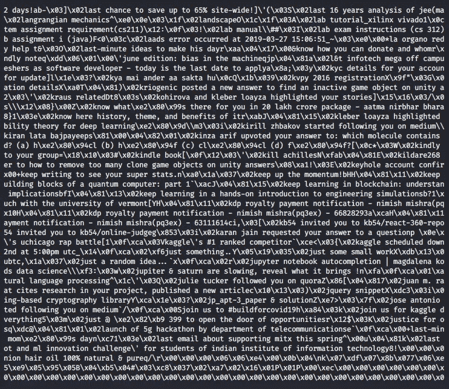

一些邮件数据。注意:未加密的邮件数据可能包含大量关于目标的信息。

下面是一些浏览数据。

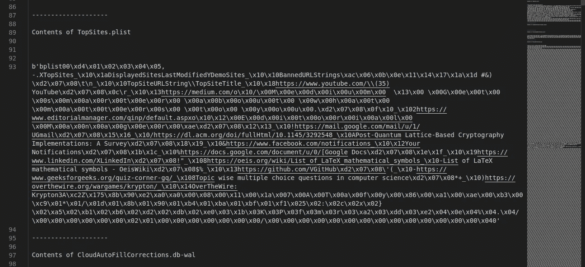

Safari 上的热门网站

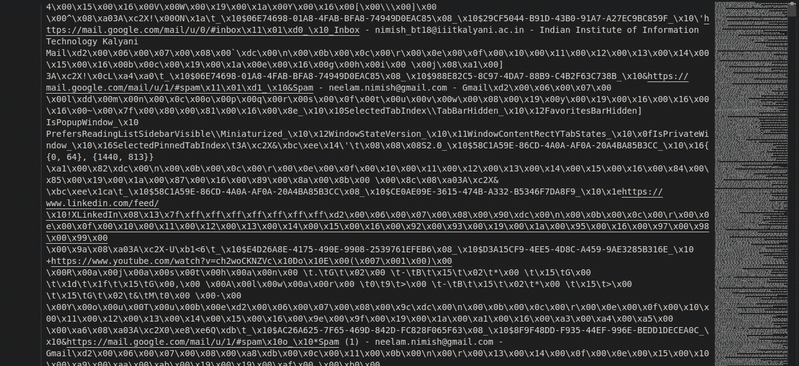

最近关闭的选项卡

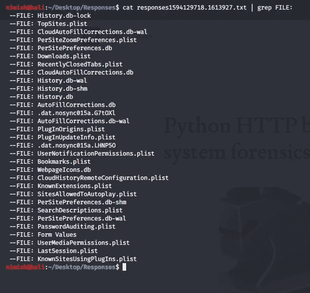

可供分析的 Safari 文件列表

# 特权转移

最有趣的任务需要 root 访问权限。虽然特权提升有复杂的机制，但我们在这里有一点优势:*sudo 进程的子进程有根访问权。*

你只需要说服目标以 root 身份运行`good.py`。这应该不难；用户有时会给那些没有 root 权限就无法运行的代码授予 root 权限(就像任何 Scapy 代码一样)。

让我们构建一个简单的嗅探器，如果没有 root 访问权限，它将无法运行。在做任何进一步的事情之前，在`Popen()`出现的任何地方将所有`COMMAND`从`python3 filename.py`更改为`sudo python3 filename.py`(当`good.py`成为`Popen` 下载器时也是如此)。

sniffer.py

我们会通过服务器上传，然后下载。现在让目标运行`good.py`。它从 root 访问权限进行提示。由于代码对目标有意义和用途，目标很可能会授予根用户访问权限。现在开始您的特权转移，其中*根访问被转移给所有孩子。如果嗅探器运行，我们将验证这一点。*

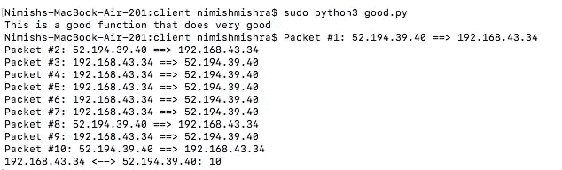

Scapy sniffer 运行时没有进一步的提示

Scapy 需要 root 访问权限，这里我们只是从给予`good.py`的 root 访问权限运行了一个 scapy 程序。它从`good.py`转移到`downloader.py`，后者转移到它产生的所有子进程。因此，嗅探器能够正常运行。此外，终止进程也需要 root 权限。

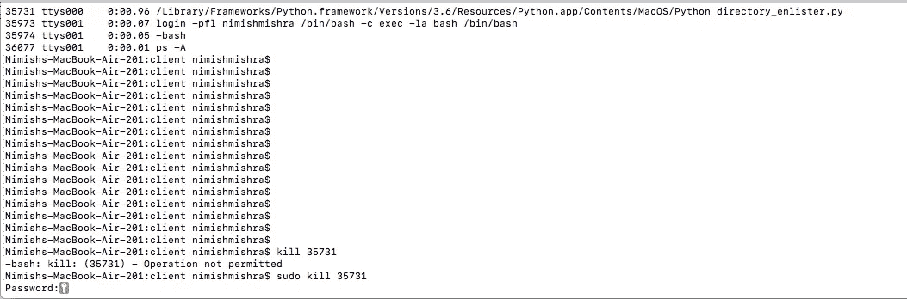

终止 directory_enlister.py 进程的 Root 访问权限

# 结论

唯一剩下的就是构建自我隐藏的功能。这是一个广泛的话题，研究 rootkits 可能是开始思考这个问题的好方法。

祝你今天开心！玩的开心！