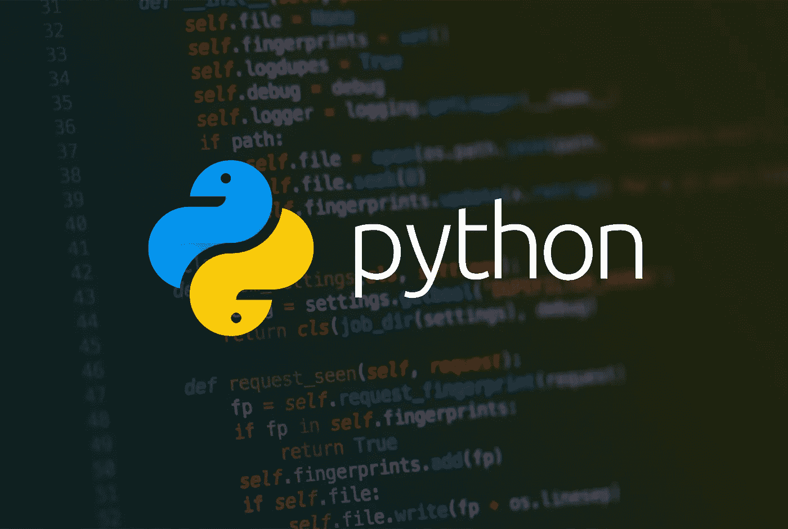

# Python 虚拟环境

> 原文：<https://infosecwriteups.com/python-virtual-environment-1b5db9844236?source=collection_archive---------0----------------------->



由 behance 增强的 python 徽标

顾名思义，虚拟环境也像虚拟机一样工作，其中安装的操作系统独立于实际的操作系统。在更新和升级过程中，它只会影响虚拟机，而不会影响实际系统。这一概念同样适用于虚拟环境，其中隔离的运行时环境帮助用户或应用程序安装和升级 python 包，而不会干扰系统上用 python 构建的其他应用程序。例如，由于 python 包在不同位置的系统上的存储方式，大多数系统包都存储在 sys.prefix 中存储的路径的子目录中。

比如说；在创建应用程序时，应用程序 A 可能有一个不同版本的特定库，而应用程序 B 也有一个不同的版本，比如说 2.0。在使用这两个应用程序的情况下，一个可能满足特定模块的需求，而另一个可能不满足，这往往会引入对 python 虚拟环境的需求。

# 创建虚拟环境

使用 python2 时安装 venv 工具。

```
pip install virtualenv
```

在 python3 中，venv 模块与标准库一起提供。

首先创建一个目录/文件夹

```
mkdir fearless-env
```

将 venv 模块作为脚本运行，目录路径为:

这将创建 tutorial-env 目录(如果它不存在的话),并在其中创建包含 Python 解释器副本、标准库和各种支持文件的目录。

虚拟环境的一个常见目录是. venv。这个名称使目录隐藏在您的 shell 中，因此不会碍事，同时给它一个解释目录存在原因的名称。它还防止与冲突。一些工具支持的 env 环境变量定义文件。

现在激活你的虚拟环境

在 Windows 上:

```
pytutorial-env\\Scripts\\activate.bat
```

在 Unix 或 Mac 上:

源教程-env/bin/activate

```
source tutorial-env/bin/activate
```

您应该会看到终端上显示的激活环境

**参考文献**

 [## 12.虚拟环境和包- Python 3.9.7 文档

### Python 应用程序通常会使用不属于标准库的包和模块。应用程序…

docs.python.org](https://docs.python.org/3/tutorial/venv.html) [](https://realpython.com/python-virtual-environments-a-primer/) [## Python 虚拟环境:初级读本-真实的 Python

### 更新于 2018-01-12:澄清了 pyenv 与 venv 在 Python 3.6+上的用法更新于 2016-06-11:添加了关于更改 Python 的部分…

realpython.com](https://realpython.com/python-virtual-environments-a-primer/) 

***查看我的 Youtube 频道了解更多内容***

[](https://www.youtube.com/channel/UCbcfcMixWSNF7BoArenrlig?sub_confirmation=1) [## 无畏的网络引擎

### 欢迎来到网络引擎。更多有趣的内容敬请期待。渗透测试是一种生活方式。带着清晰的…

www.youtube.com](https://www.youtube.com/channel/UCbcfcMixWSNF7BoArenrlig?sub_confirmation=1)