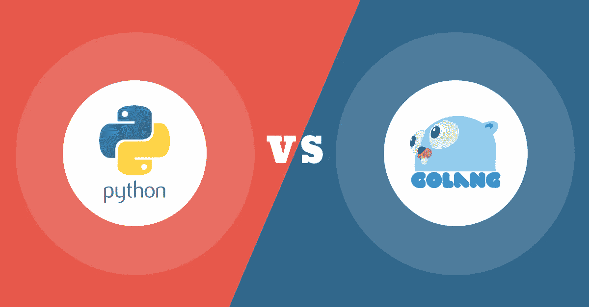

# Python Vs Golang

> 原文：<https://infosecwriteups.com/python-vs-golang-b7dab38aa837?source=collection_archive---------4----------------------->

## 介绍

Python 和 Go(也称为 Golang)是两种流行的编程语言，由于它们的相似性和差异，经常被比较。这两种语言都有广泛的用途，包括 web 开发、数据分析和系统编程。在本文中，我们将从特性、性能和用例方面比较 Python 和 Go，以帮助您决定哪种语言最适合您的需求。

## 特征

Python 是一种动态类型的解释语言，于 1991 年首次发布。它以其简单性和可读性而闻名，因为它使用空白和缩进来表示代码块，而不是像许多其他语言那样使用花括号。Python 还有一个庞大而活跃的社区，它贡献了一个庞大的库和框架生态系统，使得构建和部署应用程序变得容易。

另一方面，Go 是一种静态类型的编译语言，由 Google 于 2009 年开发。它以简单性和并发性而闻名，因为它内置了对 goroutines 和 channels 的支持，这使得编写并发代码变得很容易。Go 还具有快速的编译时间，这使得它成为大型项目的热门选择。

## 表演

Python 和 Go 的一个主要区别就是性能。因为 Python 是一种解释型语言，它往往比像 Go 这样的编译型语言要慢。然而，随着 PyPy 的发布，Python 在最近几年有了显著的改进，PyPy 是一种实时(JIT)编译器，可以显著提高性能。

另一方面，Go 是一种编译语言，这意味着它通常比 Python 快。Go 程序被编译成本机代码，这使得它们执行起来更高效更快。Go 还有许多优化技术，比如内联和转义分析，这些技术进一步提高了它的性能。

## 用例

Python 和 Go 都有广泛的用例，但它们经常用于不同的目的。Python 是 web 开发、数据分析和机器学习的热门选择，这是因为它拥有庞大的库和框架生态系统。它还用于脚本和自动化任务，因为编写和运行 Python 脚本很容易。

另一方面，Go 通常用于系统编程，例如构建操作系统、web 服务器和分布式系统。它还用于构建微服务，因为它的快速编译时间和并发支持使它非常适合构建可伸缩和容错的系统。

## 结论

总之，Python 和 Go 是两种流行的编程语言，各有优缺点。Python 是一种动态类型的解释型语言，以其简单性和庞大的库和框架生态系统而闻名。它是 web 开发、数据分析和机器学习的热门选择。另一方面，Go 是一种静态类型的编译语言，以其简单性和并发支持而闻名。它通常用于系统编程和构建微服务。

最终，Python 和 Go 之间的选择将取决于您的特定需求和目标。如果你需要一门简单易学的语言，并且拥有一个庞大的库和框架生态系统，Python 可能是更好的选择。如果您需要一种快速且非常适合构建可伸缩和容错系统的语言，Go 可能是更好的选择。