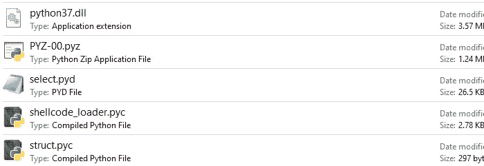
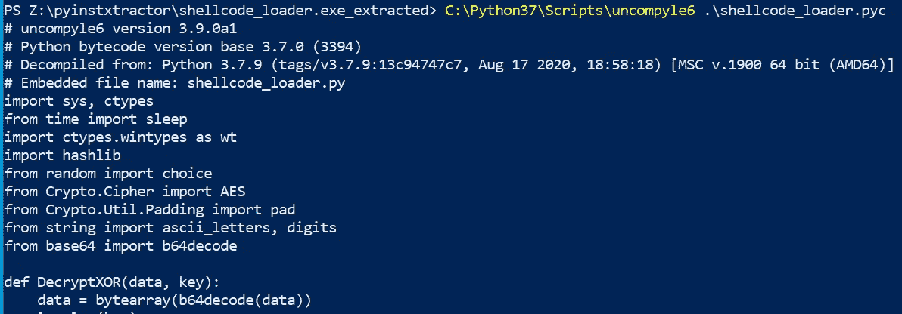
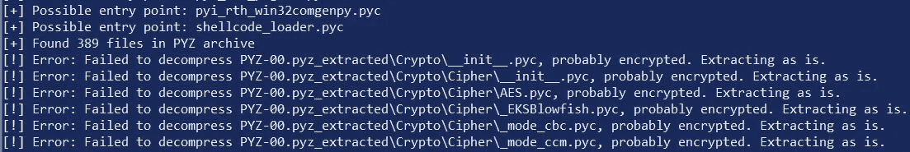
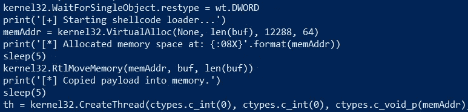
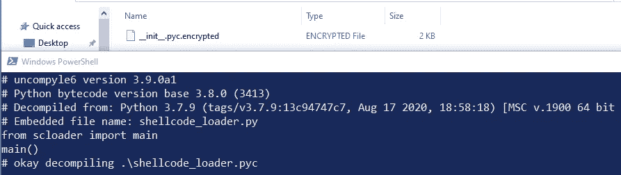
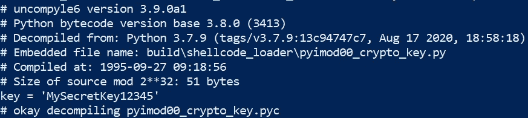

# Python 恶意软件第 2 部分:逆转 Python 可执行文件

> 原文：<https://infosecwriteups.com/pythonic-malware-part-2-reversing-python-executables-1b197bd023ca?source=collection_archive---------1----------------------->


[张彦宏](https://unsplash.com/@danielkcheung?utm_source=medium&utm_medium=referral)在 [Unsplash](https://unsplash.com?utm_source=medium&utm_medium=referral) 上的照片

在[Python Malware Part-1](https://medium.com/bugbountywriteup/pythonic-malware-evading-detection-with-compiled-executables-20194ab0719c)中，我演示了 Python 可执行文件如何被用来绕过 Windows Defender，并在完全打了补丁的系统上成功启动 Meterpreter shells。然而，这提出了一个有趣的问题，为什么更多的 APT 和威胁团体不使用 Python 进行恶意软件开发？

虽然非常有效，一个原因是因为编译的 Python 很容易被逆转。在没有人工干预或转换为低级语言的情况下，编译 Python 的默认方式可以让蓝色团队恢复明文源代码。

这篇文章演示了如何反编译在 [Part-1](/pythonic-malware-evading-detection-with-compiled-executables-20194ab0719c) 中创建的`shellcode_loader.exe`文件，并恢复正在执行的源代码——即使使用 PyInstaller 的字节码混淆和 AES256 加密。

# 反编译 Python 可执行文件

## 1.解包可执行文件

反编译`shellcode_loader.exe`文件的第一步是使用[pyinstextractor](https://github.com/extremecoders-re/pyinstxtractor)解包编译后的二进制文件。这将创建一个包含原始 Python 字节码文件和打包资源的新目录:

```
>> python pyinstxtractor.py shellcode_loader.exe
[+] Processing shellcode_loader.exe
[+] Pyinstaller version: 2.1+
[+] Python version: 307
...
[+] Possible entry point: shellcode_loader.pyc
[+] Found 179 files in PYZ archive
[+] Successfully extracted pyinstaller archive: shellcode_loader.exe
```



位于新创建的“shellcode_loader.exe_extracted”目录中的解压缩文件。

## 2.转换 Python 字节码

现在我们有了源代码的字节码(`.pyc`)版本，我们可以使用[uncompile 6](https://github.com/rocky/python-uncompyle6/)将我们的`shellcode_loader.pyc`转换回人类可读的代码:



转换中。pyc 文件返回到。未编译的 py。

# 击败 PyInstaller 的 AES256 加密

成功反转 shellcode loader 脚本后，我想更深入地挖掘和探索 PyInstaller 的带有 AES 加密的字节码混淆。这可以通过在编译时添加`--key`参数来实现，如下所示:

```
pyinstaller -F --key MySecretKey12345 shellcode_loader.py
```

## 方法 1:未加密的源

当返回并解压缩新创建的可执行文件时，显示了几个错误，表明可能应用了加密:



用 pyinstxtractor 解包加密的可执行文件。

然而，仍有可能将`shellcode_loader.pyc`文件转换回其原始来源——无需应用任何解密方法:



查看终端消息和解压缩的文件，似乎只有资源文件被加密并放在`PYZ-00.pyz_extracted`目录中。这意味着脚本入口点和主文件不受保护。

## 方法 2:使用解密密钥

假设只有脚本资源被加密，我重新构造了 shellcode loader 脚本，将主要代码作为资源导入。最终的目录结构如下所示:

```
|_shellcode_loader.py
|_scloader
  |_ __init__.py 
```

一旦重新编译和解包，就会显示相同的加密错误消息。然而，这一次，我无法恢复来源:



这时我发现了`pyimod00_crypto_key.pyc`，它包含了运行时用来解密可执行文件的静态密钥:



在“pyimod00_crypto_key.pyc”的明文中找到 PyInstaller 的加密密钥。

使用下面的脚本，可以利用这个密钥来解密 Python 字节码，并在使用 uncompyle6:

# 结论

在没有额外保护机制的情况下反转 Python 可执行文件可能是微不足道的。事实上，PyInstaller 的[文档](https://pyinstaller.org/en/stable/operating-mode.html#hiding-the-source-code)甚至提到他们的 AES256 加密只能防止“随意”篡改。这只是 Python 恶意软件在现代企业环境中不太常见的一个原因。

感谢阅读！在 [m8sec.dev](https://m8sec.dev) 了解更多关于我的信息，并关注更多攻击性安全内容。

*免责声明:所有内容仅用于教育目的。作者不对信息的使用负责。不要对你不拥有或没有明确许可的系统进行测试。*