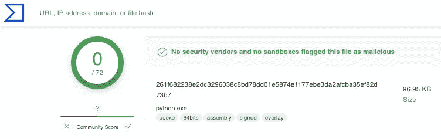

# Pythonic 恶意软件第 3 部分:内存执行和现代规避

> 原文：<https://infosecwriteups.com/pythonic-malware-part-3-in-memory-execution-and-modern-evasion-ec3cc1084628?source=collection_archive---------1----------------------->

忘记编译有效负载和在磁盘上操作——这篇文章演示了 Python 的可移植解释器在内存恶意软件部署中的使用，即使该语言没有安装在主机上。

照片由[艾莉森·王](https://unsplash.com/ja/@alison_wang?utm_source=medium&utm_medium=referral)在 [Unsplash](https://unsplash.com?utm_source=medium&utm_medium=referral) 拍摄

# 为什么是 Python？

Python 是一种众所周知的语言，在一个组织中有无限的合法用途。通过使用 Python 的可移植的或嵌入式的[包](https://www.python.org/downloads/windows/)，我们可以下载一个单独的`.zip`文件，并访问`python.exe`解释器，而无需用户进行任何安装。

此外，`python.exe`是一个有签名的二进制文件，具有很高的信誉分数，因此不太可能被阻止。这为执行 C2 信标或其他有效载荷提供了一个完美的载体，而在攻击性的安全交战。

python.exe 病毒全面扫描

# 概念证明

下面的视频演示了如何使用 PowerShell 下载和提取可移植的 Python 解释器。下载到磁盘上后，下载支架用于检索有效负载并在内存中执行 meterpreter shell，从而绕过最新版本的 Windows Defender 和其他端点安全解决方案:

*有效负载源、PowerShell 命令和 Python 下载底座可从*[*github.com/m8sec/OffsecDev*](https://github.com/m8sec/OffsecDev)获得

## 额外资源

更多关于这种技术和潜在探测领域的信息，请查看 Diago Capriotti 的[金字塔](https://github.com/naksyn/Pyramid)项目或他的 DefCon 对手村演讲: [Python 与现代防御](https://github.com/naksyn/talks/blob/main/DEFCON30/Diego%20Capriotti%20-%20DEFCON30%20Adversary%20Village%20-%20%20Python%20vs%20Modern%20Defenses.pdf)！

感谢阅读！在 [m8sec.dev](https://m8sec.dev) 了解更多关于我的信息，并关注更多攻击性安全内容。

 [## Python 恶意软件第 2 部分:逆转 Python 可执行文件

### 在 Python 恶意软件第 1 部分中，我演示了如何使用 Python 可执行文件绕过 Windows Defender 和…

infosecwriteups.com](/pythonic-malware-part-2-reversing-python-executables-1b197bd023ca)  [## Pythonic 恶意软件:通过编译的可执行文件逃避检测

### 在攻击性安全约定期间创建 Python 可执行文件曾经是一种有效的规避方法。然而…

infosecwriteups.com](/pythonic-malware-evading-detection-with-compiled-executables-20194ab0719c) 

*免责声明:所有内容仅用于教育目的。作者不对信息的使用负责。不要对你不拥有或没有明确许可的系统进行测试。*