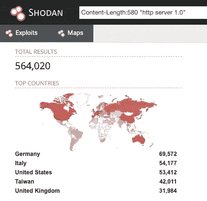

# 影响互联网上大约 312K 设备的 QNAP 预授权根 RCE

> 原文：<https://infosecwriteups.com/qnap-pre-auth-root-rce-affecting-450k-devices-on-the-internet-d55488d28a05?source=collection_archive---------2----------------------->

2019 年，我在 QNAP PhotoStation 和 CGI 程序中发现了多个漏洞。这些漏洞可以链接成一个**预授权根 RCE** 。所有 QNAP NAS 模型都存在漏洞，互联网上存在~312K 的漏洞 QNAS 实例(统计预测)。这些漏洞已被负责任地报告、修复和分配[CVE-2019–7192](https://nvd.nist.gov/vuln/detail/CVE-2019-7192))(CVSS 9.8)[CVE-2019–7193](https://nvd.nist.gov/vuln/detail/CVE-2019-71923)(CVSS 9.8)[CVE-2019–7194](https://nvd.nist.gov/vuln/detail/CVE-2019-7194)(CVSS 9.8)[CVE-2019–7195](https://nvd.nist.gov/vuln/detail/CVE-2019-7195)(CVSS 9.8)。这篇文章是第一次公开披露，但只有 3 个漏洞被披露，因为它们足以实现预授权根 RCE。

# 影响

## 脆弱的实例

下面的 Shodan 搜索揭示了互联网上的 564K QNAP 实例。其中，1065 个随机选择的实例中有 590 个启用了 Photo Station。(通过`GET /photo/slideshow.php`检查，看它是否用`Invalid album selection`响应)因此，从统计上来说，在 [95%置信水平，置信区间 3](https://www.surveysystem.com/sscalc.htm) 的情况下，应该有~312K 个实例启用了 Photo Station，并且它们在当时(2019)都是易受攻击的。



在 Shodan 上发现 564K QNAP 实例

## 受影响的照片站版本

修复版本(6.0.3、5.2.11、5.4.9)之前的所有可下载版本都受到了影响。

请访问 [QNAP 的安全顾问](https://www.qnap.com/zh-tw/security-advisory/nas-201911-25)了解版本信息等详细信息。

# 编辑

**根据 QNAP PSIRT 的要求，这篇文章已经做了很大的修改，以便为更多用户提供更长的时间来获得补丁**。我们一起建设一个更安全的世界。

现在，让我们来看看这 3 个漏洞，它们稍后将被链接起来，形成一个预授权根 RCE。

# 漏洞 1:预授权本地文件泄露(有效的绕过登录)

**【修订】**

# 将预授权本地文件公开升级到权限提升(绕过登录)

我们可以使用这个预先授权的本地文件公开来读取一个包含一个**登录令牌**的神奇文件，我们可以用它来验证一个有效的内置用户`appuser`。

魔法文件[已编辑]:

```
[redacted]
```

*   恢复出厂设置后，文件内容不会改变
*   该文件在`[redacted]`第一次成功时生成
*   `[redacted]`是加密的
*   PhotoStation 缓存了`[redacted]`中`[redacted]`的**明文**版本

```
[redacted]
```

因此，我们可以利用漏洞 1 来**读取缓存的明文令牌以绕过登录**并认证为`appuser`:

[编辑:绕过认证的图片]

用这个技巧，漏洞 1 实际上是一个**认证旁路**。

快速回顾:

*   [已编辑]
*   [已编辑]
*   [已编辑]

# 漏洞 2:认证会话篡改——将 PHP 代码写入会话

被认证为`appuser`使我们能够访问 SMTP 设置，该设置在电子邮件字符串中有一个**不正确的过滤。经过认证的攻击者可以[编校]，这可以链接到下一个漏洞，或者其他文件包含漏洞(例如`[redacted]`)。**

## POC:认证的会话篡改

**【编辑的会话篡改图片】**

# 漏洞 3:(预授权)将会话写入任意位置

根据 QNAP PSIRT 的要求，对本节进行了编辑。

此漏洞使得未经验证的攻击者能够将会话内容(`[redacted]`)写入服务器上的任意位置。

易受攻击的代码:

**【修订版】**

## POC:将会话写入任意位置

**【编校】**

# 预授权根 RCE 的链接

*   利用漏洞 1 绕过认证，认证为`appuser`
*   利用漏洞 2 将[修订的]代码(通过 SMTP 电子邮件)放入[修订的]会话(`[redacted]`)
*   利用漏洞 3 将被污染的[修订的]会话写入 Photo Station 的 web 目录，以创建一个 webshell

[已编辑]

# 公开

*   2019/06/14:向 QNAP 报告技术细节
*   2019/12/16:供应商修复了所有 4 个漏洞，提出提供赏金(由于赏金条款，金额被隐藏)
*   2019/12/31:获得赏金
*   2020/05/19:公开披露
*   2020/06/09:应供应商要求，修改了漏洞 1 的详细信息
*   2020/06/10:应供应商要求，修改了漏洞 2 和 2 的详细信息
*   2020/06/19:应供应商要求进行更多编辑

# 结论

3 个漏洞被链接起来，以获得 QNAP PhotoStation 中的预授权根 RCE，它可以在 QNAP 的所有 NAS 型号上工作。还公开了利用 QNAP 产品的几种技巧。希望 QNAP 有一天能解决这些问题，否则我敢肯定会有更多的高 CVSS 简历出现。

## 关键要点:

*   [如果您还没有升级 QNAP NAS，现在就升级](https://www.qnap.com/zh-tw/security-advisory/nas-201911-25)
*   [已编辑]
*   有一种方法可以解密`[redacted]`，但我会把它作为家庭作业留给你
*   QNAP 的网络服务器以[修订版]运行
*   [修订]可能会给你更多的 0 天

## 供应商咨询

[https://www.qnap.com/zh-tw/security-advisory/nas-201911-25](https://www.qnap.com/zh-tw/security-advisory/nas-201911-25)