# Querier — HackTheBox 详细报道

> 原文：<https://infosecwriteups.com/querier-hackthebox-writeup-71d40bf55a65?source=collection_archive---------2----------------------->

## Querier 是一个很棒的盒子，里面有一些对 Windows 初学者来说很不错的东西。该框从 smb 枚举开始，它为我们提供了登录数据库服务器的凭据。我将让主机给我建立一个 SMB 连接，在那里我可以收集 Net-NTLMv2 挑战响应，并破解它以获得密码。话虽如此，让我们直接开始吧。

# 计数和侦察

**Nmap 扫描**

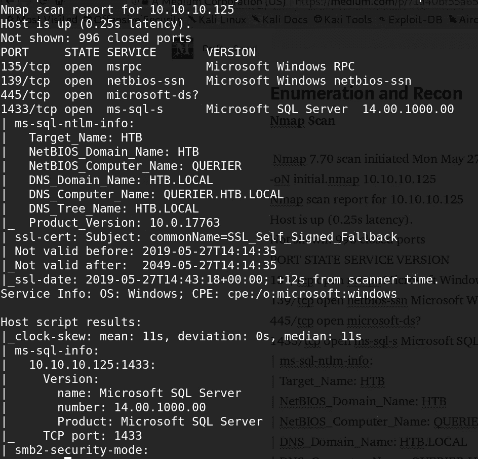

**SMB — TCP 445**

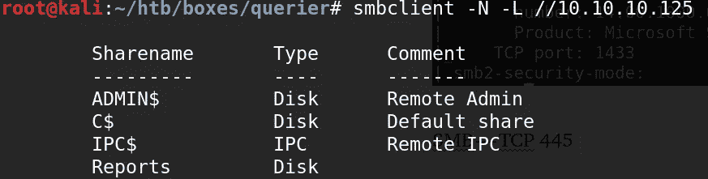

桑巴股份

**报道**看起来很有趣。让我们看看那里有什么。

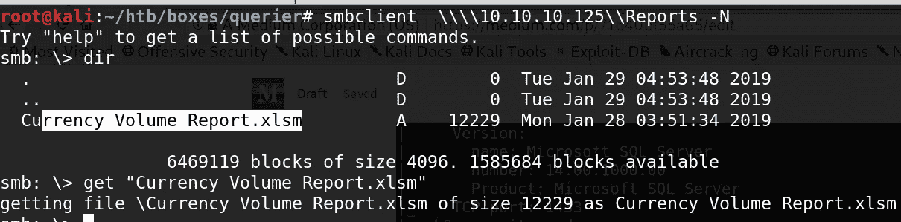

SMB 客户端输出

有一个扩展名为***【xslm】***的文件。对它运行文件命令，显示它是一个 *Microsoft Excel 文档*。我试图通过 Google Sheets 打开它，结果却遭到了攻击。后来我走了一圈，想看看文件里藏了什么。

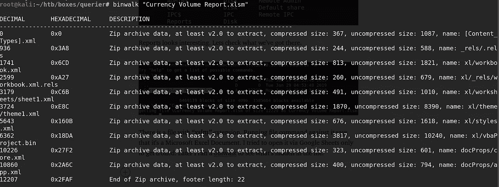

binwalk 输出

我使用 [**oletools**](https://github.com/decalage2/oletools) 来获取宏，发现了一个潜在的用户名和密码。

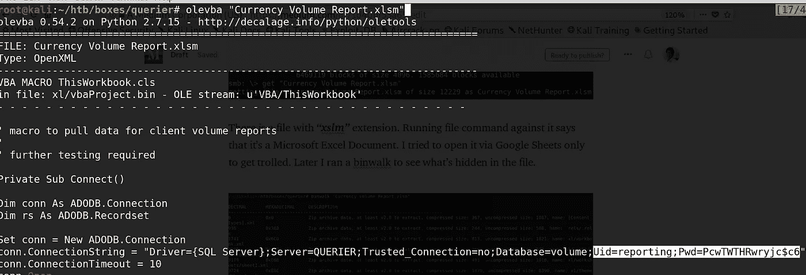

> 用户名= **报告**
> 
> 密码=**PcwTWTHRwryjc＄C6**
> 
> 数据库= **卷**

## **MSSQL — 1433**

现在我们有了凭证，让我们登录到 DB 并检查我们得到了什么。我试着用 **sqsh** 和 **dbeaver** 登录，但是由于某种原因他们失败了。后来我用这个 metasploit 辅助模块***auxiliary/admin/MSSQL/MSSQL _ SQL***枚举数据库。

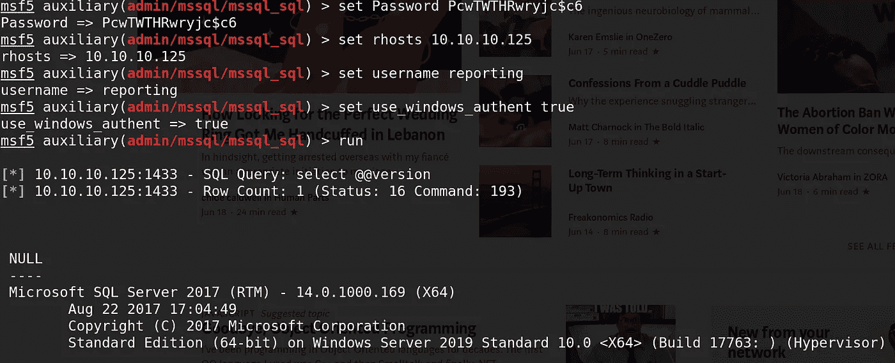

MSF 模块

好了，我们得到了 SQL Server 版本。由于用这个模块枚举相当慢，我切换到 **impacket — mssqlclient** 继续枚举。

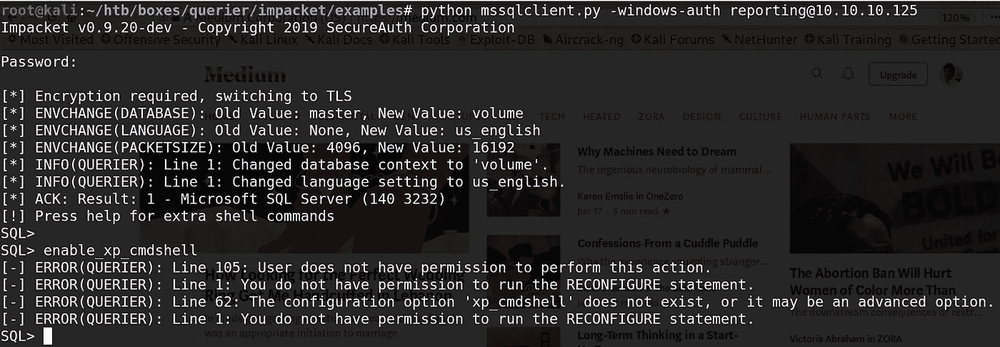

启用 xp_cmdshell 失败，因此我们可能需要提升到更高权限的用户。让我们使用[***responder***](https://github.com/SpiderLabs/Responder)**抓取哈希。**

这是一篇从 windows 获取 ntlm 哈希的好文章。

 [## 通过 NTLMv2 获取凭据

### Windows 机器用于通过网络进行身份验证的身份验证协议之一是质询/响应/…

0xdf.gitlab.io](https://0xdf.gitlab.io/2019/01/13/getting-net-ntlm-hases-from-windows.html) 

> 运行***responder-I tun 0-v***启动 responder

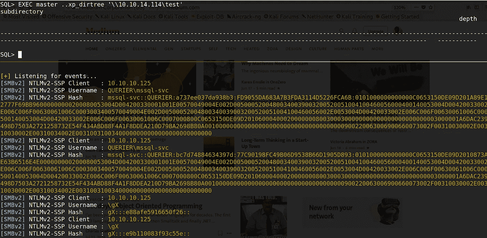

散列滚滚而来

让我们和约翰一起破解这些散列。

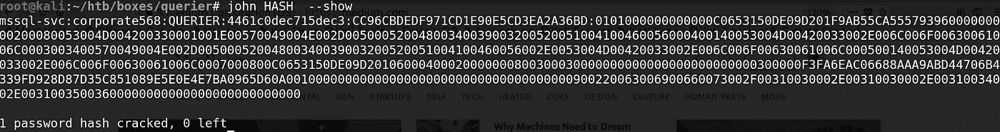

> 用户名= **mssql-svc**
> 
> 密码= **公司 568**

再次登录数据库的时间到了。当我第一次这样做的时候，我用上面的凭证登录了 ***【端口 135】***，但是不能再用它了。

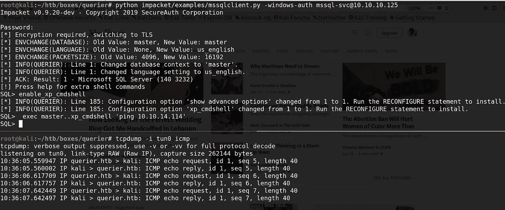

xp_cmdshell 已启用。

xp_cmdshell 已启用，我们可以 ping 自己。太棒了。是时候买个壳了。

# 作为 mssql-svc 的 Shell

我用了霓裳`[**Invoke-PowerShellTcp.ps1**](https://github.com/samratashok/nishang/blob/master/Shells/Invoke-PowerShellTcp.ps1)`反壳。

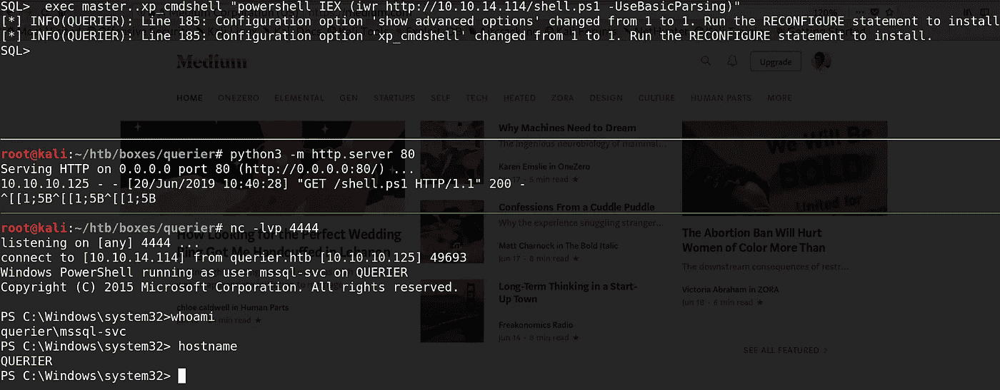

# 系统特权

我运行了[**power up . PS1**](https://github.com/PowerShellMafia/PowerSploit/blob/master/Privesc/PowerUp.ps1)**，马上就找到了管理员凭证。**

**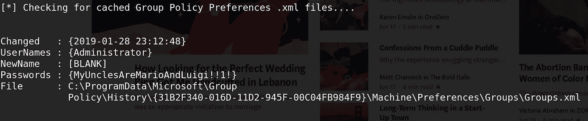**

> **用户名:**管理员****
> 
> **密码: **MyUnclesAreMarioAndLuigi！！1!****

# **阅读标志**

# **净使用**

**只需获取对文件系统的访问权，但这就是获取标志所需的全部内容:**

**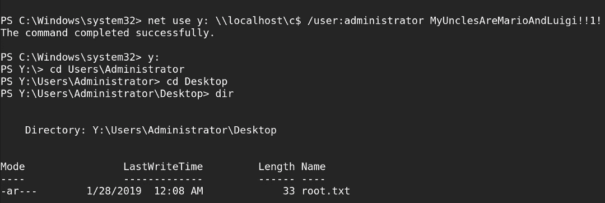**

# **Shell 作为 nt-authority\system**

**因为我们有管理员凭证，我们可以使用[**impacket/psexec . py**](https://github.com/SecureAuthCorp/impacket/blob/master/examples/psexec.py)**登录。****

****请务必下载最新的 psexec.py 文件，因为我在克隆 repo 后得到的文件有问题。这个壳本质上是慢的，耐心点。****

> ****[https://github.com/SecureAuthCorp/impacketT21](https://github.com/SecureAuthCorp/impacket)****

****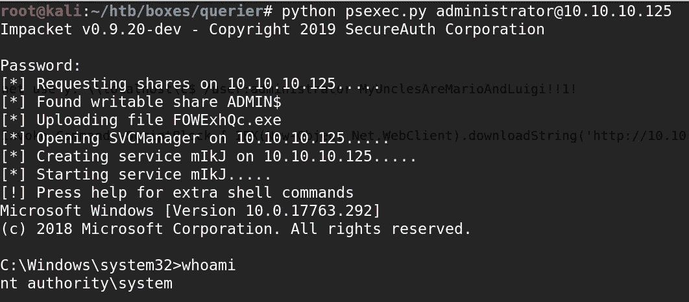****

# ****powershell“运行方式”****

****使用密码创建一个可以传递给`**Invoke-Command**`的凭证。在这种情况下，`**adminShell.ps1**`是另一个`[**Invoke-PowerShellTcp.ps1**](https://github.com/samratashok/nishang/blob/master/Shells/Invoke-PowerShellTcp.ps1)`，端口改为 9001:****

****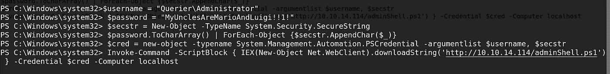********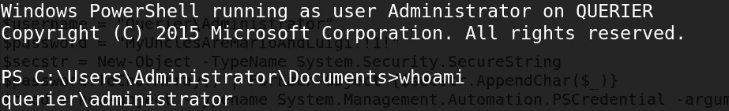****

****作为管理员的 Shell****

****我试图使用 WinRM 作为管理员获取 shell，但它给了我一个授权错误。****

****嗯，这次我就说这么多了。希望你阅读愉快。****

******感谢并快乐黑客，
Preetham(**[***)@ cyber 01***](https://www.hackthebox.eu/profile/9160)***)*******