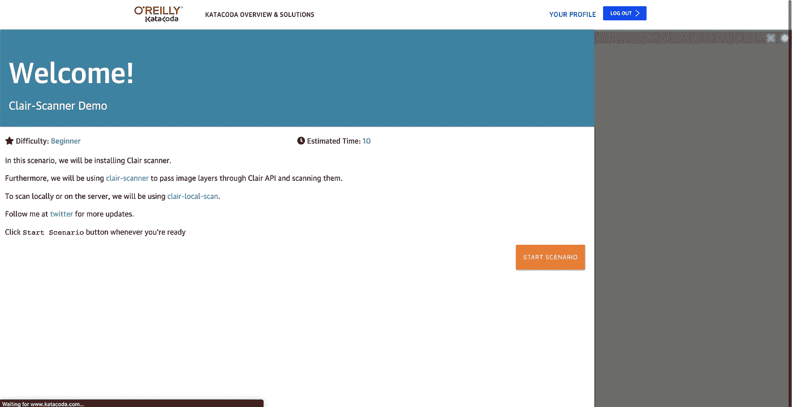
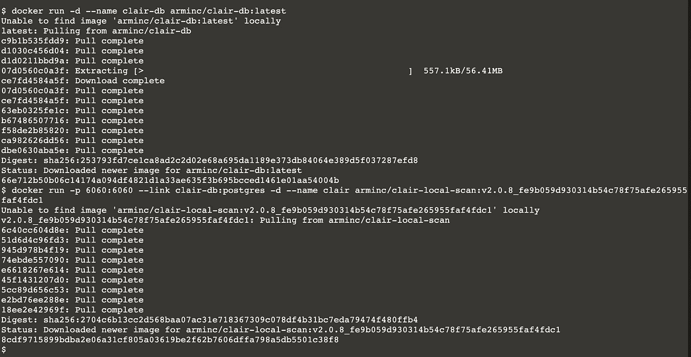
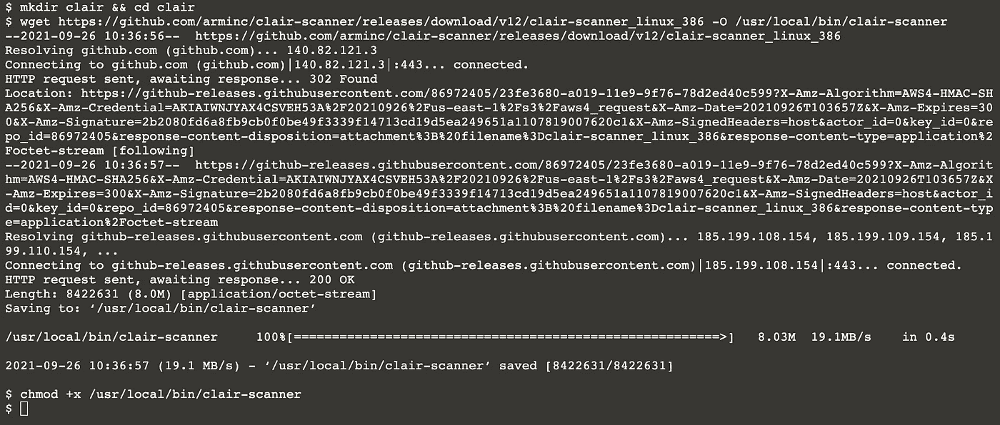
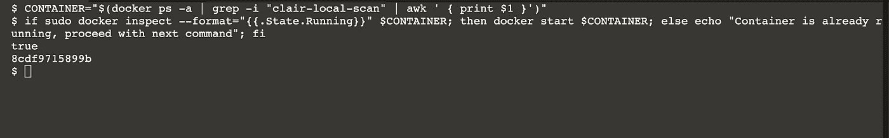
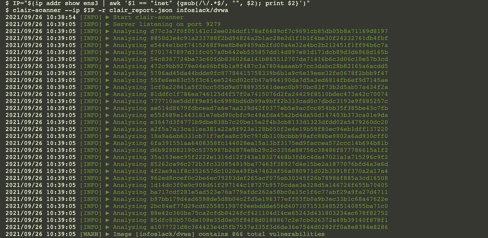
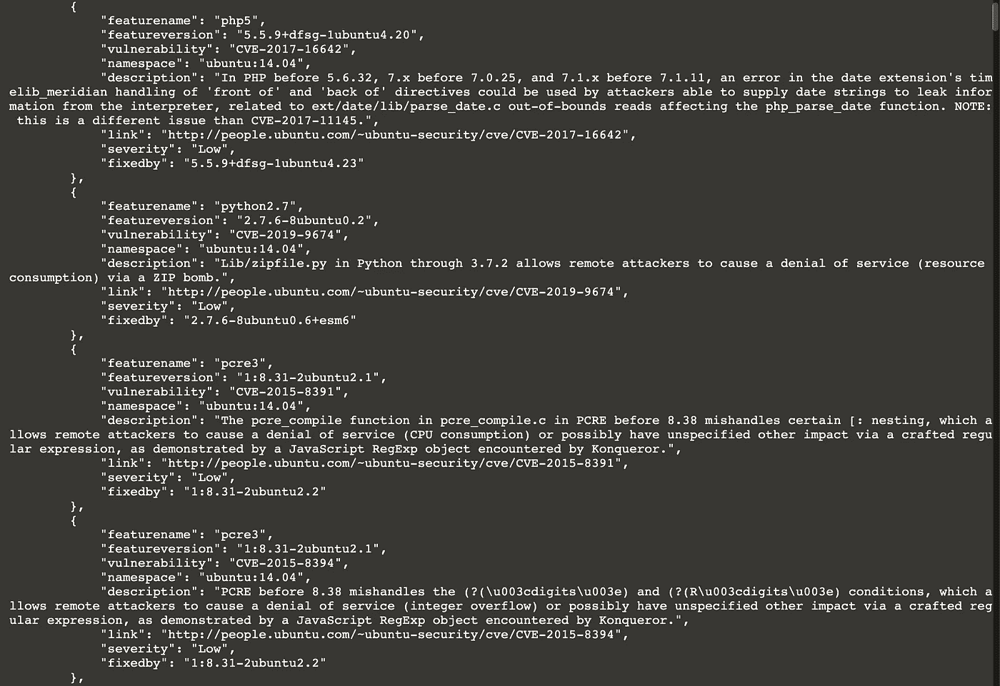

# 通过 Katacoda 运行 Clair 扫描仪的快速指南

> 原文：<https://infosecwriteups.com/quick-guide-for-running-clair-scanner-via-katacoda-a074bd256eff?source=collection_archive---------2----------------------->

本指南讲述了如何设置 Clair 扫描器，并对易受攻击的 DVWA 容器执行扫描。现在也可以在 katacoda 上进行实际操作演示。

您可以在 Katacoda 上运行演示。要运行演示，请访问[https://www.katacoda.com/justmorpheus](https://www.katacoda.com/justmorpheus)

# 设置 Clair 服务器或在本地使用。

> 科洛斯·克莱尔·https://github.com/coreos/clair
> 
> 克莱尔扫描 https://github.com/arminc/clair-scanner

您可以运行带有数据库的专用 Clair 服务器，并在 ci/cd 管道中使用该服务器，但是如果您希望将 Clair 作为 ci/cd 管道的一部分运行，那么您将会大吃一惊:

*   从头开始启动 Clair 大约需要 20 到 30 分钟，因为数据库需要用 CVE 填充。
*   Clair 需要访问容器层，因此您需要从 Clair 远程访问您的构建作业。

# 如何扫描集装箱

*   在本地或运行作业时启动 Clair 数据库和 Clair。

`docker run -d --name clair-db arminc/clair-db:latest`

`docker run -p 6060:6060 --link clair-db:postgres -d --name clair arminc/clair-local-scan:v2.0.8_fe9b059d930314b54c78f75afe265955faf4fdc1`

*   扫描易受攻击的图像

我们需要一个脆弱的形象。几乎没有易受攻击的图像，包括该死的易受攻击的 Web 应用程序。我们可以用它来测试克莱尔扫描仪。它在设计上是易受攻击的。

要从 Ubuntu 服务器指定要扫描的易受攻击的图像，请使用以下命令。

`docker pull infoslack/dvwa`

*   运行附加命令下载 Clair-scanner 二进制文件并执行扫描。

`mkdir clair && cd clair`

`wget https://github.com/arminc/clair-scanner/releases/download/v12/clair-scanner_linux_386 -O /usr/local/bin/clair-scanner`

`chmod +x /usr/local/bin/clair-scanner`

*   检查 Clair-local-scan 容器是否正在运行，否则将会出现错误。该命令将获取容器 id，并在退出时启动容器。

`CONTAINER="$(docker ps -a | grep -i "clair-local-scan" | awk ' { print $1 }')"`

`if sudo docker inspect --format="{{.State.Running}}" $CONTAINER; then docker start $CONTAINER; else echo "Container is already running, proceed with next command"; fi`

# 运行以下命令为易受攻击的 infoslack/dvwa 映像生成报告

*   此命令会将 IP 保存在变量中，这是以下操作所必需的:

`IP="$(ip addr show ens3 | awk '$1 == "inet" {gsub(/\/.*$/, "", $2); print $2}')"`

*   运行 Clair-scanner，这将生成保存在 clair_report.json 中的报告。

`clair-scanner --ip $IP -r clair_report.json infoslack/dvwa`

# 现在我们的报告准备好了，我们可以通过以下方式阅读:

`cat clair_report.json`

