# 浣熊盗 v2 恶意软件分析

> 原文：<https://infosecwriteups.com/raccoon-stealer-v2-malware-analysis-55cc33774ac8?source=collection_archive---------1----------------------->

图片来源:Bleepingcomputer.com([https://www . bleeping computer . com/news/security/malware-dev-infections-own-PC-and-data-ends-up-on-Intel-platform/](https://www.bleepingcomputer.com/news/security/malware-dev-infects-own-pc-and-data-ends-up-on-intel-platform/))

# 介绍

浣熊窃取者是在地下黑客/网络犯罪论坛上出售的信息窃取者，于 2019 年初首次观察到。浣熊盗 v2 首次出现在 2022 年 6 月，在开发者从他们在 2022 年初宣布的所谓“退休”中回来之后。[1]就像浣熊窃取者 v1 一样，v2 能够窃取信息，包括 cookies 和其他浏览器数据、信用卡数据、用户名和密码。

# 技术分析

浣熊盗 v2 是用 C/C++编写的，只有大约 57kb，是相当轻量级的。下面是打包样本和未打包样本的哈希值。根据我的研究，默认情况下，浣熊偷窃者没有打包出售，相反，任何打包都必须由将部署该恶意软件的客户完成。

*   包装的 sha 256:40 DAA 898 f 98206806 ad 3 ff 78 f 63409d 509922 e0c 482684 cf 4 f 180 faac 8 CAC 273
*   unpacked sha 256:0123 b 26 df 3c 79 BAC 0 a3 FDA 79072 e 36 c 159 CFD 1824 AE 3 FD 4 b 7 f 9 de a9 BDA 9 c 7909

## 拆包

打开这个示例非常简单。我所做的只是在一些感兴趣的 API 调用上设置断点，如 VirtualProtect、WriteProcessMemory、CreateProcessInternalW 和 VirtualAlloc。一旦命中 VirtualProtect 断点，我就跟踪内存转储中 EAX 寄存器的地址，然后再次运行程序，直到下一个断点。之后，我能够从内存中转储有效载荷，并继续我的分析。

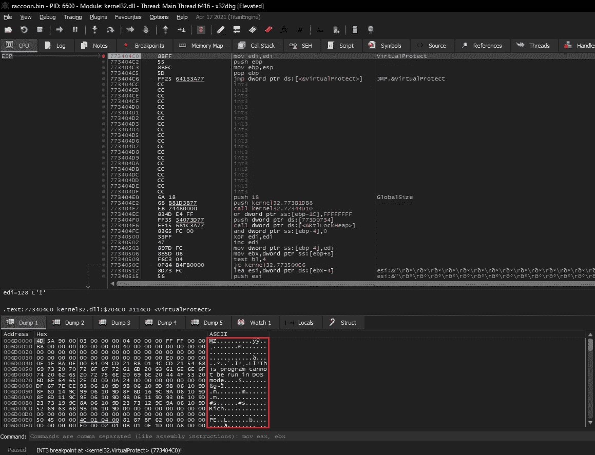

图一。从内存中转储第二级有效载荷。

## 解析导入

首先，我在 PEstudio 中打开有效负载来执行一些基本的静态分析，这将指导我如何执行其余的分析。在 PEstudio 中打开二进制文件，少量的导入函数(只有 8 个)让我相信恶意软件可能会动态解析其导入。

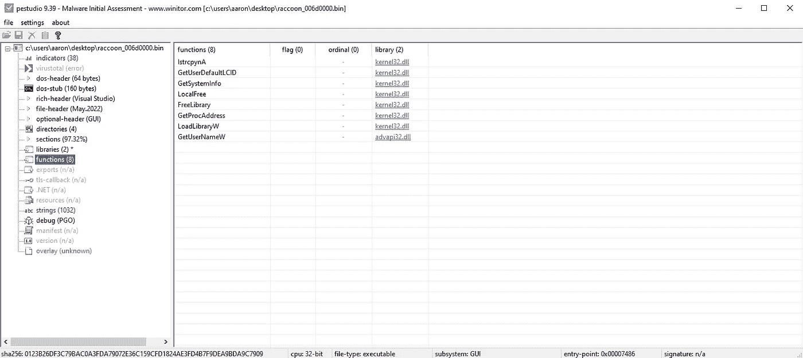

图二。PEstudio 中显示的导入功能。

在 Ghidra 中反汇编二进制文件时，我在二进制文件的早期就发现了导入解析器函数，正如所料。这个函数简单地使用 GetProcAddress API 函数来加载它将需要的函数的地址。其中一些功能立刻吸引了我的眼球，这些是图 3 中突出显示的与互联网相关的功能。

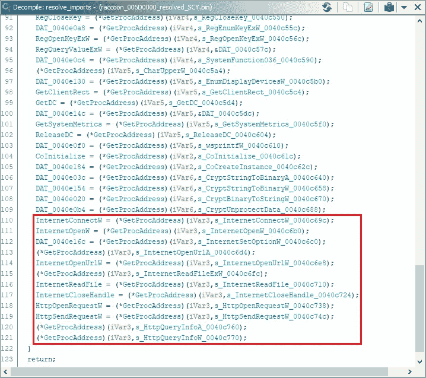

图 3。导入解析器功能中与互联网相关的功能。

## 解密字符串和 C2 IP 地址

该恶意软件还使用 Base64 编码和 RC4 加密来混淆其字符串。RC4 加密字符串以 Base64 编码形式存储。这些字符串经过 Base64 解码，然后使用 RC4 密钥“edinayarossiya”解密，edinayarossiya 在俄语中是“统一俄罗斯”的意思。一旦字符串被解密，恶意软件就会对 C2 IP 地址执行相同的解密程序，但使用不同的 RC4 密钥。

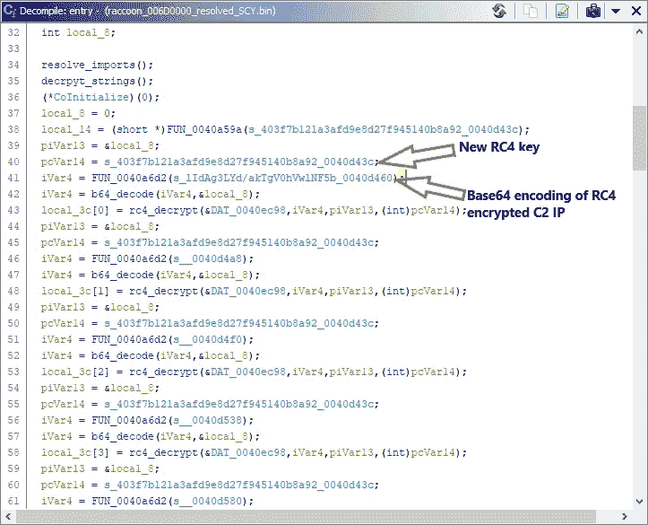

图 4。解码和解密 C2 IP 地址。

有了这个 RC4 密钥和 Base64 编码的数据，我就可以使用 cyberchef 来获取 C2 节点的 IP 地址。

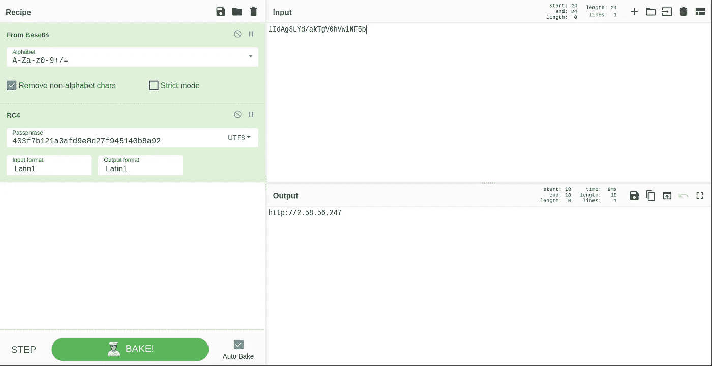

图 5。在赛博咖啡馆提取 C2 的 IP 地址。

## 检查互斥体

接下来，恶意软件通过打开值为 8724643052 的互斥体来检查它的另一个实例是否已经在受感染的机器上运行。如果 OpenMutexW 函数失败并返回 0，恶意软件将使用该值创建一个互斥体，然后继续执行。如果函数成功并返回 1(真)，恶意软件退出。

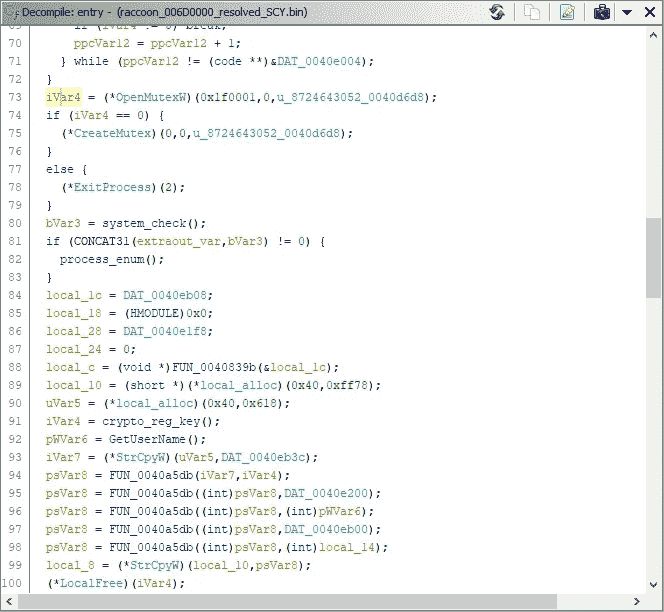

图 6。正在检查打开的互斥体。

## 系统检查和进程枚举

该恶意软件还通过比较当前进程的令牌和系统 SID S-1–5–18 来检查它是否作为系统运行。

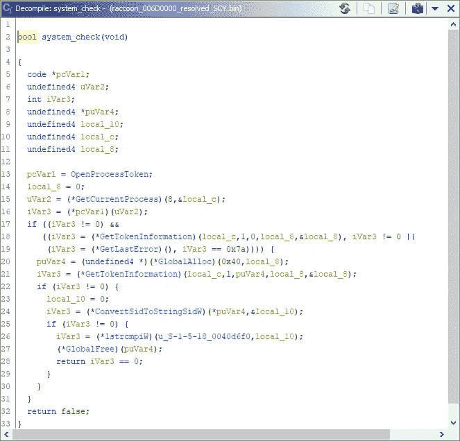

图 7。恶意软件检查它是否以系统权限运行。

如果恶意软件作为系统运行，它将使用 CreateToolHelpSnapshot32、Process32First 和 Process32Next 调用进程枚举函数。

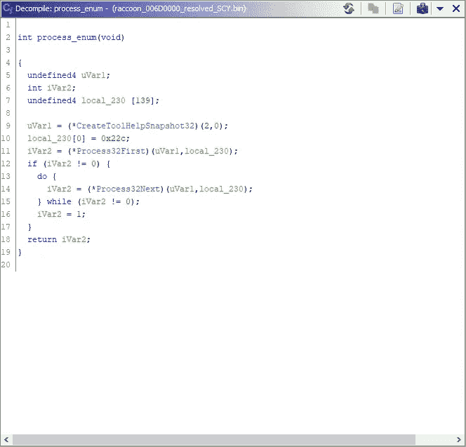

图 8。枚举受感染机器上的功能。

如果恶意软件*不是*以系统权限运行，它简单地跳过进程枚举函数并继续执行。

## 主机 GUID 和用户名

在连接到 C2 节点之前，恶意软件将通过查询 SOFTWARE \ Microsoft \ Cryptography 注册表项来检索主机的 GUID。

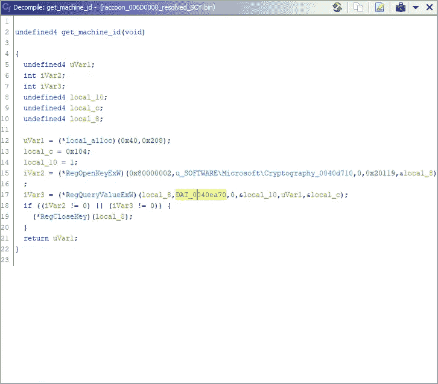

图 9。从注册表中检索主机 GUID。

该恶意软件还检索当前用户的用户名，并在联系 C2 节点之前，将其与机器 ID 一起移动到堆上。

## C2 通信

首先，恶意软件使用 WideCharToMultiByte API 函数来形成连接到 C2 节点所需的所有参数，包括 machineID、用户名和 configID 参数，这些参数将通过 POST 请求发送到 C2 节点。值得注意的是，configID 参数只是在执行的早期用来解密 C2 IP 地址的 RC4 密钥。

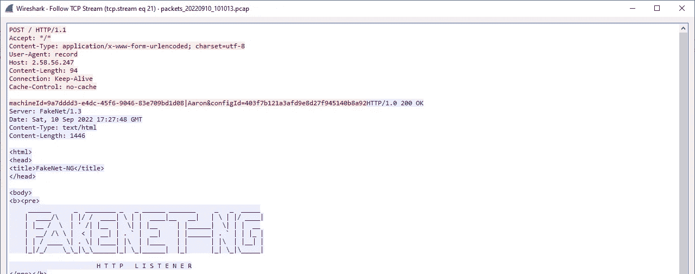

图 10。向 C2 节点发送包含 machineID、用户名和 configID 参数的请求。

恶意软件然后检查来自 C2 节点的响应是否大于 0x3f(十进制 63)字符长度。如果是，恶意软件将继续执行。否则，恶意软件会跳出循环并退出。

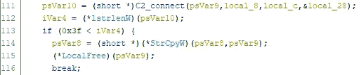

图 11。检查 C2 节点响应的长度。

不幸的是，在我进行分析的时候，C2 IP 地址似乎不再可用，因为 Shodan 显示端口 3389 (RDP)是唯一的监听端口。假设 C2 节点仍在运行并能够与受感染的主机通信，C2 节点将返回几个不同的 DLL 供下载到受感染的主机。然后，这些 DLL 将被放在“C:\ Documents and Settings \ Administrator \ Local Settings \ Application Data”文件夹中。

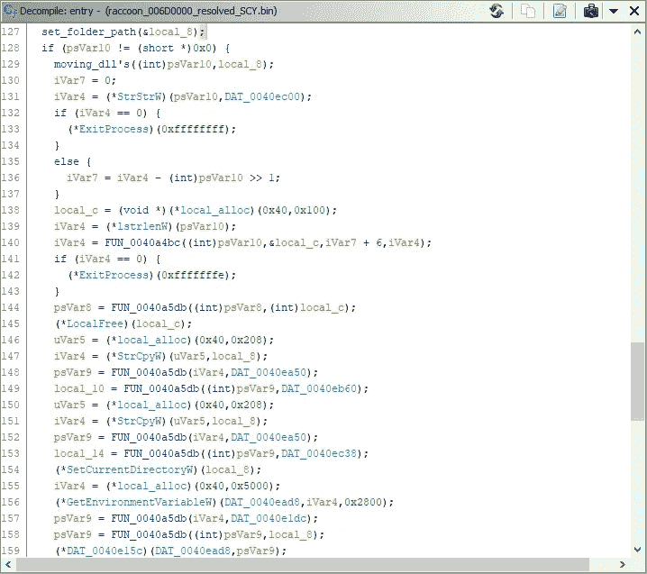

图 12。请注意在将下载的 DLL 移动到该路径之前设置文件夹路径的函数(C:\ Documents and Settings \ Administrator \ Local Settings \ Application Data)

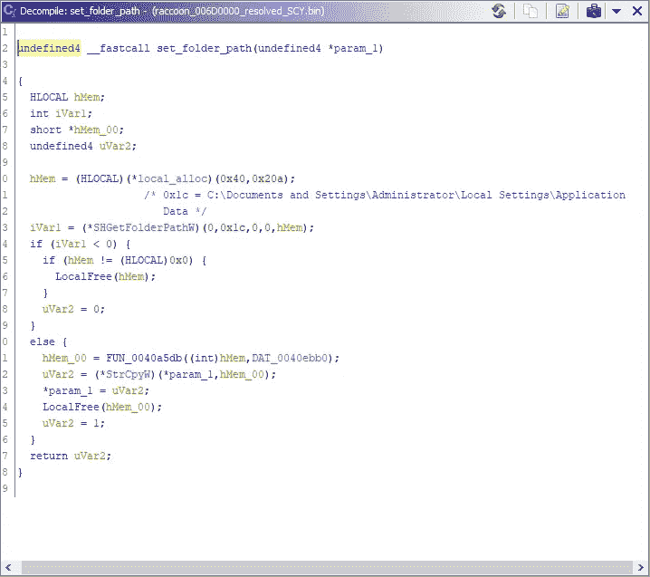

图 13。设置要放置 DLL 的文件夹路径。

此时，恶意软件将执行其大部分窃取功能，包括 cookies、密码、信用卡数据、密码、浏览器历史记录等。[2]这种功能中的一些将自动执行，而一些将需要来自控制 C2 节点的操作员的命令。

# **结论**

总之，浣熊窃取者 v2 是一个相对简单，但非常强大的信息窃取者，就像 v1 一样。这两个版本的窃取者对所有类型的组织以及个人都构成威胁。这种恶意软件窃取的信息可用于接管所有类型的帐户，包括金融、社交媒体、企业等。

我希望你喜欢这篇文章，并希望你会再次回来！一个关注和分享将是超级赞赏。反馈当然也是受欢迎的。

# 参考

[1][https://www . bleeping computer . com/news/security/浣熊-steaker-is-back-with-a-new-version-to-steak-your-passwords/](https://www.cybereason.com/blog/research/hunting-raccoon-stealer-the-new-masked-bandit-on-the-block)

[2][https://blog . seko ia . io/浣熊-偷窃者-v2-part-2-深入分析/#h-mutex](https://blog.sekoia.io/raccoon-stealer-v2-part-2-in-depth-analysis/#h-mutex)

## 来自 Infosec 的报道:Infosec 每天都有很多内容，很难跟上。[加入我们的每周简讯](https://weekly.infosecwriteups.com/)以 5 篇文章、4 个线程、3 个视频、2 个 Github Repos 和工具以及 1 个工作提醒的形式免费获取所有最新的 Infosec 趋势！