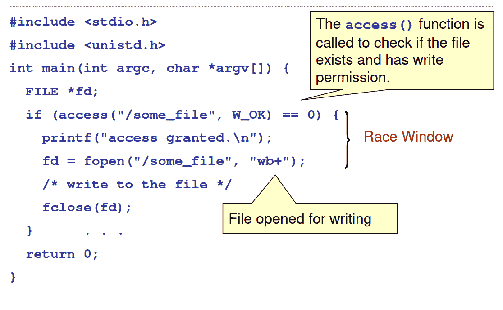
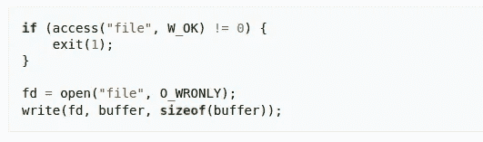
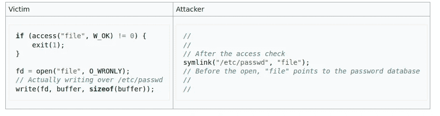
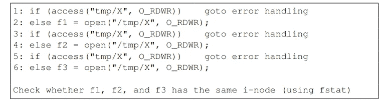

# Unix 系统中的竞争条件漏洞

> 原文：<https://infosecwriteups.com/race-condition-vulnerability-in-unix-systems-db86b6daceb6?source=collection_archive---------3----------------------->

今天我们将学习如何发现并修复 Unix 系统中的竞争情况。这是漏洞的常见来源，也可能发生在其他领域，如 Web 应用程序。

我们将首先定义什么是竞争条件，如何利用它，以及最终我们可以做什么来修复/减轻它。

# 1.什么是竞争条件？

当多个进程/线程同时访问和操作相同的数据，并且它们的时序或事件顺序影响程序的结果时，就会出现争用情况。

竞态条件可能以不同的方式发生:

*   如果一个特权程序存在竞争条件漏洞，攻击者可以运行一个并行进程来与特权程序“竞争”,并操纵与合法程序相同的数据。这就是我们将在本文中处理的例子。
*   线程上下文切换:2 个线程同时访问相同的数据，相互干扰。在这种情况下，结果可能取决于线程访问共享数据的顺序。这里有一个例子:[https://stack overflow . com/questions/7714220/how-race-conditions-will-reased-by-context-switching](https://stackoverflow.com/questions/7714220/how-race-conditions-will-caused-by-context-switching)
*   …

但是所有不同的竞争条件都有这些共同的特性:

*   并发属性:必须至少有两个流同时运行
*   共享对象属性:两个并发流必须访问一个共享的 race 对象
*   更改状态属性:至少有一个流必须改变对象的状态

进程/线程相互干扰的时间间隔称为竞争窗口。下面是一个比赛窗口的例子:

# 2.如何利用竞争条件

我们将看到一个竞争条件变成“检查时间到使用时间”错误的例子。它利用被访问数据的*检查*和数据的*使用*之间的时间同时执行另一个程序:

[https://en.wikipedia.org/wiki/Time-of-check_to_time-of-use](https://en.wikipedia.org/wiki/Time-of-check_to_time-of-use)

访问功能检查真实用户(执行 SUID 程序的人)是否通常被允许(用他的真实用户 ID)修改文件。访问功能和打开功能之间的时间是竞争窗口，可以这样利用:

[https://en.wikipedia.org/wiki/Time-of-check_to_time-of-use](https://en.wikipedia.org/wiki/Time-of-check_to_time-of-use)

因此，通过在主受害者程序创建的文件和/etc/password 文件之间创建链接，黑客可以覆盖 password 文件中的条目。链接的创建必须发生在检查和使用之间的窗口内；即在访问和开放调用之间。

这需要精确的时间，但如果黑客多次运行该程序，通过自动化，这迟早会发生。

注意:通过将计算机系统暴露在异常大的负载下，有可能有效地延长执行竞争窗口所需的时间。

如果你想弄脏你的手，并试图利用 Linux 中的一个竞争条件，我建议你查看来自 RootMe 的这个挑战:[https://www . root-me . org/en/Challenges/App-System/ELF-x86-Race-condition](https://www.root-me.org/en/Challenges/App-System/ELF-x86-Race-condition)

# 3.如何防止竞态条件？

竞争条件下的保护机制:

*   消除竞争条件的一种方法是使冲突的竞争窗口互斥。换句话说，一旦潜在的竞争窗口开始执行，在第一个竞争窗口完成之前，不允许执行任何冲突的竞争窗口。实现互斥的编程语言工具称为同步原语(如管道、信号量、锁变量等)。来自独立进程的竞争条件不能由同步原语解决。我们使用锁文件来代替。

*注意:锁定文件是锁定资源的文件，例如文件或设备。它通常不包含数据，仅作为空标记文件存在，但也可能包含锁的属性和设置。锁文件向应用程序发出信号，表明在释放锁之前不应使用资源。*

*   如果您的竞争条件涉及上下文切换，请尝试同时执行“检查并使用”。如果一个系统调用可以在同一个系统调用中同时执行“检查和使用”，那么它是安全的，因为上下文切换不会在系统调用中发生。
*   重复:我们可以添加更多的竞争条件，而不是删除竞争条件，这样，为了危及程序的安全性，攻击者需要赢得所有这些竞争条件。基本思路是重复几次 access()和 open()；每次，我们打开文件，最后，我们通过检查它们的 I 节点来检查是否打开了相同的文件(它们应该是相同的) :

因此，赢得每场比赛的概率非常低。

*注意:检查 I-node 确保相同的文件名指向相同的文件(即相同的 I-node)*

*   最小特权原则:程序员确实明白运行程序的用户可能太强大了，所以他/她引入了 access()来限制用户的权力。然而，这不是正确的方法。更好的方法是应用最小特权原则。也就是说，如果用户不需要某些特权，则需要禁用该特权。我们可以使用 setuid 系统调用来暂时禁用 root 权限，以后如果需要的话再启用它

感谢阅读这篇文章！请在评论中告诉我你对此的看法！

如果你读了这篇文章，你可能会花很多时间在你的电脑上，所以请随意查看我关于肌肉骨骼问题和电脑的文章:[https://malolegoff . medium . com/muscle skeletal-issues-due-to-computers-302d 80 EC 97 db](https://malolegoff.medium.com/musculoskeletal-issues-due-to-computers-302d80ec97db)

如果你有任何问题或者想联系我，这里是我的 LinkedIn:【https://www.linkedin.com/in/malo-le-goff-480452170/? locale=en_US