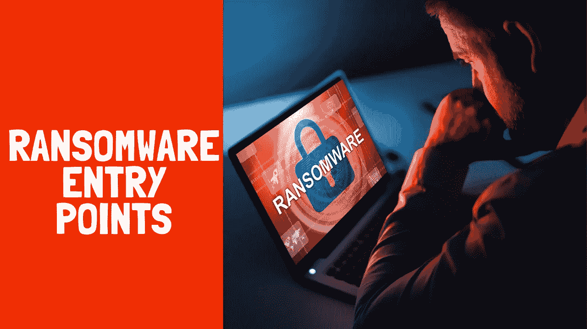
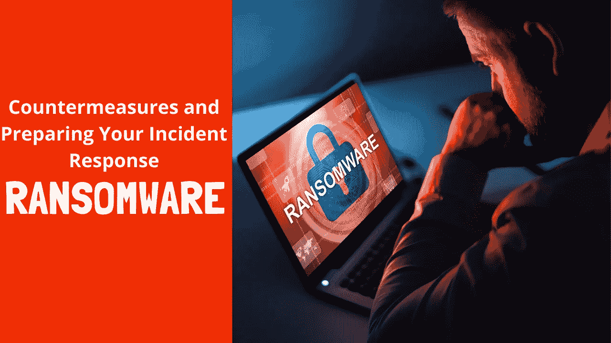
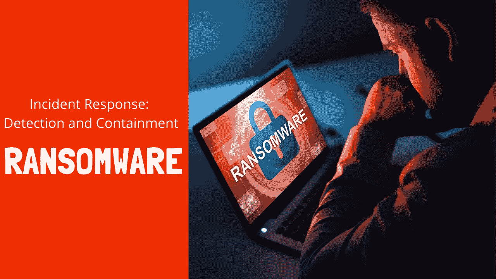

# 勒索软件攻击//事件响应—勒索软件

> 原文：<https://infosecwriteups.com/ransomware-attack-1083560626b7?source=collection_archive---------5----------------------->

1.  勒索软件是如何进入你的网络的？//勒索软件入口点[勒索软件攻击]

[https://youtu.be/JZ2Crn1SKHQ](https://youtu.be/JZ2Crn1SKHQ)

2.勒索软件:对策和准备您的事件响应//防御勒索软件攻击

https://youtu.be/JpR8UlUAGWY

3.勒索软件:事件响应:检测和遏制//勒索软件攻击

【https://youtu.be/vQgBluFQxm8 