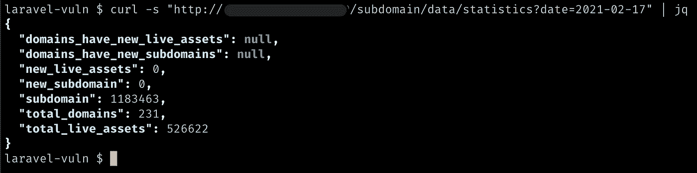
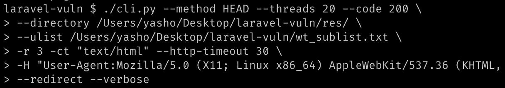
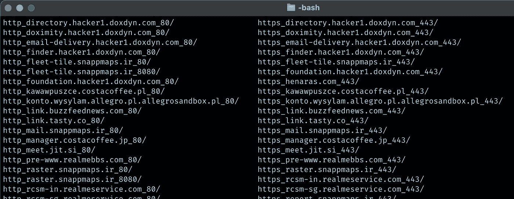
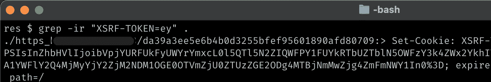
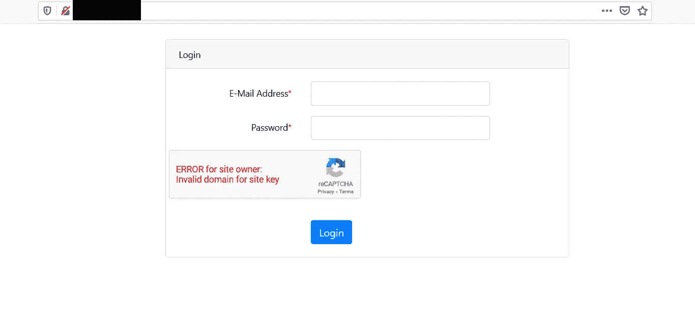
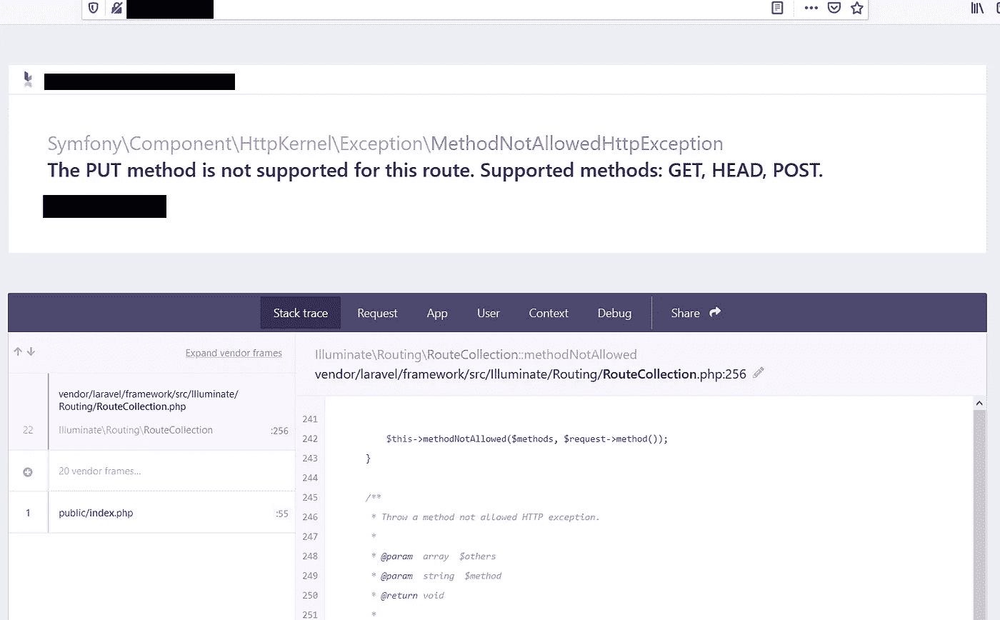
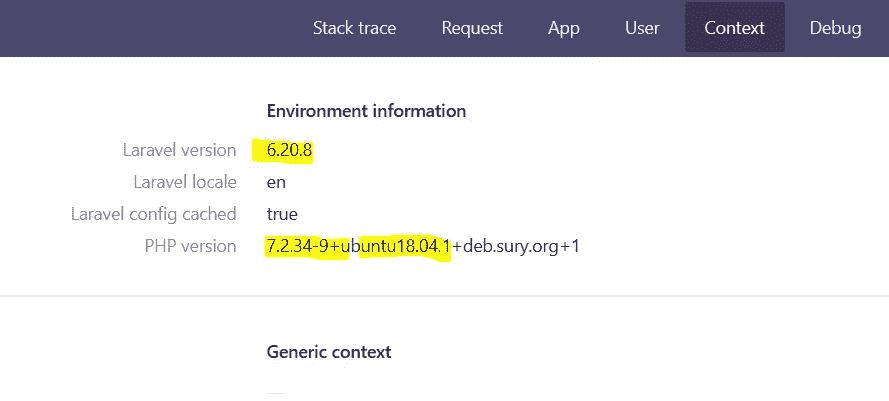

# RCE 参加了一个私人项目

> 原文：<https://infosecwriteups.com/rce-on-a-laravel-private-program-2fb16cfb9f5c?source=collection_archive---------0----------------------->

最近的 [Laravel CVE](https://nvd.nist.gov/vuln/detail/CVE-2021-3129) 使得远程攻击者能够利用使用 Laravel 的网站中的 RCE 缺陷。我已经阅读了[的文章](https://www.ambionics.io/blog/laravel-debug-rce)关于使用 Laravel 上点火库的开发过程。顺便说一下，这个帖子最初是在[这里](https://zdresearch.com/rce-on-a-laravel-private-program/)发表的，我也决定把它放在中型网站上。

首先，我浏览了我们的 recon 数据库，其中包含许多 web 应用程序的域和子域。我们建立了这个系统来抓虫子。

包含域和资产的 bug bounty 数据库

这里有大约 52.6 万个实时资产需要过滤。方法很简单，向所有资产发送 HTTP 请求，寻找匹配的 Laravel 签名。MEG 是获取大量 URL 的好工具。但是，我们运行的工具与 MEG 相似:

我使用 20 个线程运行脚本，寻找状态代码 200 和“text/html”内容类型。结果与各自的响应一起保存在不同的目录中

有许多方法可以检测 Laravel，我通过以下命令找到了几个匹配项:

然后我一个一个地检查它们，看它们是否点火。

一个有趣的案例是我们最近发现的一个私人项目。由于道德问题，我不能说出网站/公司的名称，因此将编辑名称和网址。

我总是做的第一件事是检查 web 应用程序是否在调试模式下运行。有许多方法可以做到这一点。在 Laravel 上对我来说最方便的一个方法是向端点发送允许的 HTTP 方法([需要更多信息吗？](https://laravel.com/docs/8.x/routing))。

所以我只是在向登录端点发送凭证时将 POST 方法更改为 PUT，它返回了 Laravel 的调试错误，确认应用程序启用了调试模式:

您还可以通过调试消息获得 Laravel 的版本，以及 PHP 和服务器操作系统和其他显示错误消息的额外信息。

由于私有程序的 Laravel 版本高于 6，并且它也运行 Ignition，我决定测试这个漏洞，幸运的是日志文件在默认路径上，我可以通过[这个漏洞](https://github.com/ambionics/laravel-exploits)利用它:

然而，如果日志文件路径不在默认位置，我将不得不强行猜测路径或尝试第二种方法，即使用 FTP 与 PHP-FPM 对话。