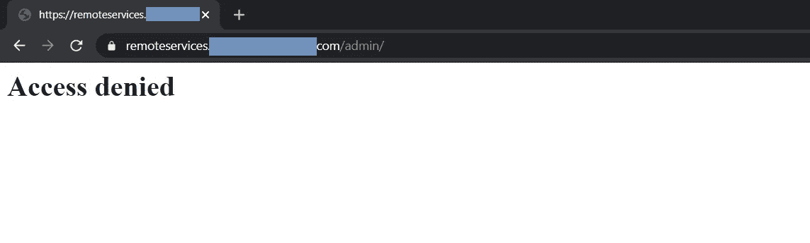
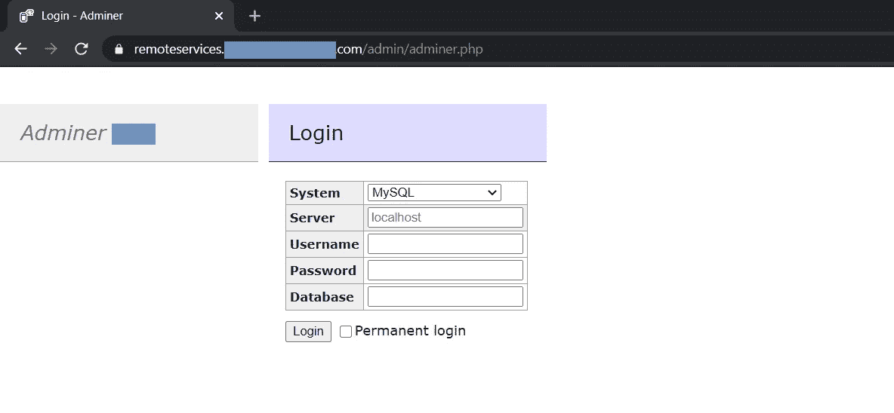
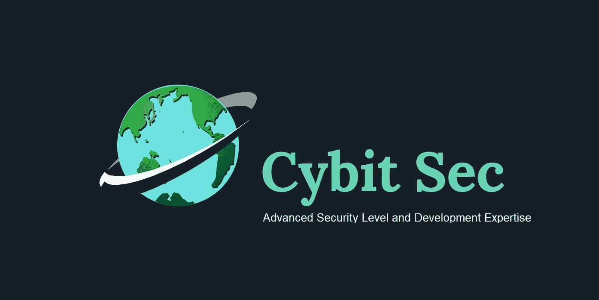

# 通过内部访问管理员数据库管理的 RCE(关键)

> 原文：<https://infosecwriteups.com/rce-via-internal-access-to-adminer-database-management-critical-d3dc2a1d392a?source=collection_archive---------0----------------------->

你好，

我的名字是艾哈迈德哈拉比，我在我的空闲时间做昆虫赏金猎人。我主要在 HackerOne 上打猎。

在这篇文章中，我将与你分享我如何能够访问内部数据库管理，导致远程代码执行。

**概述::**

当我在一个公共程序上搜索时，我发现了一个有趣的子域`remoteservices.target.com`，我对自己说，那里肯定隐藏着什么。

侦察方法::

我喜欢侦查，我花了很多时间做侦查，而不是真正的黑客。

所以浏览目标网站[https://remoteservices.target.com](https://remoteservices.target.com)显示 404 代码没有发现任何响应。

当您在响应中看到`404 Not Found`时，这意味着该网站中可能隐藏了一些东西，这里最好的方法是目录暴力/枚举。

**目录枚举::**

一个最常见的问题是你使用哪个单词表？

对我个人来说，我不使用任何特定的一个，它总是取决于你正在黑客攻击的目标。例如，如果它是一个 IIS 服务器，那么您应该使用包含 IIS 目录和文件的单词表。如果是 apache 服务器，那么您应该使用包含 apache 目录和文件的单词表。对你接近的任何目标都这样做。因此，如果我发现一个新的有趣的目录和文件路径，我通常会编辑多个单词表。这就是你如何优化你的侦察，使它更快更准确。

我用 FFUF 工具暴力破解了目标子域的目录，我得到了一个有趣的响应:这个目录的`admin`([https://remoteservices.target.com/admin](https://remoteservices.target.com/admin))。

403 禁止响应

这看起来很酷，因为禁止意味着肯定有一个隐藏的内容/部分，他们不想让你看到或访问。

**禁止绕过 403 的下一步::**

我想到的第一件事是强行打开 https://remoteservices.target.com/admin/adminer.php 的`admin`目录，我得到了一个可爱的管理员登录面板[。](https://remoteservices.target.com/admin/adminer.php)

管理员登录

Adminer 是一个数据库管理工具，允许连接和管理不同的数据库管理系统，如 MySQL 和 Oracle。

**获取内部访问::**

首先，我搜索 CVEs 和已知的漏洞属于这个管理员登录面板识别的版本号，但我没有运气。

我做的第二件事是，检查目标程序的 Github 存储库中指向 Adminer 登录面板的任何暴露的凭证，但我也没有发现任何有趣的东西。

我做的最后一件事是，我在 Google 上搜索默认的管理员登录凭证和用于管理员登录的常用凭证。我得到了很酷的结果。经过两个小时的尝试，我成功地访问了公司的内部数据库，从而远程执行代码，在那里我可以操作他们的数据库。

用户名是:`homestead`

密码是:`secret`

**补救::**

该程序立即删除了对目标网站的访问，然后修复了问题并更改了凭据。

遗憾的是，仍有一些知名公司使用默认凭证或容易被猜到的凭证。这有时会导致严重的问题，如果被罪犯而不是道德黑客发现，可能会造成有害的损害。

**报告时间::**

2020 年 9 月 17 日:初步报告。

**2020 年 10 月 18 日:**报告解决&赏金发放。

我的黑客简介:[https://hackerone.com/ahmd_halabi](https://hackerone.com/ahmd_halabi)

希望给我的创业公司` [**Cybit Sec**](https://cybitsec.com/) `一个社交媒体简介: [Twitter](https://twitter.com/CybitSec) ， [LinkedIn](https://www.linkedin.com/company/cybitsec) ，[脸书](https://www.facebook.com/CybitSec1)， [Instagram](https://www.instagram.com/cybitsec/) 。

如果你还没有阅读我的文章，关于我如何开始 bug bounty hunting，我如何在美国国防部(2019 年)排名第一，以及我如何在 hackerone 上达到前 100 名黑客，你可以在下面找到它。

 [## 我的 Bug Bounty 之旅&在美国国防部排名第一&在一年内达到前 100 名黑客

### 我正在分享我的一些方法，资源，技巧和建议来成为一个更好的虫子赏金猎人。

ahmdhalabi.medium.com](https://ahmdhalabi.medium.com/my-bug-bounty-journey-ranking-1st-in-u-s-dod-achieving-top-100-hackers-in-1-year-f208c10144fc) 

本文还包含开始学习所需的所有资源和许多有价值的提示。

祝你好运:)

感谢阅读！