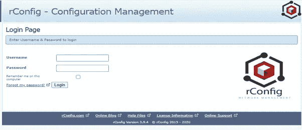
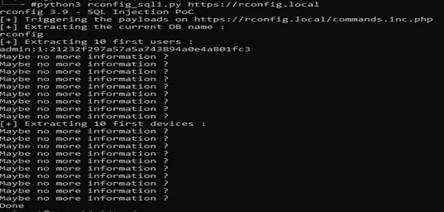
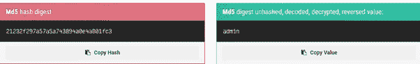
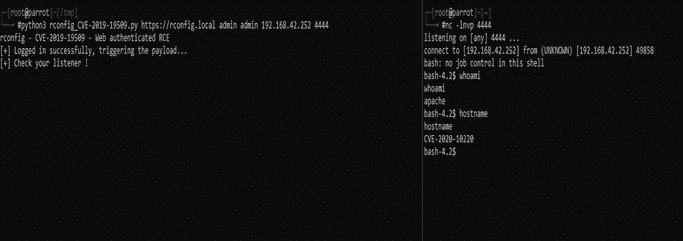
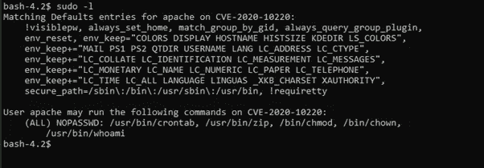
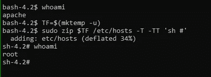

# 如何针对链式漏洞利用 rConfig 网络 DCM

> 原文：<https://infosecwriteups.com/rconfig-3-9-x-exploit-bot2root-c504429d9b0f?source=collection_archive---------2----------------------->

rConfig

rConfig 是一个开源的网络设备配置管理工具，用 PHP 编写。通过向 PHP 添加一些额外的模块，可以根据需要定制特性。这被网络管理员广泛用于频繁地拍摄他们的网络设备的配置快照。也就是说，它有许多独特的功能，如可定制的设备命令、连接模板、计划任务、数据库密码加密、监控设备配置以符合策略等。

在过去的几年中，安全研究人员在 rconfig 中发现了许多严重级别的漏洞。以下是一些简历:CVE-2019-16662，CVE-2019-16663，CVE-2019-19509，CVE-2019-19585，CVE-2020-10220。

在本帖中，我将演示如何将 CVE-2020–10220、CVE-2019–19509、CVE-2019–19585 串联起来，并利用应用程序获得初始访问权限，直到权限提升(root)。所以，事不宜迟，让我们开始吧。

每当我们试图利用任何漏洞时，第一步就是侦察。我们需要确保我们试图利用的应用程序版本是易受攻击的版本。对于 rConfig，该版本在登录页面上很容易看到。

web 界面易于通过 commands.inic.php search column 参数进行 SQL 注入。攻击者可以利用 SQL 注入漏洞从数据库中提取凭据，或者在 web 应用程序中插入假凭据。

密码是 md5 哈希摘要，可以使用在线平台或 hashcat/john 等工具解密。

经过身份验证的远程用户可以通过向 ajaxArchiveFiles.php 发送 GET 请求来直接执行系统命令，因为 path 参数未经过滤即被传递给 exec 函数，从而导致命令执行。检索凭据后，现在攻击者可以登录 web 应用程序以获得初始访问权限。

安装脚本为 rconfig 特定任务更新/etc/sudoers 文件。在“rConfig 特定的 apache 配置”更新之后，Apache 对一些二进制文件具有高特权。攻击者可以使用宽松设置的 sudo 权限来获得 root 权限。

如果一个人可以将多个漏洞串联起来，结果总是具有破坏性。作为一项安全建议，使用应用程序的最新版本并用安全更新修补应用程序始终是一项最佳实践。

 [## 漏洞利用报告

### CTF 玩家、安全专家、Bug 赏金猎人、白帽黑客和渗透测试者的博客你好，我是…

www.youtube.com](https://www.youtube.com/@Exploit-Writeup/) 

> **无聊却重要的东西:-)**

我既没有发现这个漏洞，也没有为 CVE 居功。本文表达的所有观点、信息或内容都是我自己的，不代表我曾经、现在或将来隶属的任何实体。这里描述的方法和列出的工具现在可能被证明是危险的，甚至是非法的。你对这里的信息采取的任何行动或活动都完全是你自己的风险，我不会对任何形式的滥用负责。