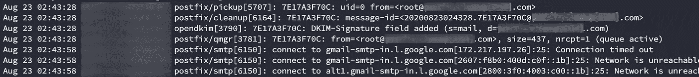
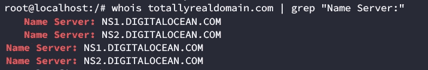
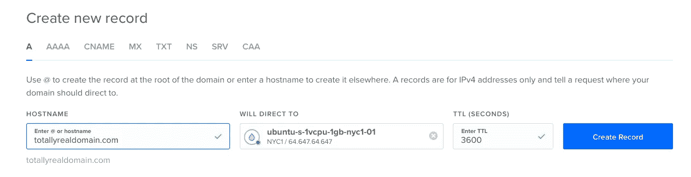
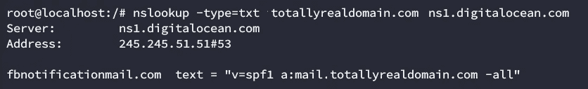
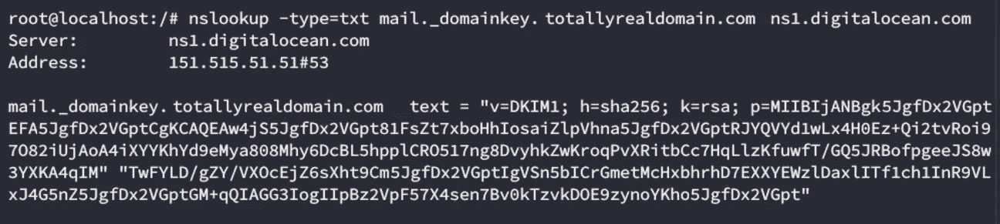
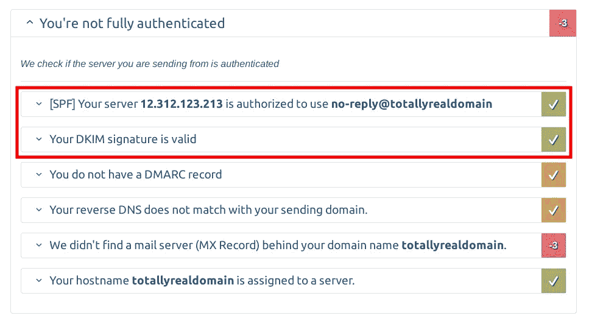
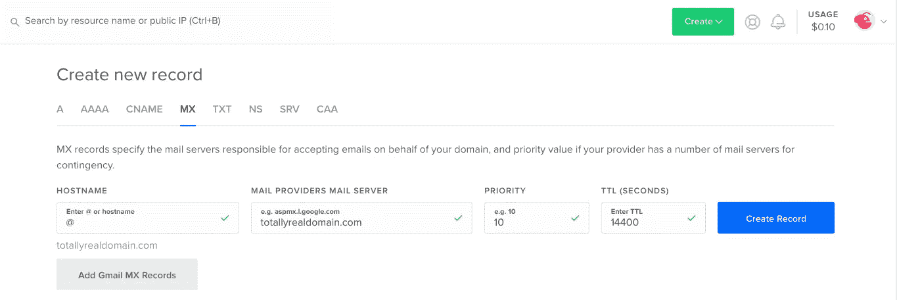
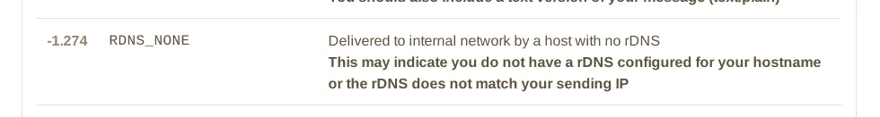
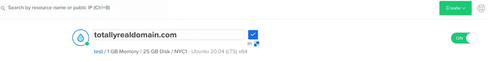
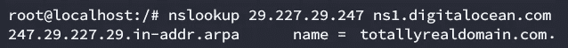

# 成功网络钓鱼活动的秘诀(1/2)

> 原文：<https://infosecwriteups.com/recipe-for-a-successful-phishing-campaign-part-1-2-dc23d927ec55?source=collection_archive---------0----------------------->

链接到第 2 部分:[https://medium . com/bugbountywriteup/recipe-for-a-successful-phishing-campaign-part-2–2–68552806 dcba](https://medium.com/bugbountywriteup/recipe-for-a-successful-phishing-campaign-part-2-2-68552806dcba)

# 介绍

网络钓鱼攻击是最先进入的媒介，其技术细节经常被白人和黑帽黑客忽略。

这些年来，我在进攻和防守团队中都参与了多次网络钓鱼活动，我从反复试验中学到了很多需要注意的事情。本文将尝试对它们进行总结。

# 技术科目

即使网络钓鱼活动通常与社会工程有关，但为了取得成功，您需要了解其中的技术成分。我们将涉及的一些主题(表面上)有:

*   普通网络钓鱼和鱼叉式网络钓鱼的区别
*   SPF、DKIM 和 DMARC
*   OSINT
*   SSL/TLS
*   垃圾邮件过滤器
*   DNS 和 MX/SPF/DKIM (txt)记录
*   同形异义攻击

# 考虑

我知道很大一部分读者只是浏览一篇文章的前几行，所以现在让我给你我能给你的最好的建议。**你需要了解的第一件事是，网络钓鱼攻击不一定要从电子邮件开始**。是的，在这个故事中，我们将主要讨论通过电子邮件进行的网络钓鱼攻击，但是您可以通过多种方式到达网络钓鱼站点。

> 此外，并非每个钓鱼网站都在寻找您的凭据或信用卡，或者让您下载恶意文件。我听到很多人说，只要你不下载任何文件，不在任何地方输入你的凭证/信用卡信息，你就可以到处点击你收到的所有信息。这不是真的。

我参加过多次评估，我们的切入点是有人点击他们不应该有的 URL，并通过 XSS 运行脚本。

或者，他们可能希望您发送请求并代表您执行操作，利用 CSRF 攻击。

又或许他们只是想用 metasploit 的浏览器 autopwn([https://blog . rapid 7 . com/2015/07/15/the-new-metasploit-browser-autopwn-strikes-faster-and-smarter-part-1/)](https://blog.rapid7.com/2015/07/15/the-new-metasploit-browser-autopwn-strikes-faster-and-smarter-part-1/)之类的东西来利用你过时的浏览器。

也许他们想用牛肉勾你([https://beefproject.com/](https://beefproject.com/))。

也许这个链接甚至没有网址，而是一个 UNC，你的网络内部有人试图传递你的凭证([https://github.com/lgandx/Responder-Windows](https://github.com/lgandx/Responder-Windows))。

也许这是最近由于隔离而在远程会议软件上出现的多次中继攻击之一，在 zoom([https://the hacker news . com/2020/04/zoom-windows-password . html](https://thehackernews.com/2020/04/zoom-windows-password.html))和 team viewer([https://the hacker news . com/2020/08/team viewer-password-hacking . html](https://thehackernews.com/2020/08/teamviewer-password-hacking.html))中

我可以继续，但我会停下来，希望我已经给了你足够的例子来证明这一点。

# 定义类型和范围

你需要和你的客户一起定义的第一件事是活动的范围。这是针对公司的所有员工，还是只针对关键的高特权员工？在后一种情况下，你需要为每个用户定制电子邮件，使用有趣的话题，确保吸引他们。**这叫鱼叉式钓鱼**。

此外，您是否希望能够使用从您的活动中收集的凭据来开始一次 pentest？这是一个明智的方法，每个公司都有不同的隐私政策。如果您只想评估您的员工的安全级别，您实际上不需要记录每个凭证。您可以在保存凭证和提取统计信息之前，对一部分凭证进行模糊处理。

您还需要预先定义您的指标。你当然想知道有多少百分比的用户点击了这个链接。但是你也可以记录它点击链接的次数。他们试了多少证件。他们在收到你的邮件后有没有尝试重置密码？收到邮件后多久？这些都是你应该为雇主收集的有趣数据。

# 建立基础设施

为了开始我们的评估，我们需要关于我们目标的信息。我不打算在这里讨论 OSINT 过程，因为这是一个非常广泛的话题，我打算写另一篇关于这个的文章。但是让我们假设您已经收集了以下信息:

1.  你的目标的电子邮件地址
2.  收件人的一般有用信息，如时区和语言(如果你是鱼叉式网络钓鱼，还有具体的兴趣)

现在您已经有了这些信息，您将需要自己的 smtp 服务器来发送电子邮件。

我不在乎雷神看起来有多简单。在建立所需的基础设施时，有实际的时间要求，**你不能只是从任何地方发送电子邮件**。

你需要

1.  可公开访问的服务器。你可以使用任何便宜的提供商，比如 Linode、Digital Ocean、AWS、GCM 等等……(我没有提到 Azure，因为本教程是针对 Linux 用户的)。他们提供低至每月 5 美元的 vps。你不需要很多资源，最便宜的 1gb 内存就足够了。在我们的案例中，我们使用了数字海洋。
2.  您的服务器的域名。
    这里不说[同形异义词攻击](https://en.wikipedia.org/wiki/IDN_homograph_attack)，我就说不透彻了。它们基本上是普通字母的变体，看起来与原始字母相似。想想西里尔字母[ғ](https://en.wikipedia.org/wiki/%D2%92)而不是普通的 f。这允许你保留一个与你想要恶搞的域名相似的域名。实际上，我并不喜欢这种方法。以我的经验来看，用户更信任其他变量，比如 URL 中的绿色挂锁，而不是真实的名称。此外，使用这些类型的字符集实际上可以提醒自动过滤器有关您的恶意活动。你真的认为脸书没有想过让机器人扫描互联网寻找新的 Faceboӧk.com 域名吗？我更想从 notifications@facenotifier.com 寄封邮件。我们将在本教程中使用 godaddy。
3.  一个当用户点击链接时接收用户的网站(我们将在后面详细讨论如何设置)。

您需要考虑的一个问题是，由于频繁的垃圾邮件，大多数云提供商会阻止到端口 25/tcp (smtp)的出站连接。这意味着在发送任何电子邮件之前，您必须联系他们取消此限制(我们必须在数字海洋的支持下创建一个票证)。



系统日志显示无法访问 gmail 的 smtp 服务器

购买域名后，你必须将其域名系统转移到你的云提供商。假设你购买了域名 totallyrealdomain.com。你可以进入 godaddy 的 DNS 设置，将域名解析为数字海洋域名服务器(ns2.digitalocean.com 和 ns2.digitalocean.com)。



之后，你必须配置 digitaloceans DNS 服务器，将你的域名指向新创建的 vps 的 IP。



在 DO 中关联您的域

所以 goddady 会把你的 dns 记录指向 digitalocean 的 dns 记录，那些会指向你的 vps。很简单。

# 防晒系数

简单来说， [SPF](https://en.wikipedia.org/wiki/Sender_Policy_Framework) [或发件人政策框架](https://en.wikipedia.org/wiki/Sender_Policy_Framework)定义了哪些主机被允许为您的域发送电子邮件。请记住，SMTP 是一个非常古老的协议，是在安全性不像今天这样重要的时代开发的。任何人都可以连接到 Gmail 的 SMTP 服务器，发送一封自称是任何人的电子邮件，因此采取了安全措施来防止这种情况。其中一个措施是 SPF，它允许你在域名的 DNS 记录上定义一组被授权发送邮件的 IP 地址。因此，当 Gmail 收到一封声称来自 totallyrealdomain.com 的电子邮件时，它会进入 totallyrealdomain 的 DNS 记录，并查找定义 SPF 策略的 TXT 记录。如果电子邮件来自的 IP 列在那里，则该电子邮件将通过 SPF 策略。

您可以像这样查询特定的 TXT 记录:



我不会深入 SPF 记录的语法，但这个记录基本上意味着只有在定义 mail.totallyrealdomain.com 的 A 记录下列出的域名应该通过 SPF 检查。

# DKIM

[域名密钥识别邮件](https://en.wikipedia.org/wiki/DomainKeys_Identified_Mail)(简称 DKIM)简单来说就是对你的电子邮件进行数字签名。再次，我简化了概念，所以这不会成为一个 5000 字的书面报告，但与 DKIM 你基本上

1.  根据您的电子邮件内容(邮件头和正文)生成哈希
2.  你用私钥签名
3.  您将签名的哈希与电子邮件一起发送

收到电子邮件时，收件人应该

1.  使用您的公钥(列在 DNS TXT 记录下)来验证收到的哈希。
2.  根据收到的电子邮件内容计算自己的哈希。
3.  比较收到的哈希和计算的哈希，以验证电子邮件在传输过程中没有被更改，并且由发件人进行了数字签名。

这可能看起来令人困惑，但这一切都归结为有一个带有你的 DKIM 公钥的 DNS TXT 记录。要查询你的 DKIM 记录，你需要一个选择器。这用于指示公钥在 DNS 中的位置。DNS 条目将位于选择器中。在我们的例子中，我们将使用选择器“mail”，这意味着我们需要查询邮件的 txt 记录。_ domain key . totallyrealdomain . com



查询我们的 DKIM 记录

如果你对记录格式感到好奇，你可以在这里看到解释的语法[，](https://help.returnpath.com/hc/en-us/articles/222481088-DKIM-DNS-record-overview)，但是重要的部分是公钥是 p=参数下的 base64 编码的字符串。在这种情况下，由于超过了 DNS 记录的最大大小限制，它被拆分。

# 试用 SPF 和 DKIM:

让我们实现这两个寄存器，看看我们如何对付 mail-tester.com！我们可以用下面的脚本来配置它们。你只需要用

```
./autoPhisher.sh $hostname
```

它会安装所有的东西并打印你需要添加的 DNS 记录。运行之后，我们可以用下面的命令测试它(确保用你在 mail-tester.com 上得到的邮箱替换目标电子邮件地址)

```
echo "Testing mail" | mail -s "$(echo -e "Test Email\nFrom: John Doe <[no-reply@totallyrealdomain.com](mailto:no-reply1@fbnotificationmail.com)>\nReply-to: [no-reply@](mailto:no-reply2@fbnotificationmail.com)[totallyrealdomain](mailto:no-reply1@fbnotificationmail.com) \nContent-Type:text/html\n")" -r [no-reply@](mailto:no-reply3@fbnotificationmail.com)[totallyrealdomain](mailto:no-reply1@fbnotificationmail.com) [test-s211hrdl7@srv1.mail-tester.com](mailto:test-s821hrdl9@srv1.mail-tester.com)
```


这看起来不像是很好的成绩，不是吗？但是不要担心，我们只是想验证我们在基础设施方面需要的所有措施都正常工作。查看详细信息，我们看到它们是:



我们几乎完成了基础设施方面的工作！我们还需要做两个改变。

# MX 记录

我们得分低的原因之一是我们的 DNS 上缺少 MX 记录。这个记录应该指向您邮件服务器。因为我们在同一个服务器上托管所有东西，所以让我们创建它，指向我们的主域。



当不同邮件服务器之间的流量负载平衡时，使用[优先级](https://en.wikipedia.org/wiki/MX_record#MX_preference,_distance,_and_priority)。我们不需要这个，因为我们只有一个，所以我们就把它留在 10 点。

# 反向 NS 查找(PTR 记录)

我们得到的一个观察结果是，我们的服务器没有有效的 PTR DNS 记录。这也称为反向查找，允许您查询 DNS 服务器上的 IP 并获取相关的主机名。



缺少反向查找

该 PTR 记录允许接收邮件服务器查询发送电子邮件的 IP 地址，并查看它是否具有带有匹配域名的相关记录。

在数字海洋的情况下，只要你用 FQDN 格式改变你的水滴的名字，PTR 记录就会自动生成[。所以我们只需要将我们的 droplet 从 ubuntu-s-1vcpu-1gb-nyc1-01 重命名为 totallyrealdomain.com](https://serverpilot.io/docs/how-to-set-ptr-records-and-reverse-dns/)



根据您配置的 TTL，我们需要等待 DNS 更改传播，但同时您可以使用以下命令查询 digitaloceans 名称服务器上的更改:



等待之后，我们再试一次，发现分数有了很大的变化。


它并不完美，但我们会实现的。至少我们已经在基础设施方面做好了准备。这是我们用一封简单的短信能得到的最高分。

我将在这里结束第一部分。在第二部分，我们将看到如何润色我们的电子邮件，使它们接近完美的 10 分，以及一些小技巧，你可以做些什么来提高你的接收百分比。