# 成功网络钓鱼活动的秘诀(2/2)

> 原文：<https://infosecwriteups.com/recipe-for-a-successful-phishing-campaign-part-2-2-68552806dcba?source=collection_archive---------1----------------------->

[链接到第 1 部分。](https://medium.com/bugbountywriteup/recipe-for-a-successful-phishing-campaign-part-1-2-dc23d927ec55)

回顾:在第 1 部分中，我们看到了在开始设置基础设施时应该记住的一般注意事项，以及使用 SPF 和 DKIM 记录设置域的技术步骤。在这一部分，我们将得到 10/10 的分数，我将向你展示如何管理大型活动，以及最后的 10 个技巧来提高你的接待率。我们还将讨论 SMTP 中继以及何时应该使用它们。

# DNS 记录

当你在 [**第一部分**](https://medium.com/bugbountywriteup/recipe-for-a-successful-phishing-campaign-part-1-2-dc23d927ec55) 完成所有设置后，你应该有 6 到 9 个 DNS 记录。让我们解释一下。

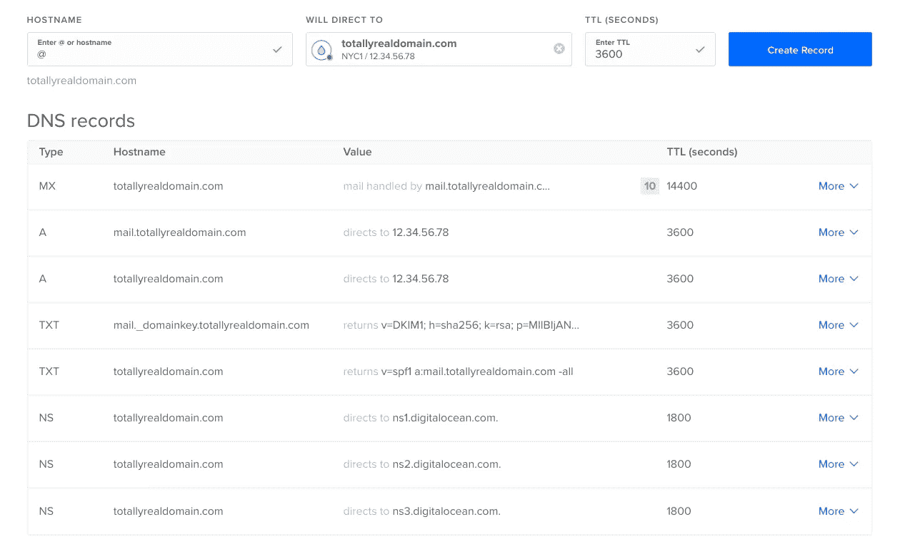

设置好一切后的 DNS 记录

1.  1 到 3 个 NS 记录，将您的域委托给云提供商的名称服务器记录(在我的例子中，最后 3 个记录是数字海洋名称服务器)
2.  A 记录指出你的领域到你的 VPS IP。
3.  一个 A 记录，指向我们将要用来设置 spf(在我的例子中是 mail.totallyrealdomain.com)到你的 VPS IP 的子域。
4.  SPF 的 TXT 记录。
5.  DKIM 的 TXT 记录。
6.  一张指向 mail.yourdomain.com 的 MX 唱片

## 调整我们的内容

在尝试我们的第一封邮件后，我们得到了 6.5/10。让我们试着改进这一点。

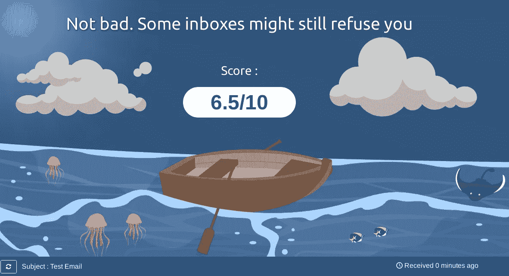

我们最后的得分

我们可能会通过一些垃圾邮件过滤器，但我们可以做得更好。让我们看看是什么降低了我们的分数。

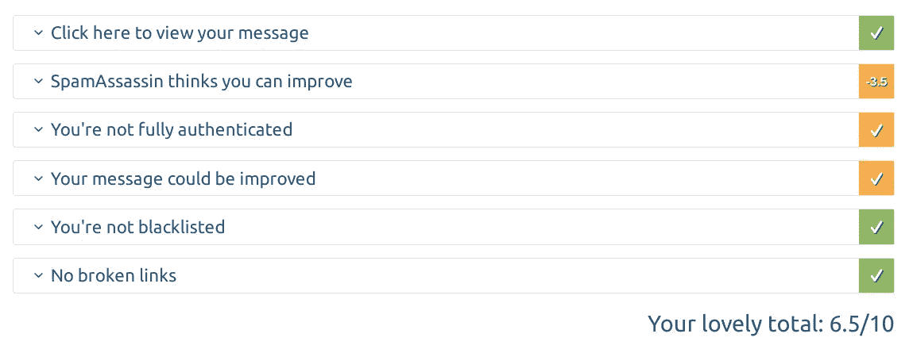

SpamAssassin 似乎在降低我们的分数

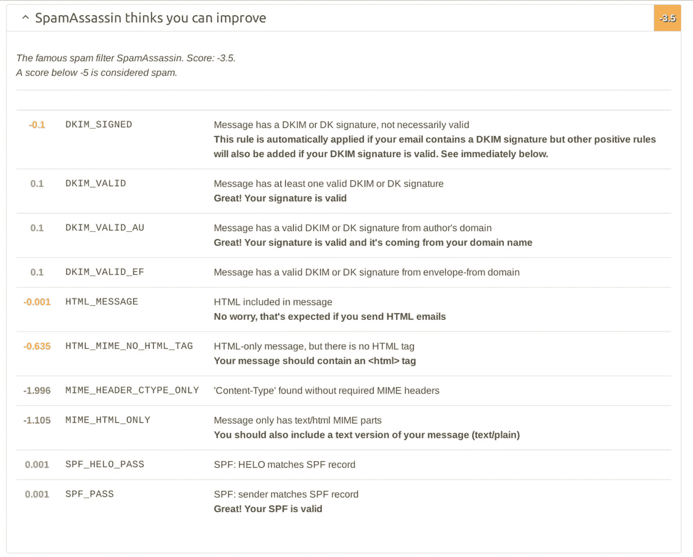

所有这些设置都与电子邮件的内容有关，而与我们的设置无关。所以让我们修改我们的电子邮件。通过理解我们用 mail 命令发送了一封简单的邮件(来自 mailutils 包),我们可以解释我们得到的大多数结果

```
echo "Testing mail" | mail -s "$(echo -e "Test Email\nFrom: John Doe <[no-reply@totallyrealdomain.com](mailto:no-reply1@fbnotificationmail.com)>\nReply-to: [no-reply@](mailto:no-reply2@fbnotificationmail.com)[totallyrealdomain](mailto:no-reply1@fbnotificationmail.com) \nContent-Type:text/html\n")" -r [no-reply@](mailto:no-reply3@fbnotificationmail.com)[totallyrealdomain](mailto:no-reply1@fbnotificationmail.com) [test-s211hrdl7@srv1.mail-tester.com](mailto:test-s821hrdl9@srv1.mail-tester.com)
```

邮件可以有多种格式，如 html、纯文本等..我们没有指定任何标题或格式，mail-tester 似乎默认为 html 电子邮件，所以我们基本上发送了一个隐式的 html 电子邮件，没有任何 html 内容或 mime 类型。让我们单独分析每个警告。

## HTML _ MIME _ NO _ HTML _ 标记

为了类似于任何看起来不太像样的真实邮件，我们需要 html 内容。这意味着 html 标签。但是我们没有发。

## MIME_HEADER_CTYPE_ONLY

这意味着我们应该用有效的 [MIME 值](https://en.wikipedia.org/wiki/MIME)指定一个 Content-Type 头。

## MIME_HTML_ONLY

还记得我们说过默认情况下 mail-tester 将邮件解释为 html 吗？嗯，一封好的邮件应该有相同内容的两个版本。一个 html 版本用于支持它的邮件客户端，一个文本版本用于最简单的邮件客户端。

# 把所有的放在一起

不幸的是，mail-tester.com 只让你测试你的电子邮件 3 次，我们已经在基础设施方面花了 2 次。因此，让我们一次性修复所有内容。我们可以创建一个 html 电子邮件，并使用命令行发送它。尽管我很喜欢 mailutils，但它并不是发送 html 邮件的最佳工具。让我们试试 postfix 自己的 sendmail。

你可以在这里找到我的模板邮件的[代码。](https://raw.githubusercontent.com/securfreakazoid/autoPhisher/master/testMail.html)

让我们修改目的地并使用以下内容发送它:

```
sed -i '[s/destinationEmail/test-zxmlxbuke@srv1.mail-tester.com](mailto:s/destinationEmail/test-zxmlxbuke@srv1.mail-tester.com)/g' template.html
sendmail -i -t <testMail.html
```

您可能想知道，为什么要替换模板中的标题，而不仅仅是:

```
sendmail destination@desmail.com -i <testMail.html
```

嗯，如果你发送的电子邮件没有 To:标题，你会得到一个较低的评级:

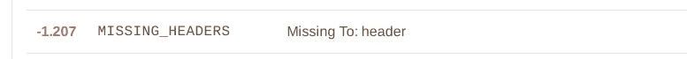

所以一定要插入这个标题。不管怎样，让我们看看我们的分数:

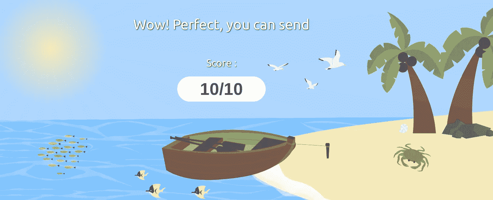

终于！

我们走吧！完美的 10/10。

如果我们想在我们的评估中插入几个目标，可能带有链接或附件，这个设置就足够了。当红队组队时，这是初次接触一家公司的好方法。如果你想生成恶意附件，你应该研究的一个工具是[独角兽](https://github.com/trustedsec/unicorn)。它支持宏攻击，HTA 和 DDE。如果你试图用 2FA 来钓鱼，你可以使用像 [Modlishka](https://blog.duszynski.eu/phishing-ng-bypassing-2fa-with-modlishka/) 这样的代理来完成(还有很多其他很酷的攻击，像 [301 重定向缓存中毒来验证 Tor 用户](https://blog.duszynski.eu/tor-ip-disclosure-through-http-301-cache-poisoning/)，但是不要跑题)。

但是，当您想要评估员工的安全级别时，我们以前的方法并不真正有效。要做到这一点，你需要一种向多个用户发送邮件的方式，并获得关于特定事件的统计数据(你的链接被点击的次数，有多少用户打开了它，等等)..).仅使用 CLI 工具管理 1000 封已发送邮件的统计数据并不容易。

要做到这一点，我们需要一个框架，根据我的经验，最好的工具是 Gophish。它不仅是免费和开源的，而且非常容易使用。

```
mkdir gophish
cd gophish
wget [https://github.com/gophish/gophish/releases/download/v0.10.1/gophish-v0.10.1-linux-64bit.zip](https://github.com/gophish/gophish/releases/download/v0.10.1/gophish-v0.10.1-linux-64bit.zip)
unzip gophish-v0.10.1-linux-64bit.zip
chmod +x gophish
./gophish
```

这将启动两个监听端口 80 和 3333 的服务。

端口 80 将托管您的钓鱼网站，端口 3333 将允许您连接到管理控制台。之后你需要定义

1.  指定目标的[发送组](https://docs.getgophish.com/user-guide/building-your-first-campaign/creating-the-sending-profile)

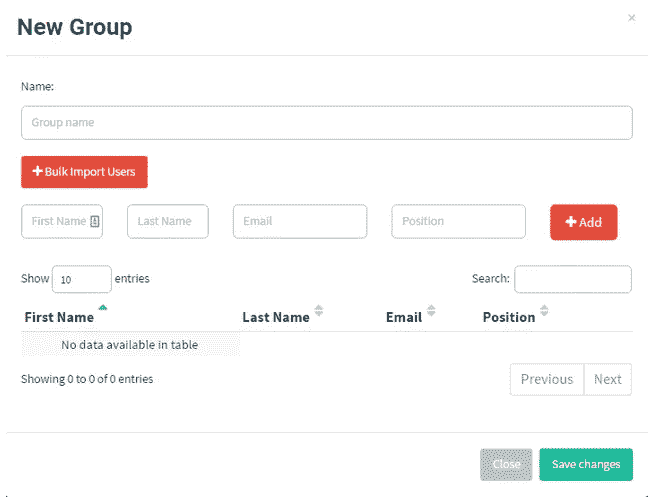

图片取自 [gophish 的文档](https://docs.getgophish.com/user-guide/building-your-first-campaign/importing-groups)

2)一个[发送配置文件](https://docs.getgophish.com/user-guide/building-your-first-campaign/creating-the-sending-profile)，如果你需要使用 SMTP 中继的话(我们将在下一部分详细讨论)。

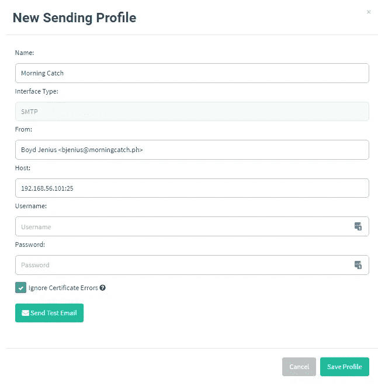

图片取自 [gophish 的文档](https://docs.getgophish.com/user-guide/building-your-first-campaign/creating-the-sending-profile)

3)您要发送的电子邮件的[邮件模板](https://docs.getgophish.com/user-guide/building-your-first-campaign/creating-the-template)。


图片取自 [gophish 的文档](https://docs.getgophish.com/user-guide/building-your-first-campaign/creating-the-template)

4)网络钓鱼的[登陆页面](https://docs.getgophish.com/user-guide/building-your-first-campaign/creating-the-landing-page)。

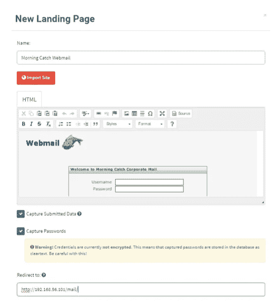

图片取自 [gophish 的文档](https://docs.getgophish.com/user-guide/building-your-first-campaign/creating-the-landing-page)

5)完成上述所有步骤后，您将能够[计划并发起一项活动](https://docs.getgophish.com/user-guide/building-your-first-campaign/launching-the-campaign)。

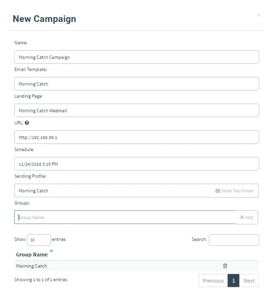

图片取自 [gophish 的文档](https://docs.getgophish.com/user-guide/building-your-first-campaign/launching-the-campaign)

有了 Gophish，你就可以得到一个带有统计数据的仪表盘，比如打开的邮件数量、点击的链接、提交的数据等等

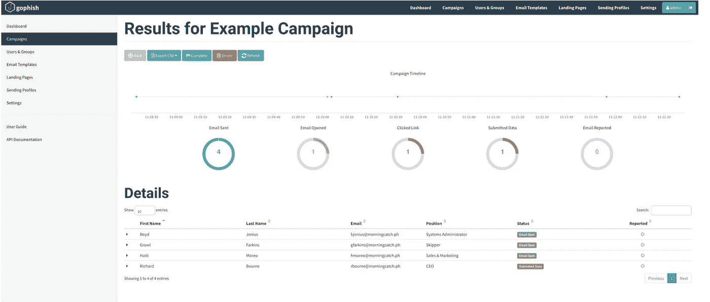

图片取自 [gophish 的文档](https://docs.getgophish.com/user-guide/documentation/generating-reports)

# SMTP 中继

我们在 smtp 中继方面没有取得多大成功。在我们尝试的所有免费软件中，我们最成功的是 [Mailchimp](https://mailchimp.com/) 和 [Sendgrid](https://sendgrid.com/) 。您可以在 Gophish 的发送模板上设置您的登录凭证，或者您可以[在 postfix](https://www.linode.com/docs/email/postfix/postfix-smtp-debian7/) 上手动配置中继。这种方法的最大优点是，您将使用中继提供商的服务器，这些服务器可能在大多数垃圾邮件过滤器上都有良好的声誉。这种方法的另一个优点是，即使出站端口 25 被阻塞，您也可以使用中继的出站端口 587。最大的缺点是，要发送大量的邮件，你需要一个付费账户。他们通常从每月 10 美元开始。

使用免费计划，我们通常可以成功发送大约 200-500 封电子邮件，而不会被标记为过度使用。因此，根据客户的规模，我们只是使用自己的服务器，或者我们将我们的目标分成不同的组，并为每个组使用不同的免费帐户(当然，每个组的电子邮件地址限制在 100 个左右)。您可以在这里看到我们使用这种方法开展的一项活动的结果截图。

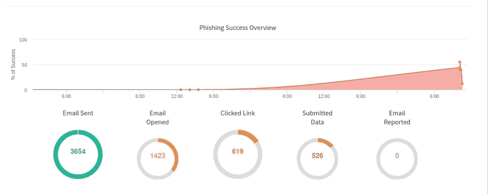

关于 Sendgrid 的免责声明:在过去的几个月里， [Sendgrid 的客户端已经成为发送钓鱼邮件的目标](https://krebsonsecurity.com/2020/08/sendgrid-under-siege-from-hacked-accounts/)。不仅如此，使用这种中继甚至可以允许您欺骗某些域，因为有时系统管理员会向他们的 SPF 记录中添加巨大的中继网络块，这将允许您欺骗来自他们域的电子邮件，只要您使用他们列入白名单的同一中继。自从我们上次尝试使用它以来，Sendgrid 可能已经注意到了这两个事实，他们在让你使用他们的中继之前，已经建立了一个全新的流程来验证你正在为一家公司工作，所以请记住，YMMV。

# 提高效率的 10 个技巧。

作为这篇文章的结尾，我想给出我学到的 10 个技巧(大多数时候是通过犯错)，它们将帮助你提高你的活动效率。我不能深入其中的大部分，因为这样写起来会很乏味，但是我认为一个简短的总结会很有帮助。

1)尽可能避免文本内容。有许多反垃圾邮件和反网络钓鱼检测机器人寻找特定的关键字。但是对图像做同样的事情并不容易。总是试图优先考虑不容易搜索的图形内容。

2)如果您需要使用文本，请研究自动扫描混淆技术。一项最近卷土重来但实际上已经超过 10 年的技术是使用用户隐藏字符如 T2 软连字符来改变自动扫描仪的文本，而不是最终用户的文本。您可以在普通搜索字符串中的随机字母之间插入这样的字符，并且您可能能够绕过一些 regex 之类的过滤器。

3)当矛击时，试着对受害者做适当的研究。当然，了解受害者的兴趣对于精心制作一封具有吸引力内容的定制电子邮件是有用的，但了解受害者的操作系统/电子邮件客户端等技术数据也非常有用。例如，如果你正在使用[跟踪像素](https://www.theverge.com/2019/7/3/20681508/tracking-pixel-email-spying-superhuman-web-beacon-open-tracking-read-receipts-location)(嵌入在 HTML 代码中以注册你的原始 IP 的像素)，你将得到依赖于
a .电子邮件提供商:谷歌自动代理请求，所以你将只获得谷歌的服务器 IP。b .电子邮件客户端和/或平台:例如，Iphone 的苹果邮件与 Unix 的雷鸟邮件并不相同。
c .用户先前设置的偏好。

4)你可以用额外的社会工程攻击来提高你的成功率。在一次评估中，我们发送电子邮件要求重设密码，并通过 OSINT 收集了大多数员工的内部号码，称为最关键的号码。我们说我们是 IT 部门的，我们受到了攻击，所以他们应该尽快按照邮件所说的去做。在这次活动中，我们的成功率约为 50%，几乎是其他类似评估的两倍。

5)邮件的内容很关键。即使你不能通过通常的方法收集有用的信息，仍然有相当有效的通用“钩子”。每个人，不管他们在哪个公司工作，都会被诱惑打开一个附件，里面有诸如薪水之类的信息。或者是即将到来的枪击。或者其他任何可能影响他们的隐私。

6)时间很关键。你应该按照一个时间表发送邮件，让大多数受害者能够立即阅读。你只能发送电子邮件，直到一定数量的人点击“报告危险”，直到你被动态过滤器标记。您还应该考虑到人们会在他们之间交谈，所以过一会儿，关于该公司受到网络钓鱼攻击的消息就会传开。尝试在短时间内发送尽可能多的电子邮件。

7) **始终避免向安全相关人员发送网络钓鱼邮件，他们会及时做出响应**。你所需要的是一个有能力的系统管理员将该邮件归类为恶意邮件，并阻止到你的 C & C / phishing 站点的出站流量。最好坚持与安全无关的目标。

> 故事时间:我工作的一家公司在一个非常相关的阿根廷安全会议( [**Ekoparty**](https://ekoparty.org/en_US/) )当天实际上遭到了攻击。黑客们知道安全团队的大部分人都会参加会议，所以他们聪明地选择了那一天。幸运的是，其中一名安全工程师兼职工作，能够应对午餐时间发生的攻击。

8) **学会处理不确定性**。在处理网络钓鱼活动时，有很多事情可能会出错，这是您无法控制的。您依赖于报告电子邮件的人数、电子邮件过滤器可能实施的自定义指标(例如您的 SMTP 服务器是多久前创建的)、自定义垃圾邮件列表…见鬼，您甚至可能会被阻止，因为您的提供商曾经在其范围内有一个标记的 IP。**这实际上发生在从数字海洋实例向 Hotmail 发送电子邮件时。**

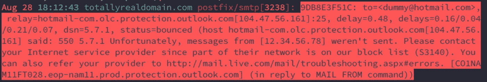

向 hotmail 发送电子邮件时出现实际错误。

9)始终、始终、始终在您的钓鱼网站上使用 TLS。有了像[这样的项目，让我们加密](https://letsencrypt.org/)吧，它会给你免费的 TLS 证书，你没有理由不加密。对于用户来说，相信你在他们的 URL 栏上有一个绿色的锁是多么重要，我怎么强调都不为过。这不仅有助于提高用户的“信任度”，还可以帮助你提高垃圾邮件过滤器的评分。请记住，每当你发送一封带有链接的电子邮件，该链接将被扫描并对照多个黑名单进行检查，拥有一个证书可能会增加你通过的机会。[这个过程非常简单](https://letsencrypt.org/getting-started/)这是将您与许多基本网络钓鱼攻击区分开来的因素之一。

10)尽可能自动化。你的域名/ SMTP 将在一两天内被标记，之后它们将变得一文不值。这就是为什么您应该始终选择云提供商提供的最便宜的实例以及最便宜的域的原因之一。**您的所有设置只适用于一个活动，并且只适用于一个活动**。因此，自动化您的设置，并在完成后销毁一切。

# 结论

有几件事，我打算涵盖，但将在未来的书面记录，以保持这一个简短。首先，你需要进行所有的奥辛特过程来收集关于你的目标的有用信息。其次，建立一个钓鱼网站需要考虑的事情。

不管怎样，我想我已经涵盖了我想传达的大部分内容。如果您认为我遗漏了什么，请告诉我，社会工程攻击(钓鱼攻击是其中的一部分)总是在变化，并且总是有改进的空间。