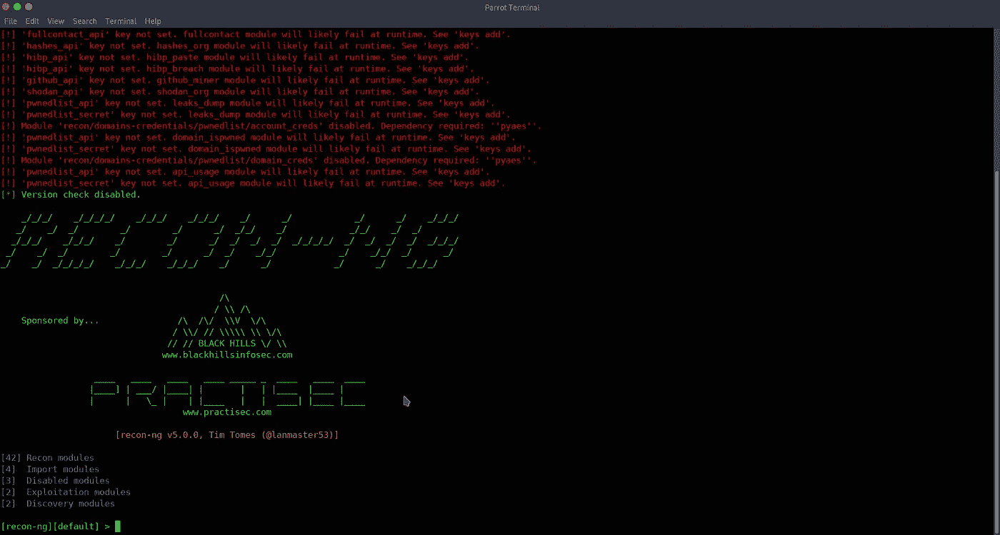
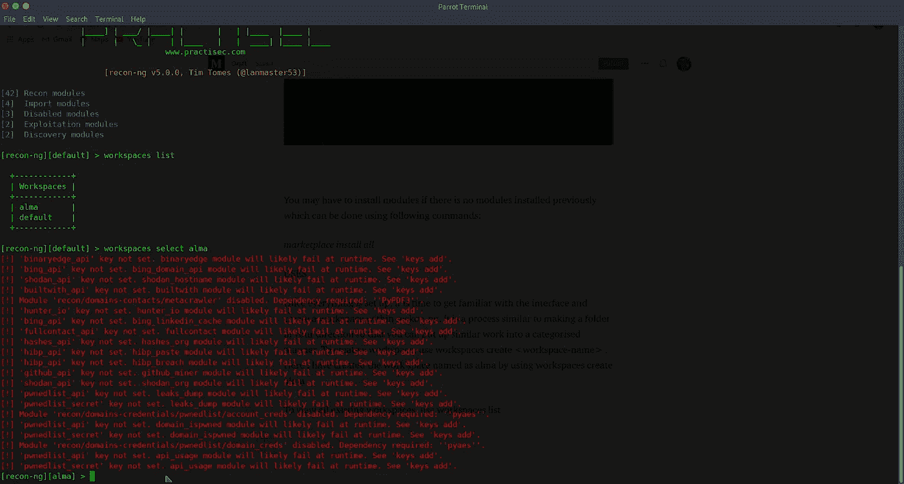
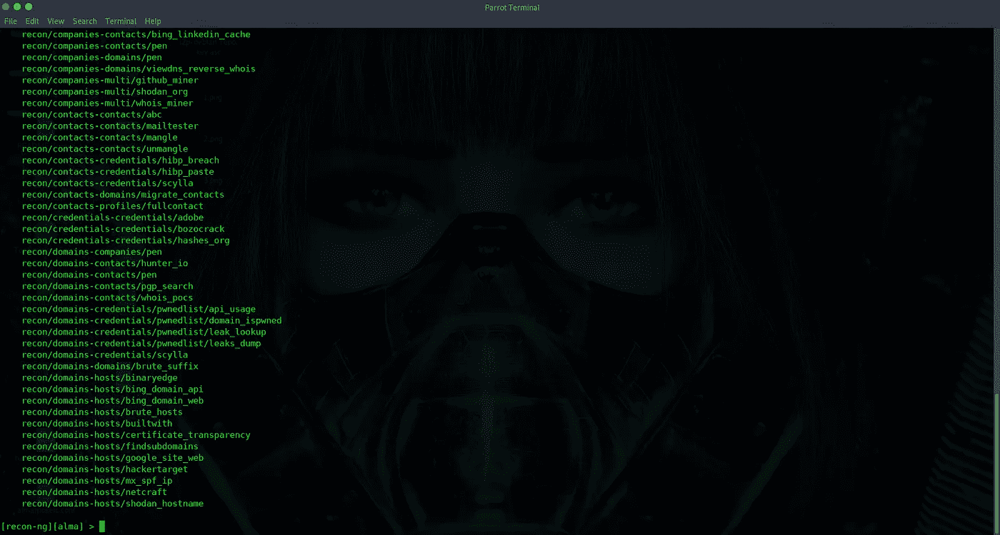
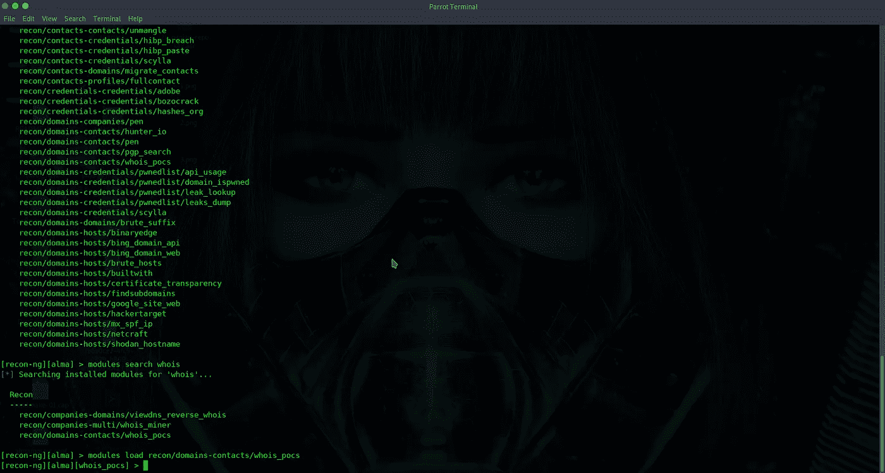
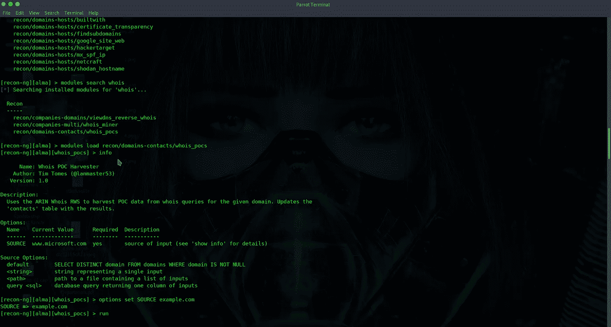
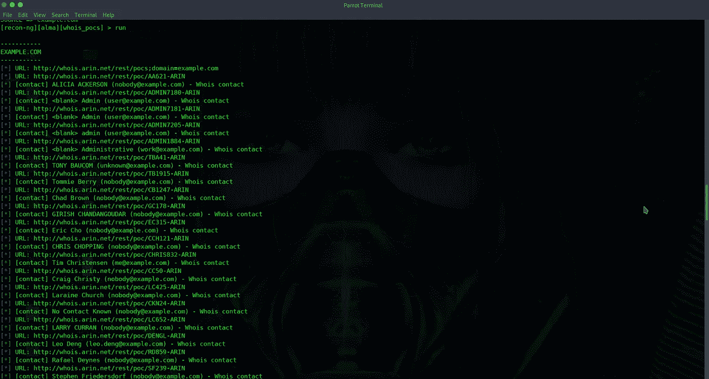
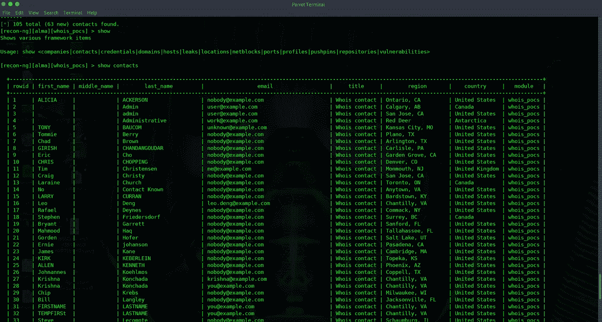

# 计算:信息分析的支柱

> 原文：<https://infosecwriteups.com/reckon-ng-backbone-of-osint-analysis-6cb2a8c06839?source=collection_archive---------1----------------------->

# 什么是 OSINT，为什么它很重要？

每一个 Pentester 都以他要攻击的客户的信息为目标。因此，新的分析开始生效。 **OSINT** 提供了敌人的想法。换句话说，它作为*开源情报*，最终意味着获取免费信息的方法。它可以作为你在互联网上的免费侦探。众所周知，大部分数据都存储在互联网上，与一些云一起或存储在 deep web 上的某个地方，信息收集工具可以在一分钟内获得所有这些信息，而通过某些搜索引擎找到这些信息可能会很费力。

# 为什么认为 NG 提供了更好的选择？

**count-ng**是一个 **OSINT** 工具，可以被认为是一种收集信息的有效方式，是一个用 Python 编写的网络侦察框架。所有熟悉 *Metasploit 框架*的人都能感受到这个工具中使用的环境的相似性。由于 Python 支持，任何新的程序员都可以向环境中添加模块。模块是选择性的分析出口，可以执行各种任务，例如标准化输出、与数据库交互、发出 web 请求和管理 API 键。

# 安装框架

如果您使用的是 Parrot/Kali linux 发行版，可以很容易地从信息收集工具中打开它。如果您的发行版中没有提供或者您正在使用 Termux，您可以使用以下命令下载

***git 克隆***[***https://github.com/lanmaster53/reckon-ng.git***](https://github.com/lanmaster53/reckon-ng.git)

***cd 估-ng***

***pip install -r 要求。/cottle-ng***

完成后，您的屏幕应该是这样的:

# 建立框架

如果之前没有安装模块，您可能需要安装模块，这可以使用以下命令完成:

***商场安装全部***

基本上，counting-ng 有五个不同的模块部分:

1.  发现
2.  剥削
3.  导入
4.  侦察
5.  报告

# 美国就业局(United States Employment Service)

一旦一切都设置好了，就该熟悉界面并在 counting-ng 内创建一个工作区了。这是一个类似于按照你的方向制作一个文件夹的过程，这样你就可以把类似的作品分类放置。要创建工作空间，使用 ***工作空间创建<工作空间-名称>*** 。在这里，我使用 workspaces create alma 创建了名为 alma 的工作空间。

要查看所有现有的工作空间，使用工作空间列表，您可以使用 ***工作空间选择<工作空间-名称>*** 选择您想要工作的工作空间。

现在，由于我们的框架已经正确设置，我们现在可以自由地使用模块来收集相应的信息。因此，我们可以使用 ***模块搜索*** 命令搜索模块:-

为了使用这些模块，我们必须加载这些模块。假设我们想要检查 whois 查找。

***【recon-ng】【alma】>模块搜索 whois*** 。其中 whois 是搜索的关键词。然后使用 ***模块加载 whois_pocs*** 命令选择模块。

现在使用 info 命令，我们可以感知查找的情况。我们可以看到源被设置为默认。我们可以使用命令 ***选项设置源<>***来改变缺省查找；这里我使用的域为 example.com 因而，我将使用 ***选项设置源 example.com***。最后，使用 run 命令。

运行该模块后，框架将开始搜索所有相关内容。

完成该过程后，所有实体将被保存，通过 show 命令，我们可以使用它来 ***显示<公司|联系人|凭据|域|主机|泄漏|位置|网络块|端口|配置文件|图钉|存储库|漏洞>***

# 结论

通过这种方法可以获得这样的结果。以非常相似的方式，可以使用许多其他模块，这些模块对于从客户端检索重要信息非常有用。我们可以看到，不同的功能有不同的模块。其中一个重要的功能是凭证收集。但是有许多研究人员仍在为这个项目做出贡献，许多作者也在根据他们扩展这些特性。该工具的易用性和结构模块使得这个框架成为 OSINT 分析的主干。