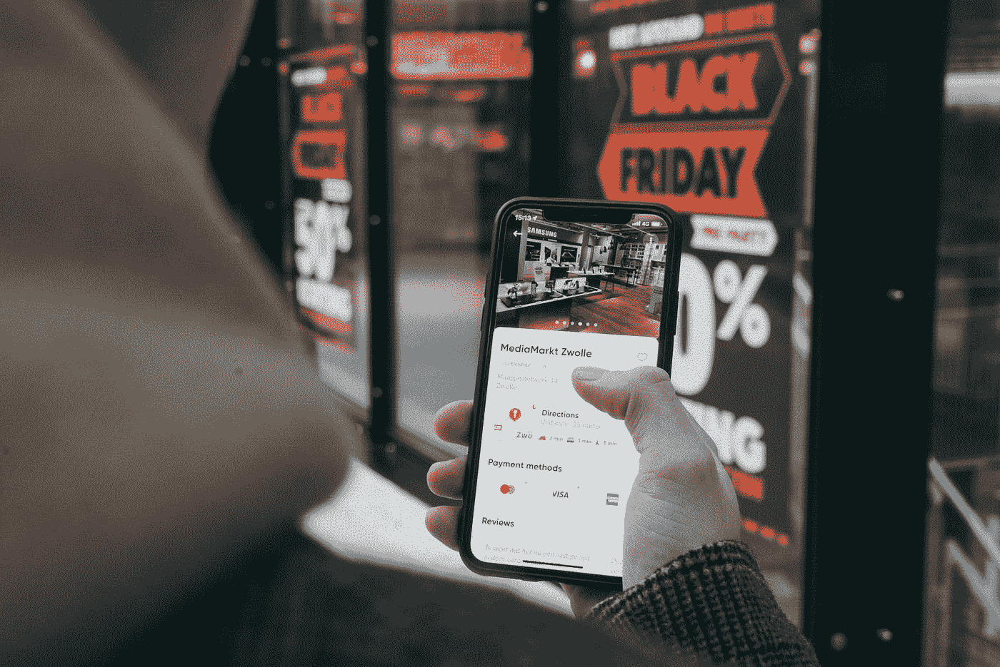
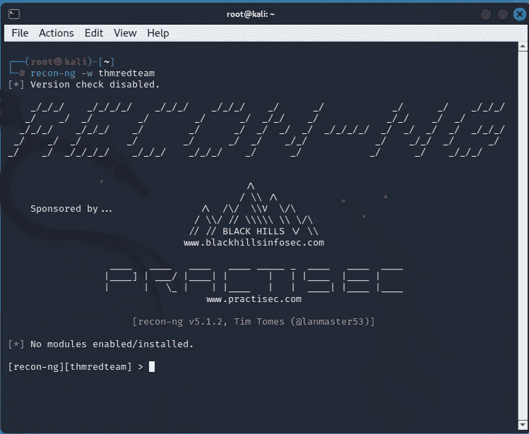
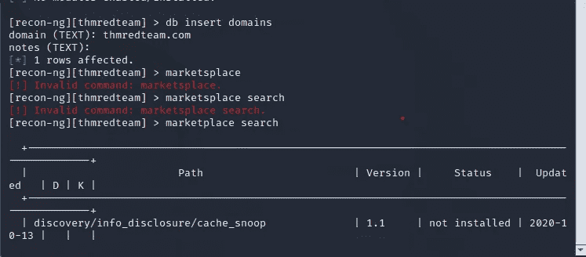
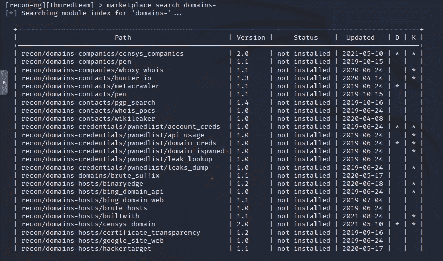
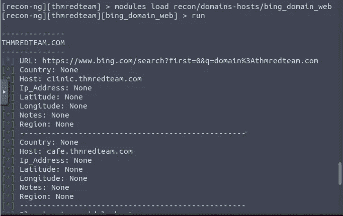

# 侦察

> 原文：<https://infosecwriteups.com/recon-98cf42e60eff?source=collection_archive---------1----------------------->

## 收集信息的艺术

侦察的动机是你越了解你的目标，攻击的可能性就越大。

在红队行动中，你必须知道你要从哪家公司收集信息。收集信息有两种侦察方式，一种是被动侦察，另一种是主动侦察。被动侦察是指在互联网上寻找可用信息。被动侦察的工具有 Google、Shodan 和 Wireshark。主动侦察是通过收集网络信息来发现隐藏的细节。可以通过 Nmap(网络映射器)收集网络信息。主动侦察的一些工具有 Nessus、OpenVas、Nikto 和 Metasploit。

## **侦察目标:**

1.  收集与目标公司相关的子域
2.  收集互联网上的公共信息，如主机名和 IP 地址。
3.  正在查找目标电子邮件地址。
4.  收集密码电子邮件和密码
5.  识别暴露的文档和电子表格。

## **侦查类型:**

我们来详细讨论一下侦察的类型。

侦察可以分为两种类型，一种是被动侦察，另一种是主动侦察。

被动侦察不会直接与目标互动。所以这些不会产生太多噪音。

被动侦察的最佳来源是 google.com 的**。**

谷歌呆子是被动收集信息的最佳来源。

谷歌呆子有可以输入谷歌搜索引擎的查询，以更好地调整搜索结果。

主动侦察需要通过向目标发送数据包并分析数据包及其响应方式来与目标进行交互。

## 主动侦察可以分为两种类型:

> 1.外部侦察-在目标网络之外进行的侦察。
> 
> 2.内部侦察-在目标网络内进行的侦察。

## 内置工具:

内置工具如 **whois、dig、nslookup、host、traceroute/tracert。**

域名注册商负责保存其租赁的域名的 whois 记录。

**Whois 命令**收集信息并显示详细信息，如注册服务商 Whois 服务器、注册服务商 URL、记录创建日期、记录更新日期、注册人联系信息和地址。管理员联系信息和地址。技术联系信息和地址。

**nslookup 命令**收集与域相关的 A 和 AAAA 记录。

**Dig 命令**通过检索 DNS 服务器信息来收集信息。

Recon-ng 是一个有助于在线工作自动化的框架。

所有收集的数据将自动保存在数据库中。

要开始侦察，只需在终端键入侦察。

为了运行扫描，您需要安装模块

安装模块需要工作流。

1.  为您的项目创建一个工作环境。
2.  将起始信息插入数据库。
3.  在市场上搜索一个模块，并在安装之前了解它。
4.  列出已安装的模块并加载一个
5.  运行加载的那个。

**创建工作空间:**

运行**work spaces create WORKSPACE _ NAME(work spaces create threateam)**为您的调查创建一个新的工作空间。举个例子，

> **工作区创建威胁组**

将创建一个名为 **threatteam** 的工作区。

根据工作空间类型执行重新识别

**recon-ng-w threat EAM**开始对指定的工作空间进行重新识别。

**搜索市场:**

对于市场应用，使用了一些有用的命令:

**市场搜索关键词**

**市场信息模块**

**市场安装模块**

**市场移除模块**

你会在 recon 下面看到很多子类，分别是**域名公司、域名联系人和域名证书。**

Domain-host 提供了一个与提供域的主机相关的模块。

**使用已安装的模块:**

> **市场安装模块**

模块安装完成后，我们必须设置模块进行加载。

## 来自 Infosec 的报道:Infosec 每天都有很多内容，很难跟上。[加入我们的每周简讯](https://weekly.infosecwriteups.com/)以 5 篇文章、4 个线程、3 个视频、2 个 GitHub Repos 和工具以及 1 个工作提醒的形式免费获取所有最新的 Infosec 趋势！

这是我的新博客页面，其中包含网络安全的提示

 [## @ ethicalhacktech8 | YoFan

### 学习保护和如何保护免受攻击。

哟.范](https://yo.fan/ethicalhacktech8) 

也通过查看内容来支持我