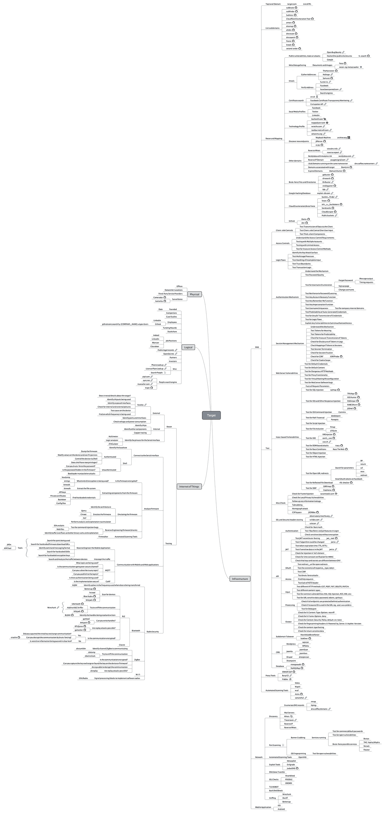
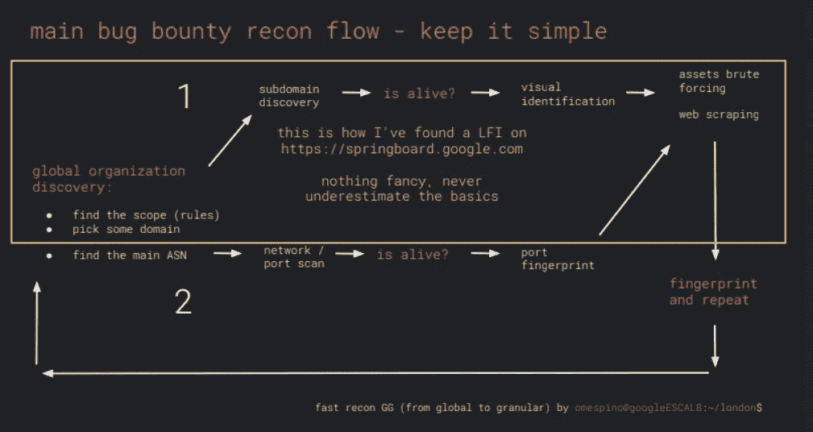

# 侦察一切

> 原文：<https://infosecwriteups.com/recon-everything-48aafbb8987?source=collection_archive---------0----------------------->

臭虫赏金猎人提示# 1——总是阅读源代码

## 接近目标(本部分大部分内容摘自 [Jason Haddix](https://medium.com/u/1dfc5adea2d4?source=post_page-----48aafbb8987--------------------------------) 和 portswigger 博客)

理想情况下，你会希望选择一个范围广泛的项目。你也会想要寻找一个范围内有更多漏洞的赏金程序。

挖掘关于域名、电子邮件服务器和社交网络连接的信息。

深入网站，检查每个请求和响应并进行分析，尝试了解他们的基础架构，例如他们如何处理会话/身份验证，他们有什么类型的 CSRF 保护(如果有)。

使用否定测试来通过错误，这个错误信息对我找到网站的内部路径很有帮助。花点时间了解应用程序的流程，以便更好地了解要寻找的漏洞类型。

开始深入研究使用脚本对端点进行单词列表暴力处理。这可以帮助您找到新的目录或文件夹，而仅仅使用网站可能无法找到这些目录或文件夹。
这往往是私人管理面板，他们忘记删除的源代码库，如/。git/ folders，或者测试/调试脚本。之后，检查网站的每一种形式，然后尝试推动客户端攻击。使用多个有效负载来绕过客户端过滤器。

尽早开始。一旦一个程序启动，如果可以的话，立即开始搜寻。

一旦你开始寻找，在应用程序中选择一个特定的功能/工作流程，并开始深入研究。我已经不再关心低挂的水果或表面的虫子。没有必要把你的努力集中在这些上面。

因此，假设某个应用程序具有允许用户向其他用户发送电子邮件的功能。

通过代理工具(如 Burp)观察此工作流程/请求。Burp 几乎是我用于 web 应用笔测试的唯一工具。

创建多个帐户，因为您想要测试从一个用户发送到另一个用户的电子邮件。如果还没有给你提供多个账户，那就去要。到目前为止，无论我什么时候提出申请，都没有被拒绝过。

现在，如果你稍微有点经验，在对这个工作流程进行几分钟的修补后，你会感觉到它是否会发生一些有趣的事情。这一点很难解释。它会随着练习而来。

如果上述情况属实，则开始模糊化、中断应用程序工作流、插入随机 id、值等。只要有可能。80%的时候，你会注意到奇怪的行为。

奇怪的行为并不一定意味着你发现了一个值得报告的错误。这可能意味着你有一个很好的机会，所以你应该继续挖掘更多。

可能还需要进行一些研究。假设您发现正在使用的电子邮件服务器的特定版本已经过时。在互联网上寻找针对它的已知漏洞。你可能会遇到一个已知的 CVE 与已知的利用。试试这个漏洞，看看会发生什么(假设你是在 bug bounty 的条款和条件下操作的)。

可能需要特殊工具。如果可能的话，探究一下。请记住，打嗝是一把瑞士军刀，但在某些情况下，你可能必须使用某些特定的工具。永远要意识到这一点。

在这上面花了几个小时后，如果你认为你已经用尽了所有的选择，并且没有从中获得任何有意义的东西，停下来，继续前进。被某事困扰是最大的动力杀手，但这并不意味着你放弃了。如果有别的事情发生，以后再来处理。把它记下来。

对我有用的是对参数进行边界检查，选择一个对应用程序流程有明显影响的参数。例如，如果一个字段有一个数字(让我们称它为 lulz 的 ID)。如果:
-你输入一个负数，会发生什么？
-你增加还是减少数字？
-你放了一个很大的数字？
-你输入一个字符串或符号字符？你试着用…/
遍历一个目录。你输入了 XSS 向量？
-你把 SQLI 向量放进去了？你输入了非 ascii 字符？
-你弄乱了变量类型，比如将一个字符串转换成一个数组
-你使用了空字符或者没有值

然后，我会看看我是否能从这些测试的结果中得出任何结论，
-看看我是否能根据错误理解正在发生的事情
-是否有任何东西损坏或暴露
-此操作是否会影响应用程序中的其他东西。

关注自上一版本目标以来重新设计或更改的网站功能。有时，以前看过/用过 bounty 产品，你会马上注意到任何新的
功能。其他时候你会读几遍赏金猎人的简介，然后意识到他们给了你一张地图。开发人员通常会指出他们认为自己薄弱的地方。他们/我们希望你成功。一个直观的例子是新的搜索功能、基于角色的访问等。bounty brief 的一个例子是阅读 brief 并注意到许多指向 API 或站点中特定页面/功能的引用。

如果范围允许(并且你有技能),测试移动应用程序。虽然客户端的错误继续变得不那么严重，但移动应用程序与之对话的 API/web 端点经常会接触到应用程序的某些部分，这在常规工作流中是看不到的。这并不是说客户端的错误是不可报告的，它们只是随着移动操作系统的安全性提高而变得不那么严重。

因此，当你对网站有了彻底的“感觉”后，你需要在心里或身体上记录下应用程序中的工作流程。你需要开始问自己这样的问题:

页面功能是否向用户显示了某些内容？(XSS、内容欺骗等)

页面看起来是否需要调用存储的数据？

(所有类型的注入、间接对象引用、客户端存储)

它是否(或能否)与服务器文件系统交互？(文件上传 vulns，LFI 等)

这是一个值得保护的功能吗？(CSRF，混合模式)

该功能是特权功能吗？(逻辑缺陷、错误、权限升级)++

输入在哪里被接受并可能显示给用户？

哪些端点保存数据？

任何文件上传功能？

使用什么类型的认证？

## 接近目标时要采取的步骤

**浏览应用程序**

识别 web 应用程序漏洞的第一步实际上是使用 web 应用程序。像实际用户一样使用 web 应用程序:

**创建帐户**点击链接，您可以看到该应用程序的功能(并识别攻击面，即该应用程序的哪些部分具有您可以攻击的功能)使用不同的功能(例如进行交易)通过这些功能，识别常见主题非常重要，例如:

开发人员使用什么语言/框架来创建应用程序。在走查过程中，开发人员使用了什么版本的服务器/语言(如果在应用程序中指定的话)，像开发人员一样思考是很重要的。在这个过程中，试着思考一个特定特性的设计/实现，并以一种开发人员不希望的方式使用这些特性。

1.检查/验证目标的范围(*.example.com)

2.查找目标的子域(参考文章中提到的子域工具)

3.运行质量扫描

4.检查哪些域已解析

5.截图

6.进行内容发现(通过强制特定域/子域上的文件和目录)

**Web 工具:**
[https://pentest-tools.com/](https://pentest-tools.com/)
[https://virustotal.com/](https://virustotal.com/)
[https://www.shodan.io/](https://www.shodan.io/)
[https://crt.sh/?q=%25target.com](https://crt.sh/?q=%25target.com)
[https://dnsdumpster.com/](https://dnsdumpster.com/)
[https://censys . io](https://censys.io)
[http://dnsgoodies.com](http://dnsgoodies.com)

# 侦察

侦察不应仅限于寻找资产和过时的东西。它还能理解应用程序，找到不易使用的功能。为了取得成功，需要在应用程序的侦察和良好的老黑客之间取得平衡

**子域枚举工具:**

*   建议通过 github 链接来了解工具的用法。

**枚举域(注意:无论你在什么地方看到下面的大破折号(—)，这些实际上是两个连在一起的破折号(-)，中号 post 用一个大破折号将两个破折号和空格转换在一起)**

a.垂直域关联(一个域的所有子域)(maps.google.cz)→某个特定基域的任何子域
b .水平域关联(像 google.com，google.cz，youtube.com，blogger.com)→任何被 google 作为实体收购的东西。

1.**副列表 3r**——[https://github.com/aboul3la/Sublist3r](https://github.com/aboul3la/Sublist3r)

**设置:**

> git 克隆[https://github.com/aboul3la/Sublist3r.git](https://github.com/aboul3la/Sublist3r.git)
> sudo pip install-r requirements . txt

**用法:**

–枚举特定域的子域:

> python sublist 3r . py-d example.com

**别名:**

> 别名 sublist 3r = ' python/path/to/sublist 3r/sublist 3r . py-d '
> 
> 别名 sublist3r-one= "。

2\. **子 finder【https://github.com/subfinder/subfinder】——**

**设置:**

> 去找 github.com/subfinder/subfinder

**用途:**

> 子 finder-d freelancer.com
> 
> 。/subfinder -dL hosts.txt

递归查找域:

> 子查找器-d<domain>-递归-静音-t 200 -v -o</domain>

要使用强制功能，可以使用-b 标志和-w 选项来指定单词列表。

> 。/sub finder-d freelancer.com-b-w jhad dix _ all . txt-t 100-来源 censys-set-settings censys pages = 2-v

o 命令可用于指定输出文件。

3.**寻找域名**——【https://github.com/Edu4rdSHL/findomain 

您可以监控子域，并提供 webhooks 来获得关于松弛和不一致的通知。

**设置:**

> $ wget[https://github . com/edu 4 rdshl/find domain/releases/latest/download/find domain-Linux](https://github.com/Edu4rdSHL/findomain/releases/latest/download/findomain-linux)
> $ chmod+x find domain-Linux

**用法:**

> 芬多姆-example.com

4.**资产发现者—**[https://github.com/tomnomnom/assetfinder](https://github.com/tomnomnom/assetfinder)

–查找可能与给定域相关的域和子域。

**设置:**

> 去找 github.com/tomnomnom/assetfinder 吧

**用法:**

> 仅资产查找器-subs<domain></domain>
> 
> cat domains | asset finder-subs-only(确保 domains 文件没有 http://或 [https://)](/))

5.**聚敛:**https://github.com/OWASP/Amass

**设置:**

> 去找 github.com/OWASP/Amass/…吧

**用法:**

> amass enum-o sub domains . txt-d output _ file . txt

或者

> amass enum-o out . txt-df domains . txt

所有发现的域名都通过反向 whois(水平子域枚举)运行

> 积累 example.com 的信息

6.**censys-枚举**——[https://github.com/0xbharath/censys-enumeration](https://github.com/0xbharath/censys-enumeration)

–这是最重要的步骤，因为您在这里找到的子域名称，您无法从其他 bruteforce 工具中找到，因为您的单词列表没有在所有子域中都可用的模式，或者没有作为子域一部分的关键字，如 gateway 或 payment。

> 搜索查询—443 . https . TLS . certificate . parsed . extensions . subject _ alt _ name . DNS _ names:snapchat . com

使用 Censys 上的 SSL/TLS 证书数据集提取给定域的子域/电子邮件的脚本

**设置:**

–克隆此回购

> $ git clone git @ github . com:yama Kira/censys-enumeration . git

–安装依赖项

> $ pip 安装-r 要求. txt

–通过在 [https://censys.io](https://censys.io) 上创建一个帐户来获取 Censys API ID 和 Censys API secret

–将 Censys API ID 和 Censys API secret 分别作为 Censys _ API _ ID & Censys _ API _ SECRET 添加到操作系统环境变量中。在 Linux 上，您可以使用类似下面的命令来实现这一点

> $ export CENSYS _ API _ SECRET = " iys d1n 0 L2 jlnhtmissbfhzxclfue 0 "

**用法:**

> $ python censys _ enumeration.py 无电子邮件-详细-outfile results . JSON domains . txt

7.https://github.com/infosec-au/altdns**alt DNS**—[](https://github.com/infosec-au/altdns)

–它从单词列表中生成原始域与*单词*的可能组合( [*示例*](https://github.com/infosec-au/altdns/blob/master/words.txt) )。

**设置:**

> pip 安装 py-altdns

**用法:**

> # python alt DNS . py-I input _ domains . txt-o ./output/path-w alt DNS/words . txt-I sub domains . txt-o data _ output-w words . txt-s results _ output . txt

8.**群发域名:**[https://github.com/blechschmidt/massdns](https://github.com/blechschmidt/massdns)

**设置:**

> git 克隆[https://github.com/blechschmidt/massdns.git](https://github.com/blechschmidt/massdns.git)CD mass DNS
> make

**用法:**

> 。/bin/mass DNS[选项][域列表]

使用列表中 resolvers.txt 内的解析器解析 domains.txt 内的所有 A 记录，并将结果存储在 results.txt 内:

> $ ./bin/mass DNS-r lists/resolvers . txt-t A domains . txt > results . txt

9.**来自 csp 的域名**—[https://github.com/0xbharath/domains-from-csp](https://github.com/0xbharath/domains-from-csp)

–Content-Security-Policy header 允许我们创建可信内容源的白名单，并指示浏览器仅执行或呈现来自这些域(源)的资源。

**设置:**

> $ git clone git @ github . com:yamakira/censys-enumeration . git
> $ pipenv install

**用法:**

> # python CSP _ parser . py target _ URL
> # python CSP _ parser . py target _ URL—解析

10.**使用 DNS 的 SPF 记录**——【https://github.com/0xbharath/assets-from-spf/ 

–一个 Python 脚本，用于从 SPF(发件人策略框架)DNS 记录中解析网络块和域名

–对于每个已解析的资产，该脚本还将查找并打印自治系统号(ASN)详细信息

**设置:**

> $ git clone git @ github . com:yamakira/assets-from-SPF . git
> $ pipenv install

**用法:**

–解析资产的 SPF 记录，但不进行 ASN 枚举

> $ python assets _ from _ SPF . py target _ URL

–解析资产的 SPF 记录并进行 ASN 枚举

> $ python assets _ from _ SPF . py target _ URL-ASN

**获取提前装运通知编号:**

–自治系统号(ASN)->[http://bgp.he.net](http://bgp.he.net)->例如，检查 tesla.com 并签入前缀 V4 以获取 IP 范围

或者

> $ curl-s[http://ip-api.com/json/192.30.253.113](http://ip-api.com/json/192.30.253.113)| jq-r . as

AS36459 GitHub 公司

–找到的 ASN 号可用于查找域的网块。

–我们可以使用高级 WHOIS 查询来查找属于 ASN 的所有 IP 范围

> $ whois-h whois.radb.net—'-I origin as 36459“| grep-Eo”([0–9。]+){ 4 }/[0–9]+" | uniq

有一个 Nmap 脚本来查找属于某个 ASN 的 IP 范围，该 ASN 是
[https://nmap.org/nsedoc/scripts/targets-asn.html](https://nmap.org/nsedoc/scripts/targets-asn.html)

> $ nmap —脚本目标-asn —脚本-参数目标-asn.asn=17012 > paypal.txt

清理上述 nmap 结果的输出，将所有 IP 放在一个文件中，然后对它们运行版本扫描或 masscan。

> nmap-p--sV-iL paypal . txt-oX paypal . XML

–您可以使用 dig

> $挖 AXFR @<nameserver></nameserver>

11.https://certspotter.com/api/v0/certs?domain=hackerone.com

–适合纵向和横向关联

–您可以获得域名、子域名

–证书中的电子邮件地址

```
find-cert() {

  curl -s https://certspotter.com/api/v0/certs?domain=$1 | jq -c '.[].dns_names' | grep -o '"[^"\+"';
}
```

12.**CRT . sh【https://crt.sh/?q=%25domain.com】—**

13.**烦躁**——[https://github.com/guelfoweb/knock.git](https://github.com/guelfoweb/knock.git)

**设置:**

> $ sudo apt-get install python-dnspython
> $ git clone[https://github.com/guelfoweb/knock.git](https://github.com/guelfoweb/knock.git)
> 设置您的 virus total API _ KEY:
> $ nano knockpy/config . JSON
> $ sudo python setup . py install

**用法:**

> $ knockpy domain.com-w 单词表. txt

14.**庄丹**—

端口:8443，8080
标题:“Dashboard[Jenkins]”
产品:Tomcat
主机名:example.com
组织:google
ssl:Google

要在目标中查找 jenkins 实例:

组织:{组织名称；x-詹金斯:200}

15.**查看 dns.info(横向域名枚举)反向 whois 查找** —如果您知道某个域名注册机构的“电子邮件 id ”,并且您想查看其他哪些域名注册了相同的电子邮件 id，您可以使用该网站。**大部分工具没有发现水平域枚举。**

使用— $ whois <domain.com>获取电子邮件地址</domain.com>

或者在本网站获取电子邮件并输入:[https://tools.whoisxmlapi.com/reverse-whois-search](https://tools.whoisxmlapi.com/reverse-whois-search)

我发现这个网站提供的域名比 viewdns.info 多

它也可以选择导出 CSV 格式的结果。

16.**子租赁—**[https://github.com/yassineaboukir/sublert](https://github.com/yassineaboukir/sublert)

Sublert 是一种安全和侦察工具，它利用证书透明性来自动监控由特定组织部署的新子域名和已颁发的 TLS/SSL 证书。

**设置:**[https://medium . com/@ yassineaboukir/automated-monitoring-of-subdomain-for-fun-and-profit-release-of-sub-colt-634 CFC 5d 7708](https://medium.com/@yassineaboukir/automated-monitoring-of-subdomains-for-fun-and-profit-release-of-sublert-634cfc5d7708)

> $ git 克隆[https://github.com/yassineaboukir/sublert.git](https://github.com/yassineaboukir/sublert.git)&&CD 子许可
> $ sudo pip3 安装-r 要求. txt

**用法:**

让我们以 PayPal 为例:

> $ python sub lert . py-u paypal.com

让我们使 Sublert.py 可执行:

> $ chmod u+x sublert.py

现在，我们需要添加一个新的 Cron 作业，以便在给定的时间调度 Sublert 的执行。为此，请键入:

> $ Crontab -e

在 Cron 文件的末尾添加以下行:

> 0 */12 * * * CD/root/sub lert/& &/usr/bin/python 3 sub lert . py-r-l > >/root/sub lert/sub lert . log 2 > & 1

杰森·哈德克斯(https://twitter.com/jhaddix/status/972926512595746816？lang=en)
带打嗝套件的链接目标发现的失落艺术:
1)关闭被动扫描
2)将表单设置为自动提交
3)将范围设置为高级控制并使用目标名称字符串(不是普通的 FQDN)
4) Walk+browse，然后递归搜索所有主机！
5)利润(更多目标)！

# **内容发现工具**(目录暴力)

使用 robots.txt 来确定目录。

还为 API 端点搜索主机。

您在 8443 上看到一个开放的端口

目录暴力

/admin/ return 403

您在/admin/上强行获取更多文件/目录

假设/admin/users.php 返回 200

在其他域、端口、文件夹等上重复

1.**ffuf**——【https://github.com/ffuf/ffuf 

–用 Go 编写的快速 web fuzzer。

**设置:**

> 去找 github.com/ffuf/ffuf

**用法:**

*   **典型目录发现:**

> ffuf-w/path/to/word list-u[https://target/FUZZ](https://target/FUZZ)

**通过几台主机测试单词表:**

> ffuf-u[https://HFUZZ/WFUZZ](https://HFUZZ/WFUZZ)-w hosts . txt:HFUZZ-w word list . txt:WFUZZ-mode cluster bomb

*   让你的主机列表在一个单独的单词列表中，因为 ffuf 现在支持多个单词列表(和关键字)

> ffuf-w HOSTS . txt:HOSTS-w content . txt:FUZZ-u[https://HOSTS/FUZZ](https://HOSTS/FUZZ)
> 
> ffuf-u URL/FUZZ/FUZZ/FUZZ-w word list 1 . txt-w word list 2 . txt-w word list 3 . txt-mode cluster bomb

然后它将执行单词列表 1 单词列表 2 单词列表 3 请求。

**虚拟主机发现(无 DNS 记录)**

- **先搞清楚假阳性的响应长度。**

> curl-s-H " Host:existing . example . com "[http://example.com](http://example.com)| WC-c
> 
> ffuf-c-w/path/to/word list-u[http://example.com](http://example.com)-H " Host:fuzz . example . com "-fs<length _ of _ flase _ positive>

**获取参数 fuzzing**
获取参数名称 fuzzing 与目录发现非常相似，其工作原理是将 FUZZ 关键字定义为 URL 的一部分。这还假设无效 GET 参数名称的响应大小为 4242 字节。

> ffuf-w/path/to/param names . txt-u[https://target/script . PHP？模糊=测试值](https://target/script.php?FUZZ=test_value) -fs 4242

如果参数名是已知的，可以用同样的方法对值进行模糊处理。此示例假设一个错误的参数值返回 HTTP 响应代码 401。

> ffuf-w/path/to/values . txt-u[https://target/script . PHP？valid_name=FUZZ](https://target/script.php?valid_name=FUZZ) -fc 401

例:
ffuf-w params . txt:hfu ZZ-H " Cookie:_ cfduid = d 12 ff 6 C4 c 7-s 915d 707 EC 42577 f 244631577769628；1337 session = 643037306562363433331343933 "-u[http://bugbountylab.art/target/web/recon/paramining-1/?hfu ZZ = vfu ZZ](http://bugbountylab.art/target/web/recon/paramining-1/?HFUZZ=VFUZZ)-w value . txt:vfu ZZ-fs 31-t 150

*   **POST 数据模糊化**
    这是一个非常简单的操作，再次通过使用 FUZZ 关键字。这个例子只是模糊了 POST 请求的一部分。我们再次过滤掉了 401 条回复。

> ffuf-w/path/to/POST data . txt-X POST-d " username = admin \ & password = FUZZ "-u[https://target/log in . PHP](https://target/login.php)-fc 401

2.**迪搜**——[https://github.com/maurosoria/dirsearch.git](https://github.com/maurosoria/dirsearch.git)或[https://github.com/Damian89/dirsearch](https://github.com/Damian89/dirsearch)

**设置:**

> git 克隆[https://github.com/Damian89/dirsearch.git](https://github.com/Damian89/dirsearch.git)
> CD dirsearch
> python 3 dirsearch . py-u<URL>-e<扩展>
> python 3 dirsearch . py-e PHP、txt、zip-u[https://target](https://target)-w db/dicc . txt—recursive-R 2

**单词表:**

> $ wget[https://gist . githubusercontent . com/EdOverflow/C4 d6d 8 c 43 b 315546892 aa 5 dab 67 FDD 6 c/raw/7 DC 210 b 17d 7742 b 46 de 340 b 824 a 0 ca A0 f 25 cf 3c c/open \ _ redirect \ _ wordlist . txt](https://gist.githubusercontent.com/EdOverflow/c4d6d8c43b315546892aa5dab67fdd6c/raw/7dc210b17d7742b46de340b824a0caa0f25cf3cc/open\_redirect\_wordlist.txt)

**别名:**

> 别名 dirsearch = ' python 3/path/to/dirsearch/dirsearch . py-u '
> 别名 dirsearch-one= "。<(猫域| awk ' { print " dirsearch " $ 1 "-e * " } ')"
> 别名 openredirect= "。<(cat domains | awk ' { print " dirsearch " $ 1 "-w/path/to/dirsearch/db/open*redirect*word list . txt-e * " } ')"

3.**捉鬼敢死队**——[https://github.com/OJ/gobuster](https://github.com/OJ/gobuster)

**设置:**

> 去找 github.com/OJ/gobuster

**用法:**

> gobuster dir-u[https://mysite.com/path/to/folder](https://mysite.com/path/to/folder)-c ' session = 123456 '-t 50-w common-files . txt-x . PHP，。超文本标记语言

4.**wfuzz**——【https://github.com/xmendez/wfuzz/】T42

**设置:**

> pip 安装 wfuzz

**用法(:**

> $ wfuzz-w raft-large-directory . txt-sc 200，403，302 http://testphp.vulnweb.com/FUZZ

5.**打嗝闯入者**

**截图工具:**

查看标题，了解有哪些安全选项，例如，查找是否存在 X-XSS-保护:或 X-帧-选项:拒绝。

了解现有的安全措施意味着您知道自己的局限性。

1.**Aquatone**——【https://github.com/michenriksen/aquatone 

**设置:**

> 去找 github.com/michenriksen/aquatone 吧

**用法:**

> cat hosts . txt | aqua tone-out ~/aqua tone/example . com

2.**目击者:**[https://github.com/FortyNorthSecurity/EyeWitness](https://github.com/FortyNorthSecurity/EyeWitness)

**设置:**

> $ git 克隆[https://github.com/FortyNorthSecurity/EyeWitness.git](https://github.com/FortyNorthSecurity/EyeWitness.git)

导航到安装目录
运行 setup.sh 脚本

**用法:**

> 。/witness-f URLs . txt—web
> 
> 。/witness-x URLs . XML—超时 8 —无头

3.**网页截图:**[https://github.com/maaaaz/webscreenshot](https://github.com/maaaaz/webscreenshot)

**设置:**

> $ apt-get update & & apt-get install phantomjs
> $ pip install 网页截图

**用法:**

> $ python web snapshot . py-I list . txt-v

完成后，我们使用名为 EPG-prep(https://www.npmjs.com/package/epg-prep)的工具来创建缩略图，只需运行:EPG-prep uber.com
这将允许我们使用 express-photo-gallery 查看创建的图片。

最后一步，使用这篇博文底部的 express-gallery-script，并将其保存为 yourname.js。你需要做的只是更改脚本中的文件夹名称:app.use('/photos '，Gallery('uber.com '，options))；在这种情况下，文件夹名称设置为 uber.com，但根据您查看的目标，它可能会有所不同。完成后，您可以使用 node yourname.js 简单地运行脚本，这将创建一个监听端口 3000 的 web 服务器，端点名为/photos。因此，要访问它，您只需输入:[http://yourserverip:3000/photos](http://yourserverip:3000/photos)就可以很好地了解您列举的子域

> **系统工具**
> apt 更新& & apt 升级
> curl-sL[https://deb.nodesource.com/setup_6.x](https://deb.nodesource.com/setup_6.x)| sudo-E bash-
> apt install-y git wget python python-pip phantomjs xvfb 屏幕 slurm gem phantomjs imagemagick graphicsmagick nodejs

**网页截图要求**

> pip 安装网页截图
> pip 安装 selenium

**快速图片库需求**

> sudo NPM install-g NPM
> NPM install express-photo-gallery
> NPM install express
> NPM install-g EPG-prep

**快速图片库脚本**

> JavaScript
> var express = require(' express ')；
> var app = express()；
> 
> var Gallery = require(' express-photo-Gallery ')；
> 
> var options = {
> title:'我的牛逼图片库'
> }；
> 
> app . use('/照片'，图库(' uber.com '，选项))；
> 
> app . listen(3000)；

**检查 CMS**

1.Wappalyzer 浏览器扩展

2.https://builtwith.com/

3.旧 js 库的 Retire.js

**晶圆**

当心 WAFs，你可以用 WafW00f 来换那个
【https://github.com/sandrogauci/wafw00f】T21

流行的谷歌呆子使用(寻找 Bug 赏金网站)

> 网站:。欧盟责任披露
> inurl:index.php？id=
> 站点:。nl bug bounty
> " inurl:WP-content/(识别 Wordpress 网站)
> inurl:" q =用户/密码"(用于查找 drupal cms)的索引

以下全部摘自 Prateek Tiwari 的文章:

> 站点:codepad.co "company"
> 站点:scribd.com "keyword"
> 站点:npmjs.com "keyword"
> 站点:npm.runkit.com "keyword"
> 站点:libraries.io "keyword"
> 站点:ycombinator.com "keyword"
> 站点:coggle.it "keyword"
> 站点:papaly.com "keyword"
> 站点:google.com "keyword"
> 站点:tre..google.com“关键词”
> 站点:gitter.im“关键词”
> 站点:bitbucket.org“关键词”
> 站点:*.atlassian.net“关键词”
> 站点:gitlab“关键词”

**单词表/有效载荷**

[*raft-large-words . txt*](https://github.com/danielmiessler/SecLists/blob/master/Discovery/Web-Content/raft-large-words.txt)，[https://github.com/danielmiessler/SecLists](https://github.com/danielmiessler/SecLists)

内容 *discovery* all.txt 来自 jhaddix:[https://gist . github . com/jhaddix/b 80 ea 67d 85 c 13206125806 f 0828 F4 d 10](https://gist.github.com/jhaddix/b80ea67d85c13206125806f0828f4d10)

all . txt from jhaddix—[https://gist . github . com/jhaddix/f64c 97d 0863 a 78454 e 44c 2 f 7119 C2 a6a](https://gist.github.com/jhaddix/f64c97d0863a78454e44c2f7119c2a6a)

PayloadAllTheThings—【https://github.com/swisskyrepo/PayloadsAllTheThings 

XSS 有效载荷-[http://www.xss-payloads.com/](http://www.xss-payloads.com/)
XSS 有效载荷-[https://github . com/pgaijin 66/XSS-Payloads/blob/master/payload . txt](https://github.com/Pgaijin66/XSS-Payloads/blob/master/payload.txt)/SQL 注入有效载荷-[https://github.com/trietptm/SQL-Injection-Payloads](https://github.com/trietptm/SQL-Injection-Payloads)
Google-Dorks 有效载荷-[https://gist . github . com/clarketm/919457847 cece 7 ce 40323 DC 217623054](https://gist.github.com/clarketm/919457847cece7ce40323dc217623054)

**提取虚拟主机**

Web 工具—[https://pentest-tools . com/information-gathering/find-Virtual-hosts](https://pentest-tools.com/information-gathering/find-virtual-hosts)
虚拟主机扫描器—[https://github.com/jobertabma/virtual-host-discovery](https://github.com/jobertabma/virtual-host-discovery)

git 克隆[https://github.com/jobertabma/virtual-host-discovery.git](https://github.com/jobertabma/virtual-host-discovery.git)
ruby scan . Rb—IP = 192 . 168 . 1 . 101—host = domain . TLD

**端口扫描**

扫描与其子域相关的每个 IP 地址，并将输出保存到文件中

查找在异常端口上运行的任何服务或在默认端口上运行的任何易受攻击的服务(FTP、SSH 等)。查找正在运行的服务的版本信息，以确定是否有任何内容过时或存在潜在漏洞

1.**质量扫描**:[https://github.com/robertdavidgraham/masscan](https://github.com/robertdavidgraham/masscan)

这是一个互联网规模的端口扫描器。它可以在 6 分钟内扫描整个互联网，每秒钟从一台机器传输 1000 万个包。

**设置:**

> $ sudo apt-get install git gcc make libpcap-dev
> $ git clone[https://github.com/robertdavidgraham/masscan](https://github.com/robertdavidgraham/masscan)$ CD mass can
> $ make-j8

这将把程序放在 masscan/bin 子目录中。如果您想将它安装在系统的其他地方，您必须手动将其复制到/usr/local/bin 这样的地方。

**用途:**

运行*摘要*的 Shell 脚本

因为 Masscan 只接受 IP 作为输入，而不接受 DNS 名称

使用它对域名或 IP 范围运行 Masscan

> #!/bin/bash
> strip = $(echo $ 1 | sed 的/https\？:\/\///')
> echo " "
> echo“# # # # # # # # # # # # # # # # # # # # # # # # # # # # # # # # #”
> 主机$ strip
> echo“# # # # # # # # # # # # # # # # # # # # # # # # # # # # # # # # # # # #”
> echo " "
> mass can-P1–65535 $(dig+short $ strip | grep-oE " \ b([0–1){ 3 }[0–9]{ 1，3 } \ b“| head-1)—最大速率 1000 |&tee＄strip _ scan
> 
> 用法:mass can-P1–65535-iL＄TARGET _ LIST-max-rate 10000-oG＄TARGET _ OUTPUT
> # mass can-p80，8000–8100 10 . 0 . 0 . 0/8
> # mass can 10 . 0 . 0 . 0/8-p80-banners-source-IP 192 . 168 . 1 . 200

1.**Nmap**:[https://nmap.org/book/man.html](https://nmap.org/book/man.html)

**侦察用 Github**

Github 非常有助于找到有关目标的敏感信息。访问密钥、密码、开放式结尾、s3 存储桶、备份文件等。可以在公共的 GitHub 库上找到。

在第一次总体评估中寻找以下内容(摘自 edoverflow):

–API 和密钥。(再弄点端点，找 API 键。)

–令牌

秘密

–待办事项

–密码

–易受攻击😜

–http://& https://

然后，我将关注那些当开发人员把事情搞砸时让我会心一笑的术语:

CSRF

–随机

–哈希

–MD5、SHA-1、SHA-2 等。

HMAC

Github 侦察工具

1.**吉特罗布:**https://github.com/michenriksen/gitrob

–git rob 是一款工具，可以帮助找到推送至 Github 公共存储库的潜在敏感文件。Gitrob 将克隆属于用户或组织的存储库，直到可配置的深度，并遍历提交历史记录，标记与潜在敏感文件的签名匹配的文件。研究结果将通过网络界面呈现，以便于浏览和分析。

**设置:**

> 去找 github.com/michenriksen/gitrob

**用法:**

git rob[选项]目标[目标 2]…[目标 N]

1.**shh git—**[https://github.com/eth0izzle/shhgit](https://github.com/eth0izzle/shhgit)

–shh git 通过监听 GitHub Events API，几乎实时地发现 GitHub 代码和 Gists 中的秘密和敏感文件。

**设置:**

> 去找 github.com/eth0izzle/shhgit

**用法:**

要进行配置，请查看 github 页面。

与其他工具不同，shhgit 不需要传递任何目标。只需运行$ shhgit 开始观察 GitHub 提交，并找到与包含的 120 个签名匹配的秘密或敏感文件。

或者，您可以放弃签名，在搜索查询中使用 shhgit，例如，查找您可以使用的所有 AWS 键

> shh git-search-query AWS _ ACCESS _ KEY _ ID = AKIA

2.松露猪:[https://github.com/dxa4481/truffleHog](https://github.com/dxa4481/truffleHog)

–在 git 存储库中搜索高熵字符串和秘密，深入挖掘提交历史。

**设置:**

> 皮普安装松露猪

**用法:**

> $ truffhog-regex-entropy = False[https://github.com/dxa4481/truffleHog.git](https://github.com/dxa4481/truffleHog.git)

3.**git-all-secrets—**[https://github.com/anshumanbh/git-all-secrets](https://github.com/anshumanbh/git-all-secrets)

–它克隆一个组织和属于该组织的用户的公共/私有 github repo 并扫描它们。

–克隆属于组织的 git 和组织的用户。

**设置:**

> https://github.com/anshumanbh/git-all-secrets.git

**用法:**

> docker run-it abhartiya/tools _ gitall secrets-help
> docker run-it abhartiya/tools _ gitall secrets-token =<>-org =<>

4.https://github.com/hisxo/gitGraber

–监控 Github，实时搜索和查找不同在线服务的敏感数据，例如:谷歌、亚马逊、Paypal、GitHub、Mailgun、脸书、Twitter、Heroku、Stripe。

**设置:**

> git 克隆[https://github.com/hisxo/gitGraber.git](https://github.com/hisxo/gitGraber.git)CD gitGraber
> pip 3 install-r requirements . txt

**用法:**

> python 3 git graber . py-k word lists/keywords . txt-q " Uber "-s

*我们建议创建一个 cron 来定期执行脚本*:

> */15 * * * * CD/bug bounty/git graber/& &/usr/bin/python 3 git graber . py-k word lists/keywords . txt-q " Uber "-s >/dev/null 2 > & 1

***手动做:***

快速搜索“Gratipay GitHub”应该会返回 Gratipay 在 GitHub 上的组织页面。然后，我将从那里检查哪些回购实际上属于该组织，哪些是分叉的。您可以通过选择页面右侧的类型:下拉菜单来完成此操作。将其设置为 Sources。

现在，我将看看项目使用的不同语言。我最喜欢的语言是 Python，所以我可能会开始专注于 Python 项目，但对于 recon，我将主要关注不同的语言。

之后，我将开始使用 GitHub 搜索栏来查找特定的关键词。

组织:gratipay hmac

这里有 4 个主要部分需要注意。

–对于与关键字相关的专用项目来说，存储库是个不错的选择。例如，如果关键字是“密码管理器”，我可能会发现他们正在建立一个密码管理器。

–代码是最重要的。您可以搜索导致整个组织安全漏洞的经典代码行。

–提交通常不是我最喜欢手动查看的区域，但是如果我看到一个较低的数字，我可能会快速查看。

这是第二大问题，将有助于你们所有人的侦察。**这是金矿。**

各公司在问题讨论和辩论中分享了大量关于其基础架构的信息。在这些票证中查找域和子域。

克里斯:“哦，嘿，约翰。我们忘记将此证书添加到此域:vuln.example.com。

*悉*

“company . com”“dev”

“dev.company.com”

“company . com”API _ key

“company.com”密码

“api.company.com”授权

其他

**读取每个 JS** 文件

有时，Javascript 文件包含敏感信息，包括各种秘密或硬编码的标记。手动检查 JS 文件总是值得的。在 Javascript 中找到以下内容。

AWS 或其他服务访问密钥

AWS S3 存储桶或其他具有读/写权限的数据存储桶。

打开备份 sql 数据库端点

内部服务的开放端点。

JS 文件解析

1.**JSParser**:[https://github.com/nahamsec/JSParser](https://github.com/nahamsec/JSParser)

**设置:**

> $ git 克隆[https://github.com/nahamsec/JSParser.git](https://github.com/nahamsec/JSParser.git)

$ `apt install libcurl4-openssl-dev libssl-dev`

> $ pip 3 install-r requirements . txt
> $ python setup . py install

**用法:**

运行 handler.py 然后访问[*http://localhost:8008*](http://localhost:8008/)。

> $ python handler.py

1.**link finder:**【https://github.com/GerbenJavado/LinkFinder 

LinkFinder 是一个 python 脚本，用于发现 JavaScript 文件中的端点及其参数

**设置:**

> $ git clone[https://github.com/GerbenJavado/LinkFinder.git](https://github.com/GerbenJavado/LinkFinder.git)$ CD link finder
> $ pip 3 install-r requirements . txt
> $ python setup . py install

**用法:**

在在线 JavaScript 文件中查找端点并将 HTML 结果输出到 results.html 的最基本用法:

> python link finder . py-I[https://example.com/1.js](https://example.com/1.js)-o results.html

CLI/STDOUT 输出(不使用 jsbeautifier，这使得它非常快):

> python link finder . py-I[https://example.com/1.js](https://example.com/1.js)-o CLI

分析整个域及其 JS 文件:

> python link finder . py-I[https://example.com](https://example.com)-d

打嗝输入(在目标中选择您想要保存的文件，右键单击，保存所选项目，将该文件作为输入输入):

> python link finder . py-I burp file-b

枚举 JavaScript 文件的整个文件夹，同时以/api/开始查找端点，最后将结果保存到 results.html:

> python link finder . py-I ' Desktop/*。results.html 的^/api/

1.**getJS**——【https://github.com/003random/getJS】T21

–快速获取所有 javascript 源/文件的工具

**设置:**

> 去找 github.com/003random/getJS

**用法:**

> cat domains.txt | getJS |tojson

要从文件馈送 URL，请使用:

> $ getJS -input=domains.txt

2.**输入扫描器**——[https://github.com/zseano/InputScanner](https://github.com/zseano/InputScanner)

–设计用于抓取 URL 列表和输入名称(如果没有找到名称，则为 id)的工具。这个工具也可以刮。在每个页面上找到的 js urls(供进一步测试)。

**设置:**

运行 PHP 的地方。建议在本地使用 LAMP/XAMPP，这样你就可以在本地运行 PHP 了。从这里可以抓到 XAMPP:[https://www.apachefriends.org/index.html.](https://www.apachefriends.org/index.html.)

在/var/www 中克隆

> https://github.com/zseano/InputScanner.git

**用法:**

–现在您已经设置好了，是时候收集一些 URL 进行测试了。使用打嗝蜘蛛爬行。

–一旦蜘蛛完成(或者您停止它)，右键单击主机并单击“复制此主机中的 URL”。

–复制完成后，将它们粘贴到 urls.txt 中。现在打开 payloads.txt，输入一些您希望注入到每个参数中的有效负载(例如 XSS“XSS ”,以测试 iputs 上的“和”字符的反映。这将有助于自动寻找 XSS)。这个脚本将把每个有效负载注入到每个参数中..所以有效载荷越多，你发送的请求就越多。

–现在访问[http://127 . 0 . 0 . 1/input scanner/](http://127.0.0.1/InputScanner/)并开始扫描

–扫描完成后，您将获得 4 个 txt 文件输出(见下文)。使用打嗝入侵者导入您的列表并运行它们。

–在/outputs/文件夹中输出 4 个文件:JS-output.txt、GET-output.txt、POSTHost-output.txt、POSTData-output.txt。

GET-output.txt 是一个很容易被导入到 BURP 入侵者攻击中的文件(使用蜘蛛类型)。在头中设置位置(GET val HTTP/1.0)并运行攻击。确保使用设置并取消勾选“URL 编码这些字符”，它可以在有效负载标签上找到。目前，脚本将回显主机 url，我只是在 Sublime 等文本编辑器中进行了大量替换。(替换为空)。你可以根据自己的需要随意修改剧本。

JS-output.xt 包含一个。在每个页面上找到的 js urls。格式是@ https://www . example . com/| https://www . example . com/eg . JS |，这样你就可以很容易地把它加载到 JS-Scan(我发布的另一个工具)中，它会让你知道每个。抓取时发现 js 文件。

POSTHost-output.txt 包含用于“Pitchfork”burp 入侵者攻击的主机 URL 列表(如[https://www.google.com/)](https://www.google.com/))。将此文件与 POSTData-output.txt 一起使用。将攻击类型设置为“音叉”，并在标题中设置一个位置(与上面的狙击手攻击相同)，在请求的底部设置另一个位置(发送的 post 数据)。确保设置内容长度等。

POSTData-output.txt 包含发布数据。(param 1 = XSS " & param 2 = XSS " & param 3 = XSS ")

3.**JS-Scan**——[https://github.com/zseano/JS-Scan](https://github.com/zseano/JS-Scan)

–一种工具，用于收集。js 文件并提取 URL，以及有趣的信息。

**设置:**

1.安装 LAMP/XAMPP 服务器。

2.输入要刮的扫描仪。js 文件

3.克隆回购:

> https://github.com/zseano/JS-Scan.git

**用法:**

–在此界面导入 JS-output.txt 文件—[http://127 . 0 . 0 . 1/JS-Scan/](http://127.0.0.1/JS-Scan/)

**WaybackUrl**

在 waybackmachine 中搜索目标网页，可以找到以下内容。
陈旧废弃的 JS 文件。
旧的 API 端点。
废弃的 CDN 的端点。
废弃子域。
Dev &在源代码注释中包含有趣信息的登台端点。如果你在一个页面上得到 403，有时你也可以在 back machine 中搜索这 403 页的目标，你会发现它们打开时有有用的信息。

1.**waybackurls—**[https://github.com/tomnomnom/waybackurls](https://github.com/tomnomnom/waybackurls)

–获取 Wayback 机器知道的域的所有 URL。

**设置**:

> 去找 github.com/tomnomnom/waybackurls

**用法:**

> cat domains.txt | waybackurls > urls

1.**way back unifier**——[https://github.com/mhmdiaa/waybackunifier](https://github.com/mhmdiaa/waybackunifier)

–WaybackUnifier 允许您通过聚合文件的所有版本来查看文件的外观，并创建一个包含所有行的统一版本。

**设置:**

> 去找 github.com/mhmdiaa/waybackunifier

**用法:**

语法:

-concurrency int
并行发出的请求数(默认为 1)
-要保存结果的输出字符串
文件(默认为“output . txt”)
-要在快照中查找的以逗号分隔的子字符串列表(仅当快照包含其中一个时才会被考虑)(默认为“Disallow，Disallow”)
-url 字符串
统一版本的 URL(无协议前缀)(默认为“site.com/robots.txt”)

## 网络地图



大量网络思维导图:[https://pentester . land/cheat sheets/2019/03/25/compilation-of-recon-workflows . html](https://pentester.land/cheatsheets/2019/03/25/compilation-of-recon-workflows.html)

## 子域接管工具

1.**下级**——[https://github.com/Ice3man543/SubOver](https://github.com/Ice3man543/SubOver)

–一个强大的子域接管工具

**设置:**

> 去找 github.com/Ice3man543/SubOver

**用途:**

> 。/SubOver -l subdomains.txt

2.**投降者**——【https://github.com/haccer/subjack 

Subjack 是一个用 Go 编写的子域接管工具，旨在同时扫描一系列子域，并识别可能被劫持的子域

–sub jack 还将检查附属于不存在的域名(NXDOMAIN)的子域，以及可以注册的**。再也不需要挖掘了**

****设置:****

> **去找 github.com/haccer/subjack**

****用法:****

> **。/sub jack-w subdomain s . txt-t 100-time out 30-o results . txt-SSL**

**3.**接管-v1**——[https://github.com/samhaxr/TakeOver-v1](https://github.com/samhaxr/TakeOver-v1)**

**–它给出了文件中所有子域的 CNAME**

****设置:****

> **git 克隆[https://github.com/samhaxr/TakeOver-v1.git](https://github.com/samhaxr/TakeOver-v1.git)**
> 
> **用法:**
> 
> **。/takeover.sh subdomain.txt**

**4.**subzy**——[https://github.com/LukaSikic/subzy](https://github.com/LukaSikic/subzy)**

**子域接管工具，基于来自[*can-I-take-over-XYZ*](https://github.com/EdOverflow/can-i-take-over-xyz/blob/master/README.md)的匹配响应指纹工作**

****设置:****

> **去找 github.com/lukasikic/subzy，去安装 github.com/lukasikic/subzy**

****用法:****

> **子域列表
> 
> 。/subzy -targets list.txt
> 单个或几个子域
> 
> 。/subzy-目标 test.google.com
> 。/subzy -target test.google.com，https://test.yahoo.com**

## **其他/有趣的工具**

**1.**帕拉梅思**——[https://github.com/maK-/parameth](https://github.com/maK-/parameth)**

**–这个工具可以用来发现 GET 和 POST 参数**

**–通常，当您在一个目录中搜索公共文件时，您会发现脚本(例如 test.php)看起来需要传递一个未知参数。希望这能帮助找到他们。**

****设置:****

> **git 克隆[https://github.com/maK-/parameth.git](https://github.com/maK-/parameth.git)virtualenv venv
> 。。/venv/bin/activate
> pip 安装要求. txt**

****用法:****

> **。/parameth . py-u[http://example.com/test.php](http://example.com/test.php)**

**2.阿尔琼——【https://github.com/s0md3v/Arjun **

**–HTTP 参数发现套件。**

****设置:****

> **[https://github.com/s0md3v/Arjun.git](https://github.com/s0md3v/Arjun.git)**

****用法:****

**–扫描单个 URL**

**要查找 GET 参数，只需执行以下操作:**

> **python 3 Arjun . py-u[https://api.example.com/endpoint](https://api.example.com/endpoint)—get**

**类似地，使用— post for POST 和— json 来查找 json 参数。**

**–扫描多个 URL**

**可以使用— urls 选项测试文件中存储的 URL 列表，如下所示**

> **python 3 Arjun . py—URLs targets . txt—get**

**3.**伏思普洛特**——[https://github.com/almandin/fuxploider](https://github.com/almandin/fuxploider)**

**–文件上传漏洞扫描器和利用工具。**

****设置:****

> **git 克隆[https://github.com/almandin/fuxploider.git](https://github.com/almandin/fuxploider.git)CD 下载者
> pip 3 install-r requirements . txt**

****用法:****

**要获得基本选项和开关的列表，请使用:**

> **python3 fuxploider.py -h**

**基本示例:**

> **python 3 fuxploider . py—URL[https://awesomeFileUploadService.com](https://awesomeFileUploadService.com)—not-regex“错误的文件类型”**

**4.**赛博格—**[https://github.com/MilindPurswani/Syborg](https://github.com/MilindPurswani/Syborg)**

**–递归 DNS 子域枚举器，带终端避免系统**

****设置:****

**使用 git clone 命令克隆存储库，如下所示:**

> **git 克隆[https://github.com/MilindPurswani/Syborg.git](https://github.com/MilindPurswani/Syborg.git)**

**解决依赖关系:**

> **pip3 install -r requirements.txt**

****用法:****

> **python 3 syborg . py yahoo.com**

**有时，Syborg 也可能会达到很高的 CPU 使用率，如果你试图在 VPS 上使用这个工具，你会付出很大的代价。因此要限制使用另一个名为 Cpulimit 的实用程序**

> **cpulimit -l 50 -p $(pgrep python3)**

**该工具可通过以下方式下载:**

> **sudo 安装 cpulimit**

**5.**dnsgen**——[https://github.com/ProjectAnte/dnsgen](https://github.com/ProjectAnte/dnsgen)**

**–根据提供的输入生成域名组合。**

**–根据单词列表创建组合。每次执行都会提取自定义单词。**

****设置:****

> **pip3 安装 dnsgen**

**..或者来自 GitHub:**

> **git 克隆[https://github.com/ProjectAnte/dnsgen](https://github.com/ProjectAnte/dnsgen)CD dnsgen
> pip 3 install-r requirements . txt
> python 3 setup . py install**

****用法:****

> **$ dnsgen domains.txt (domains.txt 包含活动域名列表)**

****与 massdns 的组合:****

> **$ cat domains . txt | DNS gen—| mass DNS-r/path/to/resolvers . txt-t A-o J—flush 2 >/dev/null**

**6.**SSRFmap**——[https://github.com/swisskyrepo/SSRFmap](https://github.com/swisskyrepo/SSRFmap)**

**–自动 SSRF 模糊器和开发工具**

**–SSRFmap 将一个 Burp 请求文件作为输入，并将一个参数作为 fuzz。**

****设置:****

> **$ git 克隆[https://github.com/swisskyrepo/SSRFmap](https://github.com/swisskyrepo/SSRFmap)$ CD SSRFmap/
> $ pip 3 install-r requirements . txt**

****用法:****

**首先，您需要一个带有模糊参数的请求，Burp requests 与 SSRFmap 配合得很好。它们应该如下所示。更多示例可在 **/data** 文件夹中找到。**

**POST /ssrf HTTP/1.1
主机:127.0.0.1:5000
用户代理:Mozilla/5.0(X11；Linux x86 _ 64RV:62.0)Gecko/2010 01 01 Firefox/62.0
接受:text/html、application/xhtml+xml、application/XML；q=0.9，*/*；q=0.8
接受-语言:en-US，en；q=0.5
Accept-Encoding: gzip，deflate
Referer:[http://mysimple.ssrf/](http://mysimple.ssrf/)
Content-Type:application/x-www-form-urlencoded
Content-Length:31
Connection:close
Upgrade-unsecured-Requests:1

URL = https % 3A % 2F % 2fwww . Google . fr**

**使用-m 后跟模块名(如果要启动几个模块，用 a 分隔)。**

> **#在本地主机上启动端口扫描并读取默认文件
> python ssrfmap . py-r data/request . txt-p URL-m read files，portscan**

**7.**nip . io**——【https://nip.io/ **

**–适用于任何 IP 地址的简单通配符 DNS**

**停止编辑带有自定义主机名和 IP 地址映射的 etc/hosts 文件。**

**[*nip.io*](https://nip.io/) 允许您使用以下格式将任何 ip 地址映射到主机名:**

**–10.0.0.1 . nip . io 映射到 10 . 0 . 0 . 1**

**–192–168–1–250 . nip . io 映射到 192.168.1.250**

**8.**https://github.com/chenjj/CORScanner CORS 扫描仪**——**

**–快速 CORS 错误配置漏洞扫描器**

****设置:****

> **git 克隆[https://github.com/chenjj/CORScanner.git](https://github.com/chenjj/CORScanner.git)**

**–安装依赖项**

> **sudo pip 安装要求. txt**

****用法:****

**–检查特定域的 CORS 错误配置:**

> **python CORS _ scan . py-u example.com**

**–检查特定 URL 的 CORS 错误配置:**

> **python CORS _ scan . py-u[http://example.com/restapi](http://example.com/restapi)**

**–检查特定标头的 CORS 错误配置:**

> **python CORS _ scan . py-u example.com-d " Cookie:test "**

**–检查多个域/URL 的 CORS 错误配置:**

> **python CORS _ scan . py-I top _ 100 _ domains . txt-t 100**

**9.布拉齐——[https://github.com/s0md3v/Blazy](https://github.com/s0md3v/Blazy)**

**–Blazy 是一款现代登录 bruteforcer，它还测试 CSRF、点击劫持、Cloudflare 和 WAF。**

****设置:****

> **git 克隆[https://github.com/UltimateHackers/Blazy](https://github.com/UltimateHackers/Blazy)CD Blazy
> pip install-r requirements . txt**

****用法:****

> **python blazy.py**

**10.**xs strike**——[https://github.com/s0md3v/XSStrike](https://github.com/s0md3v/XSStrike)**

**–最先进的 XSS 扫描仪。**

****设置:****

> **git 克隆[https://github.com/s0md3v/XSStrike.git](https://github.com/s0md3v/XSStrike.git)**

****用法:****

> **扫描单个 URL
> 选项:-u 或-URL
> 
> 测试使用 GET 方法的单个网页。
> 
> python xsstrike . py-u "http://example.com/search.php？q=query"
> 
> 提供帖子数据
> python xs strike . py-u " http://example . com/search . PHP "--data " q = query "**

**11.【https://github.com/commixproject/commix】Commix—[](https://github.com/commixproject/commix)**

****–自动化一体化操作系统命令注入和开发工具。****

******设置:******

> ****git 克隆[https://github.com/commixproject/commix.git](https://github.com/commixproject/commix.git)commix****

******用途:******

> ****[https://github.com/commixproject/commix/wiki/Usage-Examples](https://github.com/commixproject/commix/wiki/Usage-Examples)****
> 
> ****# python commix . py—URL = " http://192 . 168 . 178 . 58/DVWA-1 . 0 . 8/vulnerabilities/exec/# "—data = " IP = 127 . 0 . 0 . 1 & Submit = Submit "-cookie = " security = medium；PHPSESSID = NQ 30 op 434117 mo 7 o 2 e 5 bl 7 is 4 "****

****12.https://github.com/s0md3v/Bolt**博尔特**——[](https://github.com/s0md3v/Bolt)****

****一个愚蠢的 CSRF 扫描仪****

******设置:******

> ****git 克隆[https://github.com/s0md3v/Bolt.git](https://github.com/s0md3v/Bolt.git)****

******用法:******

****使用 Bolt 扫描 CSRF 网站非常简单****

> ****python 3 bolt . py-u[https://github.com](https://github.com)-l 2****

****1.**贝斯**——[https://github.com/Abss0x7tbh/bass](https://github.com/Abss0x7tbh/bass)****

****–Bass 会在执行活动 DNS
枚举时为您找出那些您遗漏的“额外解析器”。将 100–6k 解析器添加到您的“resolver.txt”中****

******设置:******

> ****git 克隆【https://github.com/Abss0x7tbh/bass.git】T21CD 低音
> pip 3 install-r requirements . txt****

******用法:******

> ****python 3 bass . py-d target.com-o 输出/文件/for/final_resolver_list.txt****

****1.**梅格—**[https://github.com/tomnomnom/meg](https://github.com/tomnomnom/meg)****

****meg 是一个获取大量 URL 的工具，但仍然对服务器“友好”。****

****它可以用于为许多主机获取许多路径；在移动到下一个路径并重复之前，为所有主机获取一个路径。****

******设置:******

> ****去找 github.com/tomnomnom/meg 吧****

******用法:******

****给定一个充满路径的文件:****

****/robots.txt
/。知名/security . txt
/package . JSON****

****和一个充满主机的文件(带协议):****

****[http://example.com](http://example.com)T39[https://example.com](https://example.com)T42[http://example.net](http://example.net)****

****meg 将为每个*主机*请求每个*路径*:****

****meg —主机的详细路径****

> ****梅格 <endpoint><host>【梅格/[https://edoverflow.com](https://edoverflow.com)</host></endpoint>****

****后一个命令为[https://edoverflow.com](https://edoverflow.com)请求顶级目录(https://edoverflow.com/)。值得注意的是，协议必须详细说明；meg 不会自动为主机添加前缀。如果您碰巧有一个没有协议的目标列表，请确保 sed 文件并添加正确的协议。****

> ****$ sed 's#^#http://#g'主机列表>输出****

****默认情况下，meg 将所有输出存储在 out/目录中，但是如果您想要包含一个专用的输出目录，只需将输出目录附加到您的命令中，如下所示:****

> ****$梅格/[https://edoverflow.com](https://edoverflow.com)out-edoverflow/****

****假设我们想要精确定位特定的文件，这些文件或者可以在定位平台时进一步帮助我们，或者如果暴露给公众，其本身就是一个实际的安全问题，所有需要做的就是一个端点列表(lists/php)和一系列目标(targets-all)。对于这个过程，存储所有返回“200 OK”状态代码的页面将有助于我们筛选出大多数干扰和误报(-s 200)。****

> ****$ meg -s 200 \
> 列表/php 目标-全部\
> 输出-php/ 2 > /dev/null****

****2.托吉森——[https://github.com/tomnomnom/hacks/tree/master/tojson](https://github.com/tomnomnom/hacks/tree/master/tojson)****

****将 stdin 的行转换成 JSON。****

******设置:******

> ****去找 github.com/tomnomnom/hacks/tojson 吧****

******用法:******

> ****getJS-URL = https://POC-server . com | to JSON
> ls-l | to JSON****

****3.**交错**——[https://github.com/codingo/Interlace](https://github.com/codingo/Interlace)****

****借助 CIDR 和 glob 支持，轻松将单线程命令行应用转变为快速的多线程应用。****

******设置:******

> ****$ git 克隆【https://github.com/codingo/Interlace.gitT21
> $ python 3 setup . py 安装****

******用法:******

****假设我们需要在一系列主机上运行 Nikto(一个基本的免费 web 服务器漏洞扫描器):****

****Luke $ cat targets . txt
hackerone.com
bugcrowd.com
yahoo.com
google.com****

****$ interlace -tL。/targets . txt-threads 5-c " nikto-host _ target _ >/_target_-nikto.txt" -v****

****= = = = = = = = = = = = = = = = = = = = = = = = = = = = = = = = = = = = = = = = = = Interlace v 1.2 作者:Michael Skelton(@ codingo _)= = = = = = = = = = = = = = = = = = = = = = = = = = = = = = = = = = = = = = = = = = = = = = = = = = = = = = = = = = = = = = = =[13:06:16][冗长] [nikto —主持人 yahoo.com >。/yahoo.com-nikto.txt]处理后添加[13:06:16][详细] [nikto —主持人 google.com >。/google.com-nikto.txt]处理后添加[13:06:16][详细] [nikto —主持人 hackerone.com >。/hackerone.com-nikto.txt]处理后添加[13:06:16][详细] [nikto —主持人 bugcrowd.com >。/bugcrowd.com-nikto.txt]处理后添加[13:06:16][线程] [nikto —主持人 google.com >。/google.com-nikto.txt]添加到队列****

****让我们把它分解一下，下面是我运行的命令:****

****交错-tL。/targets . txt-threads 5-c " nikto-host _ target _ >/_target_-nikto.txt" -v****

****–interlace 是工具的名称。****

****–-tL。/targets.txt 定义一个包含主机列表的文件。****

****––螺纹 5 定义了螺纹的数量。****

****–-c 后面应该紧跟您要运行的命令。****

****–" nikto—host _ target _ >。/_target_-nikto.txt "是将要运行的实际命令，注意 _target_ 的实例将被替换为。/targets.txt 文件****

****–-v 使它变得冗长。****

## ****值得阅读的好文章****

****1.帕特里克接管子域—[https://0xpatrik.com/subdomain-takeover/,](https://0xpatrik.com/subdomain-takeover/,)https://0xpatrik.com/takeover-proofs/[](https://0xpatrik.com/takeover-proofs/)****

****2.子域枚举——https://0xpatrik.com/subdomain-enumeration-smarter/,[https://0xpatrik.com/subdomain-enumeration-2019/](https://0xpatrik.com/subdomain-enumeration-2019/)T4****

****3.我能接管 xyz 吗—[https://github.com/EdOverflow/can-i-take-over-xyz](https://github.com/EdOverflow/can-i-take-over-xyz)****

****4.文件上传 https://brutelogic.com.br/blog/file-upload-xss/ XSS—****

****5.面向 Pentesters 的无服务器工具包—[https://blog.ropnop.com/serverless-toolkit-for-pentesters/](https://blog.ropnop.com/serverless-toolkit-for-pentesters/)****

****6.彭特斯码头工人—[https://blog.ropnop.com/docker-for-pentesters/](https://blog.ropnop.com/docker-for-pentesters/)****

****7.用于编码—[https://learnxinyminutes.com/](https://learnxinyminutes.com/)****

****8.Android 安全实验室设置—[https://medium . com/@ EHS ahil/basic-Android-Security-testing-Lab-part-1-a2b 87 e 667533](https://medium.com/@ehsahil/basic-android-security-testing-lab-part-1-a2b87e667533)****

****9.SSL Bypass—[https://medium . com/@ ved _ wayal/hail-Frida-the-universal-SSL-pinning-Bypass-for-Android-e 9 E1 d 733d 29](https://medium.com/@ved_wayal/hail-frida-the-universal-ssl-pinning-bypass-for-android-e9e1d733d29)****

****10.绕过证书锁定—[*https://blog . it-security guard . com/the-stony-path-of-Android-% F0 % 9F % A4 % 96-bug-bounty-绕过-证书锁定/*](https://blog.it-securityguard.com/the-stony-path-of-android-🤖-bug-bounty-bypassing-certificate-pinning/)****

****11.打嗝宏和会话处理—[https://digi.ninja/blog/burp_macros.php](https://digi.ninja/blog/burp_macros.php)****

****12.Burp 扩展—[https://blog . use journal . com/bug-hunting-methodology-part-2-5579 DAC 06150](https://blog.usejournal.com/bug-hunting-methodology-part-2-5579dac06150)****

****13.JSON CSRF 形成数据攻击—[https://medium . com/@ osamaavvan/JSON-csrf-to-formdata-attack-EB 65272376 a2](https://medium.com/@osamaavvan/json-csrf-to-formdata-attack-eb65272376a2)****

****14.梅格—[https://edoverflow.com/2018/meg/](https://edoverflow.com/2018/meg/)****

****15.资产提示:[https://github.com/tdr130/assetnote](https://github.com/tdr130/assetnote)为新域推送通知****

****16.interlace:[https://medium . com/@ hak Luke/interlace-a-productivity-tool-for-pentesters-and-bug-hunter-automate-and-threading-your-d18c 81371 d3d](https://medium.com/@hakluke/interlace-a-productivity-tool-for-pentesters-and-bug-hunters-automate-and-multithread-your-d18c81371d3d)****

****17.http-desync-attacks-request-走私-重生-[https://ports wigger . net/research/http-desync-attacks-request-走私-重生](https://portswigger.net/research/http-desync-attacks-request-smuggling-reborn)****

## ****剧本****

****子域枚举的艺术—[https://github . com/appsecco/the-art-of-subdomain-enumeration](https://github.com/appsecco/the-art-of-subdomain-enumeration)****

****设置 Bug 赏金工具:[https://gist . github . com/Lud 1161/66 f 30 da 6d 8 b 6 C1 c 05 b 9 f 6708525 ea 885](https://gist.github.com/LuD1161/66f30da6d8b6c1c05b9f6708525ea885)****

****re conpi—[https://github.com/x1mdev/ReconPi/tree/dev/v2.0](https://github.com/x1mdev/ReconPi/tree/dev/v2.0)****

****TotalRecon —出售所有工具—【https://github.com/vitalysim/totalrecon ****

****自动侦察 Bash 脚本—【https://github.com/mehulpanchal007/venom ****

## ****侦察我的路****

****1.使用 amass，assetfinder，subfind 进行子域枚举****

> ****聚集枚举—被动-d<domain></domain>****
> 
> ****资产查找器—仅限于 subs<domain></domain>****
> 
> ****子 finder-d freelancer.com****
> 
> ****子查找器-d<domain>-递归-静音-t 200 -v -o</domain>****

****2.使用 commonspeak2 单词表获得上述子域的可能排列。****

****[https://github.com/assetnote/commonspeak2-wordlists](https://github.com/assetnote/commonspeak2-wordlists)****

****为了产生可能性，您可以使用这个简单的 Python 代码片段:****

****scope = '<domain>'
word list = open('。/common speak 2 . txt’)。阅读()。对单词列表中的单词进行拆分(' \ n ')

:
如果不是 word.strip():
继续
打印(' {})。{}\n '。format(word.strip()，scope))</domain>****

****3.使用 massdns 解析上述所有域:****

****。/bin/mass DNS-r lists/resolvers . txt-t A domains . txt > results . txt****

****4.要获得最佳的 resolvers.txt，请使用低音工具:****

****python 3 bass . py-d target.com-o 输出/文件/for/final_resolver_list.txt****

****5.使用 dnsgen 从提供的输入中生成域名组合。****

****cat domains . txt | DNS gen—| mass DNS-r/path/to/resolvers . txt-t A-o J—flush 2 >/dev/null****

****6.使用 masscan 和 nmap 进行版本扫描的端口扫描****

****运行*摘要*的 Shell 脚本****

****–因为 Masscan 只接受 IP 作为输入，而不接受 DNS 名称****

****–使用它对域名或 IP 范围运行 Masscan****

****#!/bin/bash
strip = $(echo $ 1 | sed 的/https\？:\/\///')
echo " "
echo“# # # # # # # # # # # # # # # # # # # # # # # # # # # # # # # # #”
主机$ strip
echo“# # # # # # # # # # # # # # # # # # # # # # # # # # # # # # # # # # # #”
echo " "
mass can-P1–65535 $(dig+short $ strip | grep-oE " \ b([0–1){ 3 }[0–9]{ 1，3 } \ b“| head-1)—最大速率 1000 |&tee＄strip _ scan****

****或者****

****nmap-iL list . txt-Pn-n-sn-oG output . txt
mass can-iL output . txt-p 0–65535—最大速率 1000****

****或者使用以下脚本运行 massscan + nmap****

****wget[https://raw . githubusercontent . com/packt publishing/Mastering-Kali-Linux-for-Advanced-Penetration-Testing-Third-Edition/master/chapter 03/massnmap . sh](https://raw.githubusercontent.com/PacktPublishing/Mastering-Kali-Linux-for-Advanced-Penetration-Testing-Third-Edition/master/Chapter03/massNmap.sh)****

******nmap 扫描，输出一个漂亮的 xml 文件**！
$ sudo nmap-sS-T4-sC-oA my*report*name—样式表[*https://raw . githubusercontent . com/honze-net/nmap-bootstrap-xsl/master/nmap-bootstrap . xsl*](https://t.co/DYeG9mx6kT?amp=1)—iL subdomain . txt****

****7.做 github 侦察****

****8.使用 aquatone 截图。****

****cat hosts . txt | aqua tone-out ~/aqua tone/example . com****

****9.在特定域/子域上运行 ffuz 或 gobuster 进行目录强制/内容发现****

****ffuf-w/path/to/word list-u[https://target/FUZZ](https://target/FUZZ)****

****10.读取 JS 文件，获取端点，检查 JS 文件中是否有任何秘密令牌/密钥。****

****11.使用 waybackurls 获取旧的 JS 文件和 403 文件。****

****–使用 wayback 生成单词表****

****#卷发"http://web.archive.org/cdx/search/cdx？URL = hacker one . com/* & output = text & fl = original & collapse = urlkey " | sed ' s/\//\ n/g ' | sort-u | grep-v ' SVG \ |。png\|。img\|。ttf\|http:\|:\|。eot \ | woff \ | ico \ | CSS \ | bootstrap \ | WordPress \|。jpg\|。单词表****

****或者****

****# curl-L[http://xrl.us/installperlnix](http://xrl.us/installperlnix)|巴什
# curl-s "http://web.archive.org/cdx/search/cdx？URL = hacker one . com/*&output = text&fl = original&collapse = URL key " | sed ' s/\//\ n/g ' | sort-u | grep-v ' SVG \ |。png\|。img\|。ttf\|http:\|:\|。eot \ | woff \ | ico \ | CSS \ | bootstrap \ | WordPress \|。jpg\|。JPEG ' | perl-PE ' s/\ %(\ w \ w)/chr hex $ 1/ge '>word list . txt****

****12.一个班轮进口到自动扫描 Burp 套件子域的完整列表！****

> ****cat<file-name>| parallel-j 200 curl-L-o/dev/null { }-x 127 . 0 . 0 . 1:8080-k-s</file-name>****

****************

*****关注* [*Infosec 报道*](https://medium.com/bugbountywriteup) *获取更多此类精彩报道。*****

****[](https://medium.com/bugbountywriteup) [## 信息安全报道

### 收集了世界上最好的黑客的文章，主题从 bug 奖金和 CTF 到 vulnhub…

medium.com](https://medium.com/bugbountywriteup)****