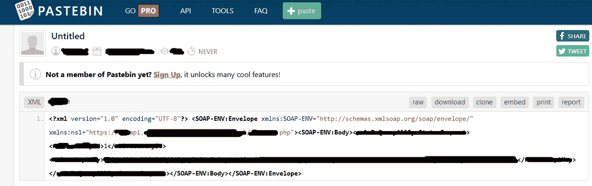

# 使用可疑的信息来源进行侦察——pastebin.com

> 原文：<https://infosecwriteups.com/recon-using-a-questionable-source-of-information-pastebin-com-29a57414f1a6?source=collection_archive---------1----------------------->

我暂时停止了写作，或者说是点击了发布按钮，有很多侦察资料要看，我想这可能是另一篇文章的主题，但这是我认为有用的东西。

虽然 github 可以很好地找到泄露的凭证和 apikeys，对于子域名，有时还有另一个更黑暗的地方，那就是 pastebin.com

**pastebin.com 可能成为的黑暗之地** 众所周知，在 pastebin.com 你可以找到坏人泄露的各种私人数据。但是，pastebin.com 不仅仅是坏消息、可疑信息等的来源。它也是人们用来分享他们的代码片段和其他东西的地方。但是，如何在 bug 搜索中使用这些信息呢？

**黑暗中的光** 老派的黑客行为包括了解系统被黑的情况。这种想法大部分延续至今。当你在寻找 bug 的过程中发现某个网站正在使用 WordPress X 版本时，最明显的下一步就是检查 WordPress X 版本是否有任何已知的 bug。但是，如果网站不是 wordpress，或者 joomla 等。但是有些定制 cms 呢？大多数情况下，使用 google 搜索特定的 cms 不会提供太多信息。但是，如果 cms 有一个看起来很有趣的端点，但是您无法访问关于它的任何文档，该怎么办呢？这就是 pastebin.com 可以帮忙的地方，只要知道如何与端点交互的人最终把代码放在那里。

在我使用这种技术的短暂时间里(因此我发现我在这方面的成功可能会随着时间的推移而增加),我偶然发现了泄露的 PII 数据，当然还有有效的凭证，但也有一次我发现了一段非常有用的代码。
过程相当简单:我在子域 api.target.com 上发现了一个有趣的端点，GET 请求显示 405 方法不被允许。POST 请求导致 xml 格式错误。立即想到的是尝试 xml xxe。但是，熟悉的 xxe 代码不起作用。那时我转向了 pastebin.com，我只使用了子域 sans endpoint 来避免遗漏任何东西(这在很多情况下被证明是有用的):

结果发现，有人，不管出于什么原因，为正在讨论的 POST 请求发布了一个正确的 xml 格式，而通常的 xml xxe 不工作的原因与 soap 有关:)我指的是 SOAP。

显然，我必须将 xxe 部分添加到无害 SOAP 请求中。而且，它成功了。算是吧。我得到了 500 内部服务器错误，但我也得到 http pingback。
由于 bug bounty 计划的政策，我不被允许尝试任何数据提取，所以攻击/PoC 就这样结束了。

你需要知道如何编码吗？
快速回答，与本文具体相关:不尽然。识别模式就足够了，特别是对于模式非常明显的 xml。
更长、更概括的回答:
作为一个总是试图填补我知识中所有空白的人，我经常花时间听/读顶级 bug 赏金猎人的采访，其中也包括 101 个初学者类型的东西(你永远也不会知道 K.I.S.S .什么时候会有这么大的不同)。一个经常被讨论的问题是，你是否需要知道如何编码才能成为一名成功的 bug 赏金猎人。
有时候那些问题会进入哪种编程语言才是唯一的(好像真的有)。但是，答案是你需要理解代码。这并不等同于知道如何编码。为此，你需要学习最基本的东西。有时候会有安卓应用的片段或者完整的源代码。虽然 android 应用程序是基于 java 的，但如果你了解任何编程语言的基础，逻辑应该足够好，可以找到有趣的东西。显然，如果你想逆向工程代码，找到代码本身的错误，这是整个其他系列的文章，如果不是书籍。