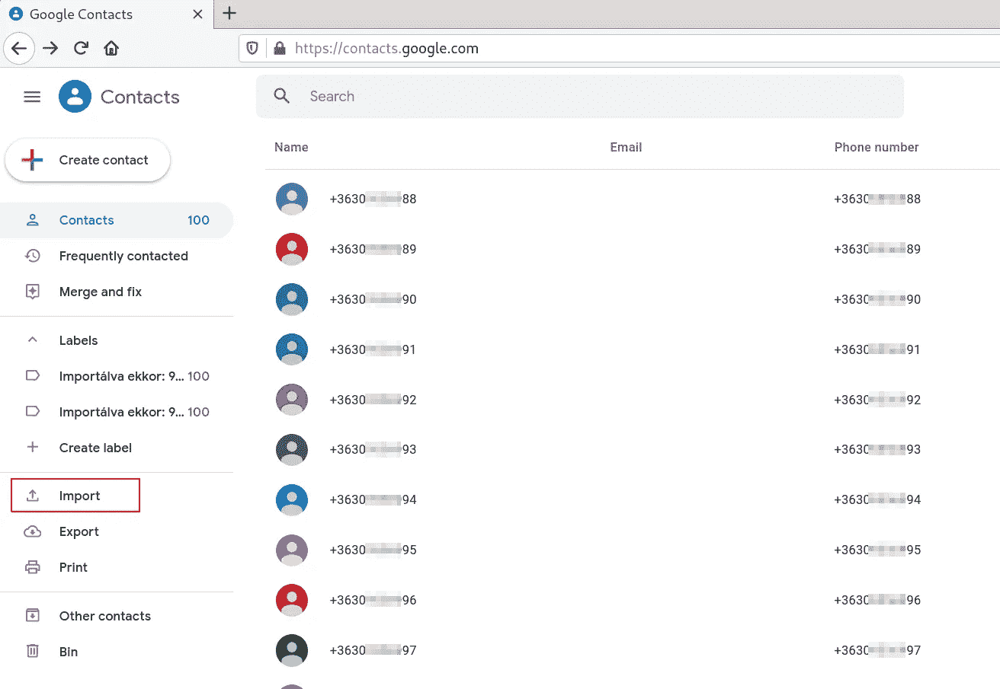
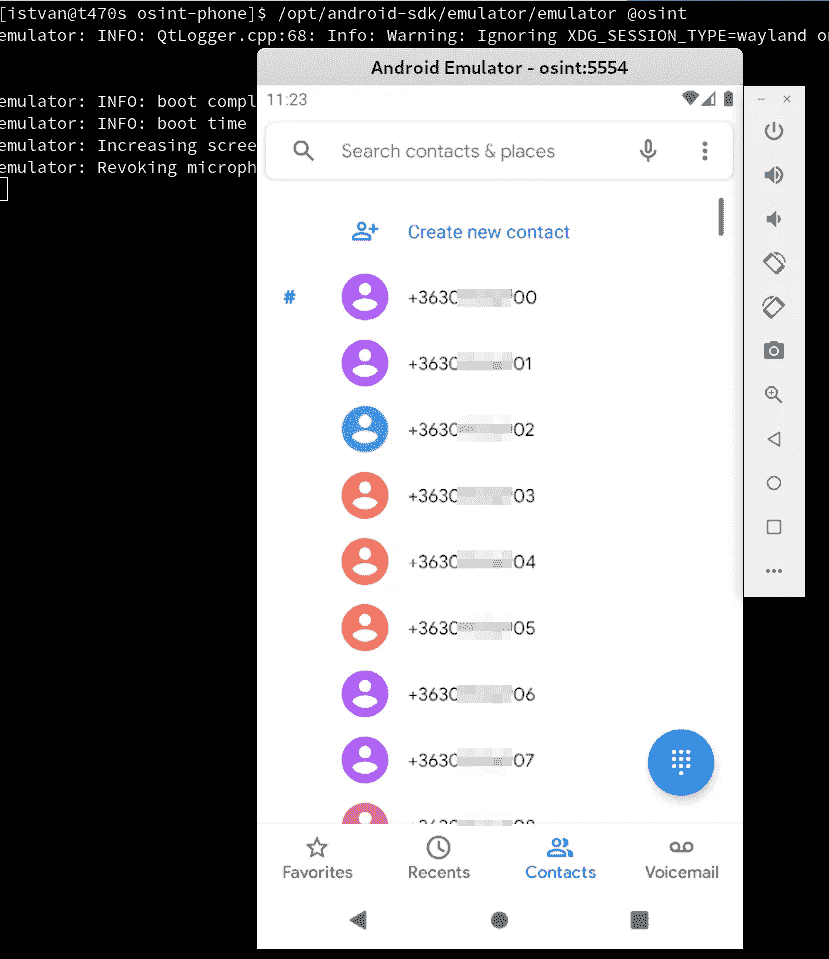
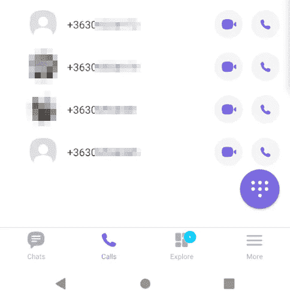
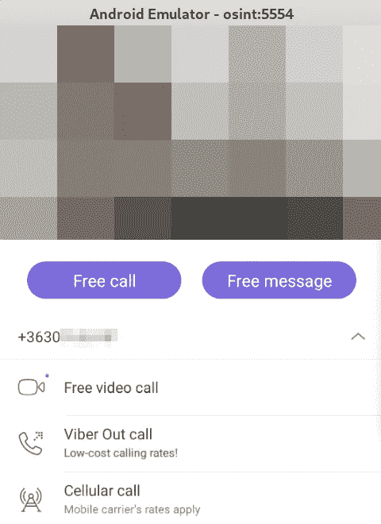

# 用黑客思维找回丢失的电话号码

> 原文：<https://infosecwriteups.com/recovering-a-lost-phone-number-using-hacker-mindset-5e7e7a30edbd?source=collection_archive---------1----------------------->

最近，由于擦除我的 Android 设备的数据分区，我意外地丢失了一个重要的电话号码(由于操作系统升级从官方但不支持的 LineageOS 分支迁移到[我的非官方但最新支持的 LineageOS 版本](https://twitter.com/an0n_r0/status/1300002966951333888/retweets/with_comments))。所有的数据都被备份了，但不幸的是，这个电话号码没有备份，它很重要。所以我必须想办法找回它。

因为被擦除的数据分区是加密的，并且加密密钥丢失了，所以对被擦除的分区的任何取证工作将会非常困难或者几乎不可能。

我们还能在哪里找到那个号码？从移动网络运营商那里获取信息似乎是显而易见的，因为他们肯定会记录所有信息。幸运的是，我的订阅资料中启用了(免费的)“电子通话详细信息”服务，因此我有机会轻松地在线获取历史通话的详细信息，访问我的历史发票。

经过短暂的思考，我能够估计出一个狭窄的时间框架，当我开始打电话给我失去的联系。我在我的在线发票中检查了我打出电话的时间范围，过滤掉了已知的号码，只剩下一个，这几乎可以肯定是我正在寻找的那个丢失的号码。

然而，还有一个小问题:由于隐私原因，网络运营商掩盖了通话记录中号码的最后两位数，因此丢失的电话号码看起来像 3012345**，其中**仍然未知。

我试着直接向运营商询问电话号码，但他们拒绝提供。(他们撒谎说自己都不知道，明显是什么伪隐私扯淡。:) )

另一种(黑客风格的)选择是暴力破解。我们只有 100 个号码可以尝试，所以这应该可以。但也可以明智地这样做，例如不拨打无效或外来号码。我们的计划是一些开源智能(OSINT)，试图使用流行的消息应用程序或云服务(如谷歌、Whatsapp、Viber)的内部数据库。

在实践中，我们应该将 100 个候选电话号码上传到 Android 电话簿，安装并注册到 Whatsapp、Viber 等。让我们看一下已经同步了哪些数据。例如，谷歌有号码的联系人姓名，Viber 甚至为没有姓名的纯号码提供个人资料图片，所以如果我们幸运的话，我们可以获得足够的信息来识别失去的联系人。

为了完成调查，我们需要一部安卓手机、一个谷歌账户和一个注册 messenger 应用程序的电话号码(实际上是一张 SIM 卡)。

因为我不想把这个开源情报项目和我真实的个人资料混在一起，所以我使用了一个专用的假身份。我使用了一个 Android 模拟器而不是一个真实的设备，使用了一个专用的谷歌帐户和一个专用的电话号码(带有一个新的预付费 SIM 卡)。出于几个原因，强烈建议对这类项目使用专用账户。例如，如果消息应用程序检测到恶意使用，它可能会阻止您的身份，这是应该避免的。

得到一张 SIM 卡从来都不困难，我很简单[就免费得到了一张](https://shop.vodafone.hu/probald-ki)。我已经在我的一个+10 岁的旧手机上激活了它。我需要的唯一服务是接收注册确认短信。

在我的 [Arch Linux](https://www.archlinux.org/) 操作系统上运行 Android 模拟器是有据可查的，我的首选方式是使用在 [AUR](https://aur.archlinux.org/) 中可用的 [Android SDK cmdline 工具](https://aur.archlinux.org/packages/android-sdk-cmdline-tools-latest/)。

安装命令行工具:

```
$ git clone [https://aur.archlinux.org/android-sdk-cmdline-tools-latest.git](https://aur.archlinux.org/android-sdk-cmdline-tools-latest.git)
$ cd android-sdk-cmdline-tools-latest
$ makepkg -s
$ sudo pacman -U android-sdk-cmdline-tools-latest-2.1-1-x86_64.pkg.tar.zst
```

抓取最近的 Android 系统映像并创建一个 Android 虚拟设备:

```
$ sudo /opt/android-sdk/cmdline-tools/latest/bin/sdkmanager 'system-images;android-30;google_apis_playstore;x86_64'
$ /opt/android-sdk/cmdline-tools/latest/bin/avdmanager create avd -n osint -d 10 -k 'system-images;android-30;google_apis_playstore;x86_64'
```

为了方便，我一般会通过在`~/.android/avd/osint.avd/config.ini`中添加`hw.keyboard=yes` 来增加硬件键盘支持。

现在可以通过以下命令启动模拟器:

```
$ ANDROID_SDK_ROOT=/opt/android-sdk /opt/android-sdk/emulator/emulator @osint
```

同时，我在我的桌面上注册了一个专用的谷歌账户(上面有我的专用电话号码)。这有利于 Android 个人资料，也有利于同步和上传 100 个候选电话号码到 Android 设备。

让我们创建 100 个候选电话号码(作为一个适合在 Google Contacts 中导入的 CSV):

```
$ ( echo "Phone" ; for i in `seq 0 9`; do for j in `seq 0 9`; do echo "+363012345$i$j" ; done ; done ) > phone.csv
```

现在将创建好的`phone.csv`导入到[contacts.google.com](https://contacts.google.com):



将电话号码(从 phone.csv)导入 Google 联系人

有几个号码已经确定了，但不幸的是，我要找的那个号码还没有确定:


谷歌联系人识别一些导入的电话号码

让我们试试 Android 消息应用程序。同步后，导入的电话号码会出现在 Android phonebook 中(使用相同的 Google 帐户):



Android 模拟器中的同步电话簿

从 Google Play 安装 Viber 并注册一个电话号码(使用我的旧 dump 手机中的 SIM 卡)后，电话簿中的联系人(电话号码)会同步。

同步后，将电话号码与 Viber 帐户匹配的个人资料图片就可用了:



Android 上的 Viber 显示电话簿中找到的电话号码的个人资料图片

幸运的是，其中一张个人资料图片匹配，我认出了我丢失的联系人，所以我找到了丢失的电话号码。；)



最后，失去联系的人被找到了

请注意，使用 Android 联系人应用程序是一种众所周知的获取电话号码信息的 OSINT 技术。下面是来自 [Bellingcat](https://www.bellingcat.com/) 的[王高托勒](https://twitter.com/arictoler)的一篇供参考和进一步阅读。