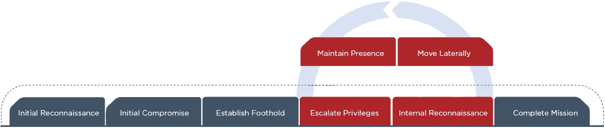

# 红队交战

> 原文：<https://infosecwriteups.com/red-teaming-engagement-71bae2b48f76?source=collection_archive---------1----------------------->

## 终极道德黑客的最深潜水

[https://www.fireeye.com/mandiant/red-team-assessment.html](https://www.fireeye.com/mandiant/red-team-assessment.html)

Red Teaming 是一个目标导向的多层攻击模拟练习。此练习基于对组织资产面临的威胁风险级别的识别。Red Teaming 还通过模拟真实世界的场景来挑战事件响应团队的能力，扮演不同类型的威胁参与者角色，如黑客行动主义者、网络恐怖分子、间谍等，从而定义组织的整体安全态势。

> 红色团队的最终目标是获取敏感的公司资产。

# 渗透测试与红队合作

*   渗透测试侧重于发现漏洞并加以利用，而 Red Teamer 则更进一步，执行一种利用后方法来访问组织的关键资产。
*   渗透测试更侧重于项目，而红队是基于客观/场景的测试。
*   渗透测试人员在规定的范围内工作；红队的范围很广，对不应该做的事情没有什么限制。
*   渗透测试是一种短期项目测试，需要一天到两周的渗透测试；而在红队训练中，持续时间在 2 周到几个月之间。
*   渗透测试仪与 CSOC 一起工作，并预先通知他们有关测试活动的细节；相比之下，红色团队将避免 CSOC 检测，因为他们模仿真实世界的网络罪犯。他们复制真实世界对手的技术、战术和程序(TTP)。CSOC 通常直到最后才知道他们正在进行的测试。这是 CSOC 和红队之间的一场猫捉老鼠的游戏，他们互相挑战以增强组织的安全态势。
*   渗透测试人员通常使用现成的工具来利用已知的漏洞；而红队队员则需要创造自己的工具/漏洞来实施攻击。

**常见红色组队要求**

*   忠诚调查
*   行业认可的 pentest 资格:OSCE OSCP，CREST CCSAS
*   需要时，必须能灵活适应非正常工作时间。
*   对通用 C2 框架、TTP、网络杀伤链、风险等有深入的了解。

# 红队方法论

## **第一步。**红色团队的目标和范围

红队的“交战规则”将列出允许实施的网络攻击的目标和类型。

该范围还将确定不会成为目标的任何异常。

红色团队的持续时间将由客户确认。

需要客户签署的“授权书”LoA 信，以授予对其托管基础设施进行网络攻击的许可。

> *在我的一篇文章—* [*基线安全检查*](https://medium.com/bugbountywriteup/baseline-security-check-i-61ce01cfcaf9) *中，我提到了几个可以用于执行 red 团队练习的领域。*

**红色团队合作的类型有:** **主动**、**被动、**或**物理**

举几个例子，以下是攻击途径:

## 活跃的

*   网络 VA 和 PT
*   Web 应用程序和移动 PT
*   水坑攻击
*   Kerberoasting
*   活动目录数据泄漏
*   AV 规避
*   NFS 文件共享枚举
*   弱密码枚举

## 消极的

*   网络钓鱼
*   视觉
*   勒索软件
*   嗅

## 身体的

*   尾部门控
*   战争驾驶
*   流氓接入点
*   现场社会工程
*   路过式下载

*假设红色团队合作目标是* ***文件服务器分类。***

## **第二步。**信息收集

这是一次被动侦察，收集范围内约定目标的数据。

*即在没有任何适当控制的情况下，探究有多少文件共享暴露给网络上的每个人。这项任务通常由初级渗透测试人员执行。*

## **第三步。**攻击映射和规划

发布信息收集—然后由 Red Teamers 和 juniors 执行攻击路径方法，以识别多个漏洞并了解资产的风险级别。网络攻击的类型以及它们将如何被执行被绘制出来。

*即列举暴露的 NFS 文件共享并寻找进一步渗透的方法以获得立足点>权限提升>横向移动以最终获得系统访问权。*

## **步骤四。**执行攻击和渗透

**指挥和控制(C2)开发后框架**

一旦红队利用漏洞并获得系统访问权，C2 框架将被用于进行后期利用，例如:

*   权限提升
*   绕轴旋转
*   横向运动
*   数据泄漏
*   加密密钥下载(勒索软件攻击)等。

**常见的 C2 框架包括:**

*   钴罢工
*   PoshC2
*   Powershell 帝国
*   米特 ATT 和 CK

## **步骤五。**报告和补救建议

报告重现此攻击的关键发现和步骤。

**以下是一些常规补救措施。**

*   外围防火墙或外围日志将威胁智能数据收集到中央日志服务器或 CSOC，以识别恶意 URL 和 IP 地址。
*   使用 Splunk 和 ELK Stack 等工具可以识别恶意 C2 流量。
*   入侵检测系统和入侵防御系统可监控匿名网络流量行为，并将日志发送到威胁情报工具(即 Splunk)进行进一步分析。
*   适当的网络分段。
*   实施网络访问控制(NAC ),将访问控制限制在私有网络之外的未授权用户和设备。

## **第六步。**重新测试

根据安全架构师制定的补救措施，重新测试最初的测试结果。此文档将包括哪些调查结果是固定的，哪些不是或已授予风险例外。然后，红队队员将重新进行攻击，以查看所应用的控制是否有效，问题现在是否已得到缓解。

# 参考

1.  [https://www . foregenix . com/blog/a-first-look-at-todays-command-control-frameworks](https://www.foregenix.com/blog/a-first-look-at-todays-command-and-control-frameworks)
2.  【https://en.wikipedia.org/wiki/Network_Access_Control 
3.  [https://www.synopsys.com/glossary/what-is-red-teaming.html](https://www.synopsys.com/glossary/what-is-red-teaming.html)
4.  [https://www . harmj 0y . net/blog/red teaming/file-server-triage-on-red-team-engagements/](https://www.harmj0y.net/blog/redteaming/file-server-triage-on-red-team-engagements/)
5.  [https://www . tripwire . com/state-of-security/mitre-framework/the-mitre-attck-framework-command-and-control/](https://www.tripwire.com/state-of-security/mitre-framework/the-mitre-attck-framework-command-and-control/)
6.  [https://resources . infosec institute . com/topic/red-teaming-overview-assessment-methodology/](https://resources.infosecinstitute.com/topic/red-teaming-overview-assessment-methodology/)