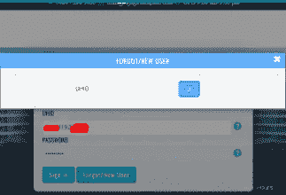
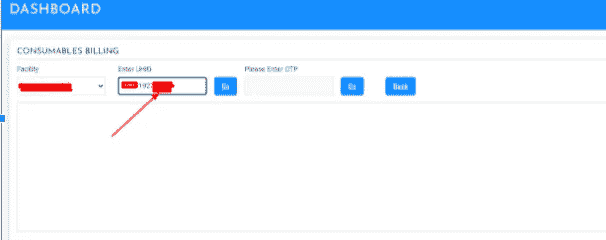
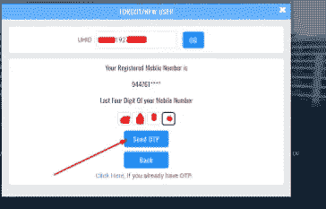
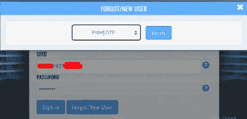
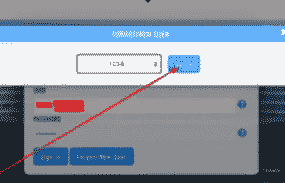
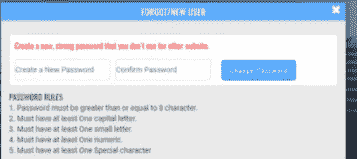
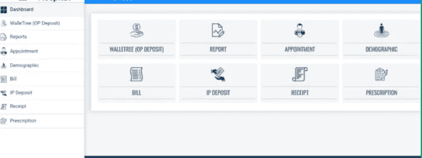
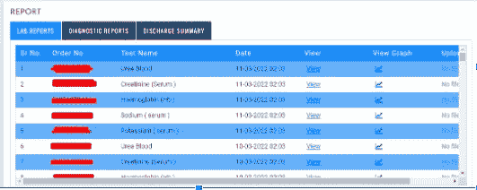
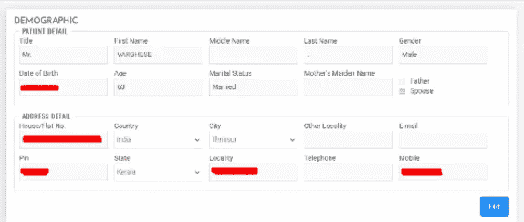

# 在<redacted>医院</redacted>进行 OTP 旁路和账户接管

> 原文：<https://infosecwriteups.com/otp-bypass-and-account-takeover-at-redacted-hospital-a49253411212?source=collection_archive---------0----------------------->

## 举报固定|赏金间接拒绝。|要求删除书面报告

要了解我的更多信息，可以问谷歌助手“谁是克里希纳德夫·P·梅勒维拉”或者在谷歌上搜索我的名字。

我们开始吧！！

注:本报告为转贴！由于医院的要求，原始报告被删除了。他们告诉我，如果我不删除报道，他们将合法搬迁。(太失望了)

> **漏洞:OTP 旁路和账户接管**
> 
> **冲击:零点一天**
> 
> **风险:患者敏感数据**
> 
> **优先级:P0**
> 
> **范围:病历、扫描报告、检验报告、其他患者敏感信息**

**从攻击者角度重现的步骤:**

1.  **访问**[**https://patient portal。<修订了>。**com/](https://patientportal.rajagirihospital.com/)
2.  **点击忘记/新用户**



**3。输入任何有效的 UHID 进行测试，我使用的是 R***192*******


**4。它需要手机号码的最后 4 位数字才能获得动态口令。攻击者还可以使用响应操作绕过这一点，这将在接下来的步骤中使用。但在这里，我将通过另一种方法检索患者的手机号码。**

**5。请访问 https://patientportal。<修订了>。com/consumeable billing/consumeable billing****并输入 UHID，然后点击“GO”并在 burpsuite** 等网络拦截工具上拦截该请求



**6。在拦截上述请求的响应后(拦截与上述步骤相关的每个请求)，我们得到如下响应:**

```
**HTTP/1.1 200 OK
Cache-Control: private
Content-Type: text/html; charset=utf-8
Server: Microsoft-IIS/8.5
X-AspNetMvc-Version: 5.2
X-AspNet-Version: 4.0.30319
X-Powered-By: ASP.NET
Date: Tue, 15 Mar 2022 02:45:40 GMT
Connection: close
Content-Length: 125****[{"Pcellno":"9447******","PPhone":"","PEMail":"","HSPLocationId":7,"patientNm":"Mr.Va******.","sex":1,"age":63,"Agetype":1}]**
```

7.**这里明确提到了他的电话号码(出于安全考虑，我在这篇文章中隐藏了“PCellno ”,但在实际攻击中，它是完全可见的。)，所以我们可以回到第 3 步，输入最后 4 位数字。**



**8。移动验证后，我们会得到一个如下图的进入 OTP 的界面:**



**9。在这里输入任意随机数，如‘1234’并截取该请求的响应**



```
**HTTP/1.1 200 OK
Cache-Control: private
Content-Type: text/html; charset=utf-8
Server: Microsoft-IIS/8.5
X-AspNetMvc-Version: 5.2
X-AspNet-Version: 4.0.30319
X-Powered-By: ASP.NET
Date: Tue, 15 Mar 2022 02:51:06 GMT
Connection: close
Content-Length: 1****0**
```

**10。在拦截响应的过程中，我们在末尾得到一个数字“0”，将其更改为“1”，然后将响应转发给客户端。您将可以更改密码。**



**11。现在设置一个新密码，并使用我们现在设置的 UHID 和密码直接从登录门户登录。**



**额外:电话号码枚举实际上是不需要的(即步骤 5 到 6 可以省略)。我们可以使用与步骤 9 中相同的响应操作技术来绕过移动验证。**

> **来自<编辑> IT 团队的回应 1:**当我问他们是否为我的工作提供了任何奖金时，他们回答说，他们不敢向管理团队报告，因为他们不知道管理团队对这份报告的反应。
> 
> **来自<编审>管理团队的回应(我直接汇报) :如果我不删除报告，他们将合法搬迁。(所以我把这个做成了匿名揭发报告)**
> 
> **由<编辑的> IT 团队采取的行动:**网站现已关闭，他们正在修复。

所有人都在这里，

***别忘了在 medium 等社交媒体上关注我。也请为这篇文章鼓掌 50 次，这是我写更多的灵感！！***

我需要你的支持来写更多，请给我买杯咖啡吧:[https://www.buymeacoffee.com/krishnadevpm](https://www.buymeacoffee.com/krishnadevpm)

*我的 Instagram 手柄:*[*https://instagram.com/krishnadev_p_melevila*](https://instagram.com/krishnadev_p_melevila)

*我的推特手柄:【https://twitter.com/Krishnadev_P_M】[](https://twitter.com/Krishnadev_P_M)*

**我的 LinkedIn 手柄:*[*https://www.linkedin.com/in/krishnadevpmelevila/*](https://www.linkedin.com/in/krishnadevpmelevila/)*

**我的人事网站:*[*http://krishnadevpmelevila.com/*](http://krishnadevpmelevila.com/)*