# 红线窃取者恶意软件静态分析

> 原文：<https://infosecwriteups.com/redline-stealer-malware-static-analysis-69367b37a146?source=collection_archive---------0----------------------->

# 介绍

这篇博文将总结我最近对红线窃取者恶意软件样本进行静态分析的结果。这并不是对 Redline 所有功能的详尽分析，而是对我感兴趣的一些功能和方法的概述。

根据 Malpedia 的说法，“Redline Stealer 是一种地下论坛上出售的恶意软件，显然是独立的(根据版本的不同，价格为 100 美元/150 美元)，也可以是订阅的(100 美元/月)。这种恶意软件从浏览器收集信息，如保存的凭据、自动完成数据和信用卡信息。在目标机器上运行时，还会进行系统清点，包括用户名、位置数据、硬件配置和已安装安全软件的相关信息等详细信息。红线的最新版本增加了窃取加密货币的功能。FTP 和 IM 客户端显然也是这个家族的目标，这种恶意软件有能力上传和下载文件，执行命令，并定期发回受感染计算机的信息。”[1]

# 技术分析

样品链接:[https://bazaar . abuse . ch/sample/12 AEC 3 AE 5c 5828745 e 45 a 86 fedb B1 ff 4c 0631855 f8e 76d 63 f 0 AC 7 FB 554 D5 AFC 3/](https://bazaar.abuse.ch/sample/12aec3ae5c5828745e45a86fedbb1ff4c0631855f8e76d63f0ac7fb554d5afc3/)。

开始时，file 命令显示二进制文件是一个. NET 程序集。根据微软的说法。NET 文档，“程序集构成了部署、版本控制、重用、激活范围和安全权限的基本单元。基于. NET 的应用程序。程序集是为协同工作而构建的类型和资源的集合，并形成功能的逻辑单元。程序集采用可执行的形式(*)。exe* )或动态链接库(*)。dll* )文件，并且是。NET 应用程序。它们为公共语言运行库提供了它需要了解的类型实现信息。[2]

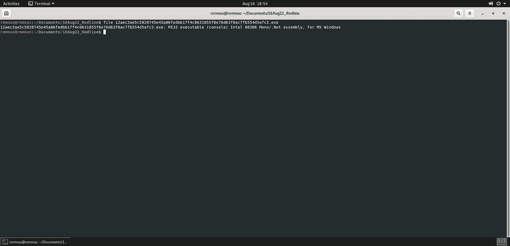

图一。文件命令的输出。

。NET 程序集本质上只是编码和编译 C#程序的最终结果。对恶意软件分析师来说幸运的是，使用 dnSpy 这样的工具可以很容易地反编译 C#二进制文件，这意味着他们可以直接查看源代码，或者至少是非常接近源代码的内容。不过，在反编译之前，我想看看 pestudio 工具能在这个二进制文件中找到什么。马上，我有了一个 IP 地址，大概是一个 C2(命令和控制)服务器。同样值得注意的是，pestudio 揭示了编译时二进制文件的名称是“Implosions.exe”。

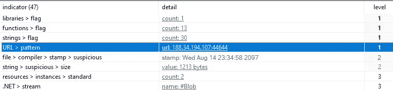

图二。从二进制文件中作为明文字符串提取的可能的 C2 服务器 IP 地址。

我找到了这个 IP 地址，并在 virustotal 上进行搜索，通信文件部分确定了 Implosions.exe 文件名。令人欣慰的是，这个特定的样本已经有相当高的检测率，这意味着在其当前的配置下，恶意软件将被大多数反病毒产品捕获。

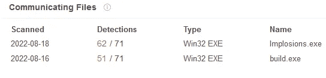

图 3。标识 Implosions.exe 文件的通信文件部分。

另一方面，仅仅通过改变一个位、重命名一个变量、添加一个垃圾注释等等，就可以非常容易地改变一个散列。我重命名了二进制文件中的一个方法，并用重命名的方法重新编译，SHA256 哈希完全不同，以前 virustotal 看不到。这说明了不过度依赖 virustotal 等工具的重要性。

## 建立 C2 和早期执行

一旦我在 dnSpy 中反编译了二进制文件，我就进入二进制文件的入口点，一个名为“Program”的类，并开始我的分析。在最上面，我注意到另一个名为 EntryPoint 的类被作为参数传递给 Execute 方法，所以我注意到了这一点。我注意到的下一件事是，二进制文件正在对 EntryPoint 类中指定的四个字符串执行解密:“Message”、“Key”、“IP”和“ID”。二进制文件还解密 C2 IP 地址，然后尝试建立连接。一旦连接建立，Redline 在从 C2 服务器获取 ScanningArgs 之前会休眠 5 秒钟，这可能是为了逃避基于行为的检测。

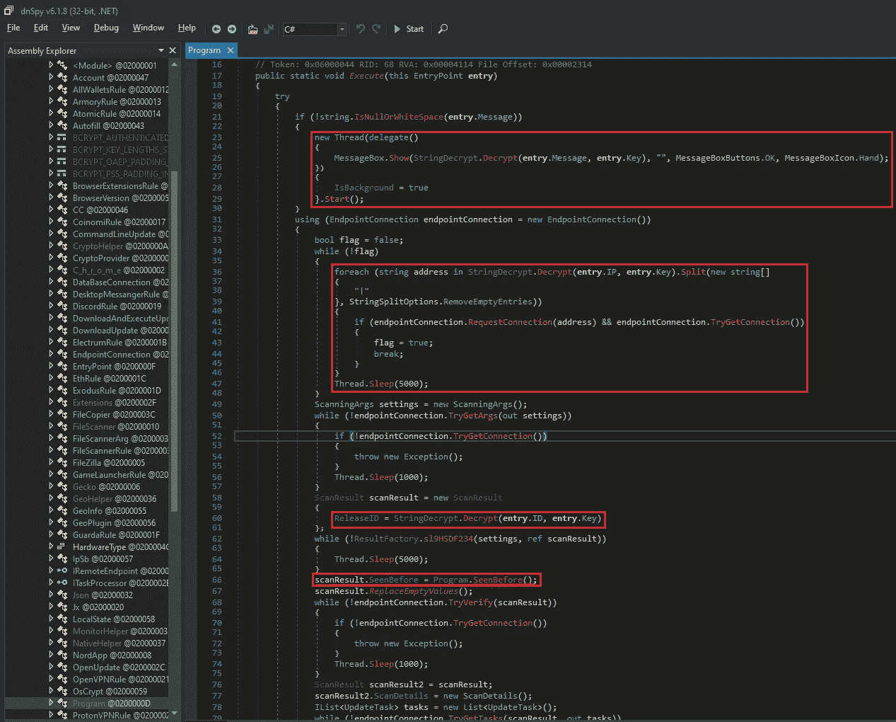

图 4。请注意 StringDecrypt。对 EntryPoint 类中的四个字符串使用的 Decrypt 方法。还要注意程序。参见 Before 方法。

即使 Redline 使用 StringDecrypt。解密方法，结果是存储在这个特定示例的 EntryPoint 类中的字符串根本没有加密。这可能是因为使用该特定样本的威胁参与者并不特别关注 OPSEC。

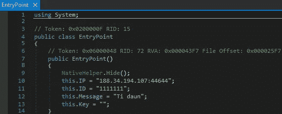

图 5。存储在 EntryPoint 类中的明文 C2 IP、ID、消息和密钥字符串。

回到 Program 类，还有一个 SeenBefore 方法(如图 4 所示)。此方法搜索\AppData\Local\Yandex\YaAddon 文件夹。如果文件夹存在，则 SeenBefore 方法返回一个 false 值，如果文件夹不存在，则使用 CreateDirectory 方法创建该文件夹。返回值(真或假)存储在 ScanResult 数据结构中，然后返回给 C2 服务器上的威胁参与者，通知他们受感染的机器以前是否感染过 Redline stealer 恶意软件。这可能会引起网络罪犯的兴趣，主要有两个原因。如果机器之前已经被感染，信息被窃取，那么他们就不能轻易在地下论坛出售这些信息来获利。第二个原因是，如果网络犯罪分子已经窃取了多个帐户的凭据，他们可能会更改其中一些帐户的凭据，以确保其继续访问。现在，另一个网络罪犯出现了，他窃取了他们认为有效的凭证，但这些凭证实际上是无效的，因为它们已经被第一个网络罪犯更改过了。

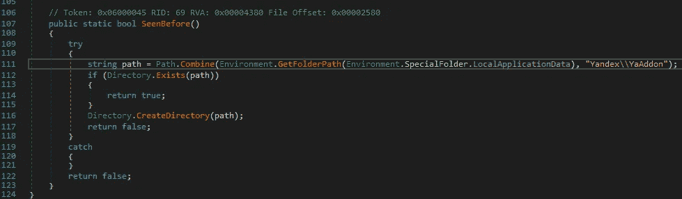

图 6。参见 Before 方法。

## 信息窃取功能

现在 Redline 已经建立了与 C2 服务器的连接，并执行了一些初始系统枚举，它需要开始接受来自操作员的命令来实现其功能。回头参考 Program 类(二进制文件的入口点)，Redline 收集由操作符指定的扫描参数。这些参数都是 ScanningArgs 类的派生类，它们指定了二进制文件应该采取的操作。例如，威胁参与者可以指定“ScanDiscord ”,然后 Redline 将执行 DiscordRule 类中的方法。

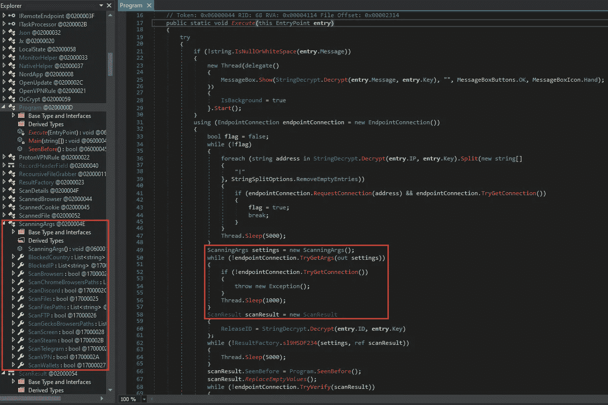

图 7。正在收集扫描参数。

让我们继续不和谐的例子。因此威胁参与者提供了 ScanDiscord 参数，现在 Redline 将执行 DiscordRule 类中包含的方法。

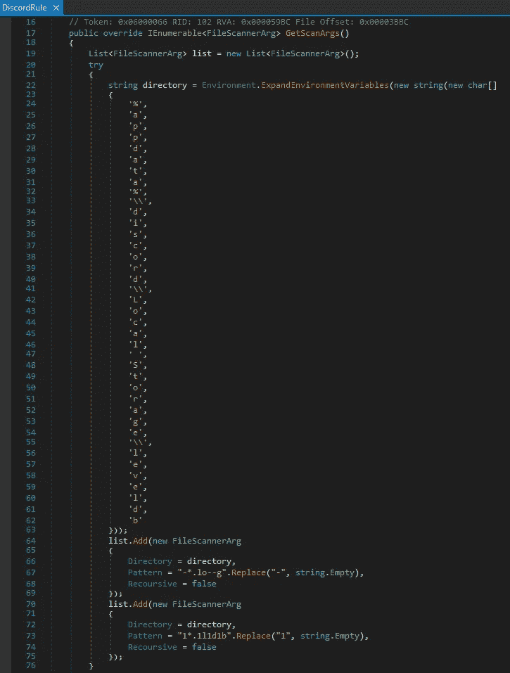

图 8。DiscordRule 类中的 GetScanArgs 方法。请注意指定要搜索的目录是% appdata % \ discord \ Local \ Storage \ level 1db 的字符串。

GetScanArgs 方法指定将要搜索的文件夹，为*C:\ Users \<USER>\ AppData \ Roaming \ discord \ Local \ Storage \ level 1db*。然后，GetTokens 方法使用正则表达式(regex)来执行模式搜索。恶意软件的开发者通过将“字符串”添加到用于搜索不一致令牌的正则表达式中，添加了一些轻微的混淆。我在下图中强调了这种混淆的存在。当稍后在执行中删除它时，正则表达式是:[A-Za-z\d]{24}\。[\w-]{6}\。[\w-]{27}。这个正则表达式正好符合不一致标记遵循的命名模式。

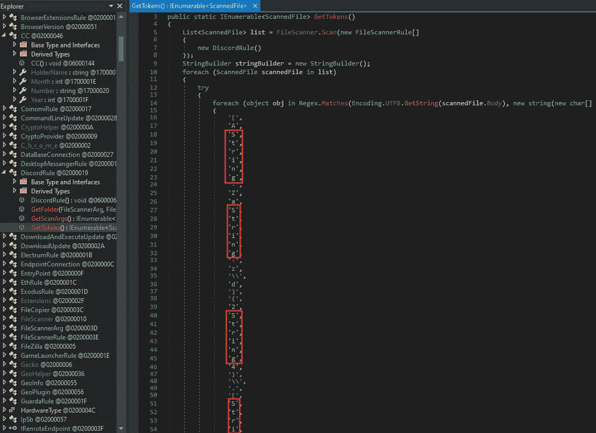

图 9。GetTokens 方法使用正则表达式对不一致令牌进行模式搜索。请注意在正则表达式字符之间的随机间隔中添加“String”的混淆尝试。

然后，令牌存储在名为“Tokens.txt”的文件中，该文件由 FileCopier 类中的 CopyFile 方法读取。然后将文件数据复制到卷影副本中。这些不一致令牌用于对不一致服务器的认证。拥有这些令牌的威胁参与者可能会试图向 discord 服务器进行身份验证，就好像他们是受害者用户一样。

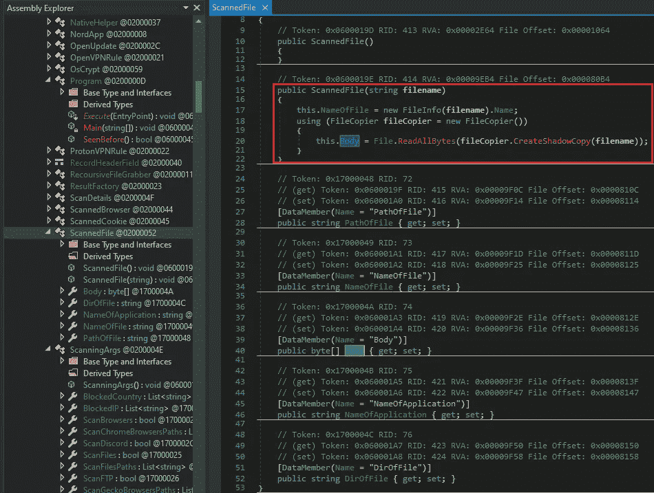

图 10。ScannedFile 类，存储 FileCopier 方法的结果。

FileCopier 包含几个不同的方法，它们都实现了与枚举、复制和读取文件相关的相似但略有不同的功能。这些方法在 Redline 的其他类和方法中被广泛使用。

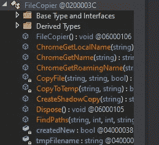

图 11。FileCopier 类中的方法。

Redline 功能的另一个有趣但不令人惊讶的方面是它针对加密货币钱包凭证。Redline 使用名为 BrowserExtensionsRule 的 FileScannerRule 的子类搜索要窃取的加密货币钱包凭据和 cookies。

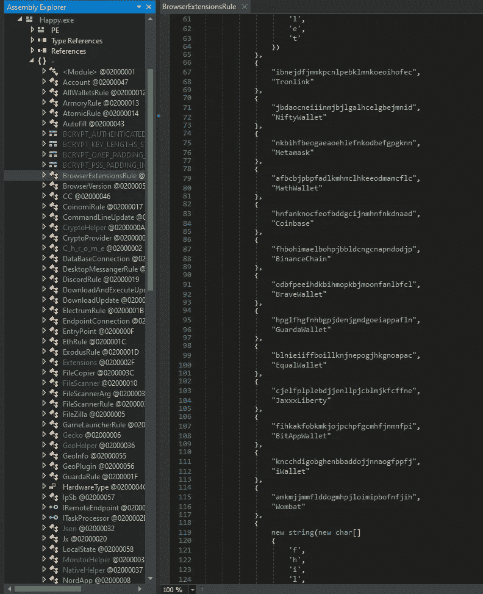

图 12。BrowserExtensionsRule 规则所针对的加密货币钱包的字典。请注意，这并不包括所有的目标加密钱包。还有几个不适合这个截图。

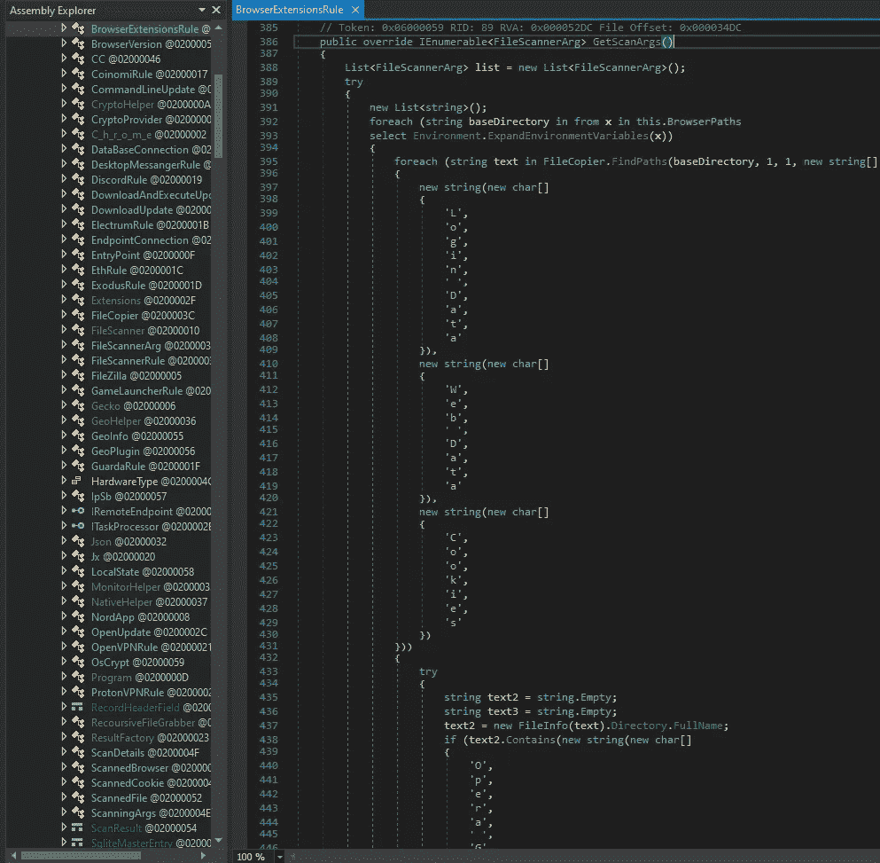

图 13。GetScanArgs 方法指定登录数据、Web 数据和 Cookies 目录。

AllWalletsRule 类是 FileScannerRule 类的子类，它使用 GetScanArgs 方法来指定 Redline 将搜索*C:\ Users \<USER>\ AppData \ Roaming \ wallets \ wallet . data*以从中窃取数据。

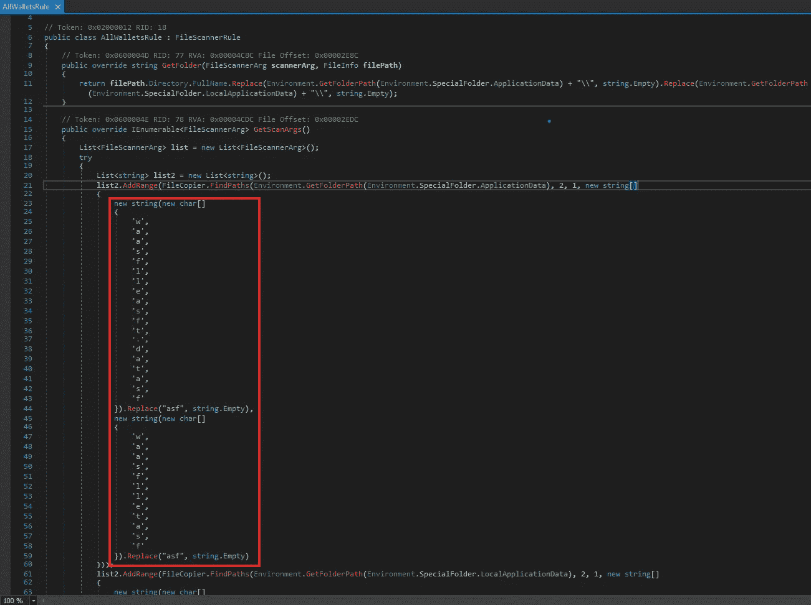

图 14。在 AllWalletsRule 类中使用 GetScanArgs 方法来指定要扫描的文件 wallet.data。请注意，通过将字符串“asf”放在实际使用的字符串中的随机位置，然后删除它，会产生轻微的混淆。

Redline 还针对来自 Telegram 桌面应用程序的数据。它使用 DesktopMessangerRule 类来实现这一点，该类也是 FileScannerRule 类的子类。Redline 将在*C:\ Users \<USER>\ AppData \ Telegram Desktop \ tdata*文件夹中搜索带有任何扩展名的文件，在下面的模式变量中用星号表示。 *\Telegram Desktop\tdata* 文件夹包含电报会话的消息、图像和文件。

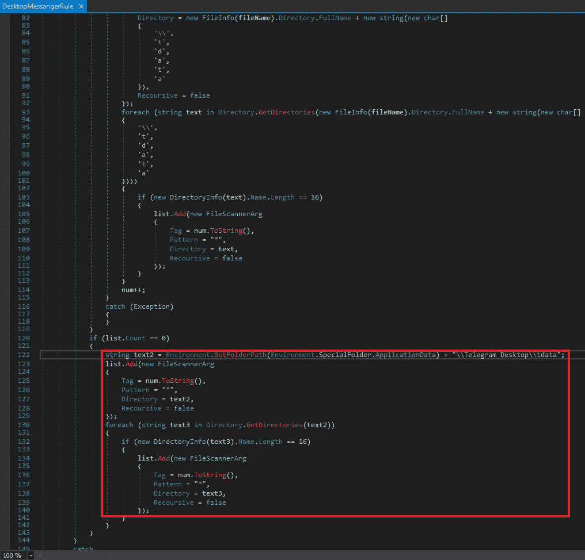

图 15。Redline 搜索存储在 tdata 文件夹中的电报桌面文件。

Redline 还能够从谷歌 Chrome 浏览器中窃取密码、cookies、自动填充数据和信用卡等信息。C_h_r_o_m_e 类包含诸如 ScanFills(自动填充)、ScanCC(信用卡)和 scan cook(cookie)之类的方法。下图显示了 ScanCC 方法。Redline 读取名为“credit_cards”的 SQLite 表，Chrome 使用该表存储用户决定保存的信用卡数据，以便快速轻松地在线结账。一旦读取了 credit_cards 表，Redline 就会解密数据并解析它。

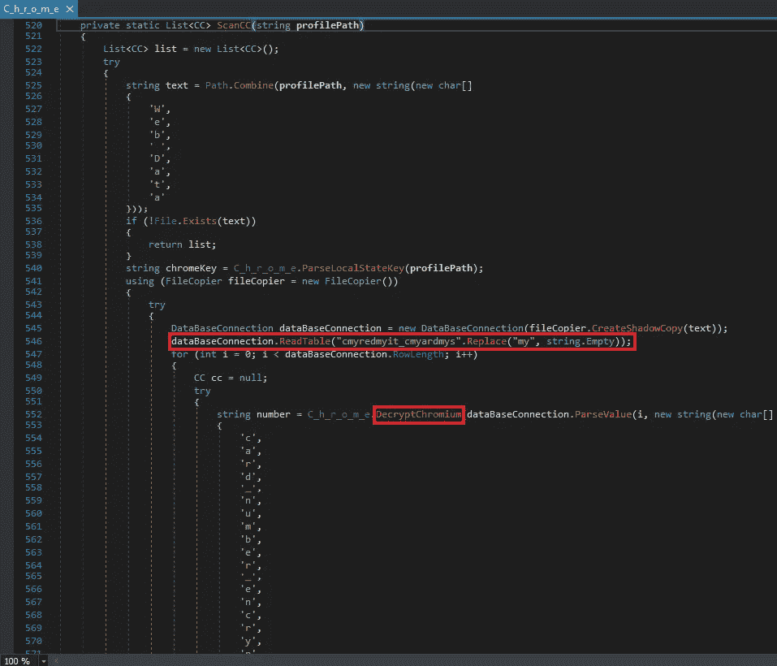

图 16。Redline 读取 credit_cards SQLite 数据库表并解密数据。

Redline 还能够使用 SystemInfoHelper 类收集关于受感染系统的大量数据。GetFirewalls 方法使用对 ManagementObjectSearcher [3]的调用来收集有关防病毒、反间谍软件和防火墙产品以及 Windows OS 安全设置的信息。同样，通过在将要使用的实际字符串中间添加随机字符串，试图进行轻度混淆。

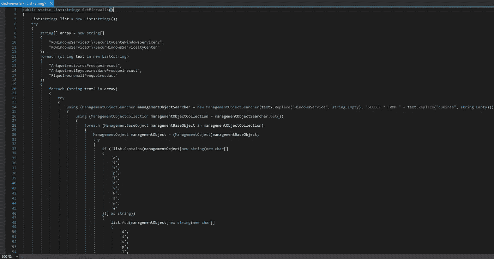

图 17。使用 ManagementObjectSearcher 调用来收集有关系统上各种安全产品和设置的信息。

# 妥协的指标(国际奥委会的)

sha 256:12 AEC 3 AE 5c 5828745 e 45 a 86 fedb B1 ff 4c 0631855 f8e 76d 63 f 0 AC 7 FB 554 D5 AFC 3

188.34.194.107:44644 C2 IP

链接到 yara 规则:[https://github . com/aarons 97/Yara-Rules/blob/main/redline . Yara](https://github.com/AaronS97/Yara-Rules/blob/main/Redline.yara)

# **结论**

总之，Redline stealer 是一款非常强大的模块化信息窃取恶意软件，被网络罪犯用于大量攻击。该恶意软件可以通过多种方法传播，威胁者不费吹灰之力就能破坏财务和个人数据。这只是被称为“恶意软件即服务”(MaaS)的地下网络犯罪增长趋势的一部分。

我希望你喜欢这篇文章，并希望你会再次回来！一个关注和分享将是超级赞赏。反馈当然也是受欢迎的。我绝不是一个专家恶意软件分析师，所以如果有什么我错过了，错了，我可以使用的技术，等等。，随时让我知道。谢谢！

# 参考

1.  (马尔佩迪亚，[https://马尔佩迪亚. caad . fkie . fraunhofer . de/details/win . redline _ stealter](https://malpedia.caad.fkie.fraunhofer.de/details/win.redline_stealer))
2.  (微软技术文档，[https://docs.microsoft.com/en-us/dotnet/standard/assembly/](https://docs.microsoft.com/en-us/dotnet/standard/assembly/))
3.  (微软技术文档，[https://docs . Microsoft . com/en-us/dot net/API/system . management . managementobjectsearcher？view=dotnet-plat-ext-6.0](https://docs.microsoft.com/en-us/dotnet/api/system.management.managementobjectsearcher?view=dotnet-plat-ext-6.0)

*来自 Infosec 的报道:Infosec 上每天都有很多事情发生，很难跟上。* [***加入我们的每周简讯***](https://weekly.infosecwriteups.com/) *以 5 篇文章、4 个线程、3 个视频、2 个 Github Repos 和工具以及 1 个工作提醒的形式免费获取所有最新的 Infosec 趋势！*