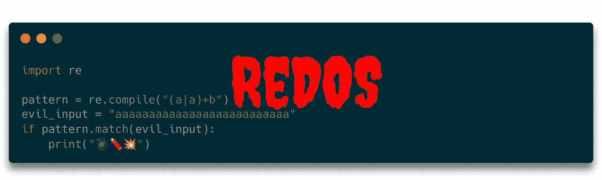
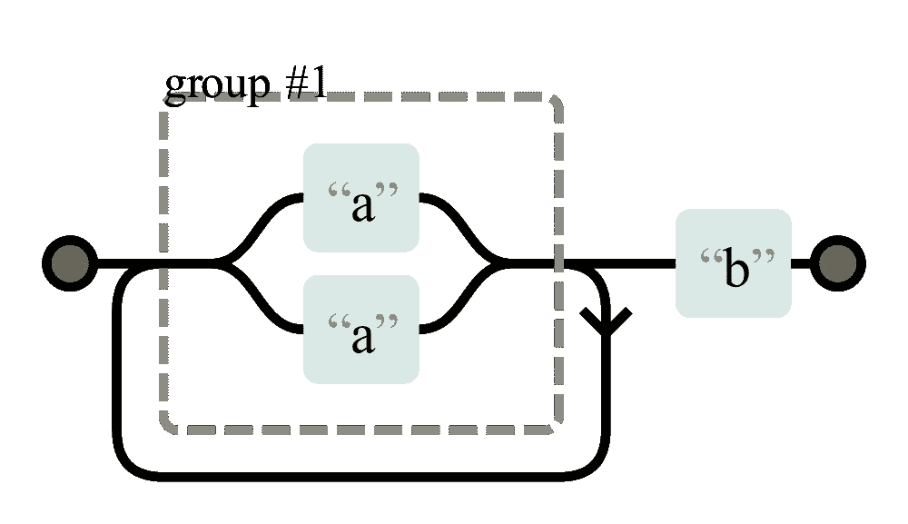

# ReDoS—RegEx 拒绝服务😈

> 原文：<https://infosecwriteups.com/redos-denial-of-service-by-regex-59c7ffab4880?source=collection_archive---------3----------------------->



正则表达式(RegEx)是一种定义简单模式的正式语言。它通常用于在大量文本中查找感兴趣的部分或验证数据。它通常很快，有时是一个干净的解决方案。但是，在某些情况下，攻击者可以为易受攻击的正则表达式手工输入，这会导致检查正则表达式输入的时间比预期的要长。

# 为什么你应该关心

我只发现了一个成功的 ReDoS“攻击”的例子。2016 年，ReDoS ( [来源](https://stackstatus.net/post/147710624694/outage-postmortem-july-20-2016))导致 StackOverflow 停电 34 分钟。

维基百科和 [OWASP](https://owasp.org/www-community/attacks/Regular_expression_Denial_of_Service_-_ReDoS) 没有提到一次成功的攻击。我猜原因是服务器端不经常使用正则表达式🤷‍♂️:python 有很多解析工具[，但我只依稀记得使用过一次](https://nedbatchelder.com/text/python-parsers.html) [pyparsing](https://github.com/pyparsing/pyparsing) 。

在许多情况下，当您可能想要使用正则表达式时，完全正确地使用它是多余的。比如[邮件正则表达式](https://stackoverflow.com/questions/201323/how-can-i-validate-an-email-address-using-a-regular-expression)。不要跳进那个兔子洞，你可以只做一些超级基本的检查，例如，长度是否至少是 3，以及是否正好有一个`@`符号在那里。然后，您只需发送一封确认电子邮件，确认用户确实可以访问该电子邮件地址。

对于 URL，您通常只需 ping 它们。对于 HTML，您希望使用 HTML 解析器。对于许多其他情况，使用`split`大有帮助。

我想说的是:你可能不需要担心，因为你可能不会在大部分代码中使用正则表达式。尽管如此，这还是很有趣😁

# PCRE 简介

Perl 兼容正则表达式(PCRE)是最常见的正则表达式样式。它们是指定字符串类型的一种方式。它们比通配符模式匹配更加具体。

例如，以下模式首先匹配单个大写字母，然后匹配任意多个小写字母:

```
[A-Z][a-z]*
```

方括号`[...]`中的字符定义了字符类别。在这种情况下，从`A`到`Z`的所有角色。`*`是一个量词，意思是“至少零个，但最多任意多个”。

# 正则表达式引擎

在上一节中，您已经看到了正则表达式是如何编写的。接下来，您需要掌握如何检查正则表达式是否匹配给定的文本。这是由正则表达式引擎完成的。

Python 的 RegEx 引擎使用**递归回溯**，可以有指数级的渐近执行时间(参见[用预览优化 Unicode 正则表达式求值](https://eprints.whiterose.ac.uk/109809/1/jsre_journal_accepted_author_manuscript.pdf))。有像 [pyre2](https://github.com/facebook/pyre2) 这样使用[汤普森 NFA 算法](https://swtch.com/~rsc/regexp/regexp1.html)的引擎。我认为使用回溯算法的唯一原因是反向引用，例如，当你想检查一个单词是否重复时。你可以在正则表达式中通过`\1`或类似的词来识别它们。

递归回溯的思想是逐步匹配字符串。它保留了一个可能匹配的可能性列表，并逐步排除它们。

# ReDoS 攻击是如何工作的？

考虑这里表示的正则表达式`(a|a)+b`:



正则表达式“(a|a)+b”的非确定性有限自动机(NFA)表示。通过[regexper.com](https://regexper.com/)创建

尽管第一组的两边都是相同的——只有“a”——但回溯回溯算法仍然会跟踪两个可能的匹配。这意味着输入中每出现一个“a ”,匹配的可能路径就会增加一倍。这意味着如果有 26 次`a`，将有 2 个⁶ = 67，108，864 条路径需要评估:

```
**import re**pattern = re.compile("**(a|a)+b**")
evil_input = "aaaaaaaaaaaaaaaaaaaaaaaaaa"
if pattern.**match**(evil_input):
    print("💣🧨💥")
```

在我的机器上执行这个需要 7 秒钟——考虑到可能的选项的数量，速度非常快，但是如果你记得你一眼就能看出这个字符串不匹配的话，速度就非常慢了。

如果您有一个易受攻击的正则表达式(也称为“evil regex”)和一个导致指数匹配时间的输入，机器将占用相当多的 CPU 资源来计算输入上的表达式。在最坏的情况下，该机器的其他用户将无法使用您的服务。正则表达式拒绝服务攻击(ReDOS)成功。

# 如何防止 ReDos 攻击？

如果你不使用正则表达式，也不给你的用户提供使用它们的选项，你就完了。

如果你使用一个不使用回溯的正则表达式引擎，你也应该被保存。

或者，如果你的正则表达式不“邪恶”，你也没有这个问题。然而，识别邪恶的正则表达式是困难的:

[](https://stackoverflow.com/q/12841970/562769) [## 我如何识别一个邪恶的正则表达式？

### 因为计算机完全按照你的要求去做，即使这不是你的本意或者完全不合理。如果…

stackoverflow.com](https://stackoverflow.com/q/12841970/562769) [](https://stackoverflow.com/questions/58345142/is-this-regex-vulnerable-to-redos-attacks/58347192#58347192) [## 这个正则表达式容易受到 REDOS 攻击吗

### 在 regex101.com 上的测试表明，没有输入的组合会产生失控检查——但是你的正则表达式是…

stackoverflow.com](https://stackoverflow.com/questions/58345142/is-this-regex-vulnerable-to-redos-attacks/58347192#58347192) 

# 下一步是什么？

在这个关于应用安全(AppSec)的系列文章中，我们已经解释了攻击者的一些技术😈以及防守队员的技术😇：

*   第 1 部分: [SQL 注入](https://medium.com/faun/sql-injections-e8bc9a14c95)😈🐝
*   第二部:[不要泄露秘密](https://levelup.gitconnected.com/leaking-secrets-240a3484cb80)😇
*   第 3 部分:[跨站脚本(XSS)](https://levelup.gitconnected.com/cross-site-scripting-xss-fd374ce71b2f) 😈🐝
*   第 4 部分:[密码哈希](https://levelup.gitconnected.com/password-hashing-eb3b97684636)😇
*   第五部分: [ZIP 炸弹](https://medium.com/bugbountywriteup/zip-bombs-30337a1b0112)😈
*   第六部分:[验证码](https://medium.com/plain-and-simple/captcha-500991bd90a3)😇
*   第 7 部分:[电子邮件欺骗](https://medium.com/bugbountywriteup/email-spoofing-9da8d33406bf)😈
*   第 8 部分:[软件组成分析](https://medium.com/python-in-plain-english/software-composition-analysis-sca-7e573214a98e) (SCA)😇
*   第九部分: [XXE 袭击事件](https://medium.com/faun/xxe-attacks-750e91448e8f)😈🐝
*   第十部分:[有效的访问控制](https://levelup.gitconnected.com/effective-access-control-331f883cb0ff)😇
*   第十一部分: [DOS via 十亿次大笑](https://medium.com/bugbountywriteup/dos-via-a-billion-laughs-9a79be96e139)😈
*   第十二部分:[全磁盘加密](https://medium.com/faun/full-disk-encryption-2090489f9760)😇
*   第 13 部分:[不安全的反序列化](https://medium.com/bugbountywriteup/insecure-deserialization-5c64e9943f0e)😈
*   第 14 部分:[码头工人安全](https://levelup.gitconnected.com/docker-security-5f4df118948c)😇
*   第 15 部分:[证件填充](https://levelup.gitconnected.com/credential-stuffing-ff58ee8c3320)😈🐝
*   第 16 部分:[多因素认证](https://medium.com/plain-and-simple/multi-factor-authentication-cefff819be95) (MFA/2FA)😇
*   第 17 部分:重做😈

以下文章即将到来:

*   第 18 部分:安全消息传递😇
*   第 19 部分:密码劫持😈
*   第 20 部分:备份😇
*   第 21 部分:加密木马😈
*   第 22 部分:单点登录😇
*   第 23 部分:剪贴板劫持😈
*   第 24 部分:证书😇
*   第 25 部分:区块链的种族条件攻击😈
*   第 26 部分:移动设备管理(MDM)😇
*   第 27 部分:服务器端请求伪造(SSRF)😈
*   第 28 部分:网络隔离😇
*   第 29 部分:社会工程(包括钓鱼)😈
*   第 30 部分:虚拟专用网络😇
*   第 31 部分:CSRF😈

如果您对更多关于 AppSec / InfoSec 的文章感兴趣，请告诉我！

我喜欢写关于软件开发和技术的文章🤩不要错过更新: [**获取我的免费电子邮件简讯**](https://martinthoma.medium.com/subscribe) 📧或者[如果你还没有报名参加 medium](https://martinthoma.medium.com/membership)✍️——两者都鼓励我多写点东西🤗

Infosec Writeups 团队刚刚完成了我们的第一次虚拟网络安全会议和网络活动。我们有 16 位出色的演讲者，他们主持了非常有价值和鼓舞人心的会议。要查看发言人和主题列表，并获得所有 16 场演讲的录音版本，请点击此处。

[](https://iwcon.live/) [## IWCon2022 — Infosec 书面报告虚拟会议

### 与世界上最优秀的信息安全专家建立联系。了解网络安全专家如何取得成功。将新技能添加到您的…

iwcon.live](https://iwcon.live/)