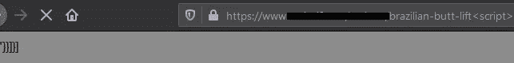
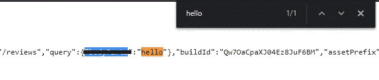
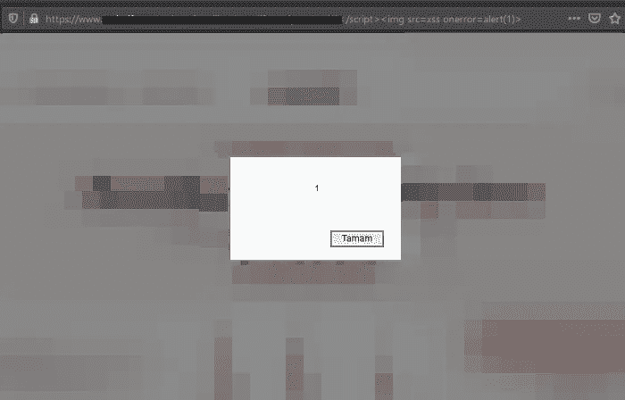

# 在修订程序上反映跨站点脚本(奖金:750 美元)

> 原文：<https://infosecwriteups.com/reflected-cross-site-scripting-on-private-program-bounty-750-34cc67a931f1?source=collection_archive---------1----------------------->

嗨，伙计们，这是我的第一篇英语文章。

显然，我发现了一个 bug，但我不确定到底是什么导致了它。所以我说，我一定要调查这个案子！

我发现这值得探索，因为这个网站似乎没有收到我的输入。然而，我添加到 URL 末尾的`****`标签关闭它，然后输入 XSS 有效载荷。

(抱歉模糊不清:)

最后；

> 【target.com/affected/url</脚本>

而且修好了！

确保检查您在源代码中添加到 URL 末尾的值，即使它看起来没有接收到用户的输入。

谢谢！！！

推特:[https://twitter.com/canmustdie](https://twitter.com/canmustdie)