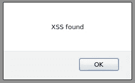
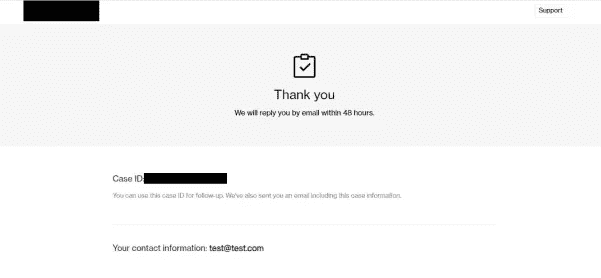
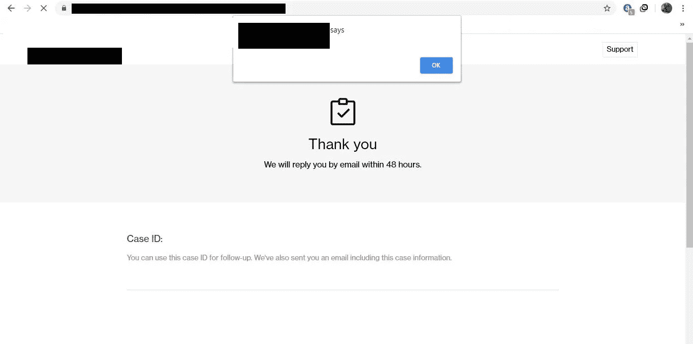

# 反射的用户输入== XSS！

> 原文：<https://infosecwriteups.com/reflected-user-input-xss-c3e681710e74?source=collection_archive---------1----------------------->

嘿伙计们！我希望每个人都做得很好，这是我的一个小发现，希望这能帮助你。开始吧！

通过电子邮件字段弹出一个警告框。

在 12 月，编校决定公开他们的 Bug 赏金计划，所以我想为什么不猎杀他们，因为他们的范围很大。

在我们深入研究之前，这里有一些非常基本的信息:

> 电子邮件地址在表单中广泛使用，并在 web 应用程序的不同部分多次显示。任何不同于传统电子邮件格式的输入都会被应用程序拒绝，并返回“无效”响应

在测试支持时，我发现:

支持页面

正如我们在上面看到的，电子邮件:test@test.com 被反射，尝试了基本的 XSS 有效负载:但是没有成功，因为它需要在电子邮件字段中使用“@”。

我记得在有限的输入格式下读过 [Brutelogic 的](https://brutelogic.com.br/blog/xss-limited-input-formats/) XSS。我强烈建议阅读他的帖子，他解释了许多其他情况，这将有很大的帮助，可能会派上用场。

所以，我在 email 字段中使用的有效载荷是["<SVG/onload = alert(1)>" @ x . y](mailto:)。提交后，我的屏幕上出现了一个弹出窗口！

我因这封反射的“电子邮件”XSS 获得了 50 美元的奖金。

感谢您的阅读！

另外，别忘了在推特上关注我