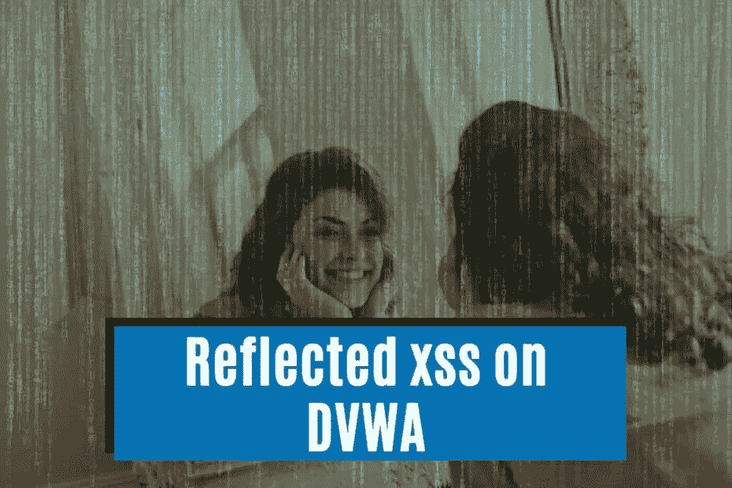
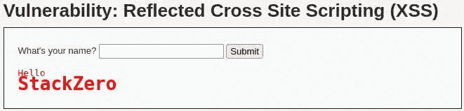
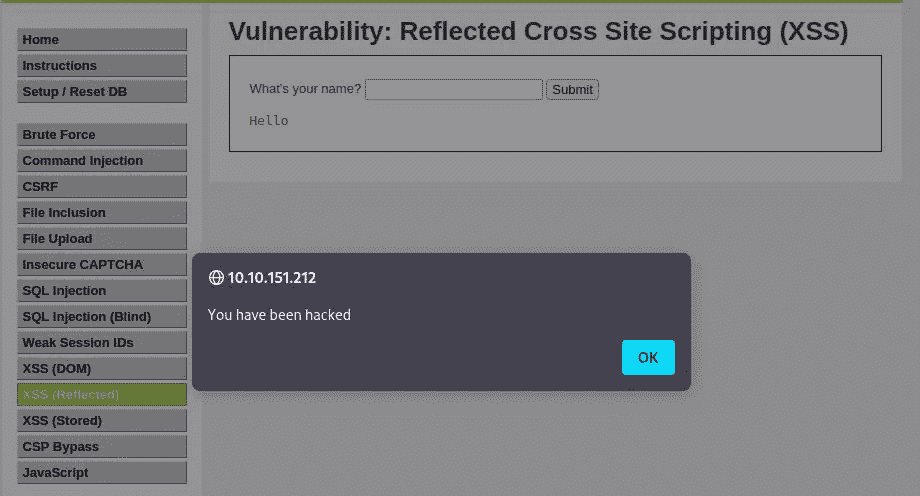
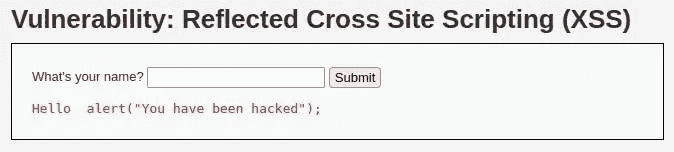
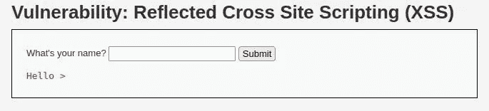
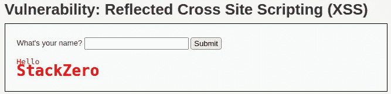

# 反映 XSS DVWA-一个利用现实世界的后果-堆栈零

> 原文：<https://infosecwriteups.com/reflected-xss-dvwa-an-exploit-with-real-world-consequences-stackzero-171cfb2d87d2?source=collection_archive---------0----------------------->



# 介绍

阅读大量的 XSS 及其运作方式，还不足以深入理解，所以 DVWA 再次帮助了我们。
像往常一样，使这个概念成为我们自己的概念的最好方法是实用的方法。
在本文中，我们将探索 [DVWA](https://github.com/digininja/DVWA) (该死的易受攻击的 Web 应用程序)，这是许多伟大黑客的第一个健身房！

如果你对这个主题不了解，我建议你看看我以前写的关于 XSS 的文章。

*   [跨站脚本的恐怖世界(XSS)(第一部分)](https://medium.com/codex/the-terrifying-world-of-cross-site-scripting-xss-part-1-stackzero-54be9cdc011a)
*   [跨站脚本的恐怖世界(XSS)(第二部分)](https://medium.com/@stackzero/the-terrifying-world-of-cross-site-scripting-xss-part-2-stackzero-cc7fa7e8dcbb)
*   [实践中的 XSS:如何在 web 应用中利用 XSS](https://medium.com/codex/xss-in-practice-how-to-exploit-xss-in-web-applications-walktrought-into-google-xss-game-c939f30005ea)
*   [反映了 XSS DVWA —一个具有真实世界后果的漏洞](/reflected-xss-dvwa-an-exploit-with-real-world-consequences-stackzero-171cfb2d87d2)
*   [如何利用 DVWA 上存储的 XSS 漏洞](/how-to-exploit-a-stored-xss-vulnerability-on-dvwa-stackzero-1de6cc9545b9)
*   [如何在 DVWA 上利用多姆 XSS](/how-to-exploit-dom-xss-on-dvwa-stackzero-c83a682ed7b7)

现在，在开始利用之前，我们需要运行一个 [DVWA](https://github.com/digininja/DVWA) 的实例。

我很懒，所以我将选择 [TryHackMe](https://tryhackme.com/room/dvwa) 机器，就像我在关于 [SQL 注入](/how-to-hack-with-sql-injection-attacks-dvwa-low-security-stackzero-9286d7d0dfd1)的教程中已经做的那样。

一旦一切准备就绪，我们就开始剥削吧！

# 第一步。在低安全性的 DVWA 上反映 XSS

开始之前，我只想提醒您，默认凭据是:

*   **用户名**:管理员
*   **密码**:密码


安全级别默认设置为*不可能*，因此从左侧栏的设置中将其更改为低:


现在我们准备磨练我们的邪恶技能！
点击左侧菜单中的 XSS(反射)。

该漏洞的目标是让页面执行任意代码，这样攻击者就能够窃取 cookies，或者利用浏览器利用工具(如[牛肉](https://beefproject.com/))进行恶意活动。

在本教程中，我们将只是看到一个概念证明，但我很快会在我的下一篇文章中展示一些更酷的东西。

如果网站运行我们的代码，在这种情况下，一个简单的警告弹出窗口，我们可以认为这个级别通过了。
在这个级别，我们可以看到一个输入文本，我们可以在其中插入一个名字。为了知道它是否是一个易受攻击的字段，我们可以做的是插入一个自定义的 HTML，并查看标签是否以某种方式被过滤。

让我们试试这个输入:

```
<h1>StackZero</h1>
```

结果令人鼓舞，H1 标签上没有过滤器:



为了进一步确认，按 CTRL+U，我们可以看到源代码

```
<div class="vulnerable_code_area">
  <form name="XSS" action="#" method="GET">
    <p> What's your name? <input type="text" name="name">
      <input type="submit" value="Submit">
    </p>
  </form>
  <pre>Hello 
    <h1>StackZero</h1>
   </pre>
</div>
```

我只是选择了感兴趣的代码，我们可以看到，我们写的所有内容都反映在页面上，没有任何详细说明。很明显，这是我们利用的一个很好的选择！
这次我们可以试着提交这个脚本

```
<script> alert("You have been hacked"); </script>
```

而且成功了！浏览器执行我们的代码！



快速浏览一下 URL，您应该看到类似这样的内容:
`http://10.10.151.212/vulnerabilities/xss_r/?name=%3Cscript%3E+alert%28%22You+have+been+hacked%22%29%3B+%3C%2Fscript%3E#`
它是 URL 编码的，并且在查询字符串中包含漏洞。

所以，要弄清楚它是如何被用于攻击的。攻击者可以将此 URL 发送给受害者，并让他/她的浏览器执行恶意代码。
受害者会因为一个可能可信的域而更加自信。

# 第二步。在中等安全的 DVWA 上反映 XSS

在进行第二步之前，转到 [DVWA](https://github.com/digininja/DVWA) 设置，并将安全性设置为*中*

解决问题的方法是使用输入净化。然而，有时候，开发人员做得并不尽如人意(也许他们编写了一个快速定制的函数，但没有涵盖更复杂的利用)。

在这一步，我们将看到服务器可能通过使用[正则表达式](https://en.wikipedia.org/wiki/Regular_expression)或替换函数来删除标签`<script>`。

我们的第一次尝试可以是插入与上一步相同的输入，然后查看结果。



通过查看包含 CTRL+U 组合的 HTML 代码，这是我们感兴趣的部分:

```
<div class="vulnerable_code_area">
  <form name="XSS" action="#" method="GET">
    <p> What's your name? <input type="text" name="name">
      <input type="submit" value="Submit">
    </p>
  </form>
  <pre>Hello alert("You have been hacked"); 
   </script>
  </pre>
</div>
```

所以服务器删除了脚本打开标签。
我们知道浏览器不在乎字母是大写还是小写([不区分大小写](https://en.wikipedia.org/wiki/Case_sensitivity))。
相反，PHP 函数大多是区分大小写的，所以一个很好的转变可以是随机交替使用大写和小写字符(开发人员很难用 [str_replace](https://www.php.net/manual/en/function.str-replace.php) 函数管理每一种可能的组合)。

让我们试试这个输入:

```
<sCRiPt> alert("You have been hacked"); </script>
```

我们的假设是正确的！


# 第三步。高安全性地在 DVWA 上反映 XSS

为了尝试下一步，我们需要将安全级别设置为高。

这个级别的 DVWA 提供了稍微高一点的安全性，所以我们需要绕过稍微复杂一点的过滤器。

在编写我们的漏洞利用之前，让我们先尝试上一级的漏洞利用，看看结果如何。



这一次，正如我们所料，它不起作用，但知道输出可以帮助我们！
所以我们按 CTRL+U 来看源代码。

```
<div class="vulnerable_code_area">
  <form name="XSS" action="#" method="GET">
    <p> What's your name? <input type="text" name="name">
      <input type="submit" value="Submit">
    </p>
  </form>
  <pre>Hello ></pre>
</div>
```

它已经移除了`<script>`标签，现在我们想知道它是否对另一个 HTML 标签做了同样的事情，例如我们在第一步中做的`<h1>`！



有用！所以可能服务器只是用正则表达式过滤输入。我们能做的就是从另一个 HTML 标签如``运行 javascript 来避开这个过滤器。

例如，我们可以从一个不存在的 URL 添加一个图像，然后以这种方式在一个`*onerror*`事件中启动我们的警报！

```

```

点击提交按钮后，结果证明我们是对的！


# 结论

正如我们已经看到的，有许多针对 XSS 滤波器的逆转，所以一个滤波器实现错误对于 web 应用程序来说是非常危险的。

避免 XSS 威胁的一个更安全的方法是使用 PHP 中的函数 [htmlspecialchars](https://www.php.net/manual/en/function.htmlspecialchars.php) 或者你喜欢的编程语言中的等效函数。
为了更好地理解主题，我建议您查看每一级(右下角按钮)的源代码，并尝试不同的方法来利用漏洞。

了解如何绕过 XSS 滤波器的一个很好的资源来自 OWASP，在这里，你可以在写你的利用之前从那里得到提示。

我希望它对你有用，并且如果你喜欢这个内容，跟随我的工作得到更多！

回头见！

*原载于 2022 年 9 月 9 日*[*【https://www.stackzero.net】*](https://www.stackzero.net/reflected-xss-dvwa/)*。*

## 来自 Infosec 的报道:Infosec 每天都有很多内容，很难跟上。[加入我们的每周简讯](https://weekly.infosecwriteups.com/)以 5 篇文章、4 个线程、3 个视频、2 个 Github Repos 和工具以及 1 个工作提醒的形式免费获取所有最新的 Infosec 趋势！