# 在脸书的镜像网站上反映 XSS

> 原文：<https://infosecwriteups.com/reflected-xss-in-facebooks-mirror-websites-4384b4eb3e11?source=collection_archive---------0----------------------->

嘿，大家好，

我希望每个人都很好，因为我已经有一段时间没有分享我的发现了。

这篇博文是关于影响脸书镜报网站的 xss 漏洞的。我将解释我如何找到易受攻击的端点的整个过程。

很多人问我如何寻找 xss 错误，所以在这篇博客中，我也将分享我寻找 xss 的方法。

我们开始吧…..

我正在收集 thefacebook.com 域名的*子域，因为我已经看到了许多关于在 thefacebook.com*子域*发现的 bug 的文章。我也想在那里找到一些东西:)*

从收集子域开始。我基本上是用[find domain](https://github.com/Edu4rdSHL/findomain)、 [Subfinder](https://github.com/projectdiscovery/subfinder) 、 [Assetfinder](https://github.com/tomnomnom/assetfinder) 等工具来寻找我的目标的子域。在我收集了子域后，我使用了另一个叫做[http probe](https://github.com/tomnomnom/httprobe)的工具

子域枚举部分完成后。我习惯于对从 httprobe 收集到的所有主机进行目录强制(使用 [ffuf](https://github.com/ffuf/ffuf) ),然后仔细检查它们，看是否能找到一些容易成功的例子。看看下面的代码，这是我怎么做的

python 3 dir . py http probe . txt

当我看着[https://mirror-ext.glbx.thefacebook.com](https://mirror-ext.glbx.thefacebook.com)ffuf 结果的时候:

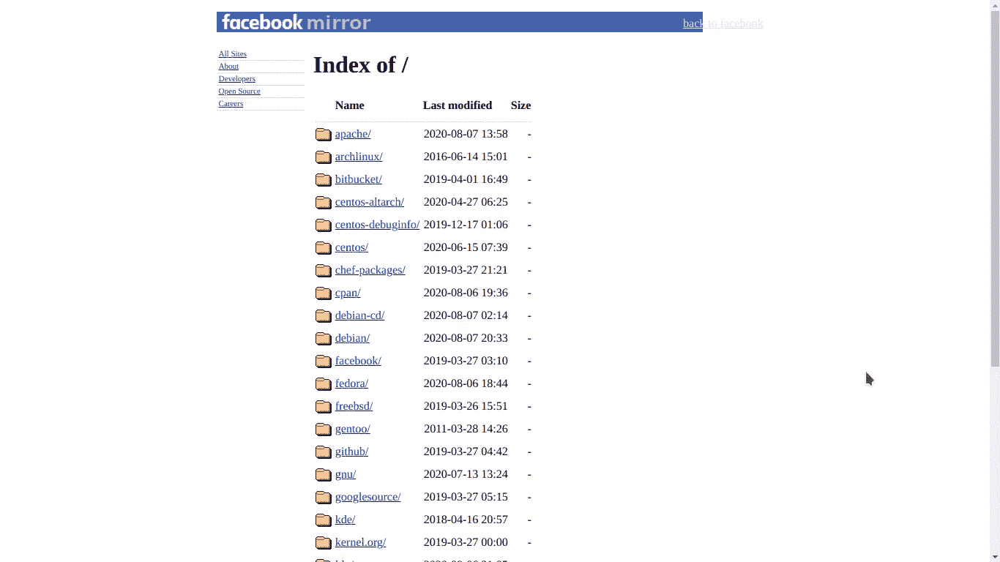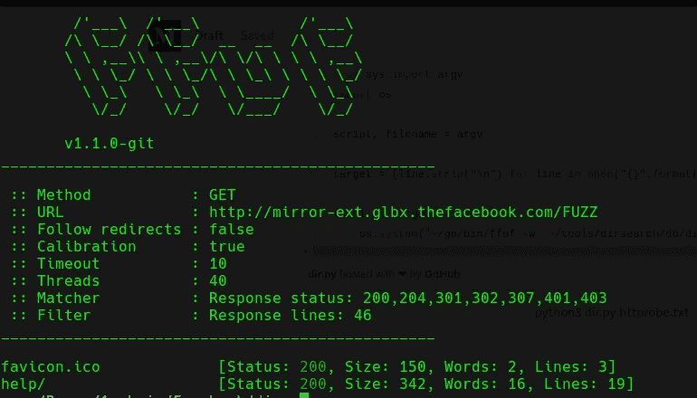

那里只有一个目录，我决定看看那里可能有什么。[http://mirror-ext.glbx.thefacebook.com/help/](http://mirror-ext.glbx.thefacebook.com/help/)

这是一个带有支持电子邮件地址的普通帮助页面，起初我并不感兴趣，但是看着页面源代码，我发现了一些不感兴趣的东西。

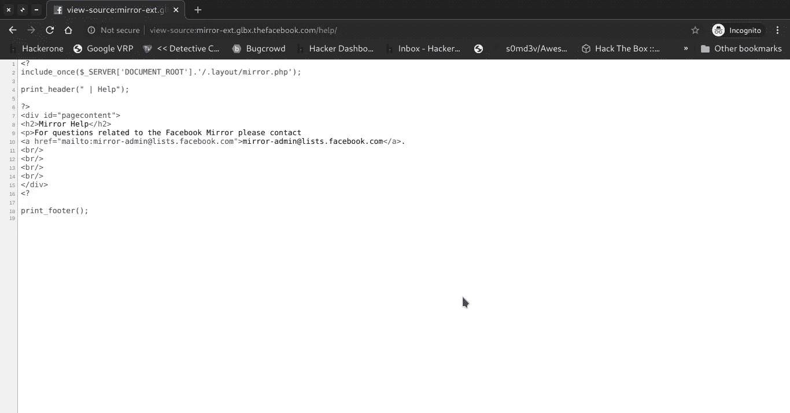

看第二行，我试着访问那个端点[http://mirror-ext.glbx.thefacebook.com/.layout/mirror.php](http://mirror-ext.glbx.thefacebook.com/.layout/mirror.php)，它只是一个空白页:(

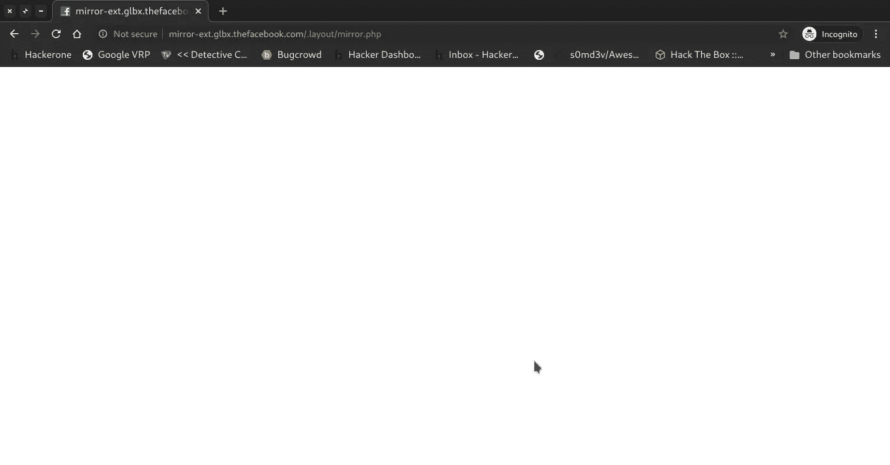

这一次，页面源代码中也没有我可以进一步查看的内容，于是我决定在/下找到更多的 php 端点。布局目录。

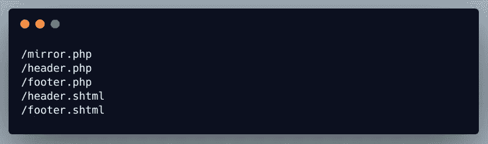

这些是我用不同的单词表找到的文件。它们都和之前的 mirror.php 空白页一样，只有一个是不同的 header.php

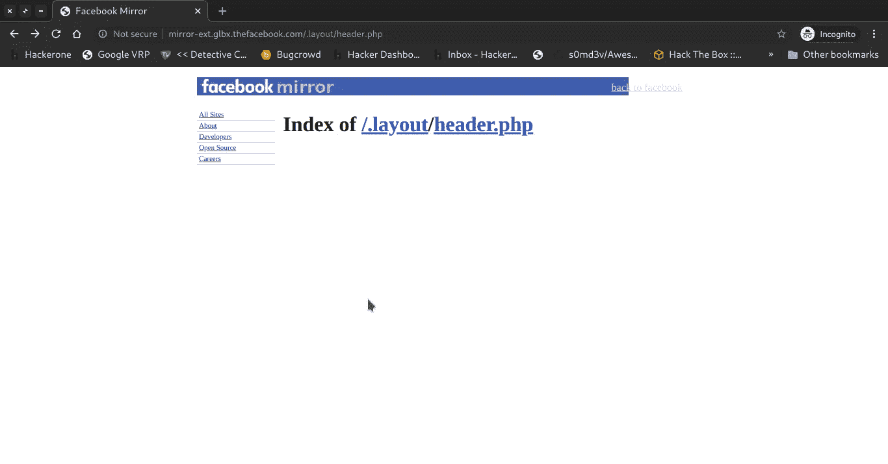

[http://mirror-ext.glbx.thefacebook.com/.layout/header.php](http://mirror-ext.glbx.thefacebook.com/.layout/header.php)

查看页面源代码时，我发现端点在锚标记 href 值中得到反映，它可能容易受到 xss 的攻击，所以我开始对它进行测试。

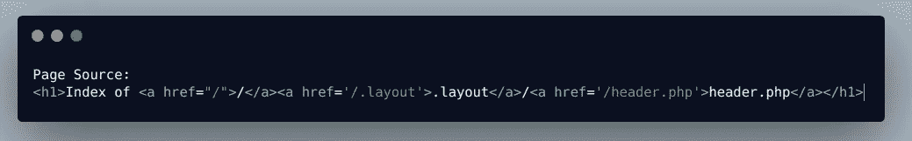

添加类似“>< at the end of the url gave *的字符未找到页面*。

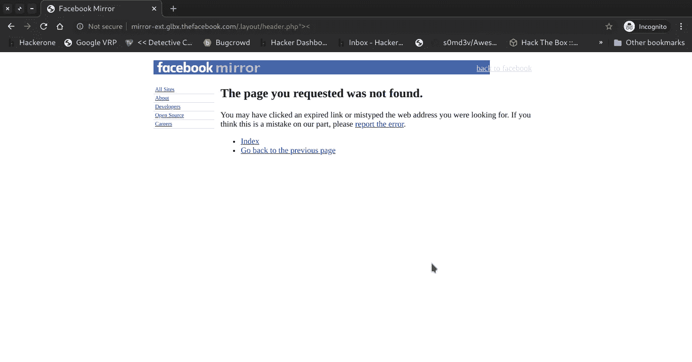

我不想这么轻易放弃，因为我能闻到 xss 的味道。我开始寻找参数，但没有找到任何参数。

在添加一个斜杠和另一个目录名后，我没有像上次一样看到*没有找到错误*。我尝试这样做是因为我以前读过的@ [brutelogic](https://twitter.com/brutelogic/) 博客

 [## 在 PHP 源代码中寻找 XSS——蛮 XSS

### 如果我们有一个服务器端脚本的源代码，这是开源软件的情况，我们可以找到 XSS…

brutelogic.com.br](https://brutelogic.com.br/blog/looking-xss-php-source/) 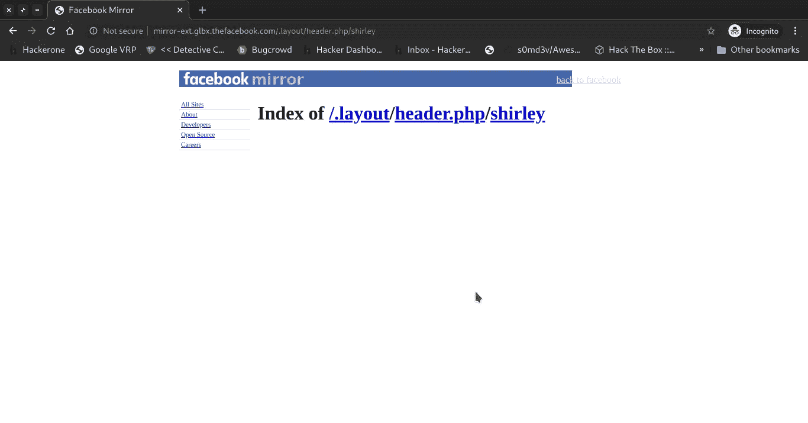

[http://mirror-ext.glbx.thefacebook.com/.layout/header.php/shirley](http://mirror-ext.glbx.thefacebook.com/.layout/header.php/shirley)

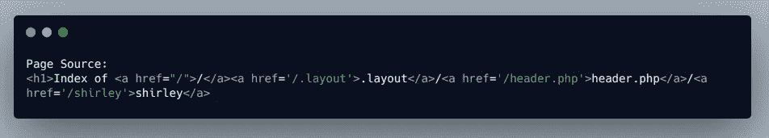

再次尝试使用**><**，我发现他们正在获取 url 编码。

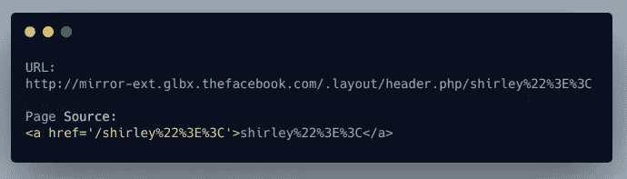

后来我意识到 href 值在单引号内。所以这次试着用单引号。

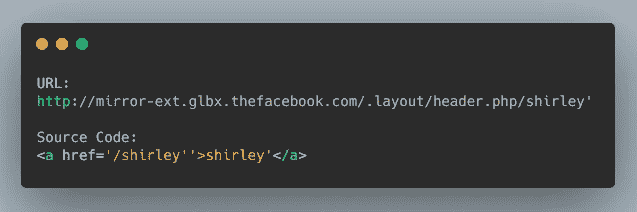

当我看到我的输入在 href，href='/javascript:alert()'中得到反映时，我开始尝试这样做，但这不起作用，因为在我们的输入前有一个斜杠。我开始在 google 上寻找在一个锚标记中包含两个 href 的方法，在[https://stack overflow . com/questions/13965753/how-can-I-open-multiple-links-using-a-single-anchor-tag 上找到了解决方案](https://stackoverflow.com/questions/13965753/how-can-i-open-multiple-links-using-a-single-anchor-tag)

根据该解决方案，最终有效载荷为:

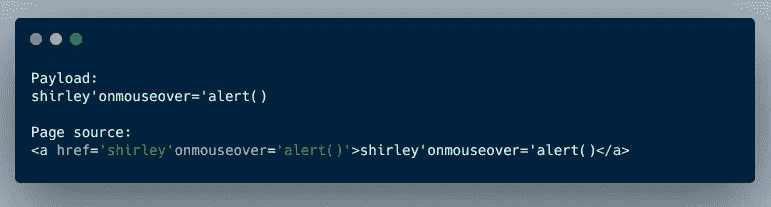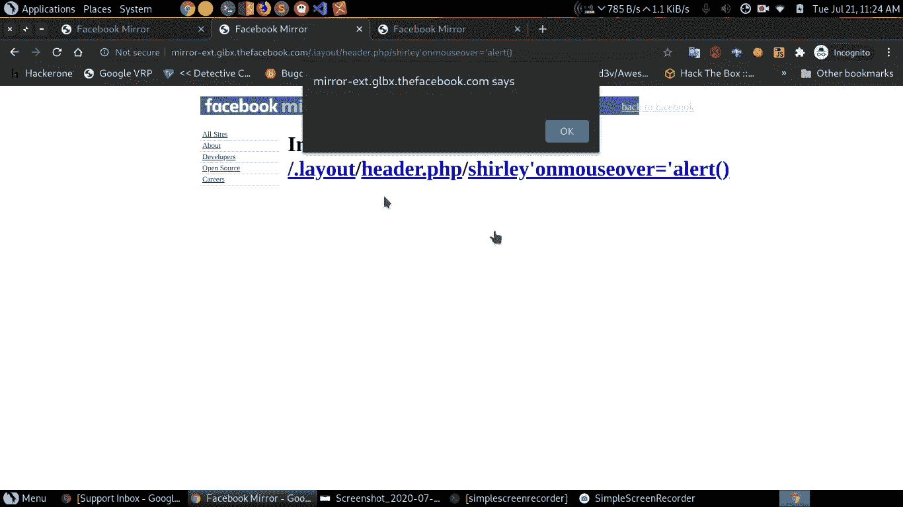

我就像神圣的 sh*t！！我刚在脸书的域名上发现了一个 xss。

嗯，我知道更多的脸书镜像域，所以尝试看看我是否可以在那里复制相同的 xss。结果是:

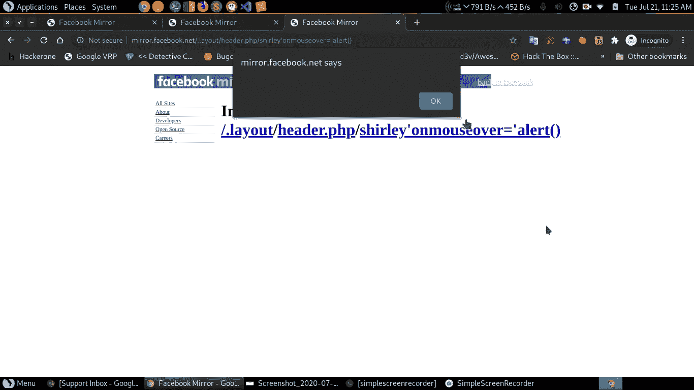

mirror.facebook.net

又一个子域易受攻击[http://mirror.t.tfbnw.net/](http://mirror.t.tfbnw.net/)但是我没有它的任何截图。

故事到此结束。

关于修复，现在单引号(')被转换为&。

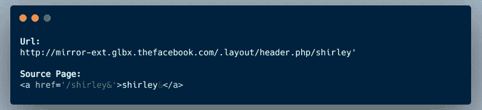

我因为这个 xss 获得了 500 美元的奖金。

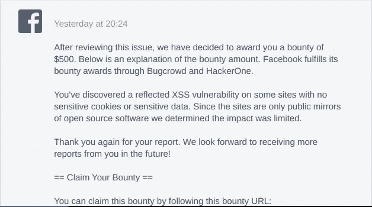

**视频概念验证:**

# **现在进入第二部分，**

我如何寻找 xss 错误？

我正在使用这个叫做[反射器](https://github.com/elkokc/reflector)的可怕的打嗝插件

 [## elkokc/反射器

### 打嗝套件扩展能够找到反映 XSS 在网页上实时浏览网站，并包括一些…

github.com](https://github.com/elkokc/reflector) 

它主要检查其值在源页面中得到反映的参数，然后尝试查看哪些符号也在源页面中得到反映，如**、>、<、{、}、’等**

你只需要浏览网络应用程序，访问那里的每个页面，填写所有的输入字段。然后查看“打嗝问题”选项卡，看看它是否有所发现。

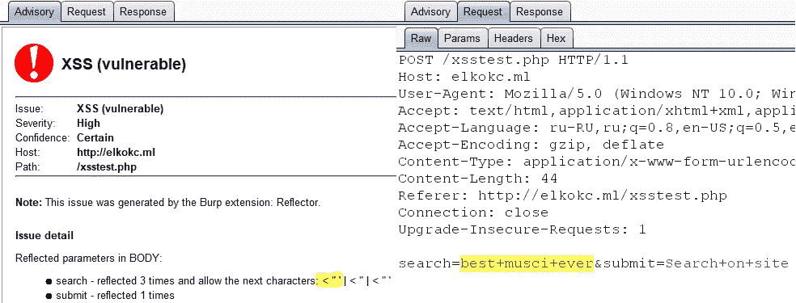

[https://github . com/elkokc/reflector/blob/master/screen shot/symbols _ analyse . png](https://github.com/elkokc/reflector/blob/master/screenshot/symbols_analyse.png)

## 谈一些自动化工作:

使用 paramspider、gau 等工具收集包含参数的端点，然后可以使用 kxss、dalfox(选择权在你，使用任何适合你的工具，它们都很好。)上看看能不能找到一些 xs。下面你可以看到 dalfox 工具的运行

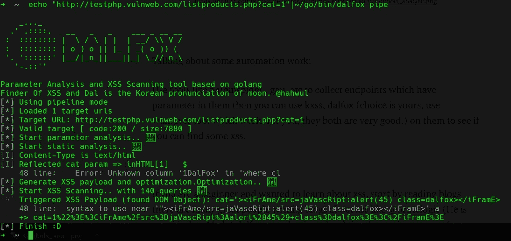

【https://twitter.com/0xAsm0d3us 

 [## devanshbatham/ParamSpider

### 从输入域的 web 档案中查找参数。也从子域中查找参数。给予…支持

github.com](https://github.com/devanshbatham/ParamSpider) 

[https://twitter.com/hacker_](https://twitter.com/hacker_)

 [## lc/gau

### getallurls (gau)从 AlienVault 的开放威胁交换、Wayback Machine 和 Common Crawl 中获取已知的 URL

github.com](https://github.com/lc/gau) 

[https://twitter.com/TomNomNom](https://twitter.com/TomNomNom)

 [## 汤姆·诺姆/哈克

### 黑客和一次性脚本的集合。通过在 GitHub 上创建一个帐户来为 tomnomnom/hacks 开发做贡献。

github.com](https://github.com/tomnomnom/hacks/tree/master/kxss) 

[https://twitter.com/hahwul](https://twitter.com/hahwul)

 [## 哈哈哈/达尔福克斯

### 只是，XSS 的扫描和参数分析工具。我以前开发过 XSpear，一个基于 ruby 的 XSS 工具，而这次，一个…

github.com](https://github.com/hahwul/dalfox) 

## 初学者指南

如果你是一个初学者，想了解 xss，从阅读博客开始吧。有许多伟大的人写关于 xss 的博客，比如 [@brutelogic](https://twitter.com/brutelogic) (他非常善良，乐于助人。如果你很难绕过 xss waf 或其他东西，他随时准备帮助你。)

 [## 蛮 XSS -掌握跨站脚本的艺术。

### 掌握跨站脚本的艺术。

掌握跨网站 Scripting.brutelogic.com.br 的艺术](https://brutelogic.com.br/blog/) 

[https://twitter.com/soaj1664ashar](https://twitter.com/soaj1664ashar)

 [## 尊重 XSS

### ReflectionHere 和我发现像'、和/等潜在危险的字符没有被编码。为了保持…

respectxss.blogspot.com](https://respectxss.blogspot.com/) 

[https://twitter.com/s0md3v](https://twitter.com/s0md3v)

 [## s0md3v/AwesomeXSS

### 这个知识库是一个了不起的 XSS 资源的集合。欢迎投稿，请通过…

github.com](https://github.com/s0md3v/AwesomeXSS) 

还有很多，你自己在谷歌上搜一下就知道了。

想在某处练习 xss 转到:**波特斯威格网络安全学院**

 [## 什么是跨站脚本(XSS)以及如何防止它？网络安全学院

### 在这一部分，我们将解释什么是跨站点脚本，描述不同种类的跨站点脚本…

portswigger.net](https://portswigger.net/web-security/cross-site-scripting) 

做与 xss 相关的 ctf 挑战，观看 poc 视频/文章，它们会告诉你应该在哪里寻找 xss，哪些字段更容易受到 xss 的攻击，例如搜索字段、提交表单等。

就这些，非常感谢你一直读到最后。希望你会喜欢它。

大家好