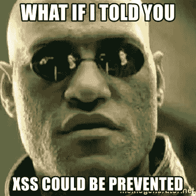
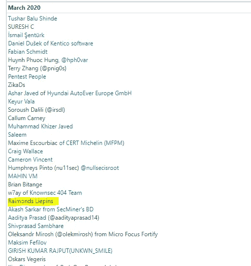

# 反映了 microsoft.com 子域上的 XSS

> 原文：<https://infosecwriteups.com/reflected-xss-on-microsoft-com-subdomains-4bdfc2c716df?source=collection_archive---------1----------------------->



微软回答说，这超出了他们的安全计划的范围，也不认为这是一个安全漏洞，所以我要写一篇关于这一点的文章。

*“这不符合安全服务的要求，因为它需要用户将恶意代码复制并粘贴到文本字段中，或者修改用户端代码/流量。像这样的自我定位攻击不被视为安全漏洞，因为它需要社会工程来定位另一个用户。”*

**2020 年 3 月 24 日更新:**

微软实际上在 3 月 23 日重新评估了被拒绝的漏洞，这些问题实际上符合他们的服务要求。因为我是一个负责任的揭露者，所以这些细节被删除了，直到它们被修补。

*“这份意见书被错误地评估为自我 XSS，而不是反映 XSS。后来有人告诉我们，这些酒吧确实满足了服务要求。*

带着这个漏洞，我实际上进入了微软的 2020 年 3 月新人名人堂部分。从这次经历中得到的教训是，在没有适当上报的情况下，你应该**永远不要**向微软提交反映的 XSS，你可以相信我，这有很大的可能性，如下文所述。



**受影响的域:**

*   activateuat.microsoft.com
*   gallery.technet.microsoft.com
*   ppe.gallery.technet.microsoft.com
*   ppe.code.msdn.microsoft.com

**你可以用 XSS 的倒影做什么？**
如果攻击者可以控制在受害者浏览器中执行的脚本，那么他们通常可以完全危及该用户的安全。其中，攻击者可以:
-在应用程序中执行用户可以执行的任何操作。
-查看用户能够查看的任何信息。
-修改用户能够修改的任何信息。
-发起与其他应用程序用户的交互，包括恶意攻击，这些攻击似乎来自最初的受害用户。

[](https://portswigger.net/web-security/cross-site-scripting) [## 什么是跨站脚本(XSS)以及如何防止它？网络安全学院

### 在这一部分，我们将解释什么是跨站点脚本，描述不同种类的跨站点脚本…

portswigger.net](https://portswigger.net/web-security/cross-site-scripting) 

**寻找漏洞:**
找到这样的漏洞并不难。我运行了以下命令:

```
 *assetfinder -subs-only microsoft.com | httprobe | cookieless*
```

资产发现者[https://github.com/tomnomnom/assetfinder](https://github.com/tomnomnom/assetfinder)http probe[https://github.com/tomnomnom/httprobe](https://github.com/tomnomnom/httprobe)无厨师[https://github.com/RealLinkers/cookieless](https://github.com/RealLinkers/cookieless)

最后一个 github 库是我创建的一个工具，用于自动化手动测试过程。希望对其他研究也有帮助。

什么是无烹饪风格，你如何把它变成 XSS 的映像？
本质上这只适用于。NET 网站，如果开发人员使用波浪符号来解析资源

```
 <script src=”<%= ResolveUrl(“~/Script.js”) %>”></script>
```

url 的无 cookieless 部分(在下面的示例中为(A(ABCD))在设计上并没有进行 HTML 编码，这使得攻击者能够逃脱以下 URL 中 HTML 标记的上下文

[https://gallery . TechNet . Microsoft . com/(A(ABCD))/](https://gallery.technet.microsoft.com/(A(ABCD))/)这将翻译成<script src = "/(A(ABCD))/script . js ">
并不是所有的字符都被支持，但通过足够的修改，你可以找到一种方法来弹出警告。显然，如果你是一个攻击者，你能做的不仅仅是如前所述的提醒。

```
 [https://gallery.technet.microsoft.com/(A(%22onerror='alert%601%60'testabcd))/](https://gallery.technet.microsoft.com/(A(%22onerror='alert%601%60'testabcd))/)
```

由于其中一些域甚至没有内容安全策略，您实际上可以包含来自第三方位置的脚本，绕过您在无 cookie 标识符允许的 URL 长度和字符范围内定义的限制。

**要更深入地探究这个问题，请参考这篇令人惊叹的文章**[https://blog.isec.pl/all-is-xss-that-comes-to-the-net/](https://blog.isec.pl/all-is-xss-that-comes-to-the-net/)和微软的文档:
[https://docs . Microsoft . com/en-us/dot net/API/system . web . configuration . session test section . cookieless？view=netframework-4.8](https://docs.microsoft.com/en-us/dotnet/api/system.web.configuration.sessionstatesection.cookieless?view=netframework-4.8)

## 披露时间表:

*   2020 年 3 月 17 日向微软 MSRC 提交漏洞
*   2020 年 3 月 19 日微软 MSRC 公司认为公开披露不属于漏洞
*   2020 年 3 月 23 日自微软 MSRC 公司重新评估漏洞以来，隐藏的公开披露事实上满足了他们的服务要求
*   问题已经解决

*关注* [*Infosec 报道*](https://medium.com/bugbountywriteup) *获取更多此类精彩报道。*

[](https://medium.com/bugbountywriteup) [## 信息安全报道

### 收集了世界上最好的黑客的文章，主题从 bug 奖金和 CTF 到 vulnhub…

medium.com](https://medium.com/bugbountywriteup)