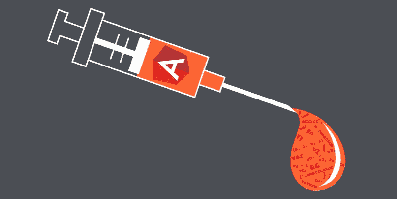
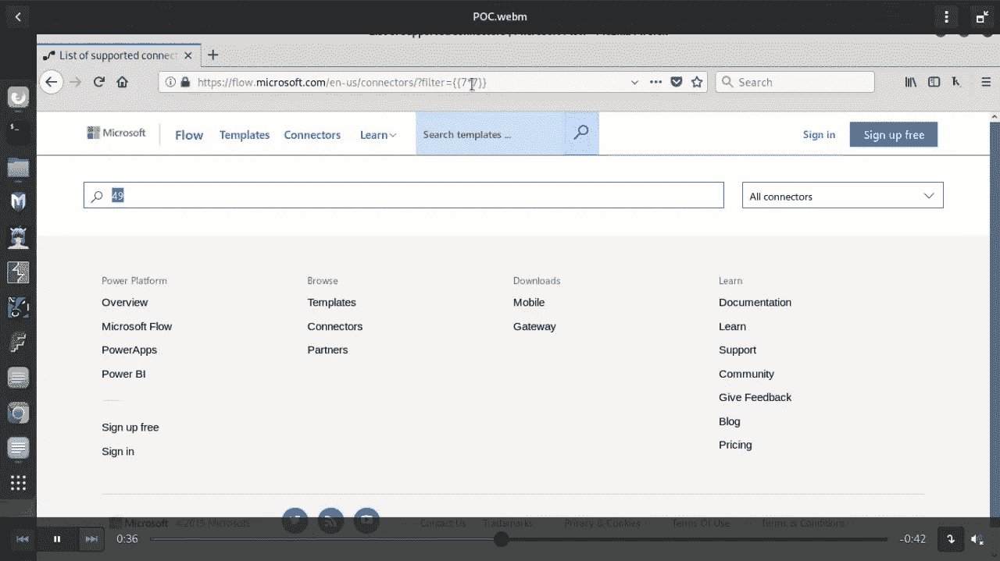
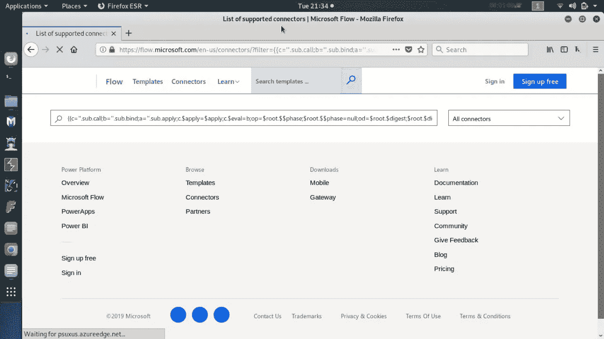
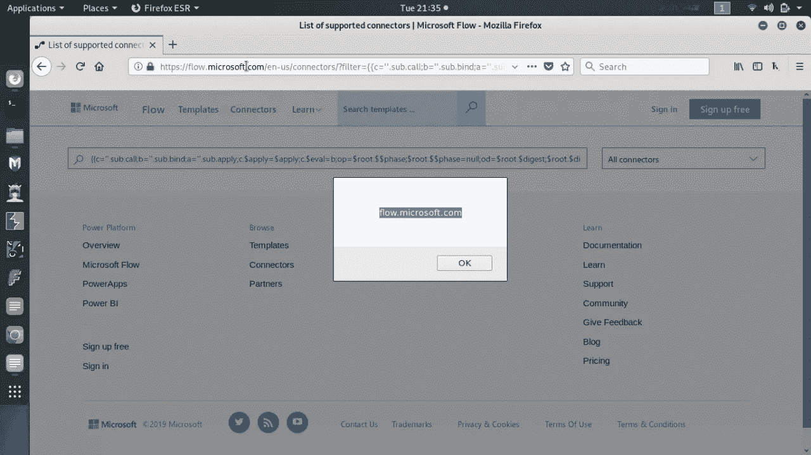
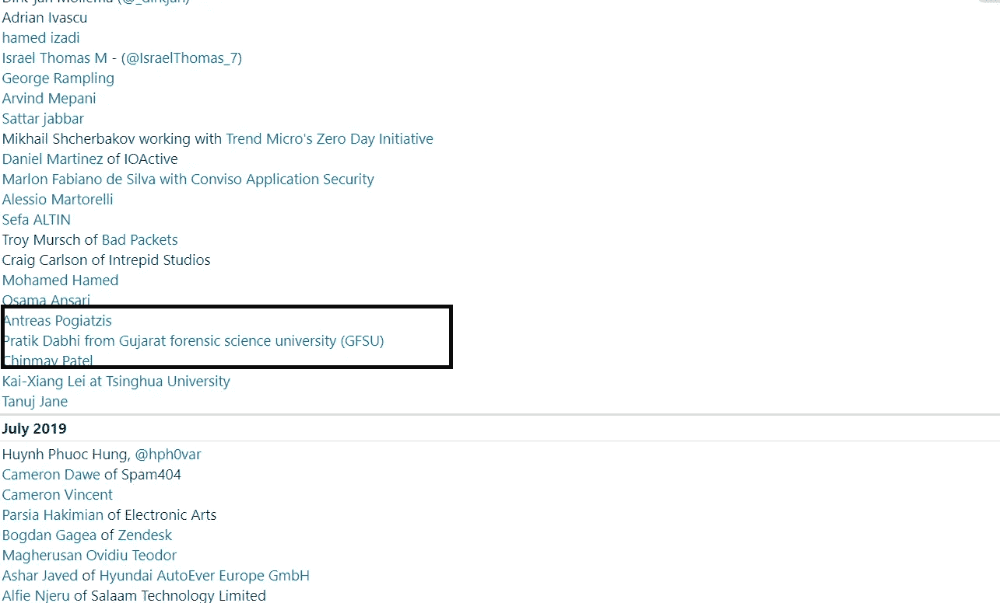

# 通过角度 Js 模板注入在 Microsoft.com 上反射 XSS

> 原文：<https://infosecwriteups.com/reflected-xss-on-microsoft-com-via-angular-template-injection-2e26d80a7fd8?source=collection_archive---------0----------------------->

我在 Instagram 和 whatsapp 上也收到了很多关于微软 POC 的消息，所以我想为它写一篇博客。

# 摘要:-

当使用客户端模板框架的应用程序在网页中动态嵌入用户输入时，客户端模板注入漏洞就会出现。当一个网页被呈现时，框架将扫描页面的模板表达式，并执行它遇到的任何模板表达式。攻击者可以通过提供恶意模板表达式来利用这一点，从而发起跨站点脚本(XSS)攻击。与普通的跨站点脚本一样，攻击者提供的代码可以执行各种各样的操作，例如窃取受害者的会话令牌或登录凭据，代表受害者执行任意操作，以及记录他们的击键。

浏览器跨站点脚本过滤器通常无法检测或阻止客户端模板注入攻击。

我开始在微软寻找子域

我得到了我目标网站，也就是 https://flow.microsoft.com/，并做了一些高级侦察。我还注意到了一些要点，比如网站使用的技术

Angular 模板可以包含[表达式](https://docs.angularjs.org/guide/expression)——双花括号内类似 JavaScript 的代码片段。要了解它们是如何工作的，请看下面的 jsfiddle:

【http://jsfiddle.net/2zs2yv7o/ 

文本输入{{7*7}}由 Angular 计算，然后显示输出:49。

这意味着任何能够插入双花括号的人都可以执行角表达式。

然后开始整理参数，找出哪个是“过滤器”

我使用了 xss 有效载荷，但是没有有效载荷在这里工作:(

然后，我手动检查源代码中反映的值，然后我意识到，通过侦察和源代码读取，它使用了一个角度模板，并找到了该模板的一个版本，然后搜索有效载荷，在这里我得到了该有效载荷

然后我用谷歌搜索它

[https://ports wigger . net/research/XSS-without-html-client-side-template-injection-with-angular js](https://portswigger.net/research/xss-without-html-client-side-template-injection-with-angularjs)

# 视频概念验证:-

最后，我进入了微软名人堂。

[https://portal . msrc . Microsoft . com/en-us/security-guidance/research-acknowledges-online-services？rtc=1](https://portal.msrc.microsoft.com/en-us/security-guidance/researcher-acknowledgments-online-services?rtc=1)

时间线:

1.  2019 年 7 月 13 日— **报告**
2.  2019 年 7 月 18 日— **分流**
3.  2019 年 7 月 28 日— **有效&固定**
4.  2019 年 8 月 20 日— **名人堂**

感谢大家的阅读:)

快乐黑客；)

喜欢我的作品就支持我吧！[给我买杯咖啡](https://www.buymeacoffee.com/impratikdabhi)，在[推特](http://twitter.com/impratikdabhi)上关注我。

 [## impratikdabhi

### 嘿，👋我刚刚在这里创建了一个页面。你现在可以给我买杯咖啡了！

www.buymeacoffee.com](https://www.buymeacoffee.com/impratikdabhi) 

网址:-[https://www.pratikdabhi.com/](https://www.pratikdabhi.com/)

insta gram:-[https://www.instagram.com/i.m.pratikdabhi](https://www.instagram.com/i.m.pratikdabhi/?hl=en)

推特:-[https://twitter.com/impratikdabhi](https://twitter.com/impratikdabhi?lang=en)

YouTube:-[https://www.youtube.com/impratikdabhi](https://www.youtube.com/impratikdabhi)