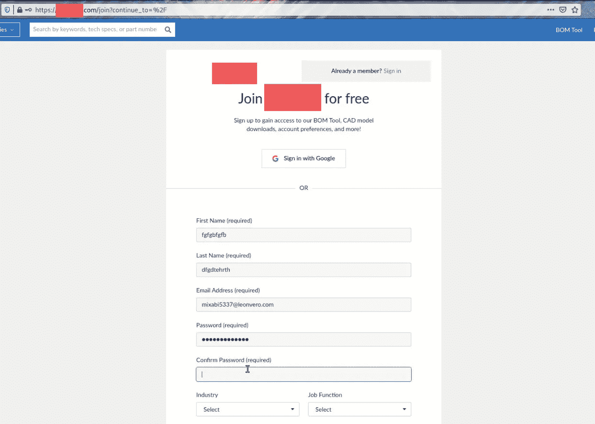
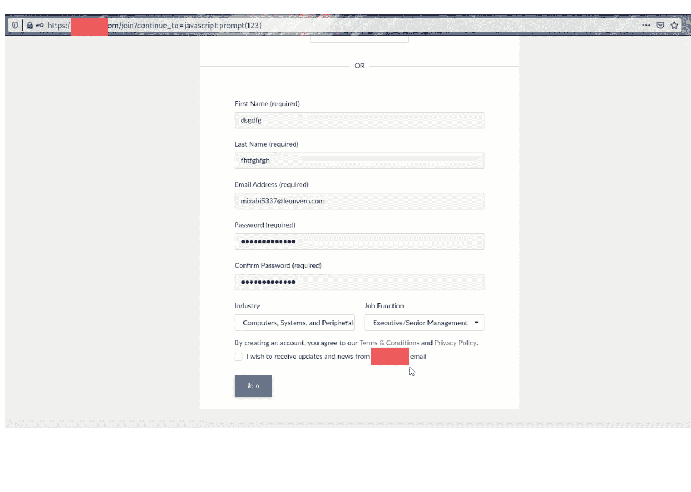
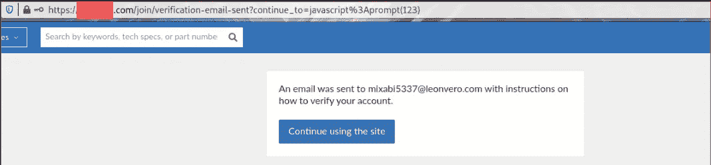
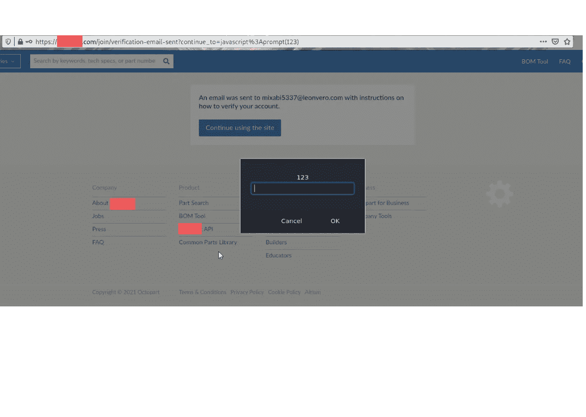

# URL 中触发的反射 xss🔎

> 原文：<https://infosecwriteups.com/reflected-xss-triggered-in-url-d4048a1da6bb?source=collection_archive---------1----------------------->

让我们一起挖吧…

大家好，我又回来了，带着一份关于反射 xss 的报告，这也是一个很容易发现但很有趣的 bug。我花了一分钟找到这个 bug …😁

所以，我的上一篇报道是关于通过 google sign in 的开放重定向([https://infosecwriteups . com/Open-redirect-in-target-via-Google-sign-in-d 42 B3 CB 633d](/open-redirect-in-target-via-google-sign-in-d42b3cb633d))。我在上一份报告中提到，在有开放重定向的地方，必须检查 xss 或 sql 注入。得到的几率总是很高的！！

总之，我测试了反射 xss:

首先，我在网站(例如:abc.com)上注册，点击免费加入。

【https://abc.com/join?continue_to=%2F (原网址)

之后，我填充了必要的细节并制作了 xss 有效负载，如下所示:

【https://abc.com/join? continue _ to = JavaScript:prompt(123)(精心制作的 URL)

下一步是显而易见的，即点击加入，然后出现以下页面:

现在，在点击继续到这个站点之后，xss 触发了😍。终于来了！！

感谢你的朗读！！希望有帮助。关注我以获取我未来报告的最新更新，✌️🏼

不断测试，不断保护🔐。保持安全

# **黑客快乐！！**😎