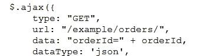
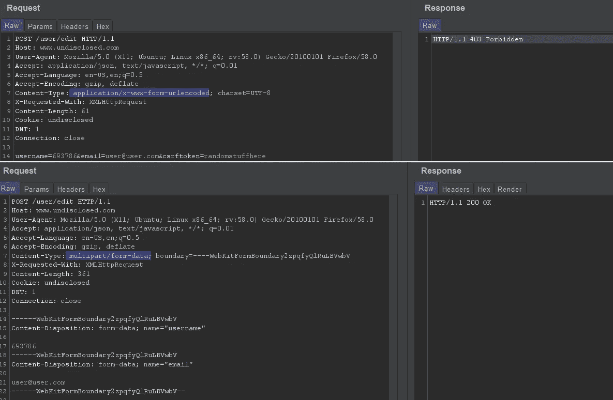

# 重新聚焦于 bug 搜索，奖励:一个有趣的简单测试 CSRF 旁路

> 原文：<https://infosecwriteups.com/refocusing-in-bug-hunting-bonus-an-interestingly-simple-to-test-csrf-bypass-8595b3312147?source=collection_archive---------1----------------------->

**使用 html 页面的源…**

在寻找 bug 的过程中，你会不时地陷入困境。您访问范围内的网站，环顾四周，检查哪些 burp 代理历史记录，那里什么也没有。也就是说，没什么明显的。有时，你可能会止步于此。尤其是如果你像我不久前一样，刚刚踏上旅程。

我去了这个网站，它有一些常见的功能，比如搜索表单、将产品添加到购物车、添加到你的愿望清单以及下订单。

对于一个“绿色”的 bug 猎人来说，最明显的攻击是将 xss 有效负载放入所有参数中，看看会发生什么。在这种情况下，什么都没有。没有什么有趣的，html 标签被正确编码。它看起来像一个死胡同。

因此，我把它搁置了几个月。当我回来时，我没有使用这个工具来提取网站正在使用的 js 文件的链接，而是决定通读主页的源代码。这不像真正的交易，只是 html 源代码。但是，事实证明，很多有趣的 javascript 代码就在所有 html 的中间。

有趣的部分是 javascript 被用于 POST 和 GET 请求的部分，这些请求被非常有趣地命名为端点。了解基本的 javascript 就足以理解代码在做什么，以及如何使用这些端点测试 IDOR。

一个简单的示例代码

在更改号码或用户名的同时向这些端点发出 GET 请求，向我显示了其他用户的数据，这些数据显然只能由这些用户访问。

**奖励:CSRF 绕行**

有许多方法可以绕过 csrf 保护:删除 csrf 头/参数，用相同长度的不同值替换 csrf 令牌的值，以及尝试从 POST 请求切换到 GET 请求(这种方法严重依赖于受 csrf 保护的网站功能)

我还没有听说过，如果你听说过，我发现它值得重复:改变内容类型。即从非表单内容类型(即应用程序/json、应用程序/x-url 编码等)切换。)到内容类型:形式-多部分

下面是一个截屏示例，根据我的一份报告进行了必要程度的简化，令我惊讶的是，由于它的简单性，它没有被标记为重复，并且我获得了一笔可观的奖金:

请求和响应示例

请注意，csrftoken 的 content-type:application/x-www-form-urlencoded 和错误值给出了 403，而 content-type:multipart/form-data 和省略 csrftoken 参数及其值给出了 200。

因为在分析以下目标时，您的方法易于自动化:

使用 burp pro 和 jsfinder 扩展访问网站，

检查 jsfinder 在端点方面找到了什么，

试图访问这些端点，

然后继续前进。

但是，有时，不是所有的时间，但有时，值得手动阅读一些简单的，看似不感兴趣的东西，如网站及其页面的 html 源代码。你可能会发现一些有趣的地方。

因此，如果，或者我应该说，每当你感到困惑时，试试这个:看看夏洛克·福尔摩斯风格的电影和电视节目，以及需要解决多部分谜题的视频游戏(意味着你需要结合多种线索才能找到某种解决方案)，因为它可能会让你的大脑摆脱困惑。