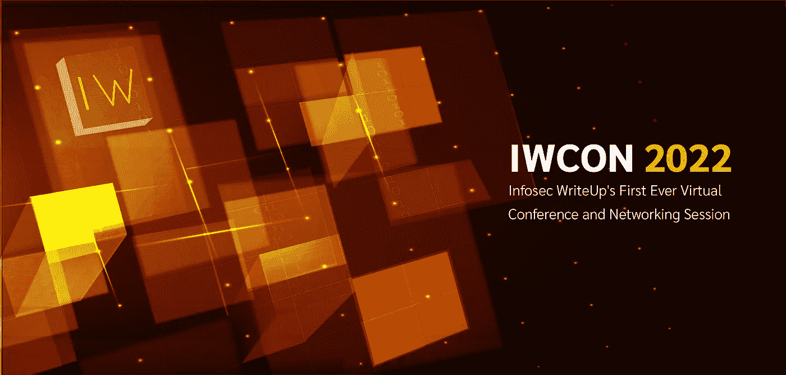

# IWCON 2022 在线信息安全会议和网络活动开始注册

> 原文：<https://infosecwriteups.com/registrations-open-for-iwcon-2022-the-online-infosec-conference-networking-event-41a1b0182b00?source=collection_archive---------1----------------------->

## 聆听 15 位以上令人敬畏的演讲者，并认识 Infosec 中最酷的一些人！

在此注册参加 IWCON 2022。

Infosec Writeups 的编辑团队很高兴地宣布，我们将于 2022 年 2 月 26 日至 27 日**举办[**IWCON 2022**](https://iwcon.live/)——我们有史以来第一次虚拟会议和网络活动。**

**我们的目标不仅仅是剖析技术层面，而是**突出信息安全中的人性角度**。**

**点击 了解更多详情 [**。**](https://iwcon.live/)**

# **为什么要参加 IWCON 2022？**

**我们邀请了来自世界各地的演讲者来分享他们的个人故事以及他们如何在 Infosec 中立足的独特经历。大会的部分发言人有 [**路易·尼夫内格尔**](https://twitter.com/snyff)**[**坦尼娅·扬卡**](https://twitter.com/shehackspurple)[**兹塞诺**](https://twitter.com/zseano)[**阿西姆·什雷**](https://twitter.com/AseemShrey) **。******

****所有演讲者的完整名单和他们演讲的主题将很快公布。[继续关注我们的页面获取更新](https://iwcon.live/)。****

****我们预计会有 1500 多人参加会议现场直播。我们的与会者大多是网络安全专业人士和信息安全影响者，这使得它成为您职业生涯中最酷的起点。****

****[***今天保住你的位子。***](https://razorpay.com/payment-button/pl_IkurresccCErYp/view)****

# ****需要更多的说服力吗？门票才 5 块！****

****是的，你没听错。****

****大多数信息安全会议都非常昂贵，使得发展中国家的人们想参加都难。我们希望 IWCON 尽可能地对所有认真开始 Infosec 工作的人开放。****

****只需 5 美元，您就可以参加所有的讲座，参加我们的酷炫网络会议，并参加我们的赞助商举办的赠品竞赛，赢取一些令人惊叹的赠品。****

****[***加入今天之前所有时段都被预定***](https://razorpay.com/payment-button/pl_IkurresccCErYp/view) 。****

# ****有什么问题吗？我们是来解决这些问题的。****

****如果您有任何问题、疑虑或阻碍您参加 IWCON 2022 的障碍，我们很乐意回答。****

****请回复此邮件(或在下方留下评论)，我们将尽快回复您。****

****如果你有一个关于你如何在 Infosec 中崭露头角的故事，并且你想在 IWCON 2022 上发言，请在此填写我们的发言人表格。如果 Infosec 的报道能成为你个人品牌之旅的垫脚石，我们会很高兴。****

****期待在 IWCON 2022 上与您见面。****

****[***今天预定座位***](https://razorpay.com/payment-button/pl_IkurresccCErYp/view) 。****

****最佳，
编辑团队
Infosec 报道。****