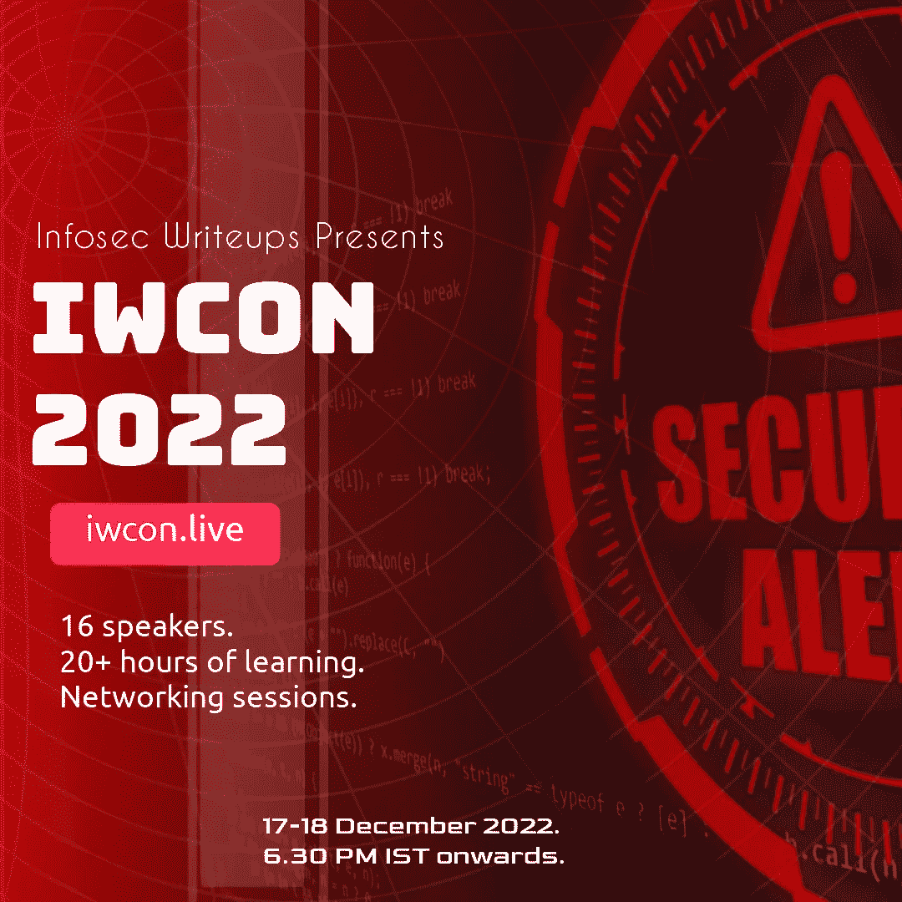
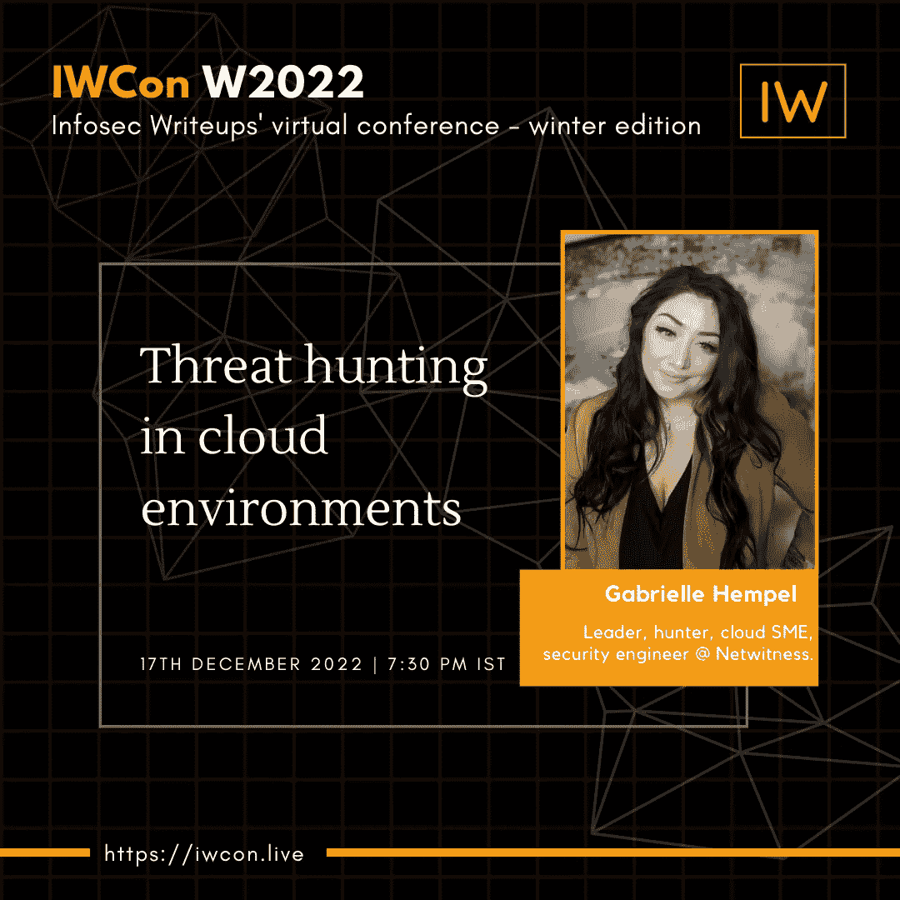
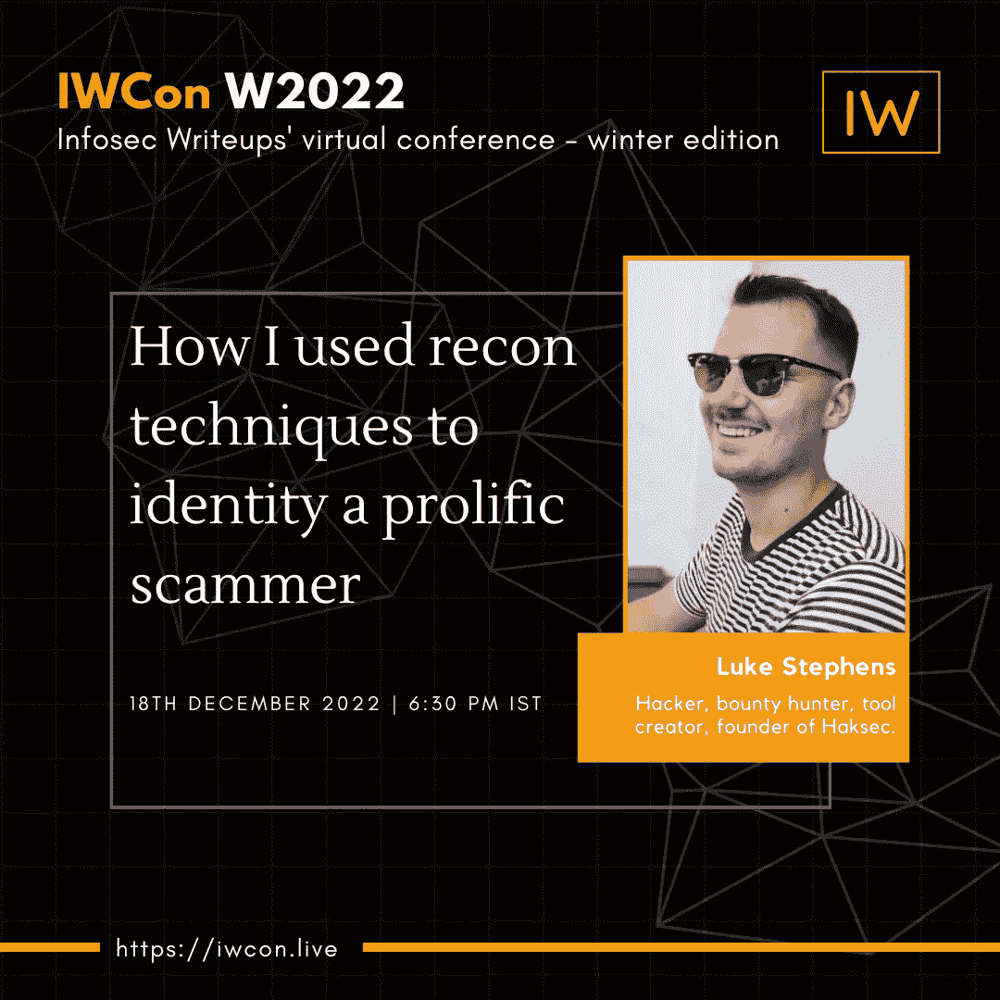
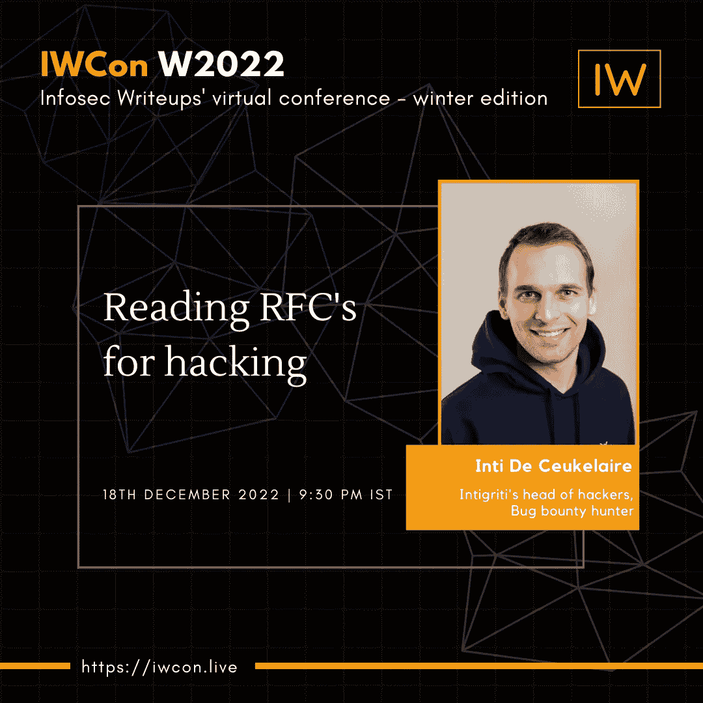

# 在线国际网络安全大会 IWCON2022 版开放注册

> 原文：<https://infosecwriteups.com/registrations-open-for-iwcon2022-version-2-0-the-online-international-cybersecurity-conference-ff4c4d1cddf3?source=collection_archive---------1----------------------->

## 今天就预订座位吧！

图片作者。

我们 Infosec Writeups 很高兴地宣布，我们最近在我们的[出版物](https://infosecwriteups.com/latest)上拥有 26000 名粉丝，在我们的[推特](https://twitter.com/InfoSecComm)上拥有 20000 名粉丝。

像往常一样，我们被你倾注在我们身上的爱所淹没。作为我们回馈社会的方式，这里是我们发起的两项倡议。

# 网络安全大会 IWCON 2022 版

2022 年 2 月，我们组织了我们的 [**首届虚拟会议暨网络活动**](https://medium.com/bugbountywriteup/check-out-the-full-speaker-line-up-of-iwcon-2022-6f62aa747420) **。我们得到的反应超出了我们的想象。推特上充斥着 IWCON2022 的标签。**

**事件的一些统计数据**

*   总注册数:700+。
*   与会者总数:400+。
*   有些会议的现场出席者总数超过了 200 人。

[**现在，我们正在组织下一个版本的 IWCON 2022，时间是 2022 年 12 月 17-18 日**](https://iwcon.live/) **。**我们的一些精彩演讲是-

## 云环境中的威胁搜寻。

Gabrielle Hempel，领导者，bug hunter cloud SME，安全工程师@ Netwitness。

时间:2022 年 12 月 17 日，IST 时间下午 7 点 30 分。

## 我如何使用侦查技术来识别一个多产的骗子

卢克·斯蒂芬斯(Luke Stephens)，黑客，bug 赏金猎人，工具创造者，Haksec 创始人。

时间:2022 年 12 月 18 日，IST 时间下午 6 点 30 分。

## 阅读 RFC 的黑客攻击

Inti De Ceukelaire，Intigriti 的黑客主管。虫子赏金猎人。

时间:2022 年 12 月 18 日，IST 时间晚上 9:30。

点击 查看完整的演讲者阵容和会议议程 [***。***](https://iwcon.live/)

# 有什么问题吗？我们是来解决这些问题的。

如果您有任何问题、疑虑或阻碍您参加 IWCON 2022 的障碍，我们很乐意回答。

请回复此邮件(或在下方留下评论)，我们将尽快回复您。

如果你有一个关于你如何在 Infosec 中崭露头角的故事，并且你想在 IWCON 2022 上发言，请在这里填写我们的发言人表格。如果 Infosec 的报道能成为你个人品牌之旅的垫脚石，我们会很高兴。

期待在 IWCON 2022 上与您见面。

[***今天预定座位***](https://razorpay.com/payment-button/pl_K8cxPtmUyBH2PC/view) 。

最佳，
编辑团队
Infosec 报道。